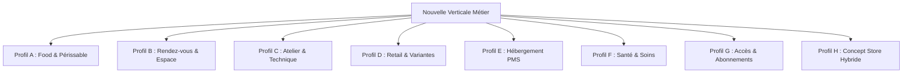

# 🏭 Skill: Vertical Forge (Usine à Verticales Nexus)

Ce Skill n'est **plus un checklist manuel** : c'est un **moteur de généralisation & capitalisation**. On décrit une verticale par un **Blueprint déclaratif**, un **agent d'étude de secteur** lui donne de la substance, et un **générateur** produit l'arborescence complète — à un **niveau de précision modulable** (L0→L3), en **réutilisant** un socle partagé plutôt qu'en dupliquant.

> **Règle d'or de l'Architecte** : une nouvelle verticale ne doit JAMAIS altérer les règles fiscales du Tronc Invariant (NF525) ni violer l'isolation `SovereignGuard`. Le moteur ne génère que la couche verticale fine + config.

---

## 🧭 1. Taxonomie des 8 Profils Métiers Archétypaux

Chaque verticale appartient à un **profil archétypal**, codé dans [`ProfileArchetype.ts`](../../../src/verticals/_shared/catalog/ProfileArchetype.ts) (`PROFILE_ARCHETYPES`). Le profil fournit le gating culinaire + un socle de capabilities par défaut.



| Profil | Exemples | `usesCulinaryStock` | Spécificités majeures |
|---|---|:---:|---|
| **A. Food & Périssable** | Restaurant, Boulangerie, Traiteur, Brasserie | `true` | HACCP/DLC, allergènes INCO, KDS, fiches techniques |
| **B. Rendez-vous & Espace** | Coiffure, Institut, Spa, Barbier | `false` | Agenda fauteuil, temps de pose, RGPD Art. 9 |
| **C. Atelier & Technique** | Garage, Carrosserie, Cycles, Réparation | `false` | SIV/IMEI, Ordre de Réparation, TecDoc/PIEC, BSDD |
| **D. Retail & Variantes** | Prêt-à-porter, Épicerie, Fleuriste | `false` | Variantes taille/couleur, scan 2D, e-commerce 2-ways |
| **E. Hébergement (PMS)** | Hôtel, Camping, Gîtes | `true/false` | Planning chambres, Channel Manager, taxe séjour, CESEDA |
| **F. Santé & Soins** | Cabinet, Dentiste, Vétérinaire, Opticien | `false` | Dossier chiffré AES-256-GCM, CCAM, tiers-payant, HDS |
| **G. Accès & Abonnements** | Gym, Coworking, Parc loisirs | `false` | SEPA récurrent, tourniquets/badges RFID, jauge |
| **H. Concept Store Hybride** | Café-Boutique, Salon de thé-Librairie | `true` | Combinaison modulaire via Switchboard MCC |

---

## ⚙️ 2. Le Moteur (5 composants)

Tout vit sous [`src/verticals/_shared/`](../../../src/verticals/_shared/) (la couche de capitalisation) :

| Composant | Rôle | Emplacement |
|---|---|---|
| **Catalogue Universel** | 45 capabilities `mod_*` **typées** (`CapabilityKey`) + dépendances + hardware + addenda légaux ; 8 profils | `catalog/CapabilityCatalog.ts`, `catalog/ProfileArchetype.ts` |
| **Factories d'adapters** | Socle universel partagé (finance, mcc, facility, human, commerce, compliance, logistics, intelligence) — tue la duplication | `adapters/factories.ts` |
| **Blueprint** | Spec déclarative d'une verticale : capabilities, tokens, routes, events, hardware, DNA, **précision**, **sous-variantes**, **substance** | `blueprint/VerticalBlueprint.ts`, `blueprint/SectorStudy.ts` |
| **Générateur** | Fonction pure `generateVertical(bp)` → fichiers + patchs de câblage ; CLI `forge-vertical.ts` | `forge/generateVertical.ts`, `scripts/forge-vertical.ts` |
| **Agent d'Étude de Secteur** | Donne la SUBSTANCE (process, réglementations, matériel, KPIs) — baseline déterministe + enrichissement LLM-agnostique | `sector-study/SectorStudyAgent.ts`, CLI `scripts/study-sector.ts` |

---

## 🛠️ 3. Le Workflow (piloté par le Blueprint)

```
┌──────────────────────────────────────────────────────────────────────────┐
│  0. PROFILER   → choisir le profil archétypal (A–H)                         │
│  1. BLUEPRINT  → écrire src/verticals/<slug>/<slug>.blueprint.ts            │
│  2. ÉTUDIER    → agent d'étude AUTO-activé pendant le forge (--no-study off) │
│  3. FORGER     → npx tsx scripts/forge-vertical.ts (étude + arborescence)   │
│  4. CÂBLER     → appliquer la checklist de wiring imprimée par le forge     │
│  5. CERTIFIER  → tsc=0 · vitest · sentrux gate · addendum légal · hardware  │
└──────────────────────────────────────────────────────────────────────────┘
```

### 🔹 Étape 1 — Écrire le Blueprint
Un seul fichier décrit la verticale. Modèle : [`salon.blueprint.ts`](../../../src/verticals/salon/salon.blueprint.ts).
```typescript
import type { VerticalBlueprint } from '@/verticals/_shared/blueprint';

export const <SLUG>_BLUEPRINT: VerticalBlueprint = {
  slug: '<slug>', className: '<Slug>Vertical', profile: 'G',
  meta: { emoji: '🏋️', label: '<Label>', name: '<Slug> OS', description: '…' },
  capabilities: { /* overrides sur le socle du profil */ },
  tokens: { appearance: 'dark', defaultTokens: { primaryColor: '#…' }, verticalTokens: { '--…': '#…' } },
  healthMetrics: { membersActive: 'number' },     // typé makeMccAdapter<…>()
  routes: [{ path: '/…', label: '…', componentPath: './…', componentExport: '…' }],
  events: [{ name: '<slug>.session_started', pillar: 'ops', durable: true }],
  hardware: ['turnstile', 'rfid_reader'],
  legalType: 'FITNESS',                            // aligné LegalContractGenerator.VerticalType
  precision: 'L1',                                 // L0 → L3
  subVariants: [ { slug: 'premium', label: 'Premium', capabilities: { /* deltas */ } } ],
};
```

### 🔹 Étape 2 — Lancer l'agent d'étude (substance)
```bash
npx tsx scripts/study-sector.ts --blueprint src/verticals/<slug>/<slug>.blueprint.ts [--sub premium] [--llm]
```
Sans `--llm` (ou sans provider LLM enregistré) → **baseline déterministe** dérivée du profil (toujours de la substance). Avec `--llm` → enrichissement via le provider du projet (`LLMManager`).

### 🔹 Étape 3 — Forger l'arborescence (l'agent d'étude s'active AUTOMATIQUEMENT)
```bash
npx tsx scripts/forge-vertical.ts --blueprint src/verticals/<slug>/<slug>.blueprint.ts --dry-run   # aperçu
npx tsx scripts/forge-vertical.ts --blueprint src/verticals/<slug>/<slug>.blueprint.ts             # écrit
```
**Créer une verticale = l'agent d'étude de secteur s'active tout seul.** À chaque forge il produit la substance, l'injecte dans le blueprint et la sauve en `src/verticals/<slug>/<slug>.sector-study.json`. Ajouter `--llm` pour l'enrichir via le LLM du projet, `--no-study` pour le désactiver. Le forge écrit ensuite `src/verticals/<slug>/` (plugin + adapters via factories + tokens + DNA + index + pages-stubs), **saute** les fichiers existants (composants métier, DNA édité), et imprime la **checklist de câblage**.

### 🔹 Étape 4 — Appliquer le câblage (checklist imprimée)
Points d'ancrage (le forge en imprime le snippet exact) :
- [`VerticalRegistry.ts`](../../../src/shared/plugins/VerticalRegistry.ts) + [`VerticalUIRegistry.ts`](../../../src/shared/plugins/VerticalUIRegistry.ts) — lazy import
- [`tenant.ts`](../../../src/modules/system/domain/schemas/tenant.ts) — `PLATFORM_VARIANTS` + `VERTICAL_META`
- [`SystemTenantRegistry.ts`](../../../src/lib/mcc/SystemTenantRegistry.ts) — triplet `_demo/_test/_ref` + `DEMO_SUBDOMAIN_MAP`
- [`seeds/index.ts`](../../../src/shared/seeds/index.ts) — `DNA_REGISTRY` (`resolveDNA`)
- [`tokens/verticals/index.ts`](../../../src/shared/nexus/tokens/verticals/index.ts) — 3 Records (DEFAULT/APPEARANCE/EXTRA)
- `verticalSupportContexts.ts`, `FontPicker.tsx`, `presets.ts` — 3 Records exhaustifs restants
- [`LegalContractGenerator.ts`](../../../src/modules/legal/services/LegalContractGenerator.ts) — addendum (FITNESS/COWORKING déjà présents)
- [`HardwareProvisioningService.ts`](../../../src/modules/facility/services/HardwareProvisioningService.ts) — périphériques

> ⚠️ Ces 8 Records `Record<PlatformVariant, …>` sont **exhaustifs** : ajouter un variant force TSC à exiger une entrée partout. (Objectif Phase B : les dériver d'un registre de Blueprints → 1 seul geste.)

### 🔹 Étape 5 — Certifier
```bash
npx tsc --noEmit      # 0 erreur
npx vitest run        # tests verts
sentrux gate .        # pas de régression vs baseline (voir mémoire : baseline peut être périmée)
```

---

## 🎚️ 4. Précision modulable · Sous-variantes · Capitalisation

- **Tiers de précision** (champ `precision` du Blueprint) :
  - **L0** squelette (plugin + index + registry, fallback `custom`).
  - **L1** câblé/roulant (adapters via factories + tokens + DNA + stubs + health ping).
  - **L2** riche (choreography métier, StatCard custom, features issues de la **substance**).
  - **L3** certifié (tests unit/E2E, hardware, addendum légal câblé).
- **Sous-variantes** : `subVariants[]` = deltas sur la base (ex. `restaurant` → `brunch` vs `gastronomique`). `resolveSubVariant(bp, slug)` les aplati. Zéro duplication.
- **Capitalisation** : les adapters composent les **factories** partagées (`...makeFinanceAdapter()`) + leurs deltas. On n'écrit QUE ce qui est propre à la verticale.

---

## 📋 5. Checklist de Certification (10 critères)

- [ ] 1. Blueprint écrit et **valide** (`validateBlueprint` sans issue).
- [ ] 2. Profil archétypal correct → gating culinaire (`usesCulinaryStock`/`mod_haccp`/`mod_kds`) cohérent.
- [ ] 3. Capabilities ⊂ catalogue (aucune clé fantôme — `findUnknownCapabilities`).
- [ ] 4. Events verticaux typés dans [`vertical.events.ts`](../../../src/shared/eventBus/events/vertical.events.ts) + `catalog.ts`.
- [ ] 5. Plugin enregistré dans `VerticalRegistry.ts` (+ UI dans `VerticalUIRegistry.ts` si skin).
- [ ] 6. DNA `<slug>-full-dna.ts` généré + enregistré dans `seeds/index.ts`.
- [ ] 7. Triplet de tenants système inscrit dans `SystemTenantRegistry.ts`.
- [ ] 8. Addendum juridique présent dans `LegalContractGenerator.ts`.
- [ ] 9. Périphériques du profil déclarés dans `HardwareProvisioningService.ts`.
- [ ] 10. `npx tsc --noEmit` = **0** · `vitest` vert · `sentrux gate` sans régression.

---

## 🧪 Preuve de référence

La verticale **salon** est régénérable par le moteur : son [`salon.blueprint.ts`](../../../src/verticals/salon/salon.blueprint.ts) + les tests [`vertical-forge.test.ts`](../../../src/__tests__/forge/vertical-forge.test.ts) / [`sector-study.test.ts`](../../../src/__tests__/forge/sector-study.test.ts) démontrent que `generateVertical()` reproduit sa structure L1 et que ses 9 adapters sont capitalisés via les factories.
