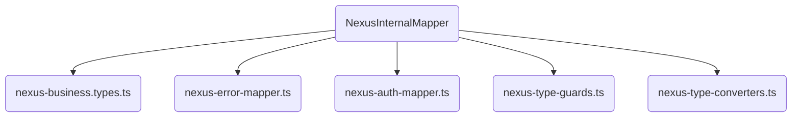
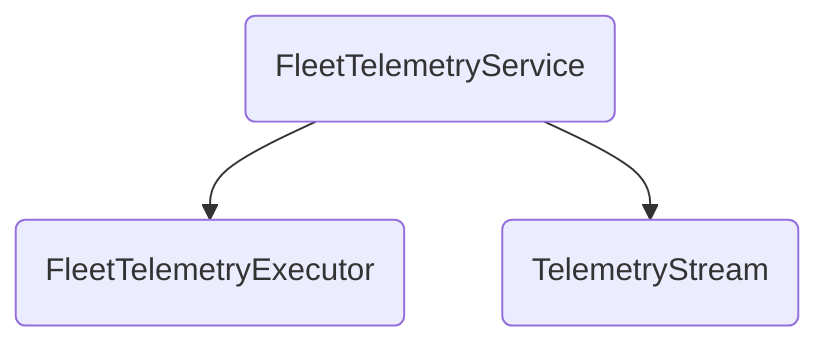

# NEXUS_SCHEMA_MAP.md

## Carte Structurelle : NexusInternalMapper Fragmenté

## Types Métier Supportés
- Table, TableStatus
- Order, OrderItem, OrderItemModification, OrderStatus
- Product, OptionGroup, Option
- Recipe, RecipeIngredient
- Quote, Campaign, Reservation, LegalInvoice
- Floor, Zone
- Customer, CRM_Record

## Hubs de Télémétrie Découplés

