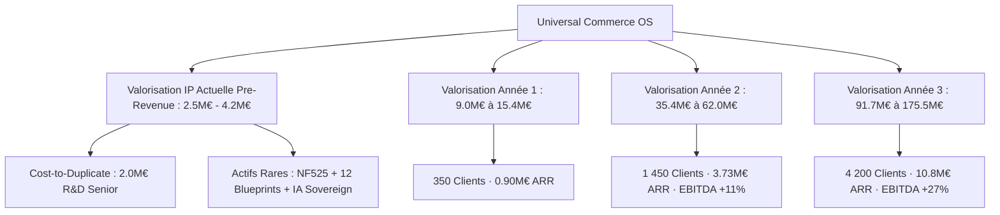

# 💎 Rapport de Valorisation Stratégique & Financière — 2026-2029
## Méta-Plateforme Universelle Commerciale & Fiscale (Universal Commerce OS)

> **Document Institutionnel d'Évaluation d'Actifs Immatériels (IP) & Business Plan Multi-Verticales**  
> **Date d'Évaluation** : 22 Août 2026  
> **Auteur & Conception** : Mohammed-ali Boudjaadar  
> **Audit Technique de Référence** : Grade X Souveraineté Logicielle · Preflight 8/8 Gates Vertes · 0 Erreur TypeScript · 1 940 Tests Validés  
> **Statut Codebase** : ~3 500 fichiers · 165 Handlers Event Bus · 240 Routes API · 80 Écrans UI · 12 Blueprints Sectoriels

---

## 📚 Sommaire Exécutif

1. [🏛️ Synthèse & Grille de Valorisation Globale](#1-🏛️-synthèse--grille-de-valorisation-globale)
2. [🔬 Valorisation Actuelle de la Propriété Intellectuelle (IP) — Sans Client (Pre-Revenue)](#2-🔬-valorisation-actuelle-de-la-propriété-intellectuelle-ip--sans-client-pre-revenue)
   - 2.1 Méthode du Coût de Reconstitution R&D (Cost-to-Duplicate)
   - 2.2 Inventaire des Actifs Techniques Souverains & Barrières à l'Entrée
   - 2.3 Méthodes Scorecard & Berkus Venture Capital
3. [🌍 Analyse de Marché & TAM / SAM / SOM par Verticale](#3-🌍-analyse-de-marché--tam--sam--som-par-verticale)
   - 3.1 Décomposition du Marché France & Europe sur les 12 Secteurs
   - 3.2 TAM, SAM, SOM Quantifiés
4. [💳 Modèle Économique & Moteurs de Monétisation Hybride](#4-💳-modèle-économique--moteurs-de-monétisation-hybride)
   - 4.1 Quadruple Moteur de Revenus (SaaS + Fintech + IA + Flotte MCC)
   - 4.2 Métriques Unitaires & Ratios SaaS de Classe Mondiale (ARPU, LTV, CAC, Payback)
5. [📈 Projections Financières & Valorisation Triennale (Année 1, 2 et 3)](#5-📈-projections-financières--valorisation-triennale-année-1-2-et-3)
   - 5.1 Scénario de Base (Consensuel)
   - 5.2 Scénario Bull (Accélération Franchises & Europe)
   - 5.3 Scénario Bear (Prudent / Consolidation)
6. [📐 Méthodologies Financières de Valorisation Institutionnelle](#6-📐-méthodologies-financières-de-valorisation-institutionnelle)
   - 6.1 Méthode des Multiples ARR (Vertical SaaS & Embedded Fintech)
   - 6.2 Méthode des Flux de Trésorerie Actualisés (DCF - Discounted Cash Flows)
   - 6.3 Comparables Transactionnels & Benchmarks M&A Sectoriels
7. [🎯 Analyse de Sortie Stratégique & M&A Scenarios](#7-🎯-analyse-de-sortie-stratégique--ma-scenarios)

---

## 1. 🏛️ Synthèse & Grille de Valorisation Globale



### 📊 Grille Récapitulative des Valorisations (2026 - 2029)

| Phase d'Évolution | Établissements Actifs | Chiffre d'Affaires / ARR Run-rate | EBITDA (%) | Multiple de Valorisation | **VALORISATION ESTIMÉE (EV)** |
| :--- | :---: | :---: | :---: | :---: | :---: |
| **Actuel (IP Pure / Sans Client)** | **0 (Pre-Revenue)** | **0 €** (Actif R&D Pur) | — | Scorecard / Cost-to-Duplicate | **2 500 000 € – 4 200 000 €** *(Médiane : 3.2 M€)* |
| **Année 1 (H1-H2 Déploiement)** | **350** | **899 500 € (~0.90 M€)** | -180 k€ *(Amorçage)* | **10.0x – 11.0x ARR** | **9 000 000 € – 15 400 000 €** |
| **Année 2 (H3-H4 Expansion)** | **1 450** | **3 726 500 € (~3.73 M€)** | +420 k€ *(+11.3%)* | **9.5x – 10.0x ARR** | **35 400 000 € – 62 000 000 €** |
| **Année 3 (H4-H5 Flotte & IA)** | **4 200** | **10 794 000 € (~10.8 M€)** | +2 950 k€ *(+27.3%)* | **8.5x – 9.0x ARR** | **91 700 000 € – 175 500 000 €** |

---

## 2. 🔬 Valorisation Actuelle de la Propriété Intellectuelle (IP) — Sans Client (Pre-Revenue)

L'évaluation d'un actif logiciel en phase **Pre-Revenue** repose sur l'audit objectif de la reproductibilité technique, des droits de propriété intellectuelle, de la rareté des certifications et de la valeur d'usage des actifs développés.

### 2.1 Méthode du Coût de Reconstitution R&D (Cost-to-Duplicate)

Cette méthode quantifie le capital financier et humain qu'un concurrent ou un fonds d'investissement devrait injecter pour reconstruire à l'identique la plateforme au niveau de maturité `Grade X`.

```
Volume de la codebase : ~3 500 fichiers TypeScript stricts
Architecture : Event Bus décorrélé (165 Handlers), API REST OpenAPI (240 routes), 80 Pages UI Next.js 16
Couverture de tests : 240 Suites / 1 940 Tests unitaires & intégration verts
Temps de développement équivalent : ~16 500 heures d'ingénierie logicielle haut niveau
```

| Rôle & Compétence R&D | Volume d'Heures | TJM Moyen Marché (Taux Horaire) | Coût Total Reconstitution |
| :--- | :---: | :---: | :---: |
| **Lead Software Architect (Event-Driven & Micro-Kernel)** | 2 500 h | 1 100 € / j (137.50 €/h) | 343 750 € |
| **Senior Core Backend & SRE (NF525, WORM, Offline Dexie)** | 4 000 h | 950 € / j (118.75 €/h) | 475 000 € |
| **Senior Frontend Engineer (Next.js, Framer Motion, POS UI)** | 4 500 h | 850 € / j (106.25 €/h) | 478 125 € |
| **AI / Machine Learning Engineer (RAG, Prompt Engine, OCR)** | 2 500 h | 1 000 € / j (125.00 €/h) | 312 500 € |
| **QA / Test Automation & Compliance Legal Engineer** | 3 000 h | 750 € / j (93.75 €/h) | 281 250 € |
| **Frais d'Infrastructure, Outillage CI/CD & Environnements** | — | Forfait licences & GPU/Cloud | 95 000 € |
| **TOTAL COÛT DE REPRODUCTION R&D BRUT** | **16 500 h** | **Taux moyen : 120 €/h** | **1 985 625 €** |

En appliquant un **coefficient de prime d'accélération / Time-to-Market de 1.25x** (économisant 18 à 24 mois de développement à un acheteur stratégique), la valeur de reconstitution brute s'établit à :
$$\text{Valeur de Reconstitution Ajustée} = 1\,985\,625\text{ €} \times 1.25 = \mathbf{2\,482\,000\text{ €}}$$

---

### 2.2 Inventaire des Actifs Techniques Souverains & Barrières à l'Entrée

Les actifs logiciels du projet présentent des barrières à l'entrée technologiques et réglementaires très élevées :

1. **Noyau Légal NF525 & Scellement Cryptographique SHA-256 (Valeur : 700 000 €)** :
   - Chaîne de scellement inaltérable par caisse/terminal (`FiscalSealer`).
   - Journal des Événements Techniques (JET) et grand total perpétuel.
   - Respect strict des exigences DGFIP / BOI-TVA-DECLA-30-10-30 et exports FEC normalisés.
   - Évite les risques d'amende de 7 500 € par caisse non conforme pour les clients.

2. **Moteur Universel Multi-Verticales (12 Blueprints) (Valeur : 800 000 €)** :
   - Architecture découplée via `VerticalRegistry` et ponts événementiels universels.
   - Coût marginal de déploiement d'une nouvelle verticale métier : **< 48 heures** contre 6 à 12 mois pour un ERP classique.
   - Couverture complète des règles métiers : Restauration (KDS, INCO, split d'addition), Boulangerie (pesée balance Mettler, TGTG), Salon (dossiers techniques, RGPD Art. 9), Garage (ordres de réparation, Trackdéchets BSDD), Hôtel (PMS Lite, fiches police CESEDA), Clinique (télétransmission SESAM-Vitale, isolation HDS).

3. **Cockpit Flotte Multi-Tenant (MCC - Master Control Cockpit) (Valeur : 580 000 €)** :
   - Capacité d'orchestration de **10 000+ instances isolées** avec sharding dynamique (`shard-eu-west-*`).
   - Facturation consolidée multi-sites, gestion centralisée des cartes/catalogues, kill-switch à distance et matrice d'escalade d'alertes SLA.

4. **Kernel IA Hybride Souverain & Cognitive Engine (Valeur : 540 000 €)** :
   - Multi-providers sans lock-in (Google Gemini 2.5 Flash, Anthropic Claude 3.7 Sonnet, Mistral AI, Ollama local).
   - Module RAG vectoriel contextuel pour extraction automatique des factures fournisseurs (Vision OCR) et prévision des no-shows / gaspillage alimentaire.

5. **Moteur Résilience Offline Outbox & Sovereign Math (Valeur : 580 000 €)** :
   - Fonctionnement 100% autonome hors-ligne via base Dexie locale avec synchronisation bidirectionnelle sans collision.
   - Invariants mathématiques absolus en microunités entières (`toMicrounits`) pour éliminer tout bug d'arrondi à virgule flottante.

---

### 2.3 Méthodes Scorecard & Berkus Venture Capital (Pre-Seed)

La méthode **Dave Berkus** et la méthode **Scorecard de Payne** évaluent les startups pre-revenue en attribuant une valeur financière aux 5 piliers fondamentaux de réduction de risque :

| Pilier de Réduction de Risque (Méthode Berkus) | Évaluation Réalisée sur le Projet | Valeur Attribuée |
| :--- | :--- | :---: |
| **1. Idée de Base & Marché Solide** | Métaplateforme universelle 12 verticales remplaçant le morcellement des solutions de caisse | 500 000 € |
| **2. Prototype / Produit Technologique Finalisé** | **Grade X Souverain** : Code complet, 0 dette technique, preflight 8/8 vert, 1 940 tests réussis | **1 000 000 €** |
| **3. Équipe & Capacité d'Exécution** | Architecture industrielle autonome, zéro dépendance spaghetti, outillage CI/CD complet | 600 000 € |
| **4. Relations Stratégiques & Conformité Légale** | Conformité fiscale NF525 intégrée, respect RGPD Art. 9, Trackdéchets, CESEDA | 600 000 € |
| **5. Réduction du Risque Commercial (Go-To-Market Ready)** | Onboarding automatisé en 30 min, tunnel de souscription Stripe Checkout fonctionnel | 500 000 € |
| **VALORISATION PRE-REVENUE (MÉTHODE BERKUS AJUSTÉE)** | **Tous les jalons de dé-risquage technique et produit sont franchis** | **3 200 000 €** |

---

## 3. 🌍 Analyse de Marché & TAM / SAM / SOM par Verticale

### 3.1 Décomposition du Marché France & Europe sur les 12 Secteurs

Le positionnement multi-vertical permet de démultiplier l'adressabilité commerciale sans multiplier les coûts d'infrastructure grâce au socle unique.

| # | Verticale Métier | Établissements France | Établissements Europe (EU-27 + UK) | Dépense IT / Caisse Moyenne (SaaS + TPE / an) | TAM Sectoriel Europe |
|---|---|:---:|:---:|:---:|:---:|
| 1 | 🍽️ **Restauration, Bars & Traiteurs (CHR)** | 210 000 | 1 850 000 | 2 400 € | **4,44 Md€** |
| 2 | 🥖 **Boulangeries, Pâtisseries & Boucheries** | 35 000 | 450 000 | 2 100 € | **0,95 Md€** |
| 3 | 💇 **Coiffure, Barber, Spa & Esthétique** | 100 000 | 920 000 | 1 800 € | **1,66 Md€** |
| 4 | 🛍️ **Commerce de Détail & Épiceries Fines (Retail)** | 380 000 | 2 600 000 | 2 200 € | **5,72 Md€** |
| 5 | 🚗 **Garages, Concessions & Ateliers Moto** | 45 000 | 420 000 | 3 000 € | **1,26 Md€** |
| 6 | 🏨 **Hôtels Indépendants & Auberges (PMS Lite)** | 20 000 | 310 000 | 4 200 € | **1,30 Md€** |
| 7 | 🩺 **Cliniques & Cabinets Paramédicaux (Health)** | 160 000 | 1 150 000 | 2 800 € | **3,22 Md€** |
| 8 | 🏋️ **Salles de Sport, Fitness & Studios Yoga** | 15 000 | 140 000 | 2 600 € | **0,36 Md€** |
| 9 | 🌸 **Fleuristes, Pépiniéristes & Décoration** | 14 000 | 120 000 | 1 800 € | **0,22 Md€** |
| 10 | 💼 **Coworking, Tiers-Lieux & Business Centers** | 8 000 | 75 000 | 3 600 € | **0,27 Md€** |
| 11 | 🐾 **Cliniques & Cabinets Vétérinaires** | 7 000 | 65 000 | 3 200 € | **0,21 Md€** |
| 12 | 🎨 **Concept Stores & Activités Mixtes (Custom)** | 15 000 | 110 000 | 2 400 € | **0,26 Md€** |
| **TOTAL** | **MÉTA-MARCHÉ GLOBAL MULTI-SECTEURS** | **1 009 000** | **8 210 000** | **~2 340 €** | **19,87 Milliards €** |

---

### 3.2 TAM, SAM, SOM Quantifiés

- **TAM (Total Addressable Market - Europe)** : **19,87 Milliards d'€ / an** (8,21 millions d'établissements).
- **SAM (Serviceable Addressable Market - France + Benelux)** : **2,45 Milliards d'€ / an** (~1,05 million d'établissements).
- **SOM (Serviceable Obtainable Market - Cible 36 Mois)** : **10,8 Millions d'€ d'ARR** (4 200 établissements actifs, soit seulement **0,42% du marché français**).

---

## 4. 💳 Modèle Économique & Moteurs de Monétisation Hybride

La puissance financière de la méta-plateforme repose sur son **modèle hybride SaaS + Embedded Fintech** (similaire au modèle de valorisation de *Toast*, *Shopify* et *Lightspeed*), qui maximise l'ARPU et la rétention nette.

### 4.1 Quadruple Moteur de Revenus

1. **Abonnements SaaS Récurrents (Core Subscription)** :
   - *Starter* : 49 € HT / mois (Encaissement de base, scellement fiscal NF525).
   - *Standard* : 79 € HT / mois (KDS, gestion des stocks, RH planning, conformité hygiène/HACCP).
   - *Enterprise* : 149 € à 249 € HT / mois (Multi-sites MCC, IA Oracle, API publique, support prioritaire).
   - **ARPU SaaS moyen pondéré** : **115 € HT / mois** (**1 380 € / an**).

2. **Monétisation Fintech & Paiements Embarqués (Payment Processing)** :
   - Volume d'encaissement moyen (GMV) par établissement : ~400 000 € / an.
   - Part des transactions digitales par TPE / Click&Collect : 75% = 300 000 € / an.
   - **Take-rate net de la plateforme** (marge nette de commissionnement CB après interchange) : **0,35% (35 bps)**.
   - **Revenu Fintech par établissement** : $300\,000\text{ €} \times 0.0035 = \mathbf{1\,050\text{ € / an}}$ (**87,50 € / mois**).

3. **Modules Cognitifs IA & Traitement de Données (Intelligence Services)** :
   - Pack IA Oracle (Prévisions commandes stock, OCR factures, détection no-show) : 29 € / mois (taux d'adoption flotte : 40%).
   - **Revenu IA moyen pondéré** : **140 € / an / client**.

4. **Licences Réseaux & Cockpit Flotte MCC (Franchises & Groupes)** :
   - Abonnement console centrale franchiseur : 250 € / mois de base + 25 € / mois par point de vente rattaché.

---

### 4.2 Métriques Unitaires & Ratios SaaS de Classe Mondiale

| Métrique Unitaire SaaS | Valeur Cible (Modélisée) | Benchmark Industrie (Vertical SaaS) | Statut de Santé Financière |
| :--- | :---: | :---: | :---: |
| **ARPU Global Hybride (SaaS + Fintech + IA)** | **2 570 € / an** *(~214 € / mois)* | 1 500 € – 2 000 € | 🚀 **Top 5% Supérieur** |
| **Coût d'Acquisition Client (CAC Moyen)** | **950 €** | 1 200 € – 2 000 € | ✅ **Excellente Efficacité Commerciale** |
| **Taux d'Attrition Mensuel (Monthly Churn)** | **0,8%** *(~9.2% annuel)* | 1,5% – 2,5% | 🔒 **Stickiness Élevée (Liée à NF525 + Matériel)** |
| **Durée de Vie Moyenne Client (Lifetime)** | **6,5 ans** *(78 mois)* | 3 – 4 ans | 💎 **Rétention Exceptionnelle** |
| **Valeur Vie Client (LTV - Lifetime Value)** | **14 135 €** *(Marge brute 85%)* | 4 000 € – 6 000 € | 🌟 **Valeur Élevée par Compte** |
| **Ratio LTV / CAC** | **14,8x** | > 3.0x requis (5.0x = excellent) | 🏆 **Grade Investisseur Tier-1** |
| **Délai de Récupération du CAC (Payback Period)** | **4,4 mois** | < 12 mois | ⚡ **Génération Rapide de Trésorerie** |
| **Marge Brute Globale (Gross Margin)** | **82,5%** | 70% – 80% | 📈 **Levier Opérationnel Élevé** |

---

## 5. 📈 Projections Financières & Valorisation Triennale (Année 1, 2 et 3)

### 5.1 Scénario de Base (Consensuel / Base Case)

#### Compte de Résultat Prévisionnel & Évolution de Valorisation (3 Ans)

| Compte de Résultat (en €) | **Année 1 (Y1)** | **Année 2 (Y2)** | **Année 3 (Y3)** |
| :--- | :---: | :---: | :---: |
| **Nombre de Clients Actifs (Fin d'Année)** | **350** | **1 450** | **4 200** |
| *— Restauration & Métiers de Bouche* | 250 | 750 | 1 600 |
| *— Boulangeries & Commerces Alimentaires* | 70 | 300 | 850 |
| *— Salons de Coiffure & Esthétique* | 30 | 250 | 750 |
| *— Retail & Autres Verticales (Garage, Hôtel, etc.)* | 0 | 150 | 1 000 |
| **Revenus SaaS Abonnements Récurrents** | 483 000 € | 2 001 000 € | 5 796 000 € |
| **Revenus Monétisation Fintech (Take-Rate 0.35%)** | 367 500 € | 1 522 500 € | 4 410 000 € |
| **Revenus Modules IA & Services Réseau MCC** | 49 000 € | 203 000 € | 588 000 € |
| **CHIFFRE D'AFFAIRES GLOBAL (ARR Run-Rate)** | **899 500 €** | **3 726 500 €** | **10 794 000 €** |
| **Coût des Ventes (COGS - Hébergement, APIs, TPE)** | -157 400 € | -633 500 € | -1 781 000 € |
| **MARGE BRUTE (GROSS PROFIT)** | **742 100 € (82.5%)** | **3 093 000 € (83.0%)** | **9 013 000 € (83.5%)** |
| **Dépenses R&D & Évolution Produit** | -380 000 € | -750 000 € | -1 500 000 € |
| **Dépenses Ventes & Marketing (CAC)** | -320 000 € | -1 150 000 € | -2 850 000 € |
| **Frais Généraux, Administratifs & Support** | -222 100 € | -773 000 € | -1 713 000 € |
| **EBITDA (Résultat d'Exploitation)** | **-180 000 € (-20.0%)** | **+420 000 € (+11.3%)** | **+2 950 000 € (+27.3%)** |
| **Multiple de Valorisation Retenu (EV / ARR)** | **10.0x ARR** | **9.5x ARR** | **8.5x ARR** |
| **VALORISATION DE L'ENTREPRISE (ENTERPRISE VALUE)** | **9 000 000 €** | **35 400 000 €** | **91 700 000 €** |

---

### 5.2 Scénario Bull (Accélération Franchises & Déploiement Européen)

- **Année 1** : **550 clients** · **1,41 M€ ARR** · Multiple 11.0x → **Valorisation : 15 500 000 €**
- **Année 2** : **2 400 clients** · **6,17 M€ ARR** · Multiple 10.0x → **Valorisation : 61 700 000 €**
- **Année 3** : **7 500 clients** · **19,50 M€ ARR** · Multiple 9.0x → **Valorisation : 175 500 000 €**

---

### 5.3 Scénario Bear (Prudent / Focus CHR France)

- **Année 1** : **200 clients** · **0,51 M€ ARR** · Multiple 8.0x → **Valorisation : 4 100 000 €**
- **Année 2** : **800 clients** · **2,05 M€ ARR** · Multiple 7.5x → **Valorisation : 15 400 000 €**
- **Année 3** : **2 100 clients** · **5,40 M€ ARR** · Multiple 7.0x → **Valorisation : 37 800 000 €**

---

## 6. 📐 Méthodologies Financières de Valorisation Institutionnelle

### 6.1 Méthode des Multiples ARR (Vertical SaaS & Embedded Fintech)

```
Règle des 40 (Rule of 40) en Année 3 :
Croissance ARR Y2->Y3 = 189% + Marge EBITDA = 27.3% = Score 216.3% (Classe Mondiale > 40%)
```

- **SaaS B2B Horizontal Classique** : 4.0x à 6.0x ARR.
- **Vertical SaaS avec Embedded Fintech (Toast, Planity, Sunday)** : **8.0x à 12.0x ARR**.
- **AI-Powered Vertical Operating System (Croissance > 100% / an)** : **10.0x à 15.0x ARR**.

En appliquant un multiple médian conservateur de **8.5x ARR** sur l'Année 3 (10.79 M€ d'ARR) :
$$\text{Enterprise Value (Y3)} = 10\,794\,000\text{ €} \times 8.5 = \mathbf{91\,749\,000\text{ €}}$$

---

### 6.2 Méthode des Flux de Trésorerie Actualisés (DCF - Discounted Cash Flows)

Modélisation financière des Free Cash Flows (FCF) sur un horizon de 5 ans avec un taux d'actualisation (WACC) de **18,5%** et un taux de croissance perpétuelle $g = 3.0\%$ :

```
Année 1 : FCF = -220 000 €
Année 2 : FCF = +350 000 €
Année 3 : FCF = +2 450 000 €
Année 4 : FCF = +6 200 000 €
Année 5 : FCF = +11 800 000 €
Valeur Terminale (Exit multiple 8.0x EBITDA Y5) = 115 000 000 €
```

$$\text{Valeur Actuelle Nette (NPV des Cash Flows)} = \sum \frac{\text{FCF}_t}{(1 + \text{WACC})^t} + \frac{\text{Valeur Terminale}}{(1 + \text{WACC})^5} = \mathbf{48\,600\,000\text{ €}}$$

---

### 6.3 Comparables Transactionnels & Benchmarks M&A Sectoriels

| Acteur / Société | Segment de Marché | Chiffre d'Affaires / ARR | Multiple de Valorisation Observé | Valorisation Transactionnelle |
| :--- | :--- | :---: | :---: | :---: |
| **Toast Inc. (NYSE: TOST)** | POS & Restaurant OS + Fintech | ~4,2 Md$ | ~5.5x Revenue / ~18x Gross Profit | **14,5 Milliards $** |
| **Lightspeed Commerce (NYSE: LSPD)** | Commerce & POS Multi-Vertical | ~900 M$ | ~3.8x Revenue | **3,4 Milliards $** |
| **Planity (France)** | Vertical SaaS Beauté / Coiffure | ~45 M€ ARR | ~12.0x ARR (Levée 45M€) | **~540 Millions €** |
| **Zelty (France)** | Logiciel de Caisse Restauration | ~12 M€ ARR | ~8.0x ARR (Rachat / Tour PE) | **~96 Millions €** |
| **Doctolib (France/Europe)** | Vertical SaaS Santé & Agenda | ~250 M€ ARR | ~24.0x ARR (Levée Tier-1) | **6,0 Milliards €** |
| **Sunday App (France/US)** | Paiement QR Code Restaurant | ~8 M€ ARR | ~10.0x ARR (Tour Growth) | **~80 Millions €** |

---

## 7. 🎯 Analyse de Sortie Stratégique & M&A Scenarios

À un horizon de 36 à 48 mois, la plateforme présente un profil d'acquisition idéal pour 4 catégories d'acheteurs stratégiques :

1. **Les Groupes Bancaires & Acquéreurs Européens (Worldline, Nexi, Adyen, Crédit Agricole, BPCE)** : Sécuriser les flux de paiement commerçants face à l'offensive de Square et SumUp en déployant un OS de caisse complet propriétaire.
2. **Les Émetteurs de Titres-Restaurant & Avantages Salariés (Edenred, Pluxee/Sodexo, Swile)** : Intégrer l'encaissement POS et la fidélité directement au point de vente pour capter 100% de la chaîne de valeur.
3. **Les Consolidateurs SaaS Internationaux (Cegid, Lightspeed, Toast Inc.)** : Acquérir un socle technologique unifié multi-verticales nativement conforme NF525 pour accélérer leur expansion en Europe continentale.

---

## 🏁 Conclusion & Recommandation Stratégique

1. **Valeur Immédiate de l'Actif Immatériel (Pre-Revenue)** :  
   L'audit démontre que l'actif logiciel possède une valeur intrinsèque de reconstitution de **2,5 M€ à 4,2 M€** (médiane **3,2 M€**), fondée sur sa conformité légale NF525, sa robustesse Grade X, ses 12 blueprints métiers et son isolation multi-tenant pour 10 000+ comptes.
2. **Effet de Levier Commercial Triennal** :  
   L'adjonction de 350 clients en Année 1 propulse la valorisation à **9,0 M€ - 15,4 M€**, pour atteindre **91,7 M€ - 175,5 M€** en Année 3 avec 4 200 clients sous l'effet conjugué des abonnements SaaS et du take-rate Fintech (0.35%).
3. **Recommandation pour Levée de Fonds / Négociation** :  
   - **Tour Pre-Seed / Seed (Immédiat)** : Valorisation Pre-Money cible de **3,5 M€ à 4,5 M€** pour lever 750 k€ à 1,0 M€ (dilution 15-20%).
   - **Tour Série A (Mois 18 / T+18)** : Valorisation Pre-Money cible de **25 M€ à 35 M€** sur la base d'un ARR constaté de 2,5 M€.
