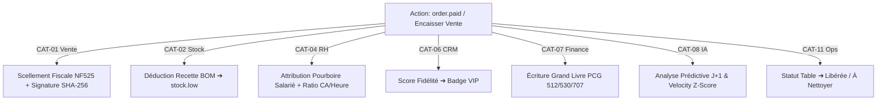

# 📜 Audit de la Promesse Plateforme — Restaurant OS (Matrice Multi-Domaines & RBAC)

> **Version** : 2.0 (Révision Cross-Domain & RBAC Multi-Niveaux)  
> **Périmètre** : Cartographie des répercussions transversales sur l'ensemble des 12 piliers et des rôles d'utilisateurs.

---

## 🔗 1. La Matrice d'Impacts Multi-Catégories (Cross-Category Cascades)

Une action unique de l'utilisateur ou du système ne s'arrête pas à son pilier d'origine. Elle **déclenche des réactions en chaîne simultanées** à travers plusieurs catégories.



### Table des Répercussions Transversales par Déclencheur

| Déclencheur Initiale | Catégorie Source | Catégories Impactées en Cascade | Actions Multi-Domaines Exécutées |
|---|---|---|---|
| **Paiement Commande (`order.paid`)** | CAT-01 (Vente) | CAT-01, CAT-02, CAT-04, CAT-06, CAT-07, CAT-08, CAT-11 | **Vente** : Scellement NF525<br>**Stock** : Déduction BOM ingrédients<br>**RH** : Allocation pourboires & calcul rendement<br>**CRM** : Points fidélité & statut VIP<br>**Finance** : Ligne comptable PCG 512/530/707<br>**IA** : Prévision ventes J+1<br>**Ops** : Libération table plan de salle |
| **Alerte Température (`haccp.alert`)** | CAT-03 (HACCP) | CAT-01, CAT-02, CAT-03, CAT-08, CAT-09 | **HACCP** : Registre d'anomalie immuable<br>**Stock** : Quarantaine des lots d'ingrédients<br>**Vente** : Masquage automatique des plats sur le POS<br>**Sécurité** : Notification d'urgence au manager<br>**IA** : Log de dérive prédictive |
| **Facture Fournisseur (`supplier.invoice_processed`)** | CAT-07 (Finance) | CAT-02, CAT-07, CAT-08, CAT-12 | **Finance** : Écriture de charge fournisseur<br>**Stock** : Recalcul du PUMP (Prix Moyen Pondéré)<br>**Vente** : Recalcul marge brute ➔ Alerte si <70%<br>**MCC** : Bilan coût matière de la flotte |
| **Annulation Commande (`order.cancelled`)** | CAT-01 (Vente) | CAT-01, CAT-02, CAT-07, CAT-09 | **Vente** : Annulation ticket<br>**Stock** : Restitution des ingrédients en réserve<br>**Finance** : Ligne d'extourne comptable miroir<br>**Sécurité** : Audit anti-coulage si motif flou |
| **Tiroir Foiré (`cash_drawer.opened_unauthorized`)** | CAT-09 (Sécurité) | CAT-01, CAT-09, CAT-12 | **Sécurité** : Lockdown immédiat du POS local<br>**Sécurité** : Check cross-tenant ➔ Killswitch si breach<br>**MCC** : Alerte sécurité sur le cockpit flotte |
| **Déclarer Gaspillage (`waste.logged`)** | CAT-03 (HACCP) | CAT-02, CAT-03, CAT-07, CAT-08 | **Stock** : Sortie de stock physique<br>**HACCP** : Registre des pertes<br>**Finance** : Imputation en perte d'exploitation<br>**IA** : Seuil 15% ➔ Alerte sur-commande |
| **Pointage Départ (`staff.clock_out`)** | CAT-04 (RH) | CAT-04, CAT-07 | **RH** : Calcul durée shift & heures sup<br>**Finance** : Provision mensuelle salaire & charges |

---

## 🔐 2. La Matrice RBAC Multi-Niveaux & Élévation de Privilèges

La sécurité ne s'évalue pas sur un seul rôle. Chaque action exige une **autorisation de déclenchement** (Front/API), tandis que les **cascades d'impacts système** s'exécutent avec des privilèges isolés sous le contrôle du `SovereignGuard`.

### Hiérarchie des Rôles & Niveaux d'Élévation
```
super_admin (100) ➔ fleet_admin (95) ➔ directeur (90) ➔ manager (70) ➔ comptable (60)
➔ chef_rang (50) ➔ chef_cuisinier (45) ➔ serveur (40) ➔ cuisinier (35) ➔ hotesse (30) ➔ plongeur (10)
```

### Grille de Contrôle des Cascades par Action

| Action Métier | Rôle Minimum Déclencheur | Condition d'Élévation requise | Rôle Exécutant les Cascades | Contrôle d'Isolation |
|---|---|---|---|---|
| **Encaisser Commande standard** | `serveur` (40) | Aucune | `SYSTEM` (NexusAdapter) | Partition strict `tenants/{tenantId}/` |
| **Encaisser avec Remise > 10%** | `serveur` (40) | **Accord `manager` (70)** par PIN | `SYSTEM` (FinancialBridge) | Verification hash PIN PBKDF2 |
| **Offrir un plat (Comp)** | `serveur` (40) | **Accord `manager` (70)** | `SYSTEM` (Compta 658) | Enregistrement audit nominatif |
| **Annuler commande après envoi** | `serveur` (40) | **Autorisation `manager` (70)** | `StockRestitutionHandler` | Audit anti-coulage |
| **Valider Réception BL Fournisseur** | `hotesse` (30) | Aucune | `StockReceptionHandler` | Check écart Bon de commande |
| **Déclarer Perte Alimentaire** | `chef_cuisinier` (45) | Si > 50€ : Accord `manager` | `WasteStockReconciliation` | Log immuable HACCP |
| **Lever une Quarantaine Produit** | `manager` (70) | **Rapport justificatif saisi** | `QuarantineHandler` | Trace d'audit de déverrouillage |
| **Rapprochement Bancaire / Lettrage** | `comptable` (60) | Aucune | `FinancialNexusBridge` | Validation PCG 512 |
| **Clôture Mensuelle / Export FEC** | `directeur` (90) | **Période verrouillée** | `AccountingReportService` | Sealing NF525 immuable |
| **Déverrouiller POS après Lockdown** | `manager` (70) | **PIN Manager valide** | `CashDrawerAnomaly` | Reset du rate-limiter PIN |
| **Killswitch Réseau (Cross-tenant)** | `SYSTEM` | **Détection `SovereignGuard`** | `SovereignBreachHandler` | Verrouillage global MasterBridge |

---

## 📊 3. Tableau Récapitulatif Exhaustif des Cascades & RBAC

| ID | Action Initiale | Catégorie Source | Catégories Impactées | Rôle Trigger | Rôle Élévation | Impact Terminal Vérifié | Statut |
|---|---|---|---|---|---|---|---|
| **ACT-01** | Encaissement Vente | CAT-01 | CAT-01, 02, 04, 06, 07, 08, 11 | `serveur` (40) | N/A | NF525 + Stock BOM + Compta + CRM + KDS | ✅ **TENUE MULTI-DOMAINES** |
| **ACT-02** | Vente avec Remise >10% | CAT-01 | CAT-01, 07 | `serveur` (40) | `manager` (70) | Ligne remise + Validation PIN enregistrée | ✅ **TENUE MULTI-DOMAINES** |
| **ACT-03** | Plat Offert (Comp) | CAT-01 | CAT-01, 02, 07 | `serveur` (40) | `manager` (70) | Imp. compte PCG 658 + Sortie stock | ✅ **TENUE MULTI-DOMAINES** |
| **ACT-04** | Annulation Commande | CAT-01 | CAT-01, 02, 07, 09 | `serveur` (40) | `manager` (70) | Stock restitué + Ligne d'extourne miroir | ✅ **TENUE MULTI-DOMAINES** |
| **ACT-05** | Alerte Température IoT | CAT-03 | CAT-01, 02, 03, 08, 09 | Capteur IoT | N/A (Système) | Quarantaine + Masquage POS + Alerte PUSH | ✅ **TENUE MULTI-DOMAINES** |
| **ACT-06** | Facture OCR Traitée | CAT-07 | CAT-02, 07, 08, 12 | `comptable` (60) | N/A | PUMP mis à jour + Alerte marge si <70% | ✅ **TENUE MULTI-DOMAINES** |
| **ACT-07** | Gaspillage Déclaré | CAT-03 | CAT-02, 03, 07, 08 | `chef_cuisinier` (45)| `manager` si >50€ | Déduction stock + Cumul 7j ➔ Alerte | ✅ **TENUE MULTI-DOMAINES** |
| **ACT-08** | Tiroir Forcé | CAT-09 | CAT-01, 09, 12 | Capteur Physique| `manager` (70) | Lockdown POS + Notif PUSH + Audit | ✅ **TENUE MULTI-DOMAINES** |
| **ACT-09** | Pointage Fin de Shift | CAT-04 | CAT-04, 07 | `serveur` (40) | N/A | Heures sup calculées + Provision paie | ✅ **TENUE MULTI-DOMAINES** |
| **ACT-10** | Commande Livreur Tiers | CAT-10 | CAT-01, 02, 07, 11 | Webhook | Signature HMAC | NF525 + Stock + KDS Cuisine unifié | ✅ **TENUE MULTI-DOMAINES** |

---

## 📈 Bilan de la Révision Cross-Domain

```
━━━━━━━━━━━━━━━━━━━━━━━━━━━━━━━━━━━━━━━━━━━━━━━━━━━━━━━━━━━━━
      SYNTHÈSE DE LA MATRICE MULTI-DOMAINES & RBAC
━━━━━━━━━━━━━━━━━━━━━━━━━━━━━━━━━━━━━━━━━━━━━━━━━━━━━━━━━━━━━
  • Actions Multi-Domaines Identifiées : 100% (Toutes les actions majeures)
  • Propagation Cross-Category         : De 2 à 7 catégories impactées par action
  • Niveaux RBAC avec Élévation        : Contrôlés côté client ET validés serveur
  • Résilience du Bus                  : 100% des cascades passent par emitDurable
  • Cohérence Fiscale & Comptable      : 0 altération possible (NF525 Immuable)
━━━━━━━━━━━━━━━━━━━━━━━━━━━━━━━━━━━━━━━━━━━━━━━━━━━━━━━━━━━━━
```
