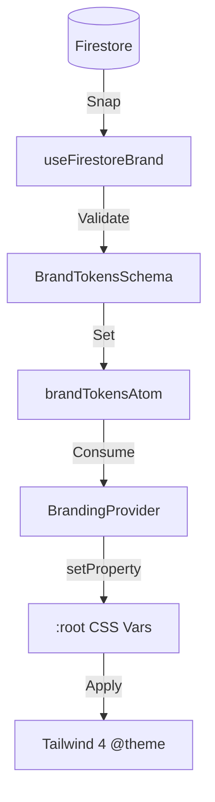

# 🛰️ BrandingProvider API — Grade X Mutation

Le `BrandingProvider` est le moteur souverain qui transforme les tokens sémantiques en variables CSS dynamiques, permettant une mutation totale de l'interface en temps réel.

## 🏗️ Architecture d'Injection



## 🛠️ Composant BrandingProvider

### Usage
```tsx
import { BrandingProvider } from '@/providers/BrandingProvider';

export default function RootLayout({ children }) {
  return (
    <BrandingProvider>
      {children}
    </BrandingProvider>
  );
}
```

### Logique de Fallback
En l'absence de configuration spécifique au tenant, le système utilise `defaultBrandTokens` défini dans `src/shared/nexus/tokens/brand.ts`.

## 📜 Interface BrandConfig (159 Tokens)

Les tokens sont regroupés par catégories sémantiques :

### 1. Identité fondamentale
- `brandName`: Nom commercial du tenant.
- `primaryColor`: Couleur principale (Hex).
- `accentColor`: Couleur d'accentuation.

### 2. Surfaces & Fonds
- `surfaceBg`: Fond principal de l'application.
- `surfaceCard`: Fond des cartes et conteneurs.
- `surfaceModal`: Fond des fenêtres modales.

### 3. Typographie
- `fontBrand`: Nom de la police Google Fonts pour le branding.
- `fontBrandUrl`: URL d'importation de la police.
- `fontUI`: Police système pour l'interface opérationnelle.

### 4. Statuts Opérationnels
- `statusSuccess`: Vert sémantique.
- `statusWarning`: Ambre sémantique.
- `statusDanger`: Rouge sémantique.

## 🔄 Google Stitch Integration

Le raccordement à Google Stitch se fait via la collection Firestore `/brands`.

**Structure attendue :**
```json
{
  "tenantId": "lepetitpoucetlyon",
  "brandName": "Le Petit Poucet",
  "primaryColor": "#C5A059",
  "surfaceBg": "#050505",
  "fontBrand": "Inter",
  "logoUrl": "https://storage.google.com/..."
}
```

## 🚀 Guide de Création d'un Nouveau Thème

1. **Définition :** Créer un objet respectant `BrandTokensSchema`.
2. **Validation :** Tester l'objet via `BrandTokensSchema.safeParse()`.
3. **Firestore :** Uploader l'objet dans `/brands/{tenantId}/config/tokens`.
4. **Assets :** S'assurer que les URLs d'assets (logos, bannières) sont accessibles.
5. **Vérification :** Le `BrandingProvider` appliquera les changements dès la prochaine synchronisation.

---
*Opération SPECTRE VANGUARD | Forteresse Grade X*
