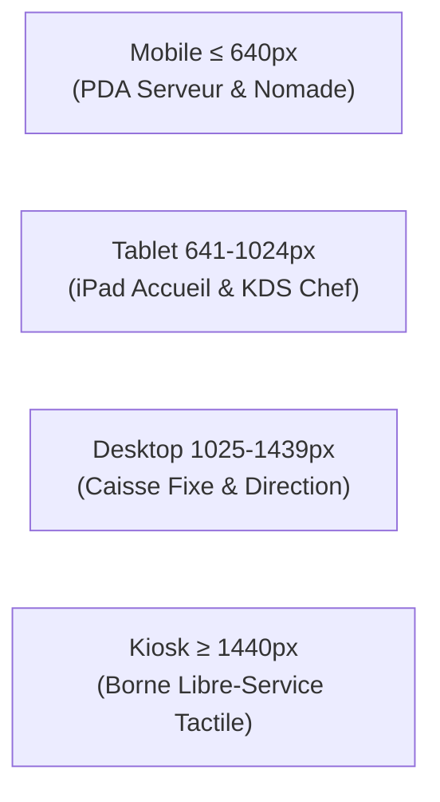

# 04 — Spécifications des Breakpoints & Cibles Matérielles

Le comportement responsive de Restaurant OS repose sur des mises en page dédiées plutôt que sur un simple redimensionnement élastique.

## Matrice des 4 Cibles Matérielles

### 1. Mobile (≤ 640px)
- **Matériel type** : Smartphone iPhone / Android durci, PDA serveur Zebra / Sunmi.
- **Règles ergonomiques** :
  - Catalogue plein écran avec recherche instantanée.
  - Addition et actions en BottomSheet swipe-up.
  - Boutons d'action tactiles larges (> 48px).
  - Navigation par barre basse (`MobileNavBar`).

### 2. Tablette (641px – 1024px)
- **Matériel type** : iPad Pro 11", iPad Mini, Galaxy Tab Active.
- **Règles ergonomiques** :
  - Disposition à 2 colonnes (Catalogue à gauche, Addition à droite).
  - Panneaux latéraux rétractables.
  - Cadençage KDS avec swipe entre postes (chaud, froid, pass).

### 3. Desktop (1025px – 1439px)
- **Matériel type** : Caisse tactile fixe 15", iMac, PC comptable.
- **Règles ergonomiques** :
  - 3 ou 4 colonnes permanentes visibles sans scroll.
  - Raccourcis clavier physiques supportés.
  - Tableaux de données étendus avec tris et pagination dense.

### 4. Kiosk (≥ 1440px / Mode Borne)
- **Matériel type** : Borne tactile verticale 24"-32", écran KDS mural 55".
- **Règles ergonomiques** :
  - Typographie augmentée (`font-size: 1.125rem` de base).
  - Suppression totale des ascenseurs de défilement (scroll locks).
  - Reset automatique après 90 secondes d'inactivité.
  - Contraste AAA et gros visuels produits.
