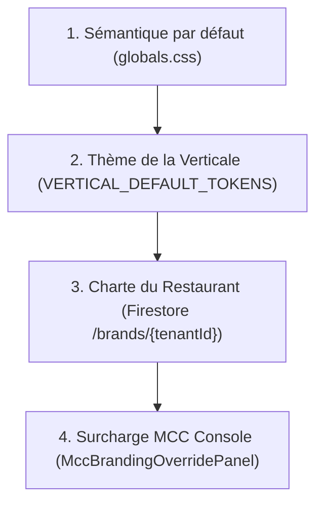

# 07 — Cycle de Vie du Branding & Précédence des Tokens

L'injection des tokens graphiques suit une hiérarchie de surcharge stricte et déterministe.

## 1. Arbre de Précédence des Tokens

## 2. Invariants de Sécurité Visuelle
- **Contraste de Texte Automatique** : La variable `--text-on-primary` est recalculée dynamiquement par luminance WCAG (`0.2126*R + 0.7152*G + 0.0722*B > 0.5 ? '#000000' : '#FFFFFF'`).
- **Isolation des Polices** : Les Google Fonts personnalisées injectent un lien `<link data-font-brand>` dédupliqué sans bloquer le rendu du premier octet.
- **Révocation MCC** : En cas de charte illisible ou d'attaque visuelle, la console MCC peut surcharger immédiatement les tokens du tenant.

## 3. Emplacements de Configuration
- **Gérant Restaurant** : Route `/settings/branding` via le composant `BrandingPanel`.
- **Opérateur MCC** : Onglet `Branding Override` dans le tableau de bord administrateur MCC.
