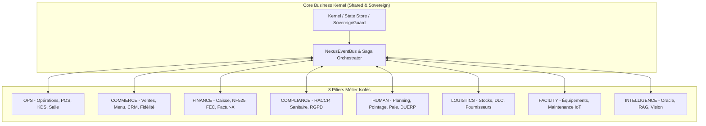

# 🏛️ Architecture Méta-Plateforme Commerciale (Universal Commerce OS)

> **Spécification d'Architecture Méta-Plateforme, Noyau Invariant & Résilience Fiscale**  
> **Codebase** : `src/kernel/`, `src/modules/`, `src/orchestration/`, `src/verticals/`  
> **Conformité** : NF525 Immutable · SovereignGuard Multi-Tenant · RGPD Art. 9 · Zero-Defect Standard

---

## 📚 Sommaire

1. [Anatomie des 8 Piliers du Domaine DDD](#1-anatomie-des-8-piliers-du-domaine-ddd)
2. [Double Moteur RBAC & Isolation Souveraine](#2-double-moteur-rbac--isolation-souveraine)
3. [Moteur Cryptographique & Fiscal NF525 Multi-Caisses Offline](#3-moteur-cryptographique--fiscal-nf525-multi-caisses-offline)
4. [La Méta-Architecture Généraliste](#4-la-méta-architecture-généraliste)
5. [Topologie du Bus Événementiel & Idempotence Stricte](#5-topologie-du-bus-événementiel--idempotence-stricte)
6. [Gouvernance des Données & Protection RGPD Art. 9 (Santé / Allergies)](#6-gouvernance-des-données--protection-rgpd-art-9-santé--allergies)
7. [Mission Control Center (MCC) & Supervision Fleet](#7-mission-control-center-mcc--supervision-fleet)
8. [Les 6 Invariants de Concurrence & Conflits Distribués](#8-les-6-invariants-de-concurrence--conflits-distribués)

---

## 1. Anatomie des 8 Piliers du Domaine DDD

Le système repose sur **8 Piliers Métier souverains**, étanches et hautement spécialisés. Aucun pilier ne possède de dépendance directe avec un autre pilier : toute communication inter-domaine transite obligatoirement par le bus asynchrone sécurisé `NexusEventBus`.



---

### 🔹 PILIER 1 : OPS (Opérations, Caisse POS, KDS & Workflow Service)
* **Volume** : **218 fichiers** (`src/modules/ops/`)
* **Rôle** : Orchestrer le flux opérationnel temps réel de l'établissement.
* **Sous-Modules** : `service/pos/` (Moteur de caisse), `production/kds/` (KDS multi-postes), `spaces/floor-plan/` (Plan de salle 2D/3D), `workflow/engine/` (Machine à états des commandes).
* **Événements** : Émet `order.placed`, `ops.course.fired`, `table.locked`, `table.released`. Consomme `reservation.matched`, `haccp.alert`.

### 🔹 PILIER 2 : COMMERCE (Catalogue, Tarifs, CRM, Fidélité & Delivery)
* **Volume** : **254 fichiers** (`src/modules/commerce/`)
* **Rôle** : Maximiser le revenu de l'établissement et unifier les canaux de vente.
* **Sous-Modules** : `catalog/` (Menu Builder), `relation/crm/` (Fichier client), `relation/loyalty/` (Moteur fidélité), `relation/delivery/` (Hub livraison).
* **Événements** : Émet `commerce.promotion_activated`, `commerce.loyalty_points_earned`, `crm.customer_created`. Consomme `order.paid`.

### 🔹 PILIER 3 : FINANCE (Caisse, Grand Livre, NF525, Factur-X & FEC)
* **Volume** : **186 fichiers** (`src/modules/finance/`)
* **Rôle** : Assurer l'intégrité fiscale absolue (Article 286 CGI / NF525) et automatiser la comptabilité.
* **Sous-Modules** : `comptabilite/` (Grand Livre, PCG), `fiscalite/tax/` (Ventilation TVA), `einvoicing/` (Factur-X PDF/A-3 + XML), `billing/` (Facturation B2B).
* **Événements** : Émet `order.paid`, `finance.ticket_z_closed`, `finance.invoice_generated`. Consomme `order.placed`, `supplier.delivery_received`.

### 🔹 PILIER 4 : COMPLIANCE (Hygiène HACCP, Traçabilité, Coffre WORM & RGPD)
* **Volume** : **123 fichiers** (`src/modules/compliance/`)
* **Rôle** : Garantir la conformité sanitaire, la protection des données et l'archivage légal inaltérable.
* **Sous-Modules** : `qualite/haccp/` (Relevés température), `securite/` (DocumentVault WORM), `sanitaire/` (Traçabilité lots), `registre/` (RGPD Art. 30).
* **Événements** : Émet `haccp.temperature_logged`, `haccp.alert`, `compliance.certificate_expiring`. Consomme `sovereign.breach`.

### 🔹 PILIER 5 : HUMAN (Effectifs, Planning Glissant, Pointeuse & Paie)
* **Volume** : **105 fichiers** (`src/modules/human/`)
* **Rôle** : Gérer les ressources humaines et orchestrer les plannings sous contraintes légales.
* **Sous-Modules** : `effectifs/hr/` (Dossiers collaborateurs), `planning/` (Planning glissant HCR), `timeclock/` (Pointeuse PIN/NFC), `paie/` (Pré-paie Silae/Payfit).
* **Événements** : Émet `hr.shift_started`, `hr.shift_ended`, `hr.absence_declared`, `hr.tip_declared`. Consomme `finance.ticket_z_closed`.

### 🔹 PILIER 6 : LOGISTICS (Approvisionnement, Stocks, Fiches Techniques & DLC)
* **Volume** : **78 fichiers** (`src/modules/logistics/`)
* **Rôle** : Assurer la disponibilité des stocks et automatiser les réapprovisionnements.
* **Sous-Modules** : `stocks/` (Stock multi-emplacements, PRMP), `approvisionnement/` (Gestion fournisseurs), `inventaire/` (Assistant inventaire), `dlc/` (Suivi DLC/DLUO).
* **Événements** : Émet `inventory.stock_adjusted`, `stock.low`, `logistics.delivery_received`. Consomme `order.paid`.

### 🔹 PILIER 7 : FACILITY (Parc Machines, Maintenance IoT & Énergie)
* **Volume** : **41 fichiers** (`src/modules/facility/`)
* **Rôle** : Maximiser la disponibilité des équipements critiques et prévenir les pannes.
* **Sous-Modules** : `maintenance/` (Carnet d'entretien machines), `interventions/` (Bons de panne), `iot/` (Sondes température Bluetooth/MQTT).
* **Événements** : Émet `facility.maintenance_requested`, `iot.offline_alert`. Consomme `haccp.threshold_exceeded`.

### 🔹 PILIER 8 : INTELLIGENCE (Oracle Majordome, LightRAG & Vision AI)
* **Volume** : **149 fichiers** (`src/modules/intelligence/`)
* **Rôle** : Transformer les données brutes en décisions stratégiques et exécuter des tâches autonomes.
* **Sous-Modules** : `oracle/` (IA conversationnelle), `rag/` (LightRAG vectoriel), `agents/` (Swarm d'agents Atlas, Themis, Cronos), `forecasting/` (Prédictif affluence).
* **Événements** : Émet `intelligence.menu_engineering_requested`, `intelligence.anomaly_detected`. Consomme tous les événements métier.

---

## 2. Double Moteur RBAC & Isolation Souveraine

La plateforme impose une séparation étanche entre **le locataire B2B (Tenant)** et **l'opérateur constructeur (MCC)** via `SovereignGuard`.

```
┌─────────────────────────────────────────────────────────────────────────────┐
│                          SUPER-ADMIN / OPÉRATEUR MCC                        │
│   Auth: MFAGate + Token Fleet Operator · Routes: /app/(admin)/*            │
│   Nature: Hors-RBAC Tenant · Mode: isMCCMode() · MccOperatorContract        │
│   Isolation: SovereignGuard bloque TOUTE lecture de données PII tenant     │
└──────────────────────────────────────┬──────────────────────────────────────┘
                                       │ Orchestration (Telemetry, Provisioning)
┌──────────────────────────────────────▼──────────────────────────────────────┐
│                           LOCATAIRE B2B (TENANT)                            │
│   Auth: Firebase JWT + PIN Staff · Routes: /app/(client)/*                  │
│   RBAC: 14 Rôles hiérarchisés du niveau 10 (Apprenti) au 100 (Propriétaire) │
│   Isolation: SovereignGuard enforce tenantId strictly on every collection   │
└─────────────────────────────────────────────────────────────────────────────┘
```

> ⚠️ **Note d'Étanchéité Fondamentale : RBAC Tenant vs Opérateur MCC**
> - **Niveau `100` (Propriétaire Gérant)** : C'est le **client B2B (gérant du restaurant/commerce)**. Il a une souveraineté totale sur **SON** propre tenant, mais reste **strictement cloisonné par SovereignGuard** au sein de son `tenantId`.
> - **Opérateur MCC (Vous / La Plateforme)** : N'appartient **PAS** à la grille RBAC (10 à 100). Il opère au niveau de la flotte sur les routes `/app/(admin)/*` via `MccOperatorContract` et `isMCCMode()`. Il ne peut pas lire les données PII privées du tenant sans une procédure d'impersonation auditée.

---

### Grille des 14 Rôles Métier Tenant (Niveaux 10 à 100) :
- `10` **Plongeur / Apprenti** : Pointage basique, consultation règles hygiène.
- `20` **Commis / Runner** : Saisie rapide POS, lecture KDS expédition.
- `30` **Serveur / Barman / Réceptionniste** : POS complet, ouverture table, encaissement direct.
- `40` **Chef de Rang** : Transferts de table, remises mineures (<10%), timeclock manager.
- `50` **Sommelier / Expert Produit** : Gestion cave, fiches dégustation, stocks nobles.
- `60` **Sous-Chef / Comptable** : Relevés HACCP, réception marchandises, comptabilité lecture.
- `70` **Manager / Chef de Cuisine** : Planning écriture, validation pertes, remises (>10%).
- `80` **Directeur Établissement** : Audit fiscal, analytics consolidation, déclarations TVA, DUERP.
- `100` **Propriétaire Gérant (Tenant)** : Souveraineté totale sur le tenant (configuration, DNA, clôture fiscale).

---

## 3. Moteur Cryptographique & Fiscal NF525 Multi-Caisses Offline

La conformité fiscale (Article 286 du CGI / NF525) est garantie par le moteur `FiscalSeal` avec une architecture robuste pour le **multi-terminaux hors-ligne** :

```
┌─────────────────────────────────────────────────────────────────────────────┐
│                 ARCHITECTURE MULTI-CAISSES OFFLINE SANS FORK                │
├─────────────────────────────────────────────────────────────────────────────┤
│  Terminal Caisse 1 (Offline)  ──► Chaîne Locale : Seal_T1_1 → Seal_T1_2     │
│  Terminal Caisse 2 (Offline)  ──► Chaîne Locale : Seal_T2_1 → Seal_T2_2     │
│                                                                             │
│  [Resynchronisation Réseau]                                                 │
│  Serveur Central ──► Enregistrement des chaînes parallèles étanches         │
│  Clôture Journalière Z ──► MasterFiscalSeal = Hash(Last_T1 + Last_T2)       │
└─────────────────────────────────────────────────────────────────────────────┘
```

1. **Intégrité Cryptographique par Caisse (`registerId`)** : Chaque terminal gère sa propre séquence ininterrompue `sequenceNumber` et `previousHash`. Aucune collision de hash n'est possible entre tablettes.
2. **Archivage WORM (Write Once Read Many)** : Implémenté via `DocumentVault.ts` et la collection `fiscal_archives/` avec interdiction stricte de modification/suppression (rétention 6 ans).
3. **Clôture Journalière Z Consolidée** : Le `MasterFiscalSeal` quotidien scelle l'état final de toutes les caisses actives de l'établissement.
4. **Calculs en Microunités Entières** : Tout montant monétaire est stocké sous forme entière `amountInMicrounits` (1€ = 1 000 000 µunits) pour éliminer tout risque d'arrondi flottant IEEE-754.

---

## 4. La Méta-Architecture Généraliste

Le système repose sur un **Tronc Invariant** et une **Couche d'Adaptation Découplée** :

### 1. Matrice Sémantique des 8 Métiers (`MetricLabels`) :
Les 9 clés sémantiques s'adaptent instantanément à chaque secteur sans altérer le code sous-jacent :

| Clé Sémantique | 🍽️ Restaurant | 🥖 Bakery | 🛍️ Retail | 💇 Salon | 🚗 Garage | 🏨 Hotel | 🩺 Clinic | 🎨 Custom |
|---|---|---|---|---|---|---|---|---|
| `unit` | couvert | pièce | article | prestation | intervention | nuitée | consultation | unité |
| `spatialContext`| table | étal | rayon | cabine | baie / pont | chambre | cabinet | espace |
| `merchantKind` | restaurant | boulangerie | commerce | salon | garage | hôtel | clinique | établissement |
| `server` | serveur | vendeur | conseiller | coiffeur | mécanicien | réceptionniste | praticien | opérateur |
| `prepTicket` | bon cuisine | ordre fournée | bon prépar. | fiche technique | ordre répar. (OR)| bon service | ordonnance | fiche travail |
| `recipeLabel` | recette | recette pâtiss.| fiche article | forfait soin | forfait révis. | forfait séjour | acte médical | prestation |
| `itemLabel` | ingrédient | matière 1ère | article | cosmétique | pièce détachée | fourniture | consommable | ressource |
| `customerLabel`| convive | client | acheteur | client | automobiliste | résident | patient | client |

### 2. Le Pont Événementiel (`VerticalEventBridge` · 42 Règles) :
Normalise les événements métier spécifiques vers les événements pivots universels :
* `auto.invoice_issued` (Garage) ──► `order.paid` (Générique)
* `hotel.guest_checked_out` (Hôtel) ──► `order.paid` (Générique)
* `retail.sale_completed` (Boutique) ──► `order.paid` (Générique)
* `salon.appointment_completed` (Salon) ──► `order.paid` (Générique)
* `health.act_billed` (Clinique) ──► `order.paid` (Générique)

---

## 5. Topologie du Bus Événementiel & Idempotence Stricte

Le `NexusEventBus` applique les règles suivantes pour garantir l'intégrité à l'échelle :

1. **Idempotence des Handlers Serveur** :
   * Chaque événement émis possède un identifiant cryptographique `eventId` unique (UUID v4).
   * Les handlers critiques (`CRITICAL` et `HIGH`) vérifient la collection atomique `events_processed_log/{eventId}` avant exécution. Si l'événement a déjà été traité, l'exécution est court-circuitée immédiatement sans doubler l'écriture.
2. **Ordre & Séquencement Asynchrone** :
   * Les événements dépendants partagent une clé d'agrégat (`aggregateId` = ex: `orderId`).
   * Les mutations sont exécutées séquentiellement par agrégat pour éviter les inversions de statut (ex: `table_closed` avant `order.paid`).
3. **Outbox Durable & Quarantaine DLQ** :
   * Persistance locale IndexedDB (`busOutbox`) avant émission en mémoire.
   * Tout échec répété 3 fois consécutives est routé vers la Dead Letter Queue (`mcc/dlq`) avec alerte superviseur.

---

## 6. Gouvernance des Données & Protection RGPD Art. 9 (Santé / Allergies)

La gestion des données personnelles et sensibles respecte le RGPD strict :

1. **Qualification Données de Santé (Art. 9 RGPD)** :
   * Les fiches allergènes (`Customer.allergens`) liées à l'identité d'un client sont classées **données de santé à protection renforcée**.
   * Recueil d'un consentement explicite lors de la prise de réservation.
   * Chiffrement au repos de ces données dans la base.
2. **Droit à l'Oubli & Crypto-Shredding** :
   * L'exécution de `ErasureService` détruit irréversiblement les clés de déchiffrement du profil client tout en préservant l'intégrité comptable NF525 (qui ne contient que des montants et numéros de tickets anonymisés).
3. **Masquage dans les Logs de Télémétrie** :
   * Aucun email, téléphone ou nom de client n'apparaît en clair dans les logs Sentry ou Axiom.

---

## 7. Mission Control Center (MCC) & Supervision Fleet

Le MCC est le tableau de bord d'administration globale permettant de piloter l'ensemble des instances clients :
* **82 Routes API Admin** dédiées (`src/app/api/admin/*`).
* **13 Onglets Dashboard** avec chargement asynchrone (`next/dynamic`).
* **Canal Support B2B & SOS Caisse** : Réception en temps réel des tickets et alertes d'urgence émis par les terminaux caisses.
* **Pipeline de Provisioning en 10 étapes** : Seeding DNA, configuration RBAC, attribution du domaine, réservation de l'espace vectoriel RAG et scellement de la clé fiscale Genesis.

---

## 8. Les 6 Invariants de Concurrence & Conflits Distribués

Tout nouveau composant, handler ou feature doit impérativement respecter ces 6 invariants d'intégrité :

```
┌─────────────────────────────────────────────────────────────────────────────┐
│                 LES 6 INVARIANTS D'INTÉGRITÉ & CONCURRENCE                  │
├─────────────────────────────────────────────────────────────────────────────┤
│ 1. Idempotence Comptable ──► Clés déterministes obligatoires                │
│ 2. Concurrence de Stock  ──► Décrémentation atomique (pas de Read-Modify-W) │
│ 3. Verrouillage Table    ──► CAS (Compare-And-Set) + Allocation reliquat    │
│ 4. Pointage Staff        ──► Debounce temporel 60s anti-rebond              │
│ 5. Service de Nuit & DST ──► ServiceSessionId & Timestamps UTC absolus      │
│ 6. Webhooks Stripe       ──► Déduplication via idempotency key              │
└─────────────────────────────────────────────────────────────────────────────┘
```

1. **Idempotence Comptable par Clé Déterministe** :
   * Les identifiants de pièces comptables doivent dériver de l'entité source (ex: `JE-PAYMENT-${orderId}`, `JE-REFUND-${orderId}`).
   * Toute réémission accidentelle écrase la même ligne sans créer de doublon dans le Grand Livre ni le FEC.
2. **Décrémentation de Stock Atomique** :
   * Interdiction formelle du schéma `read -> calculate -> update` en concurrence.
   * Utiliser impérativement des opérations atomiques (`FieldValue.increment(-qty)`) ou des transactions Firestore/Dexie pour éviter les stocks fantômes lors de rushs simultanés.
3. **Verrouillage de Table CAS & Reliquat de Split** :
   * Le verrouillage de table utilise un *Compare-And-Set* atomique (`lock only if lockedBy === null || expiresAt < now`).
   * Lors d'un fractionnement d'addition (split), le reliquat indivisible de microunités est automatiquement affecté au dernier payeur (`somme(splits) === total`).
4. **Anti-Rebond de Pointage Staff (Debounce 60s)** :
   * Toute tentative de pointage répétée pour le même employé dans les 60 secondes est bloquée avec acquittement de l'horodatage initial pour éviter de corrompre les calculs d'heures sup DSN.
5. **Session de Service & Calculs Temporels UTC (Anti-DST)** :
   * Les commandes de nuit (00h00 à 03h00) sont rattachées au `ServiceSessionId` du service du soir et non à la date civile.
   * Les durées de travail staff sont calculées sur des millisecondes UTC absolues (`Date.now()`) pour être insensibles aux changements d'heure été/hiver (DST).
6. **Déduplication des Webhooks de Paiement** :
   * Table `processed_webhooks/{stripeEventId}` vérifiée en tête de route pour éviter le traitement simultané de `payment_intent.succeeded` et `charge.succeeded`.

