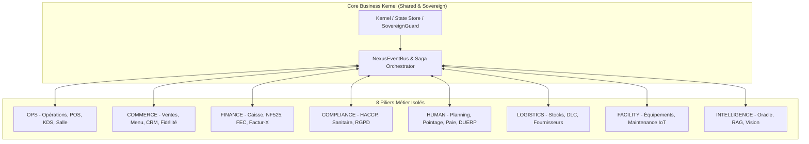

# 🏛️ Architecture Méta-Plateforme Commerciale (Universal Commerce OS)

> **Spécification d'Architecture Méta-Plateforme, Noyau Invariant & Résilience Fiscale**
> **Codebase** : `src/kernel/`, `src/modules/`, `src/orchestration/`, `src/verticals/`, `src/shared/eventBus/`
> **Conformité** : NF525 Immutable · SovereignGuard Multi-Tenant · RGPD Art. 9 · Zero-Defect Standard
> **Dernière synchronisation codebase** : 2026-08-15 (scan empirique `find src -type f`)
> **Statut Codebase** : **3 433** fichiers source · **163** Handlers Bus · **235** Routes API · **63** Pages · **97** Suites tests · **TSC = 0** ✅

---

## 📚 Sommaire

1. [Anatomie des 8 Piliers du Domaine DDD](#1-anatomie-des-8-piliers-du-domaine-ddd)
2. [Double Moteur RBAC & Isolation Souveraine](#2-double-moteur-rbac--isolation-souveraine)
3. [Moteur Cryptographique & Fiscal NF525 Multi-Caisses Offline](#3-moteur-cryptographique--fiscal-nf525-multi-caisses-offline)
4. [Méta-Architecture Généraliste & 66 Événements Verticaux](#4-méta-architecture-généraliste--66-événements-verticaux)
5. [Topologie du Bus Événementiel & Idempotence Stricte](#5-topologie-du-bus-événementiel--idempotence-stricte)
6. [Machine à États des Entités (OrderStatus, PosTicket, Table, Reservation)](#6-machine-à-états-des-entités-orderstatus-posticket-table-reservation)
7. [Gouvernance des Données & Protection RGPD Art. 9 (Santé / Allergies)](#7-gouvernance-des-données--protection-rgpd-art-9-santé--allergies)
8. [Mission Control Center (MCC) & Supervision Fleet](#8-mission-control-center-mcc--supervision-fleet)
9. [Les 6 Invariants de Concurrence & Conflits Distribués](#9-les-6-invariants-de-concurrence--conflits-distribués)
10. [ADR — Décisions d'Architecture Tracées](#10-adr--décisions-darchitecture-tracées)

---

## 1. Anatomie des 8 Piliers du Domaine DDD

Le système repose sur **8 Piliers Métier souverains**, étanches et hautement spécialisés. Aucun pilier ne possède de dépendance directe avec un autre pilier : toute communication inter-domaine transite obligatoirement par le bus asynchrone sécurisé `NexusEventBus`.



### 🔹 PILIER 1 : OPS (Opérations, Caisse POS, KDS & Workflow Service)
* **Volume** : **367 fichiers** (`src/modules/ops/`)
* **Rôle** : Orchestrer le flux opérationnel temps réel de l'établissement.
* **Sous-Modules** : `service/pos/` (moteur caisse), `production/kds/` (KDS multi-postes), `spaces/floor-plan/` (plan de salle 2D/3D), `workflow/engine/` (machine à états commandes).
* **Émet** : `order.placed`, `ops.course.fired`, `table.locked`, `table.released`, `ops.table_closed`, `ops.service_alert`.
* **Consomme** : `reservation.matched` (allergènes), `haccp.alert` (blocage plat non-conforme), `stock.zero` (service 86 auto).
* **Généralisation** : s'abstrait via `ServiceTicket` + `spatialContext` (Table/Étal/Cabine/Baie/Chambre/Cabinet selon `MetricLabels`).

### 🔹 PILIER 2 : COMMERCE (Catalogue, Tarifs, CRM, Fidélité & Delivery)
* **Volume** : **394 fichiers** (`src/modules/commerce/`)
* **Rôle** : Maximiser le revenu et unifier les canaux (sur place, click&collect, livraison, abonnement).
* **Sous-Modules** : `catalog/` (menu builder, allergènes INCO, formules), `relation/crm/` (RFM), `relation/loyalty/` (multi-paliers), `relation/delivery/` (hub agrégateur), `pricing/` (tarification dynamique).
* **Émet** : `commerce.promotion_activated`, `commerce.loyalty_points_earned`, `crm.customer_created`, `commerce.reservation_deposit_paid`, `commerce.receipt_sent`, `commerce.waitlist_ready`.
* **Consomme** : `order.paid` (crédit fidélité), `reservation.no_show` (flag risque).

### 🔹 PILIER 3 : FINANCE (Caisse, Grand Livre, NF525, Factur-X & FEC)
* **Volume** : **290 fichiers** (`src/modules/finance/`)
* **Rôle** : Assurer l'intégrité fiscale absolue (Article 286 CGI / NF525) et automatiser la comptabilité.
* **Sous-Modules** : `comptabilite/` (Grand Livre, PCG), `fiscalite/tax/` (`vatResolver` — 5.5/10/20%), `einvoicing/` (Factur-X PDF/A-3 + UBL 2.1 + CII), `billing/` (facturation B2B + Stripe acomptes + relances).
* **Émet** : `order.paid`, `finance.ticket_z_closed`, `finance.invoice_generated`, `finance.bank_synced`, `payment.captured`, `payment.refunded`.
* **Consomme** : `order.placed` (pré-comptabilisation), `supplier.delivery_received` (écriture achat).
* **Différenciateur** : 100% universel — assujettissement TVA France + UE via `vatResolver`, prêt pour la réforme e-invoicing 2026 (directive UE 2014/55).

### 🔹 PILIER 4 : COMPLIANCE (Hygiène HACCP, Traçabilité, Coffre WORM & RGPD)
* **Volume** : **213 fichiers** (`src/modules/compliance/`)
* **Rôle** : Garantir la conformité sanitaire, la protection des données et l'archivage légal inaltérable.
* **Sous-Modules** : `qualite/haccp/` (relevés température + huiles + eau), `securite/` (`DocumentVault` WORM), `sanitaire/` (traçabilité lots viande/poisson/farine), `registre/` (RGPD Art. 30, `ErasureService`).
* **Émet** : `haccp.temperature_logged`, `haccp.alert`, `haccp.non_conformity_created`, `compliance.certificate_expiring`, `compliance.age_verification_requested`.
* **Consomme** : `sovereign.breach` (intrusion), `iot.temperature_threshold` (sondes Bluetooth Testo).
* **Gating** : conditionné par `usesCulinaryStock(variant)` — actif Food (Resto/Bakery/Hotel/Retail Food), converti en registre déchets/BSDD pour Garage.

### 🔹 PILIER 5 : HUMAN (Effectifs, Planning Glissant, Pointeuse & Paie)
* **Volume** : **181 fichiers** (`src/modules/human/`)
* **Rôle** : Gérer les RH et orchestrer les plannings sous contraintes légales HCR.
* **Sous-Modules** : `effectifs/hr/` (dossiers + contrats CDI/CDD), `planning/` (roster glissant + détection conflits repos 11h/amplitude), `timeclock/` (pointeuse PIN PBKDF2 / NFC + géofencing), `paie/` (pré-paie + Silae/Payfit/Combo).
* **Émet** : `hr.shift_started`, `hr.shift_ended`, `hr.absence_declared`, `hr.tip_declared`, `hr.employee_created`.
* **Consomme** : `finance.ticket_z_closed` (ratios masse salariale jour).

### 🔹 PILIER 6 : LOGISTICS (Approvisionnement, Stocks, Fiches Techniques & DLC)
* **Volume** : **180 fichiers** (`src/modules/logistics/`)
* **Rôle** : Assurer la disponibilité des stocks et éradiquer le gaspillage.
* **Sous-Modules** : `stocks/` (multi-emplacements + PRMP), `approvisionnement/` (fournisseurs + Metro/Sysco/Pomona + BDC auto), `inventaire/` (inventaire physique + calcul écarts), `dlc/` (alertes 48h).
* **Émet** : `inventory.stock_adjusted`, `stock.low`, `stock.zero`, `logistics.delivery_received`, `logistics.waste_recorded`.
* **Consomme** : `order.paid` (décrémentation via fiches techniques).

### 🔹 PILIER 7 : FACILITY (Parc Machines, Maintenance IoT & Énergie)
* **Volume** : **119 fichiers** (`src/modules/facility/`)
* **Rôle** : Maximiser la disponibilité des équipements critiques.
* **Sous-Modules** : `maintenance/` (carnet fours/chambres froides/tireuses), `interventions/` (tickets panne + photos), `iot/` (sondes Bluetooth Testo, MQTT, compteurs Linky).
* **Émet** : `facility.maintenance_requested`, `facility.maintenance_due`, `iot.offline_alert`, `facility.hardware_fault`.
* **Consomme** : `haccp.threshold_exceeded` (déclenchement bon d'intervention frigoriste).

### 🔹 PILIER 8 : INTELLIGENCE (Oracle Majordome, LightRAG & Vision AI)
* **Volume** : **227 fichiers** (`src/modules/intelligence/`)
* **Rôle** : Transformer les données brutes en décisions stratégiques et exécuter des tâches autonomes.
* **Sous-Modules** : `oracle/` (IA conversationnelle Gemini + LightRAG), `rag/` (sidecar port 9621 isolé par tenant), `agents/` (Atlas/Themis/Cronos), `forecasting/` (ventes + affluence + weather-adjusted staffing), `vision/` (analyse retours assiette + gaspillage).
* **Émet** : `intelligence.menu_engineering_requested`, `intelligence.anomaly_detected`, `intelligence.churn_risk_detected`, `intelligence.prep_time_estimated`.
* **Consomme** : tous les événements métier pour enrichir le graphe de connaissances tenant.
* **Cold-start** : nouveaux tenants sans historique → règles heuristiques 30 jours, puis bascule ML dès `sales_history > 500 tickets`.

---

## 2. Double Moteur RBAC & Isolation Souveraine

La plateforme impose une séparation étanche entre **le locataire B2B (Tenant)** et **l'opérateur constructeur (MCC)** via `SovereignGuard`.

```
┌─────────────────────────────────────────────────────────────────────────────┐
│                          SUPER-ADMIN / OPÉRATEUR MCC                        │
│   Auth: MFAGate + Token Fleet Operator · Routes: /app/(admin)/*            │
│   Nature: Hors-RBAC Tenant · Mode: isMCCMode() · MccOperatorContract        │
│   Isolation: SovereignGuard bloque TOUTE lecture de données PII tenant     │
└──────────────────────────────────────┬──────────────────────────────────────┘
                                       │ Orchestration (Telemetry, Provisioning)
┌──────────────────────────────────────▼──────────────────────────────────────┐
│                           LOCATAIRE B2B (TENANT)                            │
│   Auth: Firebase JWT + PIN Staff · Routes: /app/(client)/*                  │
│   RBAC: 14 Rôles hiérarchisés du niveau 10 (Apprenti) au 100 (Propriétaire) │
│   Isolation: SovereignGuard enforce tenantId strictly on every collection   │
└─────────────────────────────────────────────────────────────────────────────┘
```

> ⚠️ **Note d'Étanchéité Fondamentale : RBAC Tenant vs Opérateur MCC**
> - **Niveau `100` (Propriétaire Gérant)** : C'est le **client B2B (gérant du restaurant/commerce)**. Il a une souveraineté totale sur **SON** propre tenant, mais reste **strictement cloisonné par SovereignGuard** au sein de son `tenantId`.
> - **Opérateur MCC (Vous / La Plateforme)** : N'appartient **PAS** à la grille RBAC (10 à 100). Il opère au niveau de la flotte sur les routes `/app/(admin)/*` via `MccOperatorContract` et `isMCCMode()`. Il ne peut pas lire les données PII privées du tenant sans une procédure d'impersonation auditée.
> - **Cas Clinic (HDS)** : le tenant Clinic ajoute une couche supplémentaire — les accès techniques MCC aux données patients (même pour du debugging) sont **loggués et signés** dans `mcc/hds_access_audit` avec justification obligatoire ; violation = violation du secret médical (Art. L1110-4 CSP).

### Grille des 14 Rôles Métier Tenant (Niveaux 10 à 100)

- `10` **Plongeur / Apprenti** : Pointage basique, consultation règles hygiène.
- `20` **Commis / Runner** : Saisie rapide POS, lecture KDS expédition.
- `30` **Serveur / Barman / Réceptionniste** : POS complet, ouverture table, encaissement direct.
- `40` **Chef de Rang** : Transferts de table, remises mineures (<10%), timeclock manager.
- `50` **Sommelier / Expert Produit** : Gestion cave, fiches dégustation, stocks nobles.
- `60` **Sous-Chef / Comptable** : Relevés HACCP, réception marchandises, comptabilité lecture.
- `70` **Manager / Chef de Cuisine** : Planning écriture, validation pertes, remises (>10%).
- `80` **Directeur Établissement** : Audit fiscal, analytics consolidation, déclarations TVA, DUERP.
- `100` **Propriétaire Gérant (Tenant)** : Souveraineté totale sur le tenant (configuration, DNA, clôture fiscale).

Les libellés s'adaptent automatiquement par verticale via `RoleLabels` (ex: niveau 30 = Serveur en resto, Vendeur en retail, Coiffeur en salon, Mécanicien service en garage, Infirmier en clinic).

---

## 3. Moteur Cryptographique & Fiscal NF525 Multi-Caisses Offline

La conformité fiscale (Article 286 du CGI / NF525) est garantie par le moteur `FiscalSeal` avec une architecture robuste pour le **multi-terminaux hors-ligne** :

```
┌─────────────────────────────────────────────────────────────────────────────┐
│                 ARCHITECTURE MULTI-CAISSES OFFLINE SANS FORK                │
├─────────────────────────────────────────────────────────────────────────────┤
│  Terminal Caisse 1 (Offline)  ──► Chaîne Locale : Seal_T1_1 → Seal_T1_2     │
│  Terminal Caisse 2 (Offline)  ──► Chaîne Locale : Seal_T2_1 → Seal_T2_2     │
│                                                                             │
│  [Resynchronisation Réseau]                                                 │
│  Serveur Central ──► Enregistrement des chaînes parallèles étanches         │
│  Clôture Journalière Z ──► MasterFiscalSeal = Hash(Last_T1 + Last_T2)       │
└─────────────────────────────────────────────────────────────────────────────┘
```

1. **Intégrité Cryptographique par Caisse (`registerId`)** : chaque terminal gère sa propre séquence ininterrompue `sequenceNumber` et `previousHash`. **Aucune collision de hash n'est possible entre tablettes.**
2. **Archivage WORM (Write Once Read Many)** : implémenté via `DocumentVault.ts` et la collection `fiscal_archives/` avec règles Firestore interdisant `update` et `delete` (rétention 6 ans — Art. L102 B LPF).
3. **Clôture Journalière Z Consolidée** : le `MasterFiscalSeal` quotidien scelle l'état final de toutes les caisses actives (`Hash(SeqLast_T1 || SeqLast_T2 || … || SeqLast_Tn || previousMasterHash)`).
4. **Calculs en Microunités Entières** : tout montant monétaire est stocké sous forme entière `amountInMicrounits` (1€ = 1 000 000 µunits) pour éliminer tout risque d'arrondi flottant IEEE-754.

### 3.1 Résolution de Conflit à la Reconnexion (Multi-Caisses Offline Simultanées)

Cas critique non trivial : deux terminaux offline simultanément qui se reconnectent dans un ordre non-déterministe.

* **Protocole** :
  1. Chaque terminal push sa sous-chaîne locale complète (`FiscalSeal_{registerId}_[seq_1..seq_n]`) dans une transaction Firestore atomique.
  2. Le serveur **n'accepte pas la fusion tant que le `sequenceNumber` local est manquant** — un trou dans la séquence bloque la sync et déclenche `mcc.fiscal_audit_required`.
  3. Lors de la clôture Z, si un terminal est encore offline, le `MasterFiscalSeal` du jour marque explicitement `pending_terminals: [registerId]` — la chaîne se ferme mais l'audit externe est notifié.
* **Aucune fusion silencieuse n'est jamais permise** — un cas ambigu escalade toujours vers l'opérateur MCC humain via l'onglet EventBus/DLQ.

### 3.2 Les 6 Événements Fiscalement Critiques (Escalade Audit MCC)

Ces 6 événements, définis dans `src/shared/eventBus/DLQRetryService.ts:15`, déclenchent une escalade immédiate `mcc.fiscal_audit_required` en cas d'échec définitif après 3 tentatives :

```typescript
const FISCAL_CRITICAL_EVENTS = new Set([
  'order.sealed_nf525',
  'order.completed',
  'order.cancelled',
  'payment.captured',
  'payment.refunded',
  'fiscal.seal_required',
]);
```

---

## 4. Méta-Architecture Généraliste & 66 Événements Verticaux

Le système repose sur un **Tronc Invariant** et une **Couche d'Adaptation Découplée** :

### 4.1 Matrice Sémantique des 8 Métiers (`MetricLabels`)

Les 9 clés sémantiques s'adaptent instantanément à chaque secteur sans altérer le code sous-jacent :

| Clé Sémantique | 🍽️ Restaurant | 🥖 Bakery | 🛍️ Retail | 💇 Salon | 🚗 Garage | 🏨 Hotel | 🩺 Clinic | 🎨 Custom |
|---|---|---|---|---|---|---|---|---|
| `unit` | couvert | pièce | article | prestation | intervention | nuitée | consultation | unité |
| `spatialContext`| table | étal | rayon | cabine | baie / pont | chambre | cabinet | espace |
| `merchantKind` | restaurant | boulangerie | commerce | salon | garage | hôtel | clinique | établissement |
| `server` | serveur | vendeur | conseiller | coiffeur | mécanicien | réceptionniste | praticien | opérateur |
| `prepTicket` | bon cuisine | ordre fournée | bon prépar. | fiche technique | ordre répar. (OR)| bon service | ordonnance | fiche travail |
| `recipeLabel` | recette | recette pâtiss.| fiche article | forfait soin | forfait révis. | forfait séjour | acte médical | prestation |
| `itemLabel` | ingrédient | matière 1ère | article | cosmétique | pièce détachée | fourniture | consommable | ressource |
| `customerLabel`| convive | client | acheteur | client | automobiliste | résident | patient | client |
| `culinaryGating`| ✅ actif | ✅ actif | 🔧 conditionnel | ❌ inactif | ❌→BSDD | ✅ (option bar) | ❌ inactif | 🔧 paramétrable |

### 4.2 66 Événements Verticaux → 6 Événements Pivots Universels

Le fichier [`src/shared/eventBus/events/vertical.events.ts`](../../src/shared/eventBus/events/vertical.events.ts) déclare **66 événements verticaux** distincts, ventilés :

| Verticale | # Événements | Exemples de sous-domaines |
|---|:---:|---|
| 🚗 Auto (Garage) | 14 | `auto.vehicle_checked_in`, `auto.diagnostic_completed`, `auto.repair_started`, `auto.invoice_issued`, `auto.vin_registered` |
| 🩺 Health (Clinic) | 14 | `health.patient_admitted`, `health.act_billed`, `health.hds_audit_log`, `health.consent_recorded`, `health.appointment_booked` |
| 🏨 Hotel | 13 | `hotel.guest_checked_in`, `hotel.guest_checked_out`, `hotel.room_status_changed`, `hotel.folio_charged`, `hotel.city_ledger_entry` |
| 🥖 Bakery | 9 | `bakery.batch_scheduled`, `bakery.sale_completed`, `bakery.waste_recorded`, `bakery.preorder_confirmed` |
| 🛍️ Retail | 8 | `retail.sale_completed`, `retail.return_processed`, `retail.variant_stock_low`, `retail.ecom_sync_completed` |
| 💇 Salon | 8 | `salon.appointment_completed`, `salon.color_formula_recorded`, `salon.commission_calculated` |

### 4.3 Le Pont Événementiel (`VerticalEventBridge` — Convention de Consommation)

Les handlers universels (fidélité, comptabilité, scellage NF525, décrémentation stock) s'abonnent aux **6 événements pivots** :

```
auto.invoice_issued (Garage)         ──►  order.paid (Générique)
hotel.guest_checked_out (Hôtel)      ──►  order.paid (Générique)
retail.sale_completed (Boutique)     ──►  order.paid (Générique)
salon.appointment_completed (Salon)  ──►  order.paid (Générique)
bakery.sale_completed (Boulangerie)  ──►  order.paid (Générique)
health.act_billed (Clinique)         ──►  order.paid (Générique)
```

Le "bridge" n'est **pas** un fichier séparé — c'est un contrat émanant du typage `NexusEventName` dans [`src/shared/eventBus/NexusEventBus.ts`](../../src/shared/eventBus/NexusEventBus.ts) : chaque handler consommateur d'`order.paid` reçoit également les 6 événements verticaux via double abonnement en `registerHandlers.ts`.

### 4.4 Super-Pouvoirs Industriels du Modèle

1. **Coût Marginal Nul pour de Nouveaux Métiers** : lancer une nouvelle verticale (ex: Salle de sport, Toilettage, Cordonnerie) demande **seulement ~48h** (créer `labels.ts`, `roles.ts`, 5-10 événements verticaux + double abonnement).
2. **Maintenance Fiscale Centralisée** : une seule mise à jour du moteur Factur-X 2026 ou NF525 met à niveau les 8 verticales simultanément.
3. **Mode "Custom" pour Concept Stores** : permet d'équiper des commerces hybrides (café-librairie, salon-boutique) en combinant les fonctionnalités à la volée via `VerticalRegistry`.

---

## 5. Topologie du Bus Événementiel & Idempotence Stricte

Le `NexusEventBus` ([`src/shared/eventBus/NexusEventBus.ts`](../../src/shared/eventBus/NexusEventBus.ts)) applique les règles suivantes pour garantir l'intégrité à l'échelle.

### 5.1 Priorité des Handlers (3 niveaux)

```typescript
priority: 'CRITICAL' | 'HIGH' | 'BACKGROUND';
```

- **CRITICAL** → `await` en **séquence** (ordre d'inscription). Bloquant. Ex: scellage NF525, débit fidélité, décrémentation stock.
- **HIGH** → `Promise.all` en **parallèle**. Bloquant sur le batch. Ex: notification KDS, mise à jour plan de salle.
- **BACKGROUND** → **fire-and-forget** (microtask). Non-bloquant. Erreurs loggées sans propagation. Ex: analytics, enrichissement RAG.

**Retour de `emit()`** : seulement quand CRITICAL + HIGH sont résolus. Le caller peut donc encaisser en toute confiance.

### 5.2 Idempotence Serveur (Anti-Doublement)

Chaque événement émis possède un identifiant cryptographique `eventId` unique (UUID v4).

* Les handlers `CRITICAL` et `HIGH` vérifient la collection atomique `events_processed_log/{eventId}` avant exécution.
* Si l'événement a déjà été traité, l'exécution est court-circuitée immédiatement — pas de doublement d'écriture comptable ou de stock.

### 5.3 Ordre & Séquencement par Agrégat

* Les événements dépendants partagent une clé d'agrégat (`aggregateId` = ex: `orderId`).
* Les mutations sont exécutées séquentiellement par agrégat pour éviter les inversions de statut (ex: `table_closed` **avant** `order.paid`).
* La synchronisation est assurée par les priorités `CRITICAL` (ordre strict) + `aggregateId` route stable.

### 5.4 Outbox Durable & Quarantaine DLQ

* **Outbox Pattern** : persistance locale IndexedDB (`busOutbox`) **avant** émission en mémoire. La transaction (write business + write outbox) est atomique — si l'écriture business rate, l'event n'est jamais émis.
* **Backoff Exponentiel** ([`DLQRetryService.ts:28`](../../src/shared/eventBus/DLQRetryService.ts)) :
  ```typescript
  function backoffMs(attempt: number): number {
    return Math.min(2_000 * Math.pow(2, attempt - 1), 60_000);
  }
  // tentative 1 → 2s, 2 → 4s, 3 → 8s, 4 → 16s, 5 → 32s (plafonné à 60s)
  ```
* **`MAX_ATTEMPTS = 5`** : après 5 échecs consécutifs, événement gelé en statut `quarantine` dans `mcc/dlq`.
* **Escalade Fiscale** : si l'event en échec est dans `FISCAL_CRITICAL_EVENTS` (voir §3.2), alerte d'urgence `mcc.fiscal_audit_required` transmise à l'opérateur pour audit manuel obligatoire.

### 5.5 Règles d'Or

1. **Émission Post-Écriture** : tout `emitDurable` doit impérativement intervenir **après** la persistance réussie dans la base de données principale.
2. **Idempotence des Handlers** : chaque handler doit vérifier l'identifiant unique de l'événement pour éviter tout double traitement lors d'un retry.
3. **Quarantaine DLQ Automatique** : tout événement échouant 5 fois consécutives est isolé et alerte le superviseur.

---

## 6. Machine à États des Entités (OrderStatus, PosTicket, Table, Reservation)

Chaque entité métier suit une machine à états explicite. Les transitions non autorisées lèvent une exception `InvalidStateTransitionError`.

### 6.1 `OrderStatus` — 11 valeurs ([`orders.ts:64`](../../src/modules/ops/domain/schemas/orders.ts))

```
draft → new → pending → preparing → cooking → ready → served → paid
                                                        │
                                                        └─► pending_modification → (retour à ready)
                                                        │
                                    (à tout moment) ────┴─► cancelled | delivered
```

- `draft` : commande en construction dans le POS (avant envoi cuisine).
- `new` : nouvellement validée par le serveur.
- `pending` / `preparing` / `cooking` / `ready` / `served` : cycle cuisine.
- `paid` : encaissée (déclenche `order.paid` → chaîne fiscale + fidélité).
- `cancelled` : annulée (déclenche `order.cancelled` — événement fiscalement critique).
- `pending_modification` : retour cuisine (ex: cuisson à refaire).
- `delivered` : livraison externe validée.

### 6.2 `PosTicket.status` — 3 valeurs ([`pos.ts:56`](../../src/modules/ops/domain/schemas/pos.ts))

```
validated ──► cancelled | refunded
```

Le ticket fiscal NF525 n'a que 3 états. `refunded` déclenche l'émission `payment.refunded` (événement fiscalement critique).

### 6.3 `TableStatus` — 6 valeurs ([`ops.ts:11`](../../src/modules/ops/domain/schemas/ops.ts))

```
free / available ──► reserved ──► occupied ──► cleaning ──► free
                                     │
                                     └─► locked (verrou CAS pour édition addition)
```

Le verrou `locked` implémente le pattern Compare-And-Set (voir §9 invariant 3).

### 6.4 `ReservationStatus` — 6 valeurs ([`ops.ts:34`](../../src/modules/ops/domain/schemas/ops.ts))

```
pending ──► confirmed ──► arrived ──► seated ──► (fusion order lifecycle)
                                       │
                                       └─► cancelled | no_show
```

- `confirmed` : après paiement acompte Stripe (émet `commerce.reservation_deposit_paid`).
- `arrived` : hôtesse a validé check-in (émet `reservation.matched` → **transmission allergènes KDS**).
- `no_show` : détection auto si table libérée >30 min après horaire (flag CRM `risque`).

### 6.5 `GroupEventStatus` — 11 valeurs ([`groups.types.ts:90`](../../src/modules/ops/workflow/engine/groups.types.ts))

```
inquiry → quote_pending → quote_sent → confirmed → deposit_paid → preparation → in_progress → completed → invoiced → paid
                                                       │
                                                       └─► cancelled (à tout moment)
```

Utilisé pour les privatisations, événements traiteur, groupes >8 personnes.

---

## 7. Gouvernance des Données & Protection RGPD Art. 9 (Santé / Allergies)

La gestion des données personnelles et sensibles respecte le RGPD strict :

1. **Qualification Données de Santé (Art. 9 RGPD)** :
   * Les fiches allergènes (`Customer.allergens`) liées à l'identité d'un client sont classées **données de santé à protection renforcée**.
   * Recueil d'un consentement explicite lors de la prise de réservation (case à cocher obligatoire dans `ReservationForm`).
   * Chiffrement au repos de ces données dans la base (AES-256-GCM via `CryptoService`).
2. **Droit à l'Oubli & Crypto-Shredding** :
   * L'exécution de `ErasureService` détruit **irréversiblement** les clés de déchiffrement du profil client tout en préservant l'intégrité comptable NF525 (qui ne contient que des montants et numéros de tickets anonymisés).
3. **Masquage dans les Logs de Télémétrie** :
   * Aucun email, téléphone ou nom de client n'apparaît en clair dans les logs Sentry ou Axiom.
   * Middleware `redactPII` appliqué à l'entrée du logger.
4. **Cas Clinic (HDS) — Sur-Protection** :
   * Toutes les données patient sont chiffrées + tokenisées + versionnées dans `hds_vault` (hébergement HDS certifié ANSSI).
   * Accès MCC restreint et loggé (voir §2 Note d'étanchéité).
5. **Photos Salon (Avant/Après)** :
   * Droit à l'image obligatoire (contrat signé).
   * Photos de cuir chevelu = données de santé → traitement Art. 9 obligatoire.
6. **Ordre de Réparation Garage (Signature Tablette)** :
   * Signature manuscrite sur tablette avec horodatage cryptographique via prestataire certifié eIDAS (DocuSign / Universign / Yousign) pour valeur probante en cas de litige.

---

## 8. Mission Control Center (MCC) & Supervision Fleet

Le MCC est le tableau de bord d'administration globale permettant de piloter l'ensemble des instances clients :

* **235 Routes API** dédiées (`src/app/api/`) dont ~82 admin (`src/app/api/admin/*`).
* **13 Onglets Dashboard** avec chargement asynchrone (`next/dynamic`) : Fleet, Compliance, Intelligence Oracle, Treasury/MRR, Patch/OTA, Plugins, EventBus/DLQ, Lifecycle Inspector, CLI/Runbooks, System Tenants, E-Facturation PDP, Exchange Payroll, Verticales Registry.
* **Canal Support B2B & SOS Caisse** : réception en temps réel des tickets (via `support.ticket_submitted`) et alertes d'urgence émises par les terminaux caisses.
* **Pipeline de Provisioning en 10 étapes** :
  1. Génération DNA & Seeding (`tenantConfig`, PCG, tables/zones).
  2. Patch Métadonnées B2B (SIRET, formule SaaS, branding).
  3. Configuration RBAC Zod (`pageOverrides` / `tabOverrides` par défaut).
  4. Activation de la Verticale (`VerticalRegistry.resolve(variant)`).
  5. Injection White-Label (variables CSS thématiques + assets).
  6. Liaison Client Stripe (`stripeCustomerId` + abonnements).
  7. Enregistrement Télémétrie Fleet (registre supervision).
  8. Espace Vectoriel RAG Isolé (`rag_workspace_{tenantId}` port 9621).
  9. DNS & Sous-Domaine (`tenant.restaurant-os.com` ou CNAME).
  10. Compte Propriétaire & Clé Fiscale Genesis (scellement hash GENESIS).

### 8.1 24 Tenants Système (Versionbase)

Pour garantir des déploiements instantanés et des démonstrations sans risque de corruption, le système gère **24 tenants système permanents** (8 verticales × 3 tiers) pilotés par [`SystemTenantRegistry.ts`](../../src/lib/mcc/SystemTenantRegistry.ts) :

| Tier | Suffixe | Rôle | Write-Access |
|---|---|---|:---:|
| DEMO | `_demo_<vertical>` | Vitrines prospects (Simulacra IndexedDB) | ❌ read-only |
| TEST | `_test_<vertical>` | Bacs à sable dev (reset en 1 clic) | ✅ writable |
| REFERENCE | `_ref_<vertical>` | Maîtres clônables via `cloneFromReference` | ⚠️ write-blocked par `SovereignGuard` |

---

## 9. Les 6 Invariants de Concurrence & Conflits Distribués

Tout nouveau composant, handler ou feature doit impérativement respecter ces 6 invariants d'intégrité :

```
┌─────────────────────────────────────────────────────────────────────────────┐
│                 LES 6 INVARIANTS D'INTÉGRITÉ & CONCURRENCE                  │
├─────────────────────────────────────────────────────────────────────────────┤
│ 1. Idempotence Comptable ──► Clés déterministes obligatoires                │
│ 2. Concurrence de Stock  ──► Décrémentation atomique (pas de Read-Modify-W) │
│ 3. Verrouillage Table    ──► CAS (Compare-And-Set) + Allocation reliquat    │
│ 4. Pointage Staff        ──► Debounce temporel 60s anti-rebond              │
│ 5. Service de Nuit & DST ──► ServiceSessionId & Timestamps UTC absolus      │
│ 6. Webhooks Stripe       ──► Déduplication via idempotency key              │
└─────────────────────────────────────────────────────────────────────────────┘
```

1. **Idempotence Comptable par Clé Déterministe**
   * Les identifiants de pièces comptables doivent dériver de l'entité source (ex: `JE-PAYMENT-${orderId}`, `JE-REFUND-${orderId}`, `JE-DEPOSIT-${reservationId}`).
   * Toute réémission accidentelle écrase la même ligne sans créer de doublon dans le Grand Livre ni le FEC.
2. **Décrémentation de Stock Atomique**
   * Interdiction formelle du schéma `read → calculate → update` en concurrence.
   * Utiliser impérativement des opérations atomiques (`FieldValue.increment(-qty)`) ou des transactions Firestore/Dexie pour éviter les stocks fantômes lors de rushs simultanés.
3. **Verrouillage de Table CAS & Reliquat de Split**
   * Le verrouillage de table utilise un **Compare-And-Set** atomique (`lock only if lockedBy === null || expiresAt < now`).
   * Lors d'un fractionnement d'addition (split), le reliquat indivisible de microunités est automatiquement affecté au dernier payeur (`somme(splits) === total`).
4. **Anti-Rebond de Pointage Staff (Debounce 60s)**
   * Toute tentative de pointage répétée pour le même employé dans les 60 secondes est bloquée avec acquittement de l'horodatage initial pour éviter de corrompre les calculs d'heures sup DSN.
5. **Session de Service & Calculs Temporels UTC (Anti-DST)**
   * Les commandes de nuit (00h00 à 03h00) sont rattachées au `ServiceSessionId` du service du soir et non à la date civile.
   * Les durées de travail staff sont calculées sur des millisecondes UTC absolues (`Date.now()`) pour être insensibles aux changements d'heure été/hiver (DST).
6. **Déduplication des Webhooks de Paiement**
   * Table `processed_webhooks/{stripeEventId}` vérifiée en tête de route pour éviter le traitement simultané de `payment_intent.succeeded` et `charge.succeeded`.

---

## 10. ADR — Décisions d'Architecture Tracées

Les décisions structurantes de la plateforme sont tracées ci-dessous pour préserver le "pourquoi" au-delà du "quoi" :

| # | Décision | Alternative Écartée | Raison |
|---|----------|---------------------|--------|
| ADR-01 | **Firestore** comme base primaire | PostgreSQL / MongoDB | Local-first natif (IndexedDB cache), sécurité fine-grained rules, offline sync sans code custom, temps réel. |
| ADR-02 | **Jotai** pour state management | Zustand / Redux Toolkit / Context | Atomes granulaires par pilier, zéro provider hell, dérivations réactives simples, tree-shakable. |
| ADR-03 | **Microunits (µ)** pour la monnaie | Cents (Number × 100) | Élimine l'arrondi flottant IEEE-754 sur la TVA (5.5%, 10%, 20% ventilée), branded type `Microunits` empêche cross-contamination avec cents. |
| ADR-04 | **Zod** pour validation + typage | TypeScript pur / Yup | Schémas sont Single Source of Truth (SSOT) — `z.infer<>` génère le type + valide runtime, RBAC injecté via `.refine()`. |
| ADR-05 | **NexusEventBus** custom vs. Kafka/RabbitMQ | Broker externe | Multi-tenant natif (SovereignGuard sur `tenantId`), offline-first (Dexie outbox), pas d'infra externe à déployer, LOC ~800. |
| ADR-06 | **Sidecar LightRAG Python** vs. RAG in-process | LangChain JS / RAG en Node | LightRAG (Python) est le SOTA graphe de connaissances vectoriel, isolation par tenant via `rag_workspace_{tenantId}`, port 9621. |
| ADR-07 | **NF525 chaîne SHA-256 par caisse** (`registerId`) | Chaîne unique globale | Permet le mode offline multi-terminaux sans fork de la chaîne (voir §3), fusion via `MasterFiscalSeal` à la clôture Z. |
| ADR-08 | **Next.js 16 App Router** vs. Remix / vanilla React | | Server Components + Server Actions pour NF525 côté serveur, isolation route groups pour MCC vs Tenant vs Public. |
| ADR-09 | **8 piliers DDD** vs. Monolithe métier | Micro-services | Étanchéité stricte + bus asynchrone = mêmes garanties qu'un micro-service, sans le coût réseau ni la fragmentation opérationnelle. |
| ADR-10 | **8 verticales via `VerticalRegistry` + `MetricLabels`** vs. Fork par verticale | 8 codebases dédiées | Tronc commun invariant (NF525, RBAC, Bus, Multi-Tenant), coût marginal ~48h pour nouvelle verticale (voir §4.4). |

---

## Références Codebase

- **Bus événementiel** : [`src/shared/eventBus/NexusEventBus.ts`](../../src/shared/eventBus/NexusEventBus.ts) · [`DLQRetryService.ts`](../../src/shared/eventBus/DLQRetryService.ts) · [`events/vertical.events.ts`](../../src/shared/eventBus/events/vertical.events.ts)
- **Fiscal NF525** : [`src/modules/finance/fiscalite/FiscalSealer.ts`](../../src/modules/finance/fiscalite/FiscalSealer.ts) · [`FinancialNexusBridge.ts`](../../src/modules/finance/comptabilite/FinancialNexusBridge.ts)
- **Multi-Tenant** : [`src/lib/nexus/NexusAdapter.ts`](../../src/lib/nexus/NexusAdapter.ts) · [`SovereignGuard`](../../src/shared/nexus/guards/) · [`SystemTenantRegistry.ts`](../../src/lib/mcc/SystemTenantRegistry.ts)
- **Schémas Zod** : [`src/modules/ops/domain/schemas/`](../../src/modules/ops/domain/schemas/) · [`src/shared/nexus/contracts/`](../../src/shared/nexus/contracts/)
- **RBAC** : [`src/kernel/nexus/guards/rbac/actionPermissionMap.ts`](../../src/kernel/nexus/guards/rbac/actionPermissionMap.ts)
- **Verticales** : [`src/verticals/`](../../src/verticals/) · [`src/lib/verticalRegistry.ts`](../../src/lib/verticalRegistry.ts)
