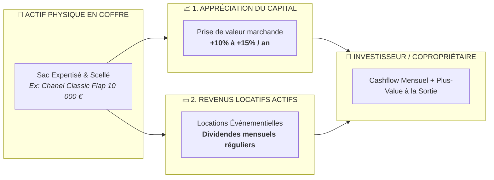
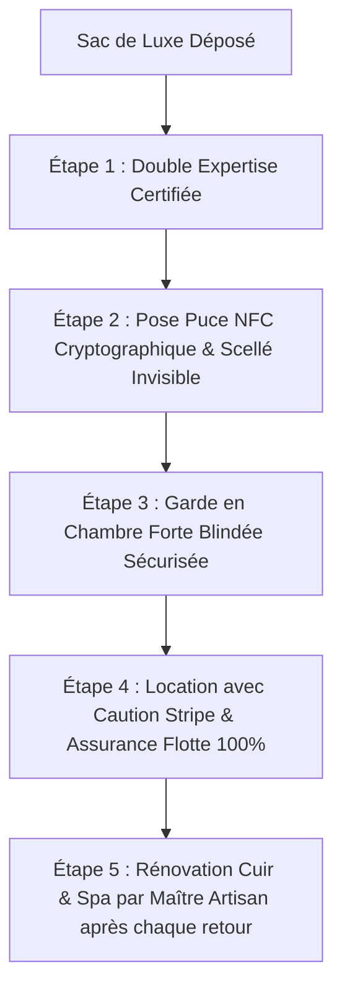
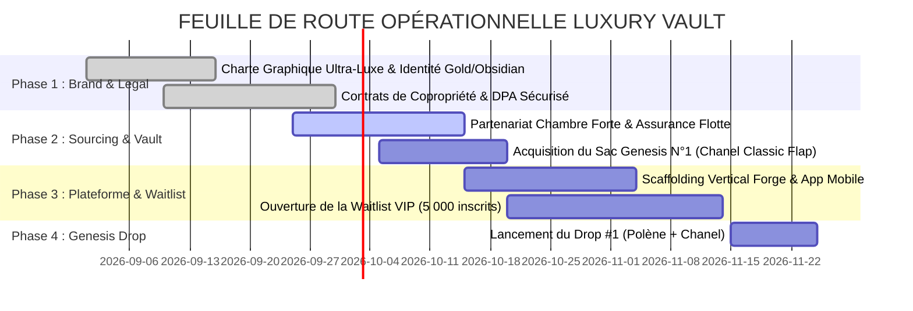

# 👑 LUXURY VAULT · PRIVATE ASSET MANAGEMENT
### *L'Alliance de la Haute Maroquinerie, de l'Investissement Fractionné et du Rendement Locatif*

```
╔══════════════════════════════════════════════════════════════════════════════════════════════════════╗
║                                                                                                      ║
║     ✨  L U X U R Y   V A U L T  ✨                                                                  ║
║     ─── La Première Plateforme d'Actifs Tangibles d'Exception : De 10 € à 250 000 € ───              ║
║                                                                                                      ║
║     [ 🟢 TIER 1 : ACCESSIBLE ]  [ 🔵 TIER 2 : PREMIUM ]  [ 🟣 TIER 3 : ICONIC ]  [ 🟡 TIER 4 : GRAIL ]║
║                                                                                                      ║
╚══════════════════════════════════════════════════════════════════════════════════════════════════════╝
```

> [!NOTE]
> **Thèse d'Investissement** : Selon l'indice *Knight Frank Luxury Investment Index (KFLII)*, les sacs de luxe de collection affichent une appréciation historique de **+13% à +15% par an**, surperformant l'Or, l'Art contemporain et les obligations d'État, tout en offrant un risque de décorrélation totale avec les marchés financiers traditionnels.

---

## 💎 1. La Proposition de Valeur : Le Modèle Hybride Dual-Yield™

LUXURY VAULT révolutionne l'économie de la mode en associant **deux moteurs de rentabilité simultanés** sur un même actif physique :



---

## 🏛️ 2. La Matrice des 4 Paliers d'Investissement

Pour démocratiser l'accès au luxe tout en préservant le prestige des pièces d'exception, LUXURY VAULT structure son catalogue en **4 Tiers stratégiques** :

```
┌──────────────────────────────────────────────────────────────────────────────────────────────────────┐
│                                   CATALOGUE DES 4 GAMMES D'ACTIFS                                    │
└──────────────────────────────────────────────────────────────────────────────────────────────────────┘
```

| Palier & Badge | Marques Phares | Modèles Emblématiques | Valeur Actif | Prix de la Part | Rendement Estimé (Plus-Value + Location) |
|---|---|---|:---:|:---:|:---:|
| 🟢 **TIER 1<br>Accessible & Trendy** | **Polène**<br>**Jacquemus**<br>**Courrèges**<br>**Telfar** | • Polène *Numéro Neuf / Cyme*<br>• Jacquemus *Le Chiquito / Bambino*<br>• Courrèges *Holy Bag* | `350 € - 1 500 €` | **10 €** | **18% à 24% / an**<br>*(Forte rotation locative)* |
| 🔵 **TIER 2<br>Premium & Iconique** | **Louis Vuitton**<br>**Dior**<br>**Celine**<br>**Saint Laurent** | • Louis Vuitton *Speedy 25 / Neverfull*<br>• Lady Dior *Cannage Medium*<br>• Celine *Triomphe Box* | `2 000 € - 8 500 €` | **25 €** | **14% à 18% / an**<br>*(Valeur refuge intemporelle)* |
| 🟣 **TIER 3<br>High Luxury & Vintage** | **Chanel**<br>**Hermès** | • Chanel *Classic Double Flap / Boy*<br>• Hermès *Picotin 18 / Evelyne III*<br>• Chanel *2.55 Vintage Gold HW* | `9 000 € - 32 000 €` | **50 €** | **15% à 20% / an**<br>*(Hausses de prix boutique annuelles)* |
| 🟡 **TIER 4<br>Holy Grail / Prestige** | **Hermès Privé**<br>*(Cuirs Exotiques)* | • Birkin 30 *Crocodile Porosus*<br>• Kelly 28 *Sellier Alligator Vert d'Eau*<br>• Birkin 25 *Himalaya Niloticus* | `35 000 € - 250 000 €+` | **100 €** | **12% à 16% / an**<br>*(Pièces de musée de ventes Sotheby's)* |

---

## 👠 3. Simulation Concrète : Le "Case Study" Rendement

Prenons l'exemple d'un actif phare de la plateforme pour illustrer la création de richesse :

```
╔══════════════════════════════════════════════════════════════════════════════════════════════════════╗
║  📌 ÉTUDE DE CAS : SAC CHANEL TIMELESS DOUBLE FLAP NOIR CUIR CAVIAR                                   ║
╠══════════════════════════════════════════════════════════════════════════════════════════════════════╣
║  • Valeur d'Acquisition : 10 000 €                                                                   ║
║  • Émission de Parts : 200 parts de 50 €                                                             ║
║  • Votre Investissement : 500 € (10 parts = 5% de la copropriété du sac)                            ║
║                                                                                                      ║
║  📊 REVENUS LOCATIFS SUR 12 MOIS :                                                                   ║
║  • 18 week-ends de location à 250 € le week-end = 4 500 € brut                                       ║
║  • Dividendes nets distribués aux copropriétaires (75%) = 3 375 €                                    ║
║  • ➜ Votre Part de Dividendes de Location (5%) = 168,75 € versés en cash                             ║
║                                                                                                      ║
║  📈 VALORISATION DE L'ACTIF (APRÈS 24 MOIS) :                                                        ║
║  • Revente du sac Chanel à 12 200 € (+22% en 2 ans)                                                  ║
║  • ➜ Récupération de votre capital + plus-value = 610 €                                              ║
║                                                                                                      ║
║  🎯 RÉSULTAT FINAL : 500 € investis ➔ 947,50 € récupérés (+89,5% de ROI Total sur 2 ans)             ║
╚══════════════════════════════════════════════════════════════════════════════════════════════════════╝
```

---

## 🔒 4. La Forteresse de Sécurité & d'Authenticité

Pour garantir la confiance absolue des investisseurs et la pérennité du parc :



> [!IMPORTANT]
> **Les 5 Verrous de Sécurité LUXURY VAULT** :
> 1. **Chambre Forte Dédiée** : Stockage en coffre bancaire sécurisé avec hygrométrie (50%) et température (19°C) constantes pour une conservation optimale des cuirs.
> 2. **Puce NFC Anti-Swap** : Chaque pièce est munie d'un micro-transpondeur cryptographique infalsifiable. Tout échange ou tentative de substitution est immédiatement détecté.
> 3. **Assurance Tous Risques Agréée** : Couverture intégrale contre le vol, la dégradation, la perte et les dommages accidentels durant les transports et locations.
> 4. **Empreinte de Caution Bancaire** : Caution systématique bloquée sur la carte du locataire avant la remise du sac.
> 5. **Atelier de Maroquinerie Partenaire** : Nettoyage haute précision, traitement déperlant et soin des tranches après chaque retour d'usage.

---

## 👑 5. L'Expérience Membre : "Wear Your Investment"

Les investisseurs ne sont pas seulement actionnaires d'un sac : ils bénéficient d'un **club de privilèges exclusifs** :

```
┌──────────────────────────────────────────────────────────────────────────────────────────────────────┐
│                                 AVANTAGES EXCLUSIFS COPROPRIÉTAIRES                                  │
├──────────────────────────────────────────────────────────────────────────────────────────────────────┤
│  🎁 TARIF PRIVILÈGE      │ -30% à -50% sur le tarif public pour louer le sac que vous possédez.     │
│  ⭐ JOURS OFFERTS        │ 2 jours de location VIP offerts par an dès 10 parts détenues.             │
│  🎟️ ACCÈS COUPE-FILE     │ Priorité absolue sur les drops de sacs rares (Hermès Birkin / Chanel).    │
│  🥂 ÉVÉNEMENTS PRIVÉS    │ Invitations aux soirées privées de présentation & Fashion Week.           │
└──────────────────────────────────────────────────────────────────────────────────────────────────────┘
```

---

## 💼 6. Modèle Économique : 5 Flux de Revenus Hautement Rentables

```
┌─────────────────────────────────────────────────────────────────────────────┐
│                    STRUCTURE DES REVENUS DE LA PLATEFORME                   │
├─────────────────────────────────────────────────────────────────────────────┤
│ 1. 🎟️ Commission de Sourcing & Listing : 3% à 5% de la valeur d'émission    │
│ 2. 👗 Marge sur les Locations : 20% à 25% prélevés sur chaque location      │
│ 3. 🔄 Frais de Courtage Bourse Secondaire : 1.5% sur les échanges de parts  │
│ 4. 🏆 Success Fee sur la Plus-Value : 12% des bénéfices à la revente finale │
│ 5. 💎 Club VIP Conciergerie : 29 €/mois pour accès prioritaire aux drops    │
└─────────────────────────────────────────────────────────────────────────────┘
```

---

## 🚀 7. Roadmap de Lancement en 4 Phases



---

> **LUXURY VAULT** : *Possédez l'icône. Portez l'exception. Encaissez le rendement.*
