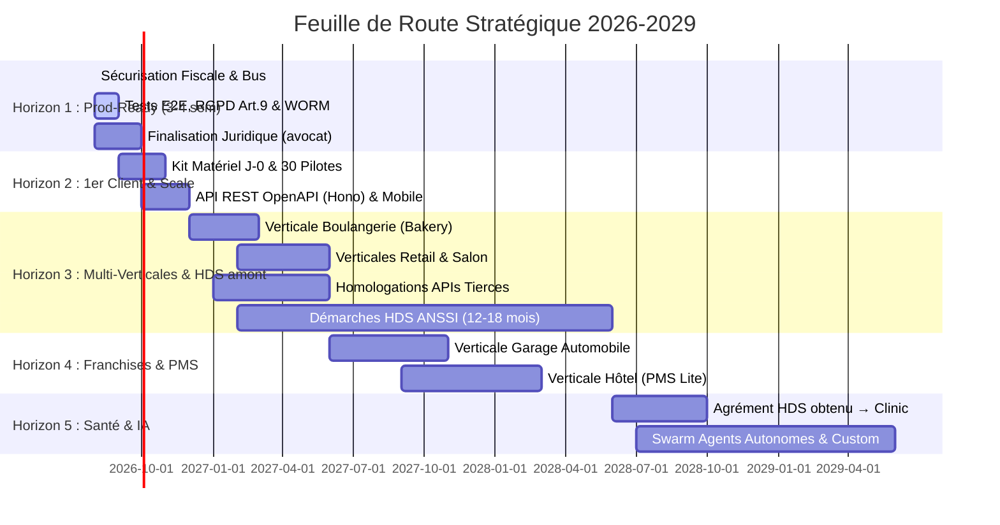

# 🗺️ Feuille de Route Stratégique 2026-2029 (v8.1) — Restaurant OS Platform

> **Document Maître de Stratégie, d'Horizons et d'Exécution Industrielle**
> **Dernière synchronisation codebase** : 2026-08-15 (Scan empirique `find src -type f`)
> **Statut Codebase** : **3 433** fichiers source · **163** Handlers Bus · **235** Routes API · **63** Pages · **97** Suites de tests · **TSC = 0** ✅
> **Gouvernance** : Zero-Defect Standard · [ARCHITECTURE_METAPLATFORM.md](ARCHITECTURE_METAPLATFORM.md) · [DEBT.md](../DEBT.md)

---

## 📚 Sommaire

1. [🏛️ Vision & Horizons d'Exécution (H1 → H5)](#1-🏛️-vision--horizons-dexécution-h1--h5)
2. [🚀 Horizon 1 — Prod-Ready & Sécurisation Fiscale (Août-Sept 2026 · 3-4 sem)](#2-🚀-horizon-1--prod-ready--sécurisation-fiscale-août-sept-2026--3-4-sem)
3. [📈 Horizon 2 — Déploiement Commercial, Hardware J-0 & Mobile App (Sept-Nov 2026)](#3-📈-horizon-2--déploiement-commercial-hardware-j-0--mobile-app-sept-nov-2026)
4. [🥖 Horizon 3 — Expansion Multi-Verticales, IA Locale & Amorce HDS (Déc 2026 – Mai 2027)](#4-🥖-horizon-3--expansion-multi-verticales-ia-locale--amorce-hds-déc-2026--mai-2027)
5. [🚗 Horizon 4 — Franchises, Groupes & Verticales Lourdes (Juin 2027 – Fév 2028)](#5-🚗-horizon-4--franchises-groupes--verticales-lourdes-juin-2027--fév-2028)
6. [🩺 Horizon 5 — Souveraineté IA & Santé HDS (2028-2029)](#6-🩺-horizon-5--souveraineté-ia--santé-hds-2028-2029)
7. [📊 Modèle Économique, FinOps & Organisation (Mitigation Bus Factor)](#7-📊-modèle-économique-finops--organisation-mitigation-bus-factor)
8. [🎯 Critères de Sortie Binaires par Sprint (Anti-Dérive)](#8-🎯-critères-de-sortie-binaires-par-sprint-anti-dérive)

---

## 1. 🏛️ Vision & Horizons d'Exécution (H1 → H5)

La plateforme évolue d'un logiciel de gestion de restaurant vers une **Méta-Plateforme Commerciale Universelle (Universal Commerce OS)** capable d'équiper 8 secteurs d'activité distincts sur un tronc commun invariant.

---

## 2. 🚀 Horizon 1 — Prod-Ready & Sécurisation Fiscale `[Août-Sept 2026 · 3-4 Semaines]`

> **Objectif** : Zéro angle mort. La plateforme est prête à encaisser le premier euro en production dans des conditions de conformité légale, d'idempotence et de stabilité irréprochables.

### Sprint 1.1 · Clôture des Émetteurs Bus & Idempotence (Semaine 1)
- **Webhook Stripe Acomptes** ([`src/app/api/webhooks/stripe/route.ts`](../../src/app/api/webhooks/stripe/route.ts)) : émission de `commerce.reservation_deposit_paid` lors de la validation d'un acompte en ligne.
- **Émission Explicite `ops.table_closed`** : câbler l'émission lors du solde de l'addition dans le POS.
- **Idempotence Serveur Bus** : table `events_processed_log/{eventId}` pour empêcher tout doublement d'écriture lors d'un retry réseau.
- **Sentry DSN Production** : injecter `SENTRY_DSN` et configurer les alertes critiques (erreur fiscale = notification SMS/Slack immédiate).

**Critère de sortie binaire** : suite `test:bus` verte à 24/24 + Sentry reçoit un événement de test en production.

### Sprint 1.2 · Cadrage Légal, RGPD Art. 9 & Backup WORM NF525 (Semaine 2)
- **Signature DPA RGPD Art. 28 & CGU/CGV** : finaliser le contrat de sous-traitance de données et les conditions générales avec avocat spécialisé. **Buffer 4-6 semaines** (démarrage semaine 1 en parallèle).
- **Fiches Allergies = Données de Santé (RGPD Art. 9)** : consentement explicite traçable et chiffrement au repos des profils allergènes.
- **Archive WORM Firestore Long-Terme** : configurer la règle d'immuabilité Firestore sur `fiscal_archives/` avec rétention légale stricte de 6 ans.

**Critère de sortie binaire** : test automatisé "tentative de `delete` sur `fiscal_archives/{id}` rejetée par la règle Firestore".

### Sprint 1.3 · Protection CI/CD & 4 Parcours E2E Playwright (Semaines 3-4)
- **Garde-Fou GitHub Actions** : verrouillage de la branche `main` avec obligation de passage des tests AST, TSC (`tsc --noEmit`) et Vitest + **auto-rollback sur health-check failed**.
- **Suite Playwright Maître** (4 parcours critiques) :
  1. *Parcours Encaissement* : prise de commande → split addition → paiement CB → génération facturette NF525.
  2. *Parcours Clôture Z* : fin de service → rapprochement caisse tiroir → clôture Z scellée → export FEC.
  3. *Parcours Réservation & Allergènes* : réservation Web → check-in hôtesse → transmission alertes allergènes au KDS cuisine.
  4. *Parcours Mode Offline* (**nouveau**) : encaissement offline sur 2 tablettes simultanées → reconnexion → validation `MasterFiscalSeal` consolidé sans divergence.

**Critère de sortie binaire** : les 4 parcours passent en vert dans le pipeline sur 10 exécutions consécutives.

---

## 3. 📈 Horizon 2 — Déploiement Commercial, Hardware J-0 & Mobile App `[Sept-Nov 2026]`

> **Objectif** : Onboarding de 30 restaurants pilotes, maîtrise du déploiement physique et application mobile compagnon.

### Sprint 2.1 · Kit Matériel J-0 & Support B2B SOS Caisse
- **Kit Valise d'Onboarding** : routeur 4G failover multi-opérateurs préconfiguré en cas de coupure de la box du restaurateur.
- **Bouton SOS Caisse sur POS** : déclenchement d'une alerte prioritaire PagerDuty/Slack avec diagnostic d'état local hors-ligne pour le support MCC.
- **Facturation Automatisée MCC** : moteur d'abonnement Stripe Invoicing avec prélèvement automatique et gestion des périodes de grâce (7 jours).
- **Checklist Matérielle 12 points** : test impression ESC/POS, test tiroir-caisse, test TPE CB 1€ CB, test coupure WiFi, test bump bar KDS, test balance Dialogue 06.

**Critère de sortie binaire** : 3 sites pilotes déployés avec succès + checklist signée par le restaurateur.

### Sprint 2.2 · API REST Publique & OpenAPI 3.1 (Hono)
- Exposition formelle des routes API Next.js sous une spécification standard OpenAPI 3.1 via framework **Hono** (léger, Edge-compatible, TypeScript natif).
- Rate limiting par jeton API avec quotas stricts par formule d'abonnement.
- Webhooks sortants pour permettre aux clients d'interconnecter leur propre écosystème (Zapier, Make, ERP externe).
- **Versioning `v1` figé** dès le premier connecteur externe pour éviter les breaking changes.

**Critère de sortie binaire** : OpenAPI publié + 1 connecteur externe (Zapier ou Make) intégré avec succès.

### Sprint 2.3 · Application Mobile Compagnon (Expo / React Native)
- **App Serveur (Mobile POS)** : prise de commande ultra-rapide sur smartphone (iOS/Android) avec transmission directe KDS.
- **App Manager** : consultation du CA en direct, alertes ruptures de stock et validation des remises à distance.
- **Pointeuse Mobile Géofencée** : pointage staff sur smartphone avec vérification de présence dans le périmètre du restaurant.
- **Dépendance bloquante** : nécessite Sprint 2.2 API REST terminé.

**Critère de sortie binaire** : app publiée en TestFlight/Play Console Alpha + 5 utilisateurs actifs quotidiens.

---

## 4. 🥖 Horizon 3 — Expansion Multi-Verticales, IA Locale & Amorce HDS `[Déc 2026 – Mai 2027]`

> **Objectif** : Déploiement des verticales Boulangerie, Retail et Salon. Anticipation des délais d'homologation partenaires. **Démarrage des démarches HDS ANSSI** (délai 12-18 mois pour agrément).

### Sprint 3.1 · 🥖 Verticale Boulangerie (Bakery)
- **Gestion des Fournées** : planning de cuisson dynamique, cadencement des fournées de baguettes/viennoiseries.
- **Vente au Poids** : connecteur balance homologuée (protocole Dialogue 06 / Mettler Toledo).
- **Gestion des Précommandes & Traiteur** : enregistrement des commandes gâteaux/pièces montées avec acomptes et fiches de retrait.
- **Anti-gaspillage** : intégration Too Good To Go + dons associations (loi Garot 2016).

**Critère de sortie binaire** : 3 boulangeries pilotes actives + vente au poids testée avec balance Mettler + 100 invendus TGTG traités.

### Sprint 3.2 · 🛍️ Verticale Commerce de Détail (Retail)
- **Scan & Code-Barres** : douchette USB/Bluetooth, gestion codes EAN-13, balances poids-prix.
- **Matrice Variantes** : gestion Tailles / Couleurs / Matières avec déclinaison automatique de SKU.
- **Synchronisation Omnicanale** : connecteurs bidirectionnels Shopify / WooCommerce (stocks et commandes unifiés).
- **Droit de rétractation** : documenté dans CGV + workflow retour pour ventes à distance uniquement (Art. L221-18).

**Critère de sortie binaire** : 3 boutiques pilotes + 100 SKU importés depuis Shopify + 5 retours traités.

### Sprint 3.3 · 💇 Verticale Coiffure & Esthétique (Salon)
- **Agenda Visuel Collaboratif** : prise de RDV en ligne, vue par collaborateur et par cabine de soin.
- **Fiches Techniques Coloration** : historique des formules de coloration client, photos avant/après avec **RGPD Art. 9** (consentement + chiffrement) + **droit à l'image** (contrat signé).
- **Moteur de Commissions** : calcul automatique des pourcentages sur prestations et ventes de produits.

**Critère de sortie binaire** : 3 salons pilotes + 50 fiches coloration avec photos chiffrées + commissions ventilées en DSN.

### Sprint 3.4 · 🧠 IA Opérationnelle LightRAG & Oracle + Cold-Start
- Activation du sidecar vectoriel LightRAG (port 9621) sur l'ensemble de la flotte.
- Suggestions prédictives de réassort basées sur la météo, l'historique et les événements locaux.
- Générateur automatique de cartes et menus optimisés selon la marge brute (Menu Engineering BCG).
- **Stratégie Cold-Start** : nouveaux tenants sans historique → règles heuristiques 30 jours (pattern semaine + type de service), bascule ML dès `sales_history > 500 tickets` ou 30 jours écoulés.
- **Fallback Oracle** : mode dégradé documenté si sidecar LightRAG down (bannière UI + réponse "Oracle temporairement indisponible" en fallback textuel).

**Critère de sortie binaire** : LightRAG actif sur ≥50% de la flotte + fallback testé + 1 prédiction ML validée sur tenant >500 tickets.

### Sprint 3.5 · ⏳ Homologations Partenaires (Buffer 3-6 mois)
- Engager les dossiers de certification partenaires externes (Google Reserve, TheFork, Planity) dès l'entrée en H3 pour absorber les délais d'audit tiers.
- Suivre progression trimestrielle dans registre partenaires.

### Sprint 3.6 · 🩺 Démarches HDS ANSSI (démarrage — cible H5)
- Contact organisme accrédité COFRAC (LSTI, Bureau Veritas, LNE).
- Audit initial ISO 27001 (prérequis HDS).
- Provisionnement infrastructure HDS-ready (OVH Healthcare, Outscale, Cegedim Cloud).
- **Budget prévisionnel** : 30-50k€ (audits + infra dédiée + accompagnement).
- **Délai réaliste** : 12-18 mois avant agrément → verticale Clinic commercialisable en H5 (2028 Q3).

**Critère de sortie binaire** : contrat COFRAC signé + audit initial planifié.

---

## 5. 🚗 Horizon 4 — Franchises, Groupes & Verticales Lourdes `[Juin 2027 – Fév 2028]`

> **Objectif** : Conquête des réseaux de franchise et ouverture des verticales Garage et Hôtel.

### Sprint 4.1 · 🚗 Verticale Garage Automobile
- **Ordres de Réparation (OR)** : réception véhicule, relevé kilométrique, photos de carrosserie et **signature client sur tablette via prestataire eIDAS** (DocuSign / Universign / Yousign) pour valeur probante.
- **Chiffrage Pièces & Main d'Œuvre** : catalogue pièces détachées (TecDoc, AD, Autossimo) et barème de temps constructeur (HaynesPro, Autodata).
- **Facturation Normée Véhicule** : mention obligatoire d'immatriculation, numéro VIN et contrôle technique.
- **Trackdéchets BSDD obligatoire** : intégration API Trackdéchets pour huiles/batteries/pneus usagés (Art. R541-45 Code Env.).

**Critère de sortie binaire** : 5 garages pilotes + 20 OR signés via Universign + 1 BSDD généré pour huile moteur usagée.

### Sprint 4.2 · 🏨 Verticale Hôtel & Hébergement (PMS Lite)
- **Gestion des Chambres & Planning** : grille des disponibilités, statuts de ménage (propre, sale, inspection).
- **Channel Manager Intégré** : passerelle 2-ways avec Booking.com, Expedia et Airbnb (après homologation OTA — buffer 3-6 mois).
- **Facturation Folio** : transfert des consommations bar/restaurant sur la note de chambre avec ventilation TVA correcte (10% hébergement / 20% bar).
- **Fiche de Police numérique VISABIO** : télétransmission Art. L.611-1 CESEDA (nécessite agrément préfectoral établissement).
- **Taxe de séjour** : calcul + déclaration municipale automatique.

**Critère de sortie binaire** : 3 hôtels pilotes + sync 2-ways avec Booking testée + 10 fiches de police télétransmises.

### Sprint 4.3 · 🏢 Multi-Établissements & Consolidation Franchise
- **Vue Groupe Consolidée** : dashboard unique pour les directeurs de chaîne avec benchmark inter-sites.
- **Mutualisation des Stocks & Personnel** : transfert de marchandises entre établissements et pool d'employés partagés (nécessite gestion identités supra-tenant).
- **Harmonisation Centrale des Tarifs** : déploiement de cartes et promotions globales en 1 clic.

**Critère de sortie binaire** : 1 franchise pilote avec ≥5 sites consolidés + 1 transfert de marchandises inter-sites réussi.

---

## 6. 🩺 Horizon 5 — Souveraineté IA & Santé HDS `[2028-2029]`

> **Objectif** : Agrément Santé HDS pour la verticale Clinique, Swarm d'agents IA totalement autonomes et internationalisation.

### Sprint 5.1 · 🩺 Verticale Clinique & Paramédical (HDS / Santé)
- **Agrément Hébergement Données de Santé (HDS) obtenu** : déploiement sur infrastructure certifiée ANSSI/HDS **avant tout traitement de données patients réelles**.
- **Facturation FSE & SESAM-Vitale** : télétransmission CPAM, gestion du tiers-payant et mutuelles.
- **Dossier Patient Informatisé (DPI)** : historique médical, ordonnances sécurisées et synchronisation Mon Espace Santé.
- **Messagerie MSSanté / Apicrypt** : échange chiffré ordonnances + bilans entre confrères.
- **Compartimentage HDS** : accès MCC restreint + logs certifiés dans `mcc/hds_access_audit` (respect secret médical Art. L.1110-4 CSP).
- **LLM local** : bascule Gemini → Mistral / Llama hébergé UE pour éviter transferts hors-UE des données patients dans les prompts.

**Critère de sortie binaire** : agrément HDS notifié + 3 cabinets paramédicaux pilotes + 100 FSE télétransmises + 0 violation secret médical.

### Sprint 5.2 · 🎨 Custom Framework & SDK Partenaires
- Moteur no-code de création de formulaires, champs personnalisés et statuts métier pour tout type d'activité.
- SDK Partenaires pour permettre aux intégrateurs de développer des verticales spécialisées.
- Marketplace de templates communautaires (partagés par les intégrateurs).

### Sprint 5.3 · 🛰️ Swarm d'Agents Autonomes
- **Agent Atlas** : passation de commandes fournisseurs 100% autonome selon prévisions stock + négociation tarifs (avec gate d'approbation humaine >500€).
- **Agent Themis** : contrôle fiscal continu en tâche de fond avec auto-réparation des anomalies mineures (avec escalade humaine sur ambiguïté).
- **Agent Cronos** : ajustement dynamique du planning staff en temps réel selon fluctuations de réservation.

---

## 7. 📊 Modèle Économique, FinOps & Organisation (Mitigation Bus Factor)

### 7.1 Grille Tarifaire SaaS par Formule

| Formule | Prix / mois | Contenu |
|---|---|---|
| **Essential** | 49€ | POS Caisse + Clôture Z NF525 + Facturation de base |
| **Standard** | 79€ | Essential + KDS + Stocks + Planning Staff + HACCP |
| **Enterprise** | 149€ | Standard + IA Oracle + Multi-sites + API Publique + Support 24/7 |

### 7.2 Projections MRR (Hypothèses Assumées)

| Horizon | MRR total | Clients cumulés | Verticales actives | ARPU moyen |
|:---:|:---:|:---:|:---:|:---:|
| **T+3** | ~10 000€ | ~30 | 🍽️ | 333€ (mix Enterprise pilotes) |
| **T+6** | ~15 000€ | ~50 | 🍽️ + 🥖 | 300€ |
| **T+12** | ~50 000€ | ~250 | + 💇 + 🛍️ | 200€ |
| **T+18** | ~120 000€ | ~600 | + 🚗 | 200€ |
| **T+24** | ~250 000€ | ~1 200 | + 🏨 + 🩺 | 208€ |
| **T+36** | ~600 000€ | ~2 500 | + 🎨 (toutes) | 240€ |

**Hypothèses SaaS assumées (à réviser trimestriellement avec données réelles)** :
- **Churn mensuel** : <5% (typique SaaS early-stage B2B)
- **CAC** : <1 500€ par client (onboarding manuel initial → automatisé)
- **LTV/CAC** : >3 (santé unitaire minimum pour scaling)
- **Payback period** : <18 mois

> ⚠️ Si churn observé >7% ou CAC observé >2 500€, révision des projections requise avant H3.

### 7.3 FinOps & Attribution des Coûts

* Suivi en continu du coût d'infrastructure Firestore, requêtes LLM Oracle et stockage WORM par `tenantId` pour garantir une marge brute > 80% sur chaque compte client.
* Dashboard FinOps dans le MCC attribuant le coût réel à chaque `tenantId` — objectif rentabilité unitaire dès T+6.
* Alerte si coût mensuel d'un tenant >40% de sa MRR (perte de marge).

### 7.4 Organisation & Plan de Transition RH (Mitigation Bus Factor)

1. **Phase Solo (0 à 10 clients / < 2k€ MRR)** : astreinte opérateur unique avec runbooks automatisés ([`ON_CALL_RUNBOOK.md`](../guides/ON_CALL_RUNBOOK.md)) et monitoring Sentry/PagerDuty.
2. **Phase Consolidation (10 à 50 clients / > 5k€ MRR)** : recrutement d'un **1er Customer Success / Support technique** pour soulager l'astreinte terrain du week-end.
3. **Phase Scale (50 à 200 clients / > 15k€ MRR)** : recrutement d'un **dev fullstack senior** et rotation d'astreinte 24/7 sur 2 personnes.
4. **Phase Groupe (200+ clients / > 40k€ MRR)** : équipe produit (PM), équipe commerciale, équipe support tier 1/2/3.

### 7.5 Cyber-Assurance & Assurance RC Pro

- **RC Pro SaaS B2B** : devis 2-5k€/an typique — couvre erreur professionnelle, préjudice financier client.
- **Cyber-Assurance** : devis 3-8k€/an — couvre incident cyber (rançongiciel, fuite données), ransomware, notification CNIL.
- **Souscription à budgéter dès H1** avant premier client payant.

---

## 8. 🎯 Critères de Sortie Binaires par Sprint (Anti-Dérive)

Contrairement aux critères de sortie flous ("sprint terminé quand on est content"), chaque sprint a un critère **binaire testable** :

| Sprint | Critère binaire | Vérification |
|---|---|---|
| S1.1 (Bus + Idempotence) | Suite `test:bus` 24/24 vert | CI GitHub Actions |
| S1.2 (WORM + RGPD Art.9) | Test `delete fiscal_archives/{id}` rejeté | Test automatisé CI |
| S1.3 (4 parcours E2E) | 10 exécutions consécutives vertes | Pipeline Playwright |
| S2.1 (Kit J-0) | 3 sites pilotes déployés + checklist signée | Documentation onboarding |
| S2.2 (API REST) | OpenAPI publié + 1 connecteur Zapier/Make actif | Log intégration externe |
| S2.3 (Mobile) | App TestFlight Alpha + 5 DAU | Analytics Firebase |
| S3.1 (Bakery) | 3 boulangeries + balance Mettler + 100 TGTG traités | Monitoring MCC |
| S3.2 (Retail) | 3 boutiques + 100 SKU Shopify + 5 retours | Monitoring MCC |
| S3.3 (Salon) | 3 salons + 50 fiches coloration chiffrées + DSN commissions | Audit RGPD + export DSN |
| S3.4 (IA LightRAG) | Sidecar actif ≥50% flotte + 1 prédiction ML validée | Dashboard Intelligence |
| S3.6 (HDS amont) | Contrat COFRAC signé + audit planifié | Document juridique |
| S4.1 (Garage) | 5 garages + 20 OR eIDAS + 1 BSDD généré | Monitoring MCC + Trackdéchets |
| S4.2 (Hotel) | 3 hôtels + sync Booking + 10 fiches police | Monitoring MCC + VISABIO |
| S4.3 (Multi-étab) | 1 franchise ≥5 sites consolidés + 1 transfert stock | Dashboard groupe |
| S5.1 (Clinic HDS) | Agrément HDS + 3 cabinets + 100 FSE + 0 violation secret médical | Audit trimestriel HDS |

---

## Références Croisées

- **Architecture invariants** : [ARCHITECTURE_METAPLATFORM.md](ARCHITECTURE_METAPLATFORM.md)
- **Dette & angles morts** : [DEBT.md](../DEBT.md)
- **Backlog produit tactique** : [BACKLOG.md](../../BACKLOG.md)
- **Verticales sectorielles** : [VERTICALS_SPECIFICATION.md](VERTICALS_SPECIFICATION.md)
- **UI composants** : [UI_MATRIX_16_ZONES.md](UI_MATRIX_16_ZONES.md)
- **Runbook astreinte** : [`docs/guides/ON_CALL_RUNBOOK.md`](../guides/ON_CALL_RUNBOOK.md)
