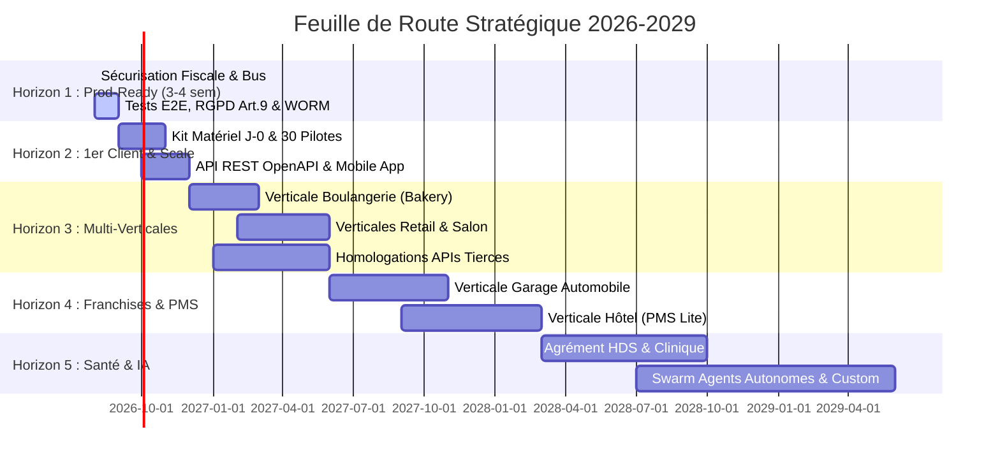

# 🗺️ Feuille de Route Stratégique 2026-2029 (v8.0) — Restaurant OS Platform

> **Document Maître de Stratégie, d'Horizons et d'Exécution Industrielle**  
> **Dernière synchronisation codebase** : 2026-08-15 (Scan empirique temps réel)  
> **Statut Codebase** : **2 686** fichiers source · **176** Handlers Bus · **179** Routes API REST · **62** Pages · **123** Suites de tests · **TSC = 0** ✅  
> **Gouvernance** : Imperial Trinity Protocol (RTK, Graphify/Atlas, MemPalace) · Zero-Defect Standard

---

## 📚 Sommaire

1. [🏛️ Vision & Horizons d'Exécution (H1 → H5)](#1-🏛️-vision--horizons-dexécution-h1--h5)
2. [🚀 Horizon 1 — Prod-Ready & Sécurisation Fiscale (Août 2026)](#2-🚀-horizon-1--prod-ready--sécurisation-fiscale-août-2026)
3. [📈 Horizon 2 — Déploiement Commercial, Hardware J-0 & Mobile App (M+1 → M+3)](#3-📈-horizon-2--déploiement-commercial-hardware-j-0--mobile-app-m1--m3)
4. [🥖 Horizon 3 — Expansion Multi-Verticales & Buffer Homologations (M+3 → M+9)](#4-🥖-horizon-3--expansion-multi-verticales--buffer-homologations-m3--m9)
5. [🚗 Horizon 4 — Franchises, Groupes & Verticales Lourdes (M+9 → M+18)](#5-🚗-horizon-4--franchises-groupes--verticales-lourdes-m9--m18)
6. [🩺 Horizon 5 — Souveraineté IA & Santé HDS (M+18 → M+36)](#6-🩺-horizon-5--souveraineté-ia--santé-hds-m18--m36)
7. [📊 Modèle Économique, FinOps & Organisation (Mitigation Bus Factor)](#7-📊-modèle-économique-finops--organisation-mitigation-bus-factor)

---

## 1. 🏛️ Vision & Horizons d'Exécution (H1 → H5)

La plateforme évolue d'un logiciel de gestion de restaurant vers une **Méta-Plateforme Commerciale Universelle (Universal Commerce OS)** capable d'équiper 8 secteurs d'activité distincts sur un tronc commun invariant.

---

## 2. 🚀 Horizon 1 — Prod-Ready & Sécurisation Fiscale `[Août 2026 · 3-4 Semaines Réelles]`

> **Objectif** : Zéro angle mort. La plateforme est prête à encaisser le premier euro en production dans des conditions de conformité légale, d'idempotence et de stabilité irréprochables.

### Sprint 1.1 · Clôture des Émetteurs Bus & Idempotence (Semaine 1)
- **Webhook Stripe Acomptes** (`src/app/api/webhooks/stripe/route.ts`) : Émission de `commerce.reservation_deposit_paid` lors de la validation d'un acompte en ligne.
- **Émission Explicite `ops.table_closed`** : Câbler l'émission lors du solde de l'addition dans le POS.
- **Idempotence Serveur Bus** : Table `events_processed_log/{eventId}` pour empêcher tout doublement d'écriture lors d'un retry réseau.
- **Sentry DSN Production** : Injecter `SENTRY_DSN` et configurer les alertes critiques (erreur fiscale = notification SMS/Slack immédiate).

### Sprint 1.2 · Cadrage Légal, RGPD Art. 9 & Backup WORM NF525 (Semaine 2)
- **Signature DPA RGPD Art. 28 & CGU/CGV** : Finaliser le contrat de sous-traitance de données et les conditions générales avec avocat spécialisé.
- **Fiches Allergies = Données de Santé (RGPD Art. 9)** : Consentement explicite traçable et chiffrement au repos des profils allergènes.
- **Archive WORM Firestore Long-Terme** : Configurer la règle d'immuabilité Firestore sur `fiscal_archives/` avec rétention légale stricte de 6 ans.

### Sprint 1.3 · Protection CI/CD & 3 Parcours E2E Playwright (Semaines 3-4)
- **Garde-Fou GitHub Actions** : Verrouillage de la branche `main` avec obligation de passage des tests AST, TSC (`tsc --noEmit`) et Vitest.
- **Suite Playwright Maître** :
  1. *Parcours Encaissement* : Prise de commande → Split addition → Paiement CB → Génération facturette NF525.
  2. *Parcours Clôture Z* : Fin de service → Rapprochement caisse tiroir → Clôture Z scellée → Export FEC.
  3. *Parcours Réservation & Allergènes* : Réservation Web → Check-in hôtesse → Transmission des alertes allergènes au KDS cuisine.

---

## 3. 📈 Horizon 2 — Déploiement Commercial, Hardware J-0 & Mobile App `[Sept-Nov 2026]`

> **Objectif** : Onboarding de 30 restaurants pilotes, maîtrise du déploiement physique et application mobile compagnon.

### Sprint 2.1 · Kit Matériel J-0 & Support B2B SOS Caisse
- **Kit Valise d'Onboarding** : Routeur 4G failover multi-opérateurs préconfiguré en cas de coupure de la box du restaurateur.
- **Bouton SOS Caisse sur POS** : Déclenchement d'une alerte prioritaire PagerDuty/Slack avec diagnostic d'état local hors-ligne pour le support MCC.
- **Facturation Automatisée MCC** : Moteur d'abonnement Stripe Invoicing avec prélèvement automatique et gestion des périodes de grâce (7 jours).

### Sprint 2.2 · API REST Publique & OpenAPI 3.1
- Exposition formelle des routes API Next.js sous une spécification standard OpenAPI / Swagger.
- Rate limiting par jeton API avec quotas stricts par formule d'abonnement.
- Webhooks sortants pour permettre aux clients d'interconnecter leur propre écosystème (Zapier, Make, ERP externe).

### Sprint 2.3 · Application Mobile Compagnon (Expo / React Native)
- **App Serveur (Mobile POS)** : Prise de commande ultra-rapide sur smartphone (iOS/Android) avec transmission directe KDS.
- **App Manager** : Consultation du CA en direct, alertes ruptures de stock et validation des remises à distance.
- **Pointeuse Mobile Géofencée** : Pointage staff sur smartphone avec vérification de présence dans le périmètre du restaurant.

---

## 4. 🥖 Horizon 3 — Expansion Multi-Verticales & Buffer Homologations `[Déc 2026 – Mai 2027]`

> **Objectif** : Déploiement des verticales Boulangerie, Retail et Salon. Anticipation des délais d'homologation partenaires.

### Sprint 3.1 · 🥖 Verticale Boulangerie (Bakery)
- **Gestion des Fournées** : Planning de cuisson dynamique, cadencement des fournées de baguettes/viennoiseries.
- **Vente au Poids** : Connecteur balance homologuée (protocole Dialogue 06 / Mettler Toledo).
- **Gestion des Précommandes & Traiteur** : Enregistrement des commandes gâteaux/pièces montées avec acomptes et fiches de retrait.

### Sprint 3.2 · 🛍️ Verticale Commerce de Détail (Retail)
- **Scan & Code-Barres** : Douchette USB/Bluetooth, gestion des codes EAN-13, balances poids-prix.
- **Matrice Variantes** : Gestion Tailles / Couleurs / Matières avec déclinaison automatique de SKU.
- **Synchronisation Omnicanale** : Connecteurs bidirectionnels Shopify / WooCommerce (stocks et commandes unifiés).

### Sprint 3.3 · 💇 Verticale Coiffure & Esthétique (Salon)
- **Agenda Visuel Collaboratif** : Prise de RDV en ligne, vue par collaborateur et par cabine de soin.
- **Fiches Techniques Coloration** : Historique des formules de coloration client, photos avant/après sécurisées.
- **Moteur de Commissions** : Calcul automatique des pourcentages sur prestations et ventes de produits.

### Sprint 3.4 · ⏳ Homologations Partenaires (Buffer 3-6 mois)
- Engager les dossiers de certification partenaires externes (Google Reserve, TheFork, Planity) dès l'entrée en H3 pour absorber les délais d'audit tiers.

---

## 5. 🚗 Horizon 4 — Franchises, Groupes & Verticales Lourdes `[Juin 2027 – Fév 2028]`

> **Objectif** : Conquête des réseaux de franchise et ouverture des verticales Garage et Hôtel.

### Sprint 4.1 · 🚗 Verticale Garage Automobile
- **Ordres de Réparation (OR)** : Réception véhicule, relevé kilométrique, photos de carrosserie et signature client sur tablette.
- **Chiffrage Pièces & Main d'Œuvre** : Catalogue pièces détachées et barème de temps constructeur.
- **Facturation Normée Véhicule** : Mention obligatoire d'immatriculation, numéro VIN et contrôle technique.

### Sprint 4.2 · 🏨 Verticale Hôtel & Hébergement (PMS Lite)
- **Gestion des Chambres & Planning** : Grille des disponibilités, statuts de ménage (propre, sale, inspection).
- **Channel Manager Intégré** : Passerelle 2-ways avec Booking.com, Expedia et Airbnb (après homologation OTA).
- **Facturation Folio** : Transfert des consommations bar/restaurant sur la note de chambre.

### Sprint 4.3 · 🏢 Multi-Établissements & Consolidation Franchise
- **Vue Groupe Consolidée** : Dashboard unique pour les directeurs de chaîne avec benchmark inter-sites.
- **Mutualisation des Stocks & Personnel** : Transfert de marchandises entre établissements et pool d'employés partagés.

---

## 6. 🩺 Horizon 5 — Souveraineté IA & Santé HDS `[2028-2029]`

> **Objectif** : Agrément Santé HDS pour la verticale Clinique, Swarm d'agents IA totalement autonomes et internationalisation.

### Sprint 5.1 · 🩺 Verticale Clinique & Paramédical (HDS / Santé)
- **Agrément Hébergement Données de Santé (HDS)** : Déploiement sur infrastructure certifiée ANSSI/HDS avant tout traitement de données patients réelles.
- **Facturation FSE & SESAM-Vitale** : Télétransmission CPAM, gestion du tiers-payant et mutuelles.
- **Dossier Patient Informatisé (DPI)** : Historique médical, ordonnances sécurisées et synchronisation Mon Espace Santé.

### Sprint 5.2 · 🎨 Custom Framework & SDK Partenaires
- Moteur de création de formulaires, champs personnalisés et statuts métier pour tout type d'activité.
- SDK Partenaires pour permettre aux intégrateurs de développer des verticales spécialisées.

---

## 7. 📊 Modèle Économique, FinOps & Organisation (Mitigation Bus Factor)

### Grille Tarifaire SaaS par Formule :
* **Essential** (49€/mois) : POS Caisse + Clôture Z NF525 + Facturation de base.
* **Standard** (79€/mois) : Essential + KDS + Stocks + Planning Staff + HACCP.
* **Enterprise** (149€/mois) : Standard + IA Oracle + Multi-sites + API Publique + Support 24/7.

### FinOps & Attribution des Coûts :
* Suivi en continu du coût d'infrastructure Firestore, requêtes LLM Oracle et stockage WORM par `tenantId` pour garantir une marge brute > 80% sur chaque compte client.

### Organisation & Plan de Transition RH (Mitigation Bus Factor) :
1. **Phase Solo (0 à 10 clients / < 2k€ MRR)** : Astreinte opérateur unique avec runbooks automatisés (`ON_CALL_RUNBOOK.md`) et monitoring Sentry/PagerDuty.
2. **Phase Consolidation (10 à 50 clients / > 5k€ MRR)** : Recrutement d'un 1er Customer Success / Support technique pour soulager l'astreinte terrain du week-end.
3. **Phase Scale (50 à 200 clients / > 15k€ MRR)** : Recrutement d'un dev fullstack senior et rotation d'astreinte 24/7.
