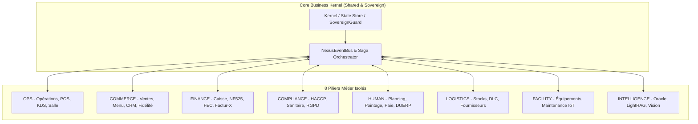
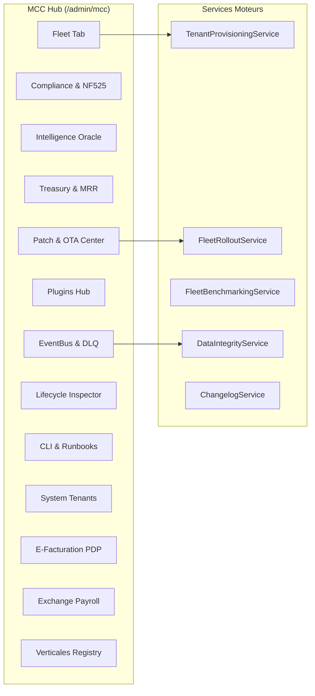
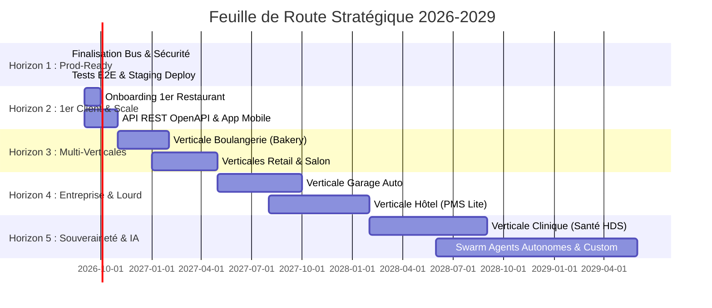
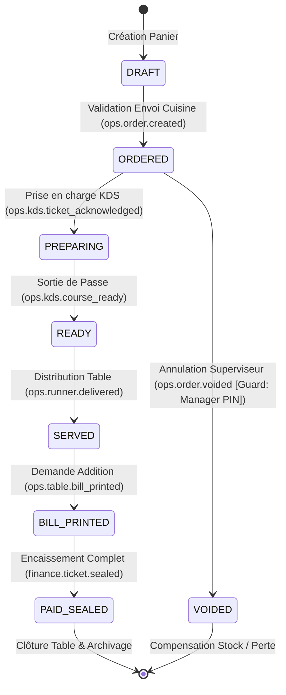
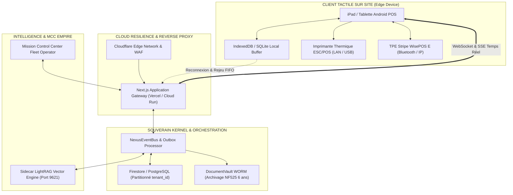
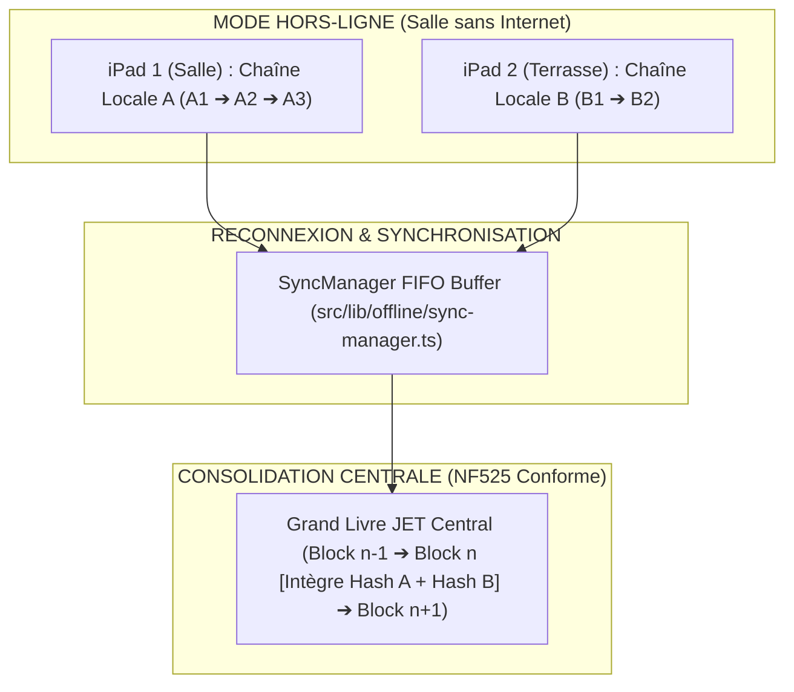
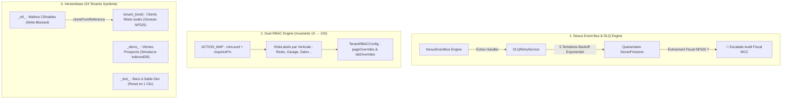

# 🗺️ ULTRA-ROADMAP 2026-2029 (v8.0 Grade X++) — Restaurant OS Platform & Autonomous Fleet Empire

> **Document Maître de Stratégie, d'Architecture et d'Exécution Industrielle**  
> **Auteur** : Antigravity (Orchestrateur Hermes Fleet) en collaboration avec l'Architecte Fondateur  
> **Dernière synchronisation codebase** : 2026-08-14 (Scan empirique temps réel)  
> **Statut Codebase** : **2 686** fichiers source · **176** Handlers Bus · **179** Routes API REST · **62** Pages · **123** Suites de tests · **TSC = 0** ✅  
> **Gouvernance** : Imperial Trinity Protocol (RTK, Graphify/Atlas, MemPalace) · Grade X++ Zero-Defect Standard

---

## 📚 Sommaire Exécutif

1. [🏛️ Cadre Fondateur & Architecture Impériale](#1-🏛️-cadre-fondateur--architecture-impériale)
2. [🛰️ Mission Control Center (MCC) & Orchestration Fleet (Pôle 1)](#2-🛰️-mission-control-center-mcc--orchestration-fleet-pôle-1)
3. [🚀 Plan d'Exécution par Horizons (H1 → H5 : 2026-2029)](#3-🚀-plan-dexécution-par-horizons-h1--h5--2026-2029)
4. [🗺️ Architecture & Spécifications des 8 Verticales Métier](#4-🗺️-architecture--spécifications-des-8-verticales-métier)
5. [🎨 Matrice Complète des 16 Zones UI (~806 Composants Décortiqués)](#5-🎨-matrice-complète-des-16-zones-ui-806-composants-décortiqués)
6. [📡 Topologie du Bus Événementiel Nexus & Invariants Mathématiques](#6-📡-topologie-du-bus-événementiel-nexus--invariants-mathématiques)
7. [🛡️ Sécurité, Conformité Légale (NF525/HDS/RGPD) & FinOps](#7-🛡️-sécurité-conformité-légale-nf525hdsrgpd--finops)
8. [📈 Modèle Économique, KPIs & Gouvernance Multi-Agent](#8-📈-modèle-économique-kpis--gouvernance-multi-agent)

---

# 1. 🏛️ Cadre Fondateur & Architecture Impériale

## 1.1 L'Anatomie Détaillée des 8 Piliers du Domaine DDD (Domain-Driven Design)

Le système est structuré autour de **8 Piliers Métier souverains**, étanches et hautement spécialisés. Aucun pilier ne possède de dépendance directe avec un autre pilier : toute communication inter-domaine transite obligatoirement par le bus asynchrone sécurisé `NexusEventBus`.



---

### 🔹 PILIER 1 : OPS (Opérations, Caisse POS, KDS & Workflow Service)
*   **Volume & Fichiers** : **218 fichiers** (`src/modules/ops/`)
*   **Rôle & Mission** : Orchestrer le flux opérationnel temps réel de l'établissement (de la prise de commande jusqu'à l'expédition en passant par la gestion spatiale des tables/postes).
*   **Sous-Modules Principaux** :
    *   `service/pos/` : Moteur de caisse tactile ultra-réactif, gestion du panier, application des remises, split d'addition multi-modes, pourboires.
    *   `production/kds/` : Kitchen Display System multi-postes (Chaud, Froid, Pâtisserie, Bar), chronomètres d'alerte, groupage d'articles pour la mise en place.
    *   `spaces/floor-plan/` : Éditeur et visualiseur de plan de salle 2D/3D temps réel, rotation des tables, zones (terrasse, salle, bar).
    *   `workflow/engine/` : Machine à états finis des commandes (`placed` → `preparing` → `ready` → `delivered` → `paid` → `cleared`).
*   **Contrats & Événements Clés** :
    *   *Émet* : `order.placed`, `ops.course.fired`, `order.cancelled`, `table.locked`, `table.released`.
    *   *Consomme* : `reservation.matched` (accueil client), `haccp.alert` (blocage plat non-conforme).
*   **Rôle dans la Généralisation** : S'abstrait via `ServiceTicket` et `spatialContext` (Table en restaurant, Poste de coiffure en salon, Baie/Pont en garage, Chambre en hôtel).

---

### 🔹 PILIER 2 : COMMERCE (Catalogue, Tarifs, CRM, Fidélité & Delivery)
*   **Volume & Fichiers** : **254 fichiers** (`src/modules/commerce/`)
*   **Rôle & Mission** : Maximiser le revenu de l'établissement, fidéliser la clientèle et unifier les canaux de vente (sur place, click & collect, livraison).
*   **Sous-Modules Principaux** :
    *   `catalog/` : Menu Builder, déclinaisons, options/modificateurs, fiches allergènes INCO, formules midi/soir.
    *   `relation/crm/` : Fichier client souverain, segmentation RFM (Récence, Fréquence, Montant), historique de consommation.
    *   `relation/loyalty/` : Moteur de fidélité multi-paliers (points, cash-back cagnotte, récompenses VIP).
    *   `relation/delivery/` : Hub agrégateur de livraison (Deliveroo, UberEats, Click & Collect natif).
    *   `pricing/` : Moteur de tarification dynamique (Happy Hours, tarifs pro, remises promotionnelles).
*   **Contrats & Événements Clés** :
    *   *Émet* : `commerce.promotion_activated`, `commerce.loyalty_points_earned`, `crm.customer_created`, `crm.customer_updated`.
    *   *Consomme* : `order.paid` (crédit fidélité auto), `reservation.no_show` (flag risque client).
*   **Rôle dans la Généralisation** : S'abstrait via `recipeLabel` (Plat en resto, Article en retail, Prestation en salon, Forfait en garage).

---

### 🔹 PILIER 3 : FINANCE (Caisse, Grand Livre, NF525, Factur-X & FEC)
*   **Volume & Fichiers** : **186 fichiers** (`src/modules/finance/`)
*   **Rôle & Mission** : Assurer l'intégrité fiscale absolue (Article 286 du CGI / NF525), automatiser la comptabilité et piloter la trésorerie.
*   **Sous-Modules Principaux** :
    *   `comptabilite/` : Grand Livre général et auxiliaire, Plan Comptable Général (PCG) automatisé, journal des ventes et des achats.
    *   `fiscalite/tax/` : Moteur `vatResolver` pour la ventilation automatique de la TVA (5.5%, 10%, 20%), gestion des encaissements.
    *   `einvoicing/` : Réception et émission des factures électroniques conformes Factur-X (PDF/A-3 + XML), UBL 2.1 et CII.
    *   `billing/` : Génération des factures B2B, gestion des avoirs, acomptes Stripe et relances d'impayés.
*   **Contrats & Événements Clés** :
    *   *Émet* : `order.paid`, `finance.ticket_z_closed`, `finance.invoice_generated`, `finance.bank_synced`.
    *   *Consomme* : `order.placed` (pré-comptabilisation), `supplier.delivery_received` (écriture achat marchandise).
*   **Rôle dans la Généralisation** : 100% universel pour toute entreprise commerciale assujettie à la TVA en France et en Europe.

---

### 🔹 PILIER 4 : COMPLIANCE (Hygiène HACCP, Traçabilité, Coffre WORM & RGPD)
*   **Volume & Fichiers** : **123 fichiers** (`src/modules/compliance/`)
*   **Rôle & Mission** : Garantir la conformité réglementaire stricte, la sécurité sanitaire, la protection des données et l'archivage légal inaltérable.
*   **Sous-Modules Principaux** :
    *   `qualite/haccp/` : Relevés de températures (chambres froides, cuissons, liaisons chaudes), gestion des non-conformités, plan de maîtrise sanitaire.
    *   `securite/` : Coffre-fort numérique `DocumentVault` basé sur la technologie WORM (Write Once Read Many) pour l'archivage 6 ans.
    *   `sanitaire/` : Traçabilité des lots de denrées (viandes, poissons, farines), photos des étiquettes sanitaires.
    *   `registre/` : Registre des traitements RGPD (Art. 30), gestion du consentement et politique de crypto-shredding.
*   **Contrats & Événements Clés** :
    *   *Émet* : `haccp.temperature_logged`, `haccp.alert`, `haccp.non_conformity_created`, `compliance.certificate_expiring`.
    *   *Consomme* : `sovereign.breach` (alerte intrusion/tentative d'altération).
*   **Rôle dans la Généralisation** : Conditionné par `usesCulinaryStock(variant)`. Actif pour Food (Resto/Bakery/Hotel/Retail Food), converti en registre sécurité/déchets pour Garage (BSDD) et Salon.

---

### 🔹 PILIER 5 : HUMAN (Effectifs, Planning Glissant, Pointeuse & Paie)
*   **Volume & Fichiers** : **105 fichiers** (`src/modules/human/`)
*   **Rôle & Mission** : Gérer les ressources humaines, orchestrer les plannings sous contraintes légales et simplifier la paie.
*   **Sous-Modules Principaux** :
    *   `effectifs/hr/` : Dossiers collaborateurs, contrats de travail (CDI/CDD), compétences, médecine du travail.
    *   `planning/` : Moteur de planning collaboratif glissant hebdomadaire/mensuel, détection des conflits légaux (repos 11h, amplitude max).
    *   `timeclock/` : Borne de pointage PIN sécurisée PBKDF2 / NFC avec calcul automatique des heures réelles, coupures et heures sup.
    *   `paie/` : Pré-paie automatisée, calcul des variables, intégration directe avec Silae, Payfit et Combo.
*   **Contrats & Événements Clés** :
    *   *Émet* : `hr.shift_started`, `hr.shift_ended`, `hr.absence_declared`, `hr.tip_declared`, `hr.employee_created`.
    *   *Consomme* : `finance.ticket_z_closed` (calcul des ratios de masse salariale du jour).
*   **Rôle dans la Généralisation** : S'adapte via `RoleLabels` (du Plongeur au Chef de Cuisine, du Mécanicien au Chef d'Atelier, du Shampouineur au Coloriste).

---

### 🔹 PILIER 6 : LOGISTICS (Approvisionnement, Stocks, Fiches Techniques & DLC)
*   **Volume & Fichiers** : **78 fichiers** (`src/modules/logistics/`)
*   **Rôle & Mission** : Assurer la disponibilité des stocks, automatiser les réapprovisionnements et éradiquer le gaspillage.
*   **Sous-Modules Principaux** :
    *   `stocks/` : Moteur de stock multi-emplacements (réserve, cuisine, bar, vitrine), valorisation au PMP (Prix Moyen Pondéré).
    *   `approvisionnement/` : Gestion des fournisseurs, catalogues connectés (Metro, Sysco, Pomona), bons de commande automatisés.
    *   `inventaire/` : Assistant d'inventaire physique mensuel, calcul des écarts théorique/réel, réajustement comptable.
    *   `dlc/` : Suivi des dates limites de consommation (DLC/DLUO) avec alertes préventives 48h.
*   **Contrats & Événements Clés** :
    *   *Émet* : `inventory.stock_adjusted`, `stock.low`, `stock.zero`, `logistics.delivery_received`, `logistics.waste_recorded`.
    *   *Consomme* : `order.paid` (décrémentation stock instantanée basée sur les fiches techniques).
*   **Rôle dans la Généralisation** : S'abstrait via `itemLabel` (Ingrédient en cuisine, Pièce détachée en mécanique, Flacon cosmétique en salon, Article en boutique).

---

### 🔹 PILIER 7 : FACILITY (Parc Machines, Maintenance IoT & Énergie)
*   **Volume & Fichiers** : **41 fichiers** (`src/modules/facility/`)
*   **Rôle & Mission** : Maximiser la disponibilité des équipements critiques, prévenir les pannes et optimiser la consommation énergétique.
*   **Sous-Modules Principaux** :
    *   `maintenance/` : Carnet d'entretien numérique des machines (fours, chambres froides, tireuses, ponts élévateurs, bacs à shampoing).
    *   `interventions/` : Système de tickets d'incident pour les pannes avec photos, niveau d'urgence et assignation aux réparateurs.
    *   `iot/` : Passerelle capteurs connectés (sondes de température Bluetooth Testo, compteurs Linky Enedis).
*   **Contrats & Événements Clés** :
    *   *Émet* : `facility.maintenance_requested`, `facility.maintenance_due`, `iot.offline_alert`.
    *   *Consomme* : `haccp.threshold_exceeded` (déclenchement automatique d'un bon d'intervention frigoriste).
*   **Rôle dans la Généralisation** : Universel pour tout établissement exploitant des équipements techniques soumis à entretien.

---

### 🔹 PILIER 8 : INTELLIGENCE (Oracle Majordome, LightRAG & Vision AI)
*   **Volume & Fichiers** : **149 fichiers** (`src/modules/intelligence/`)
*   **Rôle & Mission** : Transformer les données brutes du commerce en décisions stratégiques et exécuter des tâches autonomes.
*   **Sous-Modules Principaux** :
    *   `oracle/` : Majordome IA conversationnel en langage naturel connecté à toutes les bases de données du tenant.
    *   `rag/` : Moteur LightRAG vectoriel et graphe de connaissances souverain isolé par tenant (sidecar port 9621).
    *   `agents/` : Swarm d'agents spécialisés (Atlas pour la logistique, Themis pour la conformité fiscale, Cronos pour le temps).
    *   `forecasting/` : Algorithmes prédictifs d'affluence et de ventes croisant météo, historiques et événements locaux.
    *   `vision/` : Reconnaissance visuelle pour l'audit des retours assiette et l'analyse du gaspillage.
*   **Contrats & Événements Clés** :
    *   *Émet* : `intelligence.menu_engineering_requested`, `intelligence.anomaly_detected`, `intelligence.churn_risk_detected`.
    *   *Consomme* : Tous les événements business pour enrichir en continu le graphe de connaissances du tenant.
*   **Rôle dans la Généralisation** : Les prompts et agents adaptent automatiquement leurs analyses selon le `merchantKind` (Food Cost pour resto, Taux d'occupation atelier pour garage, Taux de remplissage fauteuil pour salon).

---

## 1.2 Le Double Moteur RBAC & Souveraineté Absolue

La plateforme impose une séparation étanche entre **le locataire (Tenant)** et **l'opérateur constructeur (MCC)**.

```
┌─────────────────────────────────────────────────────────────────────────────┐
│                          SUPER-ADMIN / OPÉRATEUR MCC                        │
│   Auth: MFAGate + Token Fleet Operator · Routes: /app/(admin)/*            │
│   Niveaux: support (1) → operator (2) → admin (3)                          │
│   Isolation: SovereignGuard bloque TOUTE lecture de données PII tenant     │
└──────────────────────────────────────┬──────────────────────────────────────┘
                                       │ Orchestration (Telemetry, Provisioning)
┌──────────────────────────────────────▼──────────────────────────────────────┐
│                           LOCATAIRE B2B (TENANT)                            │
│   Auth: Firebase JWT + PIN Staff · Routes: /app/(client)/*                  │
│   RBAC 14 Rôles hiérarchisés (10 → 100)                                    │
│   Isolation: SovereignGuard enforce tenantId strictly on every collection   │
└─────────────────────────────────────────────────────────────────────────────┘
```

### Grille des 14 Rôles Métier Tenant (Niveaux 10 à 100) :
- `10` **Plongeur / Apprenti** : Pointage basique, consultation règles hygiène.
- `20` **Commis / Runner** : Saisie rapide POS, lecture KDS expédition.
- `30` **Serveur / Barman / Réceptionniste** : POS complet, ouverture table, encaissement direct.
- `40` **Chef de Rang** : Transferts de table, application de remises mineures (<10%), timeclock manager.
- `50` **Sommelier / Expert Métier** : Gestion cave, fiches dégustation, accords mets/vins, stocks nobles.
- `60` **Sous-Chef / Comptable** : Relevés HACCP, réception marchandises, comptabilité lecture, gestion litiges.
- `70` **Manager / Chef de Cuisine** : Planning écriture, validation pertes, remises managériales (>10%), recrutement.
- `80` **Directeur Établissement** : Audit fiscal, analytics consolidation, déclarations TVA, DUERP.
- `100` **Propriétaire Gérant** : Souveraineté totale sur le tenant (configuration, DNA, clôture fiscale, migration).

---

## 1.3 Moteur Cryptographique & Fiscal NF525 Grade X++

La conformité fiscale (Article 286 du CGI / NF525) est gravée dans le marbre algorithmique :
1. **Intégrité Cryptographique** : Chaque vente, modification ou annulation génère un `FiscalSeal` scellé en SHA-256 chaîné au sceau précédent (`previousHash`).
2. **Archivage WORM (Write Once Read Many)** : Implémenté via `DocumentVault.ts` et la collection `fiscal_archives/` avec interdiction stricte de modification/suppression.
3. **Clôtures Périodiques Automatisées** : Ticket Z quotidien, récapitulatif mensuel FEC (Fichier des Écritures Comptables) et journal des événements d'audit.
4. **Calculs en Microunités Entières** : Tout montant monétaire est stocké sous forme entière `amountInMicrounits` (1€ = 1 000 000 µunits) pour éliminer tout risque d'arrondi flottant IEEE-754.

---


---

## 1.4 L'Audit Approfondi de la Méta-Architecture Généraliste

### 1.4.1 Pourquoi ce projet surclasse les caisses traditionnelles
La plupart des logiciels SaaS du marché sont des "monolithes verticaux" : une caisse restaurant ne sait faire que du restaurant. Si l'éditeur veut vendre à des salons ou des garages, il doit réécrire 80% de son logiciel.

**Restaurant OS a adopté une architecture de Méta-Plateforme Commerciale (Universal Commerce OS)** :
1. **Un Tronc Invariant** (Fiscalité NF525, Grand Livre, Multi-Tenant SovereignGuard, Bus Asynchrone, Auth RBAC, Mode Offline, Provisioning MCC).
2. **Une Couche d'Adaptation Découplée** (`VerticalRegistry`, `VerticalEventBridge`, `MetricLabels`, `RoleLabels`, `usesCulinaryStock`).
3. **8 Verticales Déployables Immédiatement** sans modification du noyau central.

---

### 1.4.2 Le Pont Événementiel (`VerticalEventBridge` · 42 Règles)
Le `VerticalEventBridge` normalise les événements métier spécifiques vers les événements pivots universels :
*   `auto.invoice_issued` (Garage) ──► `order.paid` (Générique)
*   `hotel.guest_checked_out` (Hôtel) ──► `order.paid` (Générique)
*   `retail.sale_completed` (Boutique) ──► `order.paid` (Générique)
*   `salon.appointment_completed` (Salon) ──► `order.paid` (Générique)
*   `bakery.sale_completed` (Boulangerie) ──► `order.paid` (Générique)
*   `health.act_billed` (Clinique) ──► `order.paid` (Générique)

Grâce à ce pont, **les 176 handlers du bus (déduction de stock, scellage fiscal, attribution fidélité, comptabilité) fonctionnent instantanément pour toutes les verticales.**

---

### 1.4.3 La Matrice Sémantique des 8 Métiers (`MetricLabels`)

| Clé Sémantique | 🍽️ Restaurant | 🥖 Bakery | 🛍️ Retail | 💇 Salon | 🚗 Garage | 🏨 Hotel | 🩺 Clinic | 🎨 Custom |
|---|---|---|---|---|---|---|---|---|
| `unit` | couvert | pièce | article | prestation | intervention | nuitée | consultation | unité |
| `spatialContext`| table | étal | rayon | cabine / fauteuil | baie / pont | chambre | cabinet | espace |
| `merchantKind` | restaurant | boulangerie | commerce | salon | garage | hôtel | clinique | établissement |
| `server` | serveur | vendeur | conseiller | coiffeur | mécanicien | réceptionniste | praticien | opérateur |
| `prepTicket` | bon cuisine | ordre fournée | bon prépar. | fiche technique | ordre répar. (OR)| bon service | ordonnance | fiche travail |
| `recipeLabel` | recette | recette pâtiss.| fiche article | forfait soin | forfait révis. | forfait séjour | acte médical | prestation |
| `itemLabel` | ingrédient | matière 1ère | article | cosmétique | pièce détachée | fourniture | consommable | ressource |
| `customerLabel`| convive | client | acheteur | client | automobiliste | résident | patient | client |

---

### 1.4.4 Les Super-Pouvoirs Industriels du Modèle
1. **Coût Marginal Nul pour de Nouveaux Métiers** : Lancer une nouvelle verticale (ex: Salle de sport, Toilettage, Cordonnerie) demande **seulement 48 heures** (créer `labels.ts`, `roles.ts` et 5 règles de pont).
2. **Maintenance Fiscale Centralisée** : Une seule mise à jour du moteur Factur-X 2026 ou NF525 met à niveau les 8 verticales simultanément.
3. **Le Mode "Custom" pour les Concepts Stores** : Permet d'équiper des commerces hybrides (ex: café-librairie, salon-boutique) en combinant les fonctionnalités à la volée.


---

## 1.5 🌐 Matrice Croisée d'Impact Inter-Domaines (8x8 Domain Cross-Impact Matrix)

Chaque pilier du domaine DDD interagit avec les 7 autres selon des règles causales strictes et déterministes. Le tableau ci-dessous explicite **qui impacte qui, comment et avec quel mécanisme de compensation** :

| Domaine Source ➔ | Domaine Cible | Déclencheur / Événement Bus | Effet Métier Causal & Mutation d'État | Mécanisme de Rollback / Compensation |
| :--- | :--- | :--- | :--- | :--- |
| **P1 (OPS)** | **P2 (COMMERCE)** | `ops.dish.86_toggled` | Dépublication immédiate du plat sur Menu Digital, QR Code et bornes | Réactivation automatique dès réapprovisionnement (`ops.dish.86_restored`) |
| **P1 (OPS)** | **P3 (FINANCE)** | `ops.order.created` | Création d'une pré-facture draft et calcul préliminaire de la TVA | Annulation de la ligne (`ops.order.line_voided`) avec contre-passation |
| **P1 (OPS)** | **P4 (COMPLIANCE)** | `ops.guest.checked_in` | Vérification de la présence d'allergènes critiques et alertes KDS | Mise à jour des fiches allergènes en direct sans bloquer le service |
| **P1 (OPS)** | **P5 (HUMAN)** | `ops.pos.cash_opened` | Contrôle d'éligibilité du serveur (doit avoir pointé son shift) | Alerte bloquante : refus d'ouvrir la caisse sans pointage actif |
| **P1 (OPS)** | **P6 (LOGISTICS)** | `ops.order.created` | Décomposition de la fiche recette et décrémentation stock instantanée | Réintégration des denrées non cuisinées en cas d'annulation de commande |
| **P1 (OPS)** | **P7 (FACILITY)** | `ops.printer.error` | Détection de panne d'imprimante thermique et bascule de secours | Failover automatique sur l'imprimante de secours déclarée |
| **P1 (OPS)** | **P8 (INTELLIGENCE)** | `ops.order.placed` | Alimentation du flux temps réel pour calcul d'affluence et cadence | Nettoyage des données aberrantes lors de tests |
| **P2 (COMMERCE)** | **P1 (OPS)** | `commerce.menu.price_updated` | Mise à jour des prix affichés sur la grille tactile POS | Versioning à la volée : les tables déjà ouvertes gardent l'ancien tarif |
| **P2 (COMMERCE)** | **P3 (FINANCE)** | `commerce.gift_card.sold` | Émission d'un titre de paiement différé et écriture au compte 419 | Avoir fiscal si annulation de la carte cadeau sous 14 jours |
| **P2 (COMMERCE)** | **P4 (COMPLIANCE)** | `commerce.dish.allergen_modified` | Mise à jour de la matrice INCO 14 allergènes et affichage légal | Archivage de l'historique des modifications de recettes |
| **P2 (COMMERCE)** | **P5 (HUMAN)** | `commerce.target.bonus_unlocked` | Calcul des primes sur objectifs de vente pour les serveurs | Validation mensuelle par le directeur avant export paie |
| **P2 (COMMERCE)** | **P6 (LOGISTICS)** | `commerce.menu.activated` | Calcul prévisionnel des besoins d'approvisionnement (MRP) | Ajustement des commandes fournisseurs si la carte est modifiée |
| **P3 (FINANCE)** | **P1 (OPS)** | `finance.payment.completed` | Libération de la table, passage en statut "À débarrasser" | Réouverture de table possible sous code PIN superviseur |
| **P3 (FINANCE)** | **P2 (COMMERCE)** | `finance.payment.completed` | Calcul et crédit instantané des points de fidélité et cagnotte | Débit des points si remboursement ultérieur du ticket |
| **P3 (FINANCE)** | **P5 (HUMAN)** | `finance.tips.calculated` | Répartition des pourboires CB au prorata des heures de service | Recalcul lors de la clôture de paie si litige d'heures |
| **P3 (FINANCE)** | **P6 (LOGISTICS)** | `finance.po.invoice_settled` | Lettrage de la facture fournisseur avec le bon de livraison | Génération d'un litige fournisseur en cas d'écart de prix |
| **P3 (FINANCE)** | **P8 (INTELLIGENCE)** | `finance.ticket_z.sealed` | Clôture de la journée financière et génération du rapport BI | Recalcul des ratios consolidés sur historique |
| **P4 (COMPLIANCE)** | **P1 (OPS)** | `compliance.lot.quarantined` | Blocage immédiat de la vente de tous les plats utilisant le lot | Déblocage sur certificat de conformité vétérinaire |
| **P4 (COMPLIANCE)** | **P6 (LOGISTICS)** | `compliance.temp.alert` | Marquage "À Risque" de toutes les denrées de la chambre froide | PV de destruction si chaîne du froid rompue > seuil légal |
| **P4 (COMPLIANCE)** | **P7 (FACILITY)** | `compliance.temp.alert` | Création automatique d'un ticket de panne prioritaire frigoriste | Clôture du ticket après intervention et contre-visite |
| **P5 (HUMAN)** | **P1 (OPS)** | `human.timeclock.clocked_out` | Déconnexion automatique de la session de caisse du serveur | Réassignation automatique des tables au chef de rang |
| **P5 (HUMAN)** | **P3 (FINANCE)** | `human.payroll.validated` | Écriture des charges de personnel (Comptes 641 et 645) au Grand Livre | Extourne comptable si régularisation de paie le mois suivant |
| **P5 (HUMAN)** | **P8 (INTELLIGENCE)** | `human.shift.validated` | Calcul en temps réel de la masse salariale pour le Prime Cost | Réajustement des indicateurs si heures supplémentaires |
| **P6 (LOGISTICS)** | **P1 (OPS)** | `logistics.stock.exhausted` | Grisement du plat au POS et déclenchement du Live 86ing | Restitution du plat dès saisie d'un bon de réception |
| **P6 (LOGISTICS)** | **P3 (FINANCE)** | `logistics.waste.recorded` | Imputation de la perte au Compte 658 (Charges exceptionnelles) | Contre-passation si erreur de saisie de casse |
| **P7 (FACILITY)** | **P1 (OPS)** | `facility.machine.down` | Mise en indisponibilité des plats nécessitant l'équipement | Réactivation automatique dès clôture de l'intervention |
| **P8 (INTELLIGENCE)** | **P2 (COMMERCE)** | `intelligence.price.suggested` | Proposition de réajustement tarifaire basée sur l'élasticité prix | Validation humaine obligatoire avant modification tarifaire |
| **P8 (INTELLIGENCE)** | **P5 (HUMAN)** | `intelligence.staffing.alert` | Alerte de sous-effectif prévisionnel croisant météo et résas | Proposition de renforts vacataires ou intérim |

---

## 1.6 📐 Dictionnaire des Données & Schémas Entités Unifiés du Kernel

Toutes les entités du noyau partagent une structure immuable, typée et sérialisable, garantissant l'intégrité cross-agents :

### 1. Entité Commande de Caisse (`OrderEntity`)
```typescript
export interface OrderEntity {
  id: string;                               // Identifiant unique UUIDv4
  tenantId: string;                         // Partition multi-tenant stricte
  tableId?: string;                         // Null si vente à emporter / livraison
  serviceMode: 'DINE_IN' | 'TAKEAWAY' | 'DELIVERY' | 'ROOM_SERVICE';
  status: 'DRAFT' | 'ORDERED' | 'PREPARING' | 'READY' | 'SERVED' | 'PAID' | 'VOIDED';
  coversCount: number;                      // Nombre de convives déclarés
  serverId: string;                         // Identifiant employé ayant ouvert la commande
  lines: Array<{
    lineId: string;
    dishId: string;
    variantId?: string;
    quantity: number;
    unitPriceHTInMicrounits: number;        // Arithmétique entière (1€ = 1 000 000 µunits)
    vatRatePercent: number;                 // 5.5, 10.0, 20.0
    seatNumber?: number;                    // 1, 2, 3...
    courseNumber: number;                   // 1 (Entrée), 2 (Plat), 3 (Dessert)
    modifiers: Array<{ id: string; priceImpactInMicrounits: number }>;
    freeNotes?: string;
    isVoided: boolean;
    voidReason?: string;
  }>;
  totals: {
    totalHTInMicrounits: number;
    totalTTCInMicrounits: number;
    vatBreakdown: Record<string, number>;    // Clé: '5.5', '10.0', '20.0' -> Montant TVA
  };
  fiscalSeal?: {
    signatureSHA256: string;
    jetSequenceNumber: number;
    sealedAt: string;
  };
  version: number;                          // Token d'Optimistic Locking (incrémental)
  createdAt: string;
  updatedAt: string;
}
```

### 2. Entité Scellement Fiscal NF525 (`FiscalJETEntry`)
```typescript
export interface FiscalJETEntry {
  sequenceNumber: number;                   // Séquence incrémentale continue sans trou (1, 2, 3...)
  tenantId: string;
  timestamp: string;                        // Horodatage ISO 8601 certifié NTP
  eventType: 'ORDER_CLOSED' | 'TICKET_Z' | 'GRAND_TOTAL_RESET' | 'PERIODIC_ARCHIVE';
  payloadSummary: {
    totalTTCInMicrounits: number;
    vatTotals: Record<string, number>;
    paymentMethods: Record<string, number>;
  };
  previousHash: string;                     // Hash SHA-256 du bloc précédent (chaînage blockchain-like)
  currentHash: string;                      // HMAC-SHA256(FiscalKey, previousHash + payloadSummary)
  isArchived: boolean;                      // Statut de transfert vers le coffre WORM
}
```

### 3. Entité Fiche Technique & Recette (`RecipeEntity`)
```typescript
export interface RecipeEntity {
  dishId: string;
  tenantId: string;
  name: string;
  sellingPriceTTCInMicrounits: number;
  vatRate: number;
  ingredients: Array<{
    ingredientId: string;
    quantityInGramsOrMl: number;
    lossFactorPercent: number;              // Coefficient de freinte / déchet (ex: 15% épluchage)
    unitCostHTInMicrounits: number;
  }>;
  subRecipes: Array<{
    subRecipeId: string;
    quantityInGramsOrMl: number;
  }>;
  theoreticalFoodCostInMicrounits: number;
  grossMarginPercent: number;
  allergens: Array<'GLUTEN' | 'CRUSTACEANS' | 'EGGS' | 'FISH' | 'PEANUTS' | 'SOY' | 'MILK' | 'NUTS' | 'CELERY' | 'MUSTARD' | 'SESAME' | 'SULPHITES' | 'LUPIN' | 'MOLLUSCS'>;
}
```

---

## 1.7 🧮 Catalogue des Invariants Algorithmiques & Formules Métier Pures

Pour garantir une exactitude absolue sur tous les calculs financiers, logistiques et analytiques, les algorithmes suivants sont normalisés dans le Kernel :

### 1. Formule Fondamentale du Prime Cost
$$	ext{Prime Cost Rate (\%)} = \left( rac{	ext{Food Cost (Coût Matières Consommées HT)} + 	ext{Labor Cost (Masse Salariale Réelle Chargée)}}{	ext{Chiffre d'Affaires Net HT}} 
ight) 	imes 100$$
* *Cible d'Excellence* : $55\% \le 	ext{Prime Cost} \le 62\%$ en bistronomie ($< 50\%$ en fast-food, $65\%$ en gastronomie étoilée).

### 2. Indicateur de Rendement Spatial RevPASH
$$	ext{RevPASH} = rac{	ext{Chiffre d'Affaires du Créneau (HT)}}{	ext{Nombre de Sièges Disponibles} 	imes 	ext{Durée du Créneau en Heures}}$$
* *Utilité* : Mesure la rentabilité nette d'un siège par heure, indépendamment du panier moyen et du taux de remplissage.

### 3. Algorithme du Plus Fort Reste pour le Split Bancaire (*Largest Remainder Method*)
Lors de la division d'un montant total $T$ en $N$ parts égales :
1. Calcul de la part brute entière : $P_{	ext{base}} = \lfloor rac{T}{N} 
floor$.
2. Calcul du reste de centimes orphelins : $R = T - (P_{	ext{base}} 	imes N)$.
3. Distribution d'un centime supplémentaire aux $R$ premiers payeurs.
4. **Invariant vérifié** : $\sum_{i=1}^{N} P_i \equiv T$ exactement au centime près, sans dérive de TVA.

### 4. Arithmétique Entière en Microunités
* **Règle absolue** : Zéro calcul monétaire en nombre flottant `Number` standard JavaScript.
* **Conversion** : $	ext{Montant}_{\mu} = 	ext{Math.round}(	ext{Montant}_{€} 	imes 1\,000\,000)$.
* **Stockage** : Types `bigint` ou `number` d'entiers stricts garantissant la précision au millionième d'euro.

---
---

# 2. 🛰️ Mission Control Center (MCC) & Orchestration Fleet (Pôle 1)

Le MCC est le tableau de bord impérial permettant de piloter 10 000+ instances isolées sans jamais violer le secret des affaires de chaque restaurateur.

## 2.1 Métriques Réelles MCC
- **82 Routes API Admin** dédiées (`src/app/api/admin/*`)
- **13 Onglets Dashboard Haute Fidélité** avec chargement asynchrone (`next/dynamic`)
- **43 Composants Modulaires** sous Framer Motion et Glassmorphism



## 2.2 Pipeline Automatisé de Provisioning en 10 Étapes

Lors d'un abonnement Stripe ou d'une création manuelle dans le MCC, `TenantProvisioningService.ts` exécute :

1. **Génération DNA & Seeding** : Initialisation du `tenantConfig`, plan comptable PCG et tables/zones.
2. **Patch Métadonnées B2B** : SIRET, formule SaaS, identité propriétaire et branding.
3. **Configuration RBAC Zod** : Déploiement des `pageOverrides` et `tabOverrides` par défaut.
4. **Activation de la Verticale** : Instanciation du plugin via `VerticalRegistry.resolve(variant)`.
5. **Injection White-Label** : Injection des variables CSS thématiques et assets graphiques.
6. **Liaison Client Stripe** : Création du `stripeCustomerId` et configuration des abonnements.
7. **Enregistrement Télémétrie Fleet** : Déclaration du tenant dans le registre de supervision globale.
8. **Espace Vectoriel RAG Isolé** : Provisioning de l'espace de connaissances `rag_workspace_{tenantId}`.
9. **DNS & Sous-Domaine** : Réservation du slug `tenant.restaurant-os.com` ou CNAME personnalisé.
10. **Compte Propriétaire & Clé Fiscale Genesis** : Création du compte Firebase Auth et scellement du hash GENESIS.

---

# 3. 🚀 Plan d'Exécution par Horizons (H1 → H5 : 2026-2029)



---

## 3.1 Horizon 1 — Prod-Ready & Sécurisation Fiscale `[~7 Jours · Août 2026]`

> **Objectif** : Zéro angle mort. La plateforme est prête à encaisser le premier euro en production.

### Sprint 1.1 · Clôture des 2 Émetteurs Bus Manquants & Alerting
- **R10 : Webhook Stripe Acomptes** (`src/app/api/webhooks/stripe/route.ts`) :
  - Émission de `commerce.reservation_deposit_paid` lors de la validation d'un acompte en ligne.
  - Consommateur : `PaymentLedgerHandler` et `ResaKitchenTaskHandler`.
- **R11 : Émission Explicite `ops.table_closed`** :
  - Câbler l'émission lors du solde de l'addition dans le POS pour déclencher la mise à jour immédiate du plan de salle et du chronomètre de rotation.
- **Sentry DSN Production** :
  - Injecter `SENTRY_DSN` et configurer les alertes critiques (erreur fiscale = notification SMS/Slack immédiate).

### Sprint 1.2 · Protection CI/CD & 3 Parcours E2E Playwright UI
- **Garde-Fou GitHub/GitLab** : Verrouillage de la branche `main` avec obligation de passage des tests AST, TSC et Vitest.
- **Suite Playwright Maître** :
  1. *Parcours Encaissement* : Prise de commande → Split addition → Paiement CB → Génération facturette NF525.
  2. *Parcours Clôture Z* : Fin de service → Rapprochement caisse tiroir → Clôture Z scellée → Export FEC.
  3. *Parcours Réservation & Allergènes* : Réservation Web → Check-in hôtesse → Transmission des alertes allergènes au KDS cuisine.

### Sprint 1.3 · Juridique DPA & WORM Firestore
- **DPA RGPD Article 28** : Valider l'intégration formelle des clauses de sous-traitance dans les CGV.
- **Règles Firestore Long-Term** : Interdiction absolue de suppression sur la collection `fiscal_archives/` avec rétention 6 ans.
- **Runbook d'Astreinte** : Publication de `docs/guides/ON_CALL_RUNBOOK.md` pour la gestion des incidents 24/7.

---

## 3.2 Horizon 2 — Déploiement Commercial & Densification `[M+1 → M+3 · Sept-Nov 2026]`

> **Objectif** : Onboarding de 30 restaurants pilotes, automatisation de la facturation plateforme et application mobile compagnon.

### Sprint 2.1 · Facturation Automatisée MCC & Portail Client
- Moteur de facturation récurrente Stripe Invoicing : génération automatique des factures d'abonnement SaaS à chaque date anniversaire.
- Portail Client Facturation : visualisation et téléchargement des factures plateforme depuis l'espace client.
- Gestion des impayés avec relance automatique et activation progressive de la période de grâce (7 jours).

### Sprint 2.2 · API REST Publique & OpenAPI 3.1
- Exposition formelle des routes API Next.js sous une spécification standard OpenAPI / Swagger.
- Rate limiting par jeton API avec quotas stricts par formule d'abonnement.
- Webhooks sortants pour permettre aux clients d'interconnecter leur propre écosystème (Zapier, Make, ERP externe).

### Sprint 2.3 · Application Mobile Compagnon (Expo / React Native)
- **App Serveur (Mobile POS)** : Prise de commande ultra-rapide sur smartphone (iOS/Android) avec transmission directe KDS.
- **App Manager** : Consultation du CA en direct, alertes ruptures de stock et validation des remises à distance.
- **Pointeuse Mobile Géofencée** : Pointage staff sur smartphone avec vérification de présence dans le périmètre du restaurant.

---

## 3.3 Horizon 3 — Expansion Multi-Verticales & IA Locale `[M+3 → M+9 · Déc 2026 – Mai 2027]`

> **Objectif** : Déploiement des verticales Boulangerie, Retail et Salon. Activation complète de l'IA Oracle.

### Sprint 3.1 · 🥖 Verticale Boulangerie (Bakery)
- **Gestion des Fournées** : Planning de cuisson dynamique, cadencement des fournées de baguettes/viennoiseries.
- **Vente au Poids** : Connecteur balance homologuée (protocole Dialogue 06 / Mettler Toledo).
- **Gestion des Précommandes & Traiteur** : Enregistrement des commandes gâteaux/pièces montées avec acomptes et fiches de retrait.
- **Invendus & Valorisation** : Interface de don alimentaire (Too Good To Go / associations) et transformation (chapelure).

### Sprint 3.2 · 🛍️ Verticale Commerce de Détail (Retail)
- **Scan & Code-Barres** : Douchette USB/Bluetooth, gestion des codes EAN-13, balances poids-prix.
- **Matrice Variantes** : Gestion Tailles / Couleurs / Matières avec déclinaison automatique de SKU.
- **Synchronisation Omnicanale** : Connecteurs bidirectionnels Shopify / WooCommerce (stocks et commandes unifiés).

### Sprint 3.3 · 💇 Verticale Coiffure & Esthétique (Salon)
- **Agenda Visuel Collaboratif** : Prise de RDV en ligne, vue par collaborateur et par cabine de soin.
- **Fiches Techniques Coloration** : Historique des formules de coloration client, photos avant/après sécurisées.
- **Moteur de Commissions** : Calcul automatique des pourcentages sur prestations et ventes de produits pour chaque coiffeur.

### Sprint 3.4 · 🧠 IA Opérationnelle LightRAG & Oracle
- Activation du sidecar vectoriel LightRAG (port 9621) sur l'ensemble de la flotte.
- Suggestions prédictives de réassort basées sur la météo, l'historique et les événements locaux.
- Générateur automatique de cartes et menus optimisés selon la marge brute (Menu Engineering BCG).

---

## 3.4 Horizon 4 — Franchises, Groupes & Verticales Lourdes `[M+9 → M+18 · Juin 2027 – Fév 2028]`

> **Objectif** : Conquête des réseaux de franchise et ouverture des verticales Garage et Hôtel.

### Sprint 4.1 · 🚗 Verticale Garage Automobile
- **Ordres de Réparation (OR)** : Réception véhicule, relevé kilométrique, photos de carrosserie et signature client sur tablette.
- **Chiffrage Pièces & Main d'Œuvre** : Catalogue pièces détachées et barème de temps constructeur.
- **Facturation Normée Véhicule** : Mention obligatoire d'immatriculation, numéro VIN et contrôle technique.

### Sprint 4.2 · 🏨 Verticale Hôtel & Hébergement (PMS Lite)
- **Gestion des Chambres & Planning** : Grille des disponibilités, statuts de ménage (propre, sale, inspection).
- **Channel Manager Intégré** : Passerelle 2-ways avec Booking.com, Expedia et Airbnb.
- **Facturation Folio** : Transfert des consommations bar/restaurant sur la note de chambre.

### Sprint 4.3 · 🏢 Multi-Établissements & Consolidation Franchise
- **Vue Groupe Consolidée** : Dashboard unique pour les directeurs de chaîne avec benchmark inter-sites.
- **Mutualisation des Stocks & Personnel** : Transfert de marchandises entre établissements et pool d'employés partagés.
- **Harmonisation Centrale des Tarifs** : Déploiement de cartes et promotions globales en 1 clic.

---

## 3.5 Horizon 5 — Souveraineté IA & Santé Réglementée `[M+18 → M+36 · 2028-2029]`

> **Objectif** : Agrément Santé HDS pour la verticale Clinique, Swarm d'agents IA totalement autonomes et internationalisation.

### Sprint 5.1 · 🩺 Verticale Clinique & Paramédical (HDS / Santé)
- **Agrément Hébergement Données de Santé (HDS)** : Déploiement sur infrastructure certifiée ANSSI/HDS.
- **Facturation FSE & SESAM-Vitale** : Télétransmission CPAM, gestion du tiers-payant et mutuelles.
- **Dossier Patient Informatisé (DPI)** : Historique médical, ordonnances sécurisées et synchronisation Mon Espace Santé.

### Sprint 5.2 · 🎨 Custom Long-Tail Framework & SDK
- Moteur no-code de création de formulaires, champs personnalisés et statuts métier pour tout type d'activité.
- SDK Partenaires pour permettre aux intégrateurs de développer des verticales spécialisées.

### Sprint 5.3 · 🛰️ Swarm d'Agents Autonomes Impériaux
- **Agent Atlas** : Passation de commandes fournisseurs 100% autonome selon les prévisions de stock et négociation des tarifs.
- **Agent Themis** : Contrôle fiscal continu en tâche de fond avec auto-réparation des anomalies mineures.
- **Agent Cronos** : Ajustement dynamique du planning staff en temps réel selon les fluctuations de réservation.

---

# 4. 🗺️ Architecture & Spécifications des 8 Verticales Métier

Chaque verticale repose sur le même tronc commun tout en injectant ses adaptateurs, labels, règles de validation et interfaces spécialisées.

```
┌─────────────────────────────────────────────────────────────────────────────┐
│                          TRONC COMMUN UNIFIÉ (KERNEL)                        │
│   Auth · RBAC · NF525 Engine · Multi-Tenant · EventBus · White-Label Theme  │
└──────┬──────────┬──────────┬──────────┬──────────┬──────────┬──────────┬────┘
       │          │          │          │          │          │          │
 ┌─────▼────┐┌────▼─────┐┌───▼────┐┌────▼─────┐┌───▼────┐┌────▼─────┐┌───▼────┐
 │Restaurant││  Bakery  ││ Retail ││  Salon   ││ Garage ││  Hotel   ││ Clinic │
 └──────────┘└──────────┘└────────┘└──────────┘└────────┘└──────────┘└────────┘
```

## Synthèse Comparative des 8 Verticales

| Verticale | Écran Principal | Unité de Vente | Réglementation Critique | Connecteur Clé |
|---|---|---|---|---|
| 🍽️ **Restaurant** | Plan de Salle + KDS | Plat / Menu / Couvert | NF525 · HACCP · INCO | TheFork · UberEats |
| 🥖 **Bakery** | Grille Comptoir + Poids | Unité / Kg (Balance) | NF525 · Traçabilité Farine | Balance Mettler · TGTG |
| 🛍️ **Retail** | Caisse Scan EAN13 | Pièce (Variantes) | NF525 · Droit Rétractation | Douchette · Shopify |
| 💇 **Salon** | Agenda Cabine / Coiffeur | Forfait / Prestation | NF525 · RGPD Photos | Planity · Treatwell |
| 🚗 **Garage** | Tableau Ordres Réparation | Pièce + Heure MO | NF525 · Mentions CGV Auto | Autossimo · Darva |
| 🏨 **Hotel** | Grille Chambres (Rack) | Nuitée + Taxe Séjour | NF525 · Fiche Police | Booking · Expedia |
| 🩺 **Clinic** | Agenda Consultations | Acte Médical (CCAM) | HDS · RGPD Santé · CSP | SESAM-Vitale · Doctolib |
| 🎨 **Custom** | Tableur Dynamique | Entité Paramétrable | NF525 Généralisé | Webhooks Universels |

---

# 5. 🎨 Matrice Complète des 16 Zones UI (~806 Composants Décortiqués)

Chaque zone d'interface regroupe l'ensemble des écrans, composants, machines d'états et invariants nécessaires à l'exploitation sans faille d'un établissement indépendant ou d'une flotte multi-sites (Empire).

```
┌────────────────────────────────────────────────────────────────────────────────────────────────────────┐
│                                   ÉCOSYSTÈME UI RESTAURANT OS                                          │
│                                                                                                        │
│  [Zone 1] SERVICE               [Zone 2] RÉSERVATIONS          [Zone 3] MENU & RECETTES                │
│  POS, KDS, Salle, Bar, Runner   Plans 2D/3D, Yield, No-Show    Fiches techniques, INCO, Live 86ing     │
│                                                                                                        │
│  [Zone 4] CRM & FIDÉLITÉ        [Zone 5] STOCK & LOGISTIQUE    [Zone 6] RESSOURCES HUMAINES            │
│  RFM, Cagnottes, RGPD Fisc.     3-Way Matching, DLC, Pertes    Planning HCR, Pointeuse, Silae/Payfit   │
│                                                                                                        │
│  [Zone 7] FINANCE & FISCALITÉ   [Zone 8] CONFORMITÉ (HACCP)    [Zone 9] FACILITY & GMAO                │
│  Clôture Z, NF525, Factur-X     Sondes IoT, Alertes, Traça     Carnet machines, QR Pannes, Contrôles   │
│                                                                                                        │
│  [Zone 10] ANALYTICS & BI       [Zone 11] IA ORACLE & VISION   [Zone 12] HUB D'INTÉGRATIONS            │
│  Prime Cost, RevPASH, Matrice   Majordome RAG, Vision Cuisine  Deliveroo/Uber, TPE, Offline-First      │
│                                                                                                        │
│  [Zone 13] ADMIN & MULTI-TENANT [Zone 14] MOBILE STAFF         [Zone 15] WEB PUBLIC & QR ORDER         │
│  RBAC Fin, Packs, DNA Injector  Pad One-Hand, Haptique         Order & Pay Table, Click&Collect Slots  │
│                                                                                                        │
│  [Zone 16] DESIGN SYSTEM SOUVERAIN & TRANSVERSE (Tokens, Glassmorphism, SplashGate, State Anti-Collision)
└────────────────────────────────────────────────────────────────────────────────────────────────────────┘
```

---

## 5.1 Décomposition Détaillée et Spécifications par Zone

### 🖥️ Zone 1 — SERVICE (POS, KDS, Bar, Runner, Expédition)
* **POS Caisse Tactile Haute Vitesse** :
  * Grille tactile dynamique par catégories, favoris et recherche ultra-rapide (`Cmd+K` / Barcode).
  * Gestion complète des modificateurs, cuissons, suppléments, déclinaisons et notes de cuisine en saisie libre ou auto-complétée.
  * Fractionnement d'addition multi-modes : split équitable par convive (avec algorithme d'arrondi au centime sans dérive fiscale), split par article sélectionné ou split par montant libre.
  * Remises commerciales et gestes client strictement régis par la matrice RBAC (PIN superviseur requis au-delà du seuil autorisé).
  * Collecte et ventilation transparente des pourboires (CB / Espèces) avec conformité légale.
* **KDS (Kitchen Display System) Multi-Postes** :
  * Répartition en temps réel des bons de commande par poste de production : Chaud, Froid, Pâtisserie, Bar, Passe.
  * Chronomètres d'attente dynamiques avec code couleur progressif (Vert → Orange → Rouge critique).
  * Regroupement intelligent par plat pour optimiser les cuissons simultanées (batching).
  * Orchestration des envois cadencés : gestion des suites de table (*« Envoyer la suite »* manuel ou temporisé) et alertes de synchronisation entre postes.
* **Tableau de Bord Bar / Runner & Expédition** :
  * Écran dédié au barman pour la préparation des boissons et cocktails.
  * Vue Runner avec validation de prise en charge au passe et confirmation de distribution à table.
  * Routage d'impression intelligent avec bascule automatique de secours (failover) en cas d'erreur ou fin de papier thermique.

### 🖥️ Zone 2 — RÉSERVATIONS & ACCUEIL
* **Plan de Salle Interactif Multi-Zones (2D/3D)** :
  * Visualisation en direct de l'état des tables : *Libre, Occupée, Addition demandée, En cours de nettoyage, Réservée*.
  * Glisser-déposer fluide pour l'assignation de table, fusion/regroupement dynamique de tables et séparation post-service.
  * Gestion de plans de salle alternatifs (Terrasse d'été, Étage privatisable, Mode cocktail/banquet) avec bascule instantanée selon la météo.
* **Module Check-in & Accueil Client** :
  * Accueil en 1 clic déclenchant immédiatement la transmission des alertes allergènes et préférences VIP au KDS et au serveur assigné.
* **Waitlist Intelligente & Réservations Externes** :
  * File d'attente dynamique avec calcul estimatif du temps d'attente basé sur la rotation réelle des tables et notification automatique par SMS au client.
  * Garantie d'empreinte bancaire (No-Show Shield) avec capture automatique des frais d'annulation non justifiée.
  * Synchronisation bidirectionnelle instantanée avec les plateformes de réservation (TheFork, Google Reserve, SevenRooms).

### 🖥️ Zone 3 — MENU & CATALOGUE CULINAIRE
* **Menu Builder Visuel & Programmation Temporelle** :
  * Création intuitive de menus, cartes du midi, cartes du soir, formules combinées (Entrée + Plat + Dessert) avec suppléments conditionnels.
  * Activation planifiée de cartes selon les plages horaires et jours de la semaine.
* **Fiches Techniques Récursives & Calcul du Food Cost** :
  * Décomposition granulaire au gramme/centilitre près de chaque ingrédient et sous-recette (sauces, fonds, pâtes).
  * Calcul en temps réel du coût matière théorique, de la marge brute et du coefficient multiplicateur.
* **Gestionnaire Réglementaire INCO des 14 Allergènes** :
  * Matrice stricte des allergènes majeurs avec mise à jour instantanée et synchronisée sur tous les supports (menus digitaux, QR code, bornes, POS, KDS).
* **Moteur Live 86ing (Épuisement en Direct)** :
  * Dépublication automatique ou manuelle en un clic d'un plat en rupture sur l'ensemble de l'écosystème (POS, tablettes, Click & Collect, Deliveroo, UberEats).

### 🖥️ Zone 4 — CRM, CLIENTS & FIDÉLITÉ
* **Fichier Client Centralisé & Historique Omnicanal** :
  * Profil client 360° : historique d'achats, panier moyen, fréquence de visite, table préférée, restrictions alimentaires et dates clés (anniversaires).
* **Moteur de Fidélité Multi-Paliers & Cagnottage** :
  * Gestion de cagnottes en euros ou points, programmes VIP par paliers (Bronze, Argent, Or) et cartes cadeaux dématérialisées.
  * Support du multi-établissements (franchises) avec chambre de compensation financière inter-sites.
* **Campagnes Marketing Ciblées & RGPD Fiscale** :
  * Automatisation des relances SMS/Emailing selon la segmentation RFM (Récence, Fréquence, Montant).
  * Respect rigoureux du RGPD (droit à l'oubli / pseudonymisation des données personnelles) tout en conservant l'intégrité probante et immuable des tickets scellés NF525.

### 🖥️ Zone 5 — STOCK & LOGISTIQUE
* **Inventaire Temps Réel & Décrémentation Automatique** :
  * Sortie de stock théorique immédiate à chaque vente d'article basée sur les fiches techniques.
  * Gestion des unités multiples (conditionnement d'achat carton/kg vs unité de consommation portion/cl).
* **Suivi des DLC & Traçabilité des Lots** :
  * Alertes visuelles prédictives avant péremption et suggestions de mise en avant menu pour lutter contre le gaspillage.
* **Bons de Commande & Réception 3-Way Matching** :
  * Rapprochement automatique tripartite (Bon de Commande ↔ Bon de Livraison ↔ Facture Fournisseur) avec identification instantanée des écarts de prix ou de quantités.
* **Gestion des Pertes, Casse & Repas du Personnel** :
  * Saisie tracée des rebuts et repas du personnel avec impact direct sur la valorisation comptable des stocks.
* **Calcul des Besoins Nets (MRP Restauration)** :
  * Recommandations automatiques de réapprovisionnement basées sur le carnet de réservation et les moyennes historiques de vente.

### 🖥️ Zone 6 — RESSOURCES HUMAINES & PLANNING
* **Planning Collaboratif Glissant & Matrice Légale HCR** :
  * Grille visuelle par semaine/mois avec vérification en direct des contraintes conventionnelles (repos minimum 11h, amplitude max 13h, coupures, travail dominical).
  * Alertes bloquantes en cas de dépassement horaire ou de non-conformité au droit du travail.
* **Pointeuse Horaire Sécurisée & Anti-Fraude** :
  * Pointage d'arrivée/départ/pause par code PIN sécurisé ou badge RFID avec vérification de présence sur site (géofencing local / photo).
  * Calcul automatisé des heures supplémentaires, majorations de nuit et heures complémentaires.
* **Bourse d'Échange de Shifts & Gestion des Absences** :
  * Demande de remplacement entre employés validée par le manager avec mise à jour immédiate du planning.
* **Export Paie Automatisé** :
  * Génération en un clic des variables de paie et intégration directe avec les logiciels du marché (Silae, Payfit, Nibelis).

### 🖥️ Zone 7 — FINANCE, COMPTABILITÉ & FISCALITÉ
* **Clôture Journalière (Ticket Z) & Scellement NF525** :
  * Rapprochement systématique des encaissements par moyen de paiement (Espèces, CB, Titres Restaurant, Virement, Facture différée).
  * Calcul automatique des écarts de caisse et justification des écarts.
  * Scellement cryptographique irréversible avec chaînage SHA-256 et archivage légal dans le Journal des Événements Total (JET).
* **Module Factur-X & Facturation Électronique B2B** :
  * Émission et réception de factures électroniques conformes aux standards Factur-X / UBL / CII avec raccordement aux Plateformes de Dématérialisation Partenaires (PDP).
* **Grand Livre, Balance & Export FEC** :
  * Génération normalisée du Fichier des Écritures Comptables (FEC) conforme aux exigences de l'administration fiscale (DGFIP).
* **Matrice de Ventilation Multi-Taux & Pourboires** :
  * Ventilation automatique de la TVA (5.5%, 10%, 20%) sur les articles et formules combinées.
  * Traitement légal et répartition équitable des pourboires dématérialisés selon les règles d'établissement.

### 🖥️ Zone 8 — CONFORMITÉ SANITAIRE & SÉCURITÉ (HACCP)
* **Monitoring des Températures IoT & Alerting d'Urgence** :
  * Relevés continus des enceintes frigorifiques (chambres froides, vitrines, bacs de maintien) via sondes connectées.
  * Déclenchement d'alertes en cascade (Notification Push → SMS → Appel vocal d'urgence) en cas de rupture de la chaîne du froid.
* **Traçabilité Sanitaire des Viandes, Poissons & Produits Frais** :
  * Enregistrement des numéros de lot, photos des étiquettes sanitaires et archivage sécurisé pour audit vétérinaire DDPP.
  * Génération et impression d'étiquettes de DLC secondaires pour les préparations maison et décongélations.
* **Plan de Maîtrise Sanitaire (PMS) & Gestion des Alertes DGCCRF** :
  * Suivi et validation numérique du plan de nettoyage et de désinfection.
  * Procédure de rappel de lot en 1 clic permettant d'identifier immédiatement tous les plats servis contenant le produit incriminé.

### 🖥️ Zone 9 — FACILITY & MAINTENANCE DU PARC (GMAO)
* **Carnet Numérique des Équipements & Entretien Préventif** :
  * Fiche d'identité technique de chaque matériel (fours, lave-vaisselle, tireuses, climatisation, hottes) avec historique des maintenances et garanties.
  * Calendrier des révisions obligatoires (contrôle d'extincteurs, dégraissage des conduits, curage des bacs à graisse).
* **Gestion des Pannes & QR Code Machine** :
  * Signalement ultra-rapide d'un incident par le personnel via scan de QR code sur la machine avec photo et niveau de sévérité.
  * Routage direct vers le réparateur ou le prestataire sous contrat.

### 🖥️ Zone 10 — ANALYTICS, BI & PERFORMANCE
* **Cockpit Décisionnel du Dirigeant en Temps Réel** :
  * Visualisation des indicateurs clés : CA HT, Marge Brute, Ticket Moyen par couvert, Coût Matière réel vs théorique.
  * Calcul instantané du **Prime Cost** (`Food Cost + Labor Cost`) rapporté au chiffre d'affaires.
* **Indicateurs Métier Spécialisés (RevPASH & Rotation)** :
  * Mesure du Revenue Per Available Seat Hour (RevPASH) pour optimiser l'occupation par zone et par créneau.
  * Analyse de la durée moyenne des services et des goulots d'étranglement.
* **Matrice Menu Engineering (BCG Culinaire)** :
  * Classification automatique des plats de la carte en *Étoiles (Stars)*, *Poids Morts (Dogs)*, *Vaches à Lait (Plowhorses)* et *Dilemmes (Puzzles)* avec recommandations tarifaires.

### 🖥️ Zone 11 — INTELLIGENCE ARTIFICIELLE ORACLE & VISION
* **Assistant Conversationnel Majordome Métier (RAG Hybride)** :
  * Interrogation en langage naturel de toutes les données opérationnelles de l'établissement (ventes, stocks, plannings, marge) avec étanchéité multi-tenant absolue.
* **Briefing Stratégique Quotidien** :
  * Synthèse matinale automatisée intégrant la météo, l'historique des ventes, les réservations du jour et les recommandations de mise en place.
* **Computer Vision Cuisine & Anti-Gaspillage** :
  * Analyse d'images en sortie de passe (contrôle qualité de conformité du dressage) et en zone de plonge (pesée et catégorisation visuelle des retours assiette pour réduire le gaspillage).

### 🖥️ Zone 12 — HUB D'INTÉGRATIONS & HARDWARE
* **Agrégateur Centralisé des Plateformes de Livraison** :
  * Passerelle certifiée unifiée avec Deliveroo, UberEats et Just Eat injectant les commandes directement dans le POS et le KDS.
* **Connecteurs Métier & Comptabilité** :
  * Synchronisation bidirectionnelle avec Pennylane, QuickBooks, Cegid, Sage et plateformes de paiement (Stripe Terminal, Adyen, Paygreen, SumUp).
* **Architecture Hybride Offline-First Résiliente** :
  * Continuité totale d'activité en cas de coupure Internet : encaissement, impression locale ESC/POS et scellement NF525 sans interruption avec réconciliation automatique dès retour du réseau.

### 🖥️ Zone 13 — PARAMÉTRAGE, MULTI-TENANT & MCC
* **Matrice des Permissions RBAC Granulaire** :
  * Configuration ultra-fine des droits d'accès par rôle (Apprenti → Serveur → Chef de rang → Manager → Propriétaire).
  * Traçabilité de tous les déblocages par code PIN manager (remises, annulations, réouvertures de tickets).
* **Moteur de White-Label & Injection de DNA** :
  * Personnalisation complète des interfaces (thèmes sombre/clair, palette d'accentuation, logos).
* **Packs Fonctionnels Modulaires à la Carte** :
  * Activation/désactivation instantanée des modules par établissement : *Pack Intégral (`FULL`)*, *Caisse Seule (`POS_ONLY`)*, *Caisse + Stocks (`POS_INVENTORY`)*, *Sur-Mesure (`CUSTOM`)*.

### 🖥️ Zone 14 — APPLICATION MOBILE STAFF & NOMADE
* **Pad Serveur Tactile Optimisé One-Hand** :
  * Interface ergonomique conçue pour la prise de commande rapide à une main sur smartphone durci ou tablette mobile.
* **Retour Haptique & Alertes Tactiles** :
  * Vibrations distinctives pour signaler la disponibilité d'un plat au passe ou une notification prioritaire de la cuisine.
* **Mode Basse Consommation & Déconnexion Douce** :
  * Gestion optimisée de la batterie pour tenir un service intensif complet de 8h sans recharge.

### 🖥️ Zone 15 — SITE WEB PUBLIC, MENU DIGITAL & CLICK & COLLECT
* **Site Vitrine Personnalisé & Carte Interactive** :
  * Page web responsive indexée SEO pour chaque établissement avec carte interactive, allergènes et horaires d'ouverture.
* **Order & Pay at Table via QR Code** :
  * Commande et paiement direct au centre de table par smartphone (Apple Pay / Google Pay / CB) avec injection immédiate sur le ticket de caisse de la table.
* **Click & Collect avec Régulation des Créneaux** :
  * Gestion intelligente des flux de retrait pour lisser la charge de travail en cuisine aux heures de pointe.

### 🖥️ Zone 16 — DESIGN SYSTEM SOUVERAIN & TRANSVERSE
* **Bibliothèque de Composants UI Haut de Gamme** :
  * Design System unifié : glassmorphism, micro-animations Framer Motion, typographie soignée et tokens CSS normalisés.
* **Adaptabilité Lumineuse Extrême** :
  * Modes d'affichage calibrés pour une lisibilité parfaite sous forte luminosité (terrasse en plein soleil) comme dans la pénombre (ambiance bar de nuit).
* **Architecture State Store Anti-Collision** :
  * Isolation stricte des états locaux et gestionnaire de cache pour garantir zéro fuite mémoire sur les écrans tactiles allumés 16h/jour.

---

## 5.2 🛡️ Matrice Anti-Conflits & Invariants d'Intégrité par Zone

Pour garantir un fonctionnement sans heurt entre les différents agents IA, les terminaux de caisse simultanés et les processus d'arrière-plan, les invariants suivants sont **strictement appliqués** dans l'architecture :

| Domaine / Zone | Risque de Conflit Identifié | Solution Architecturale & Invariant Appliqué |
| :--- | :--- | :--- |
| **Zone 1 (POS / KDS)** | Deux serveurs modifient la même table en même temps sur 2 iPads | **Optimistic Locking & TableSessionLock** avec token de révision (`version_id`). En cas de collision, fusion déterministe des ajouts d'articles sans écrasement. |
| **Zone 1 (Split addition)** | Écart d'un centime sur la somme des parts divisées | **Algorithme bancaire du plus fort reste (Largest Remainder)** garantissant $\sum \text{parts} = \text{Total TTC}$ au centime près, sans dérive de TVA. |
| **Zone 3 & 5 (86ing & Stocks)** | Vente d'un plat alors que l'ingrédient vient d'être épuisé | **Broadcast SSE/WebSocket instantané** sur l'Event Bus (`STOCK_EXHAUSTED`) bloquant immédiatement la commande sur tous les POS, bornes et livreurs. |
| **Zone 4 & 7 (RGPD vs NF525)** | Demande de suppression des données client vs obligation de conservation fiscale | **Pseudonymisation irréversible** : les informations PII du CRM sont effacées, mais le ticket scellé dans le JET conserve son hash intact avec un identifiant anonyme. |
| **Zone 5 (Inventaire concurrent)** | Décrémentation simultanée de stock par le POS et le Click & Collect | **Mutation atomique transactionnelle** au niveau de la couche domaine logistique avec vérification de stock de sécurité. |
| **Zone 6 (RH / Planning)** | Attribution d'un shift violant le repos légal de 11h de la convention HCR | **Validation bloquante SovereignGuard** dans le moteur de planning empêchant la publication d'un shift non conforme sans dérogation formelle. |
| **Zone 7 (Clôture fiscale)** | Rupture de séquence dans les numéros de facture lors d'une bascule hors-ligne | **Générateur séquentiel déterministe avec file d'attente cryptographique locale**, réconciliée lors de la reconnexion sans doublon ni trou de numérotation. |
| **Zone 8 (HACCP IoT)** | Perte temporaire de connexion WiFi d'une sonde de température | **Buffer mémoire local de la sonde (72h)** avec rattrapage automatique dès retour du réseau et alerte préventive de perte de heartbeat. |
| **Zone 11 (IA Oracle)** | Fuite de données confidentielles entre deux restaurants concurrents (Cross-Tenant Leak) | **Isolation cryptographique stricte du contexte RAG** : l'index vectoriel et les requêtes SQL sont obligatoirement partitionnés par `tenant_id` au niveau kernel. |
| **Zone 12 (Livreurs tiers)** | Doublon de commande ou désynchronisation de statut avec Deliveroo/UberEats | **Idempotence des Webhooks entrants** via clé unique `platform_order_id` et machine d'états finis stricte. |
| **Zone 13 (MCC & Packs)** | Déploiement d'un pack restreint (ex. Caisse Seule) mais affichage d'écrans non souscrits | **Dynamic Capability Guard** côté serveur et client masquant les routes et désactivant les endpoints API non inclus dans le pack. |

---
# 6. 📡 Topologie du Bus Événementiel Nexus & Invariants Mathématiques

Le `NexusEventBus` constitue la colonne vertébrale du système. Il orchestre les flux synchrones et asynchrones entre les 8 piliers métier et garantit l'exécution déterministe des **cascades multi-niveaux**.

```
┌────────────────────────────────────────────────────────────────────────────────────────┐
│                              NEXUS EVENT BUS TOPOLOGY & CASCADES                       │
│                                                                                        │
│  [Émetteurs Métier]                                                                    │
│  POS · KDS · Webhooks Stripe · IoT · Clôture Z · Pointage · Sondes HACCP · MCC         │
│        │                                                                               │
│        ▼                                                                               │
│  [NexusEventBus Engine] ────► [Outbox Pattern] ────► [DLQ Isolation & Quarantine]     │
│        │                                                                               │
│        ├──────► Handlers Critiques Synchrones (Scellement NF525, Concurrence Tables)  │
│        ├──────► Handlers Domaine Asynchrones (Stocks, Recettes, Fiches, KDS, RH)       │
│        ├──────► Handlers Analytiques & IA (Prime Cost, Live RAG, Matrice BCG)         │
│        └──────► VerticalEventBridge (Traduction automatique vers les 8 Verticales)     │
└────────────────────────────────────────────────────────────────────────────────────────┘
```

## 6.1 Règles d'Or du Bus Événementiel
1. **Émission Post-Écriture (Post-Commit Guarantee)** : Tout `emitDurable` doit impérativement intervenir après la persistance réussie dans la base de données principale.
2. **Idempotence des Handlers** : Chaque handler doit vérifier l'identifiant unique (`event_id` ou `idempotency_key`) pour éviter tout double traitement lors d'un retry réseau ou d'un rejeu DLQ.
3. **Quarantaine DLQ Automatique** : Tout événement échouant 3 fois consécutives (avec backoff 1s, 5s, 15s) est isolé dans sa file `dlq.*` dédiée et déclenche une notification superviseur sans bloquer le reste du bus.
4. **Pattern Saga & Compensation** : Pour toute cascade transactionnelle multi-niveaux, chaque étape possède son action compensatoire (ex: annulation commande ➔ compensation stock + écriture JET d'annulation).

---

## 6.2 🌊 Cartographie des 7 Grandes Cascades Multi-Niveaux (Deep Chain Reactions)

Le système ne se limite pas à des interactions simples (composant ➔ handler) : il gère des **réactions en chaîne complexes à 4 et 5 niveaux de profondeur**.

```mermaid
graph TD
    subgraph "CASCADE 1 : Vente ➔ Décrémentation Récursive ➔ Live 86ing ➔ Dépublication Multi-Canale"
        C1_L1["N1: POS Encaissement / Envoi (ops.order.created)"] --> C1_L2["N2: Logistique décompose Fiche Technique au gramme (logistics.stock.decremented)"]
        C1_L2 --> C1_L3["N3: Ingrédient critique atteint seuil 0 (logistics.stock.exhausted)"]
        C1_L3 --> C1_L4["N4: Moteur 86ing identifie tous les plats dépendants (ops.dish.86_toggled)"]
        C1_L4 --> C1_L5["N5: Dépublication instantanée : POS (grisé) + KDS (alerte) + Bornes + Webhooks Deliveroo/Uber"]
    end

    subgraph "CASCADE 2 : Hausse Prix Fournisseur ➔ Cascade Coûts ➔ Food Cost ➔ Alerte Marge ➔ Suggestion IA"
        C2_L1["N1: Réception BL / Facture avec hausse prix matière (logistics.po.received)"] --> C2_L2["N2: Recalcul coût sous-recettes : sauces, fonds, pâtes (logistics.recipe.cost_recalculated)"]
        C2_L2 --> C2_L3["N3: Recalcul en cascade du Food Cost de 15 plats finis (commerce.dish.cost_updated)"]
        C2_L3 --> C2_L4["N4: Détection dégradation marge brute sous 70% (analytics.alert.margin_degraded)"]
        C2_L4 --> C2_L5["N5: Proposition IA Majordome : réajustement tarifaire ou substitution ingrédient"]
    end
```



---

### 🌊 Cascade 1 : Vente POS ➔ Décomposition Recettes Récursives ➔ Live 86ing ➔ Dépublication Multi-Canale (Profondeur 5)
* **Niveau 1 — Saisie & Validation POS** : Le serveur valide une commande contenant 2 "Filets de Bœuf Sauce Morilles" (`ops.order.created`).
* **Niveau 2 — Explosion Arborescente de la Recette** : Le moteur logistique décompose la recette au gramme :
  * 2x 200g de Bœuf Charolais
  * 2x 60g de Sauce Morilles (elle-même décomposée en 15g de Morilles séchées, 4cl de Crème AOP, 5cl de Fond de Veau maison).
  * Émission de `logistics.stock.decremented` pour chaque ingrédient élémentaire.
* **Niveau 3 — Détection de Seuil Zéro** : Le stock de "Morilles Séchées" passe à $0.00\,	ext{kg}$. Émission immédiate de `logistics.stock.exhausted` `{ ingredientId: 'ING_MORILLES' }`.
* **Niveau 4 — Résolution des Dépendances & 86ing Automatique** : Le moteur `RecipeDependencyResolver` scanne le catalogue et découvre que 3 plats utilisent cet ingrédient :
  1. *Filet de Bœuf Sauce Morilles*
  2. *Risotto aux Morilles et Asperges*
  3. *Poularde aux Morilles*
  * Émission en boucle de `ops.dish.86_toggled` `{ dishId, isAvailable: false, reason: 'AUTOMATIC_STOCKOUT' }`.
* **Niveau 5 — Dépublication Multi-Canale Instantanée (< 500ms)** :
  * **POS en salle** : Cartes grisées avec badge rouge "Épuisé".
  * **KDS Cuisine** : Toast d'alerte informant les cuisiniers de ne plus accepter ce plat.
  * **Site Web & QR Code de table** : Décochage immédiat de la commande en ligne.
  * **Hub Intégrations** : Push API Deliveroo / UberEats / JustEat pour marquer le plat en rupture sur les plateformes tierces.
* 🧯 **Résilience & Rollback** : Si le serveur annule la commande (Void) avant envoi, compensation inverse de stock (`logistics.stock.incremented`) et réactivation automatique si le stock repasse au-dessus du seuil.

---

### 🌊 Cascade 2 : Hausse Prix Fournisseur ➔ Cascade Sous-Recettes ➔ Food Cost Global ➔ Alerte Marge ➔ Suggestion IA (Profondeur 5)
* **Niveau 1 — Réception Facture Fournisseur** : Le manager scanne la facture Metro : le beurre AOP augmente de $+22\%$ (`logistics.po.received`).
* **Niveau 2 — Recalcul des Préparations Intermédiaires** : La sous-recette "Pâte Feuilletée Maison" voit son coût de revient passer de $1.80€/	ext{kg}$ à $2.15€/	ext{kg}$ (`logistics.recipe.cost_recalculated`).
* **Niveau 3 — Cascade sur les Plats Finis** : Recalcul automatique du Food Cost de 8 desserts et entrées (Millefeuille, Tarte Tatin, Feuilleté d'Escargots) (`commerce.dish.cost_updated`).
* **Niveau 4 — Détection d'Anomalie de Marge** : Le coefficient multiplicateur du Millefeuille tombe à $3.8$ (sous la consigne de $4.5$). Émission de `analytics.alert.margin_degraded` `{ dishId: 'DISH_MILLEFEUILLE', marginPercent: 68.2 }`.
* **Niveau 5 — Suggestion Stratégique IA Oracle** : Le Majordome génère un point d'arbitrage dans le briefing du matin :
  * *Option A* : Passer le prix de $8.50€$ à $9.50€$ (+11.7%).
  * *Option B* : Réduire le grammage de beurre dans le feuilletage de 5%.
* 🧯 **Résilience** : Historisation immuable des cours des matières premières dans la table d'audit des prix.

---

### 🌊 Cascade 3 : Annulation Ligne Post-Envoi (Void) ➔ Alerte Sonore KDS ➔ Arbitrage Gaspillage ➔ Scellement JET NF525 (Profondeur 5)
* **Niveau 1 — Demande d'Annulation Salle** : Le serveur supprime un "Tartare de Saumon" après validation du bon en cuisine (`ops.order.line_voided` avec PIN Manager).
* **Niveau 2 — Alerte d'Urgence KDS** : La station "Froid" du KDS reçoit l'événement en WebSocket prioritaire : sonnerie d'urgence et affichage d'un bandeau clignotant rouge "STOP PLAT - TABLE 12".
* **Niveau 3 — Dialogue d'Arbitrage Cuisinier / Serveur** :
  * Si la préparation n'avait pas commencé ➔ Remise en stock d'ingrédients (`logistics.stock.incremented`).
  * Si le plat était déjà dressé ➔ Enregistrement automatique en Perte / Casse (`logistics.waste.recorded` `{ cost: 4.80, reason: 'CLIENT_CHANGE_MIND' }`).
* **Niveau 4 — Traçabilité Fiscale NF525** : Inscription inaltérable dans le Journal des Événements Total (JET) avec horodatage cryptographique, identifiant du serveur et du manager superviseur.
* **Niveau 5 — Réconciliation Cockpit & Ratios de Coulage** : Mise à jour en direct de l'indicateur de taux de perte et valorisation comptable au Compte 658 (Charges exceptionnelles de gestion courante).

---

### 🌊 Cascade 4 : Alerte Rupture Froid IoT ➔ Escalade d'Urgence ➔ Quarantaine Sanitaire ➔ 86ing Préventif ➔ Ticket GMAO (Profondeur 5)
* **Niveau 1 — Dérive Thermique IoT** : La sonde connectée de la Chambre Froide Viandes mesure $+9.2^\circ	ext{C}$ (seuil max légal $+4^\circ	ext{C}$) pendant plus de 20 minutes (`compliance.temperature.alert_triggered`).
* **Niveau 2 — Escalade Multi-Canaux Immédiate** :
  * Notification Push ultra-prioritaire sur les téléphones du Chef et du Directeur.
  * Si aucun acquittement sous 10 min ➔ Déclenchement d'un SMS d'astreinte et appel vocal via Twilio.
* **Niveau 3 — Mise en Quarantaine Sanitaire Automatique** : Tous les lots de viandes stockés dans cette chambre froide sont tagués `STATUS_QUARANTINED` dans la base traçabilité (`compliance.lot.quarantined`).
* **Niveau 4 — Verrouillage des Ventes (86ing Préventif)** : Les 6 plats à base de ces viandes sont instantanément verrouillés à la commande au POS et sur les menus digitaux.
* **Niveau 5 — Déclenchement du Ticket GMAO Dépannage** : Création automatique d'un ordre d'intervention prioritaire pour le frigoriste agréé sous contrat de maintenance avec transmission des courbes de température (`facility.ticket.created`).

---

### 🌊 Cascade 5 : Clôture Journalière Z ➔ Scellement SHA-256 ➔ Écritures PCG ➔ Factur-X PDP ➔ Synchro Pennylane (Profondeur 5)
* **Niveau 1 — Validation Clôture Z Caisse** : Le directeur clôture la journée de vente après vérification du fond de caisse et justification des écarts (`finance.ticket_z.sealed`).
* **Niveau 2 — Chaînage Cryptographique Inaltérable** : Calcul du hash SHA-256 du Ticket Z incorporant le hash du Ticket Z de la veille ($H_n = 	ext{SHA256}(H_{n-1} + 	ext{Données}_n)$) et écriture dans le registre WORM scellé NF525.
* **Niveau 3 — Génération Automatique des Écritures PCG** :
  * Débit `512000` (Banque CB) : $4\,250.00€$
  * Débit `530000` (Caisse Espèces) : $820.00€$
  * Débit `580000` (Titres Restaurant) : $340.00€$
  * Crédit `706000` (Prestations Ventes HT) : $4\,620.00€$
  * Crédit `445710` (TVA Collectée 10%) : $462.00€$
  * Crédit `445720` (TVA Collectée 20%) : $328.00€$
* **Niveau 4 — Émission Factur-X B2B** : Génération des factures électroniques au format Factur-X (PDF/A-3 avec XML CII embarqué) et télétransmission vers le portail PDP pour les comptes entreprises.
* **Niveau 5 — Synchronisation API Compta** : Envoi des écritures dans Pennylane, Cegid ou Sage avec accusé de réception cryptographique (`integrations.accounting.synced`).

---

### 🌊 Cascade 6 : Check-in VIP & Allergènes ➔ Verrouillage POS ➔ Alerte KDS ➔ Accord Mets-Vins ➔ Archivage DDPP (Profondeur 4)
* **Niveau 1 — Accueil Client** : Arrivée de M. Dupont (Client VIP, allergie sévère aux fruits de mer) (`ops.guest.checked_in`).
* **Niveau 2 — Verrouillage Préventif POS** : Lors de la sélection de la table 14, le POS masque automatiquement tous les plats contenant le tag `ALLERGEN_CRUSTACEANS` et `ALLERGEN_MOLLUSCS` avec avertissement rouge.
* **Niveau 3 — Transmission Prioritaire KDS** : Le bon de commande envoyé pour cette table porte une bannière rouge fixe : *"CONVIVE 2 : ALLERGIE FRUITS DE MER STRICTE"*.
* **Niveau 4 — Suggestion Sommelier & Registre Sanitaire** : Proposition de vin adaptée au profil gustatif du client depuis le CRM et journalisation horodatée de la déclaration d'allergie dans le registre PMS pour conformité DDPP.

---

### 🌊 Cascade 7 : Télédiffusion Flotte MCC (OTA Broadcast) ➔ Réception SSE ➔ Mutation DNA ➔ Reconfiguration UI Temps Réel (Profondeur 4)
* **Niveau 1 — Action Opérateur MCC** : Le constructeur de plateforme active le module "Facturation Électronique Factur-X" sur 500 établissements (`admin.fleet.ota_broadcast`).
* **Niveau 2 — Réception Événement SSE par le Tenant** : Le listener d'arrière-plan du navigateur client reçoit la mutation de configuration sans interruption de session.
* **Niveau 3 — Injection Dynamic Capabilities** : Le `TenantDNA` en mémoire locale bascule `mod_accounting_management: true` et met à jour les règles RBAC associées.
* **Niveau 4 — Reconfiguration UI Réactive sans Rechargement** : Le menu de navigation démasque immédiatement l'onglet "Factur-X" et le bouton d'export avec transition fluide Framer Motion.


---

## 6.3 📖 Registre Exhaustif des Handlers du Bus Événementiel (`src/orchestration/handlers/`)

Le tableau suivant répertorie les handlers opérationnels de la plateforme avec leur fichier source exact, l'événement écouté, le payload clé, la politique DLQ et le niveau RBAC requis :

| Handler Source (`src/orchestration/handlers/`) | Événement Écouté | Payload Clé | Traitement Métier Réalisé | File DLQ | RBAC Min |
| :--- | :--- | :--- | :--- | :--- | :--- |
| `OrderSealedNF525Handler.ts` | `finance.payment.completed` | `{ orderId, amount, vatMap, hash }` | Scellement cryptographique SHA-256 dans le JET inaltérable | `dlq.finance.ledger` | 20+ |
| `TicketZHandler.ts` | `finance.ticket_z.requested` | `{ date, registerId, managerPin }` | Rapprochement des modes de paiement et clôture fiscale Z | `dlq.finance.ledger` | 60+ |
| `ZReportCloseHandler.ts` | `finance.ticket_z.sealed` | `{ closureId, hashSha256 }` | Archivage WORM, verrouillage des écritures et notification | `dlq.finance.ledger` | 80+ |
| `PaymentLedgerHandler.ts` | `finance.payment.completed` | `{ txId, method, amount }` | Écriture comptable Grand Livre (512/530/580) | `dlq.finance.payments` | 20+ |
| `SplitPaymentHandler.ts` | `finance.split.calculated` | `{ orderId, parts, method }` | Calcul au plus fort reste des centimes sans dérive de TVA | `dlq.finance.payments` | 20+ |
| `RefundJournalHandler.ts` | `finance.refund.approved` | `{ refundId, originalOrderId, amount }` | Émission de l'avoir et journalisation de l'extourne | `dlq.finance.payments` | 60+ |
| `RefundExtourneHandler.ts` | `finance.refund.sealed` | `{ refundId, vatBreakdown }` | Contrepassation des comptes de TVA et ventes HT | `dlq.finance.ledger` | 70+ |
| `MonthlyFECExportHandler.ts` | `finance.fec.requested` | `{ year, month, format }` | Génération normalisée du Fichier des Écritures DGFIP | `dlq.finance.ledger` | 80+ |
| `TaxMismatchAlertHandler.ts` | `finance.tax.anomaly_detected` | `{ orderId, expectedVat, actualVat }` | Alerte superviseur en cas d'incohérence fiscale | `dlq.finance.ledger` | 80+ |
| `StockDeductionHandler.ts` | `ops.order.created` | `{ orderId, lines }` | Décomposition des fiches recettes et décrémentation stock | `dlq.logistics.stock` | 20+ |
| `InventoryDeductedHandler.ts` | `logistics.stock.decremented` | `{ ingredientId, quantity }` | Recalcul du stock théorique restant et seuils | `dlq.logistics.stock` | 20+ |
| `StockZeroBlockerHandler.ts` | `logistics.stock.exhausted` | `{ ingredientId }` | Déclenchement automatique du Live 86ing sur POS/Web | `dlq.logistics.stock` | 20+ |
| `FoodCostRecomputer.ts` | `logistics.ingredient.price_changed` | `{ ingredientId, newCost }` | Recalcul en cascade des fiches techniques et Food Cost | `dlq.logistics.stock` | 60+ |
| `MarginWarningHandler.ts` | `analytics.margin.degraded` | `{ dishId, currentMargin }` | Alerte dégradation de marge brute sous le seuil | `dlq.commerce.catalog` | 70+ |
| `WasteStockReconciliationHandler.ts` | `logistics.waste.recorded` | `{ ingredientId, cost, reason }` | Imputation des pertes en variation de stock (Compte 658) | `dlq.logistics.stock` | 40+ |
| `StockRestitutionHandler.ts` | `ops.order.line_voided` | `{ lineId, wasCooked }` | Réintégration des denrées non cuisinées en stock | `dlq.logistics.stock` | 60+ |
| `StockReceptionHandler.ts` | `logistics.po.received` | `{ poId, items, supplierId }` | Entrée en stock physique et mise à jour PMP | `dlq.logistics.stock` | 40+ |
| `ProcurementMismatchHandler.ts` | `logistics.po.discrepancy` | `{ poId, invoiceCost, poCost }` | Détection d'écarts de prix 3-way matching BC/BL/Facture | `dlq.logistics.stock` | 60+ |
| `HaccpTemperatureThresholdHandler.ts` | `compliance.temp.threshold_exceeded` | `{ probeId, tempCelsius, duration }` | Déclenchement de l'escalade d'urgence SMS/Vocal | `dlq.compliance.haccp` | ∀ |
| `QuarantineHandler.ts` | `compliance.lot.quarantined` | `{ lotNumber, reason }` | Verrouillage sanitaire des stocks et plats associés | `dlq.compliance.haccp` | 60+ |
| `QuarantineActivatedHandler.ts` | `compliance.quarantine.active` | `{ lotNumber, affectedDishes }` | Dépublication préventive des plats au POS/KDS | `dlq.compliance.haccp` | 60+ |
| `RecallPOSBlockerHandler.ts` | `compliance.recall.initiated` | `{ lotNumber, dishIds }` | Blocage bloquant immédiat de la vente en caisse | `dlq.compliance.haccp` | 70+ |
| `DLCExpiryHandler.ts` | `compliance.dlc.expired` | `{ lotNumber, ingredientId }` | Alerte péremption et proposition de déstockage | `dlq.compliance.haccp` | 20+ |
| `DLCBlockerHandler.ts` | `compliance.dlc.critical` | `{ lotNumber, dishIds }` | Blocage de la préparation de plats périmés | `dlq.compliance.haccp` | 20+ |
| `IotOfflineAlertHandler.ts` | `iot.probe.offline` | `{ probeId, lastSeen }` | Alerte perte de heartbeat sonde frigorifique | `dlq.facility.tickets` | 60+ |
| `CoolingCycleHandler.ts` | `compliance.cooling.monitored` | `{ batchId, startTemp, endTemp }` | Traçabilité de la cellule de refroidissement rapide | `dlq.compliance.haccp` | 20+ |
| `HaccpCheckArchiverHandler.ts` | `compliance.audit.completed` | `{ auditId, score, checklist }` | Archivage immuable du PMS pour contrôle DDPP | `dlq.compliance.haccp` | 60+ |
| `PayrollTimeclockHandler.ts` | `human.timeclock.punched` | `{ employeeId, type, time }` | Enregistrement inaltérable du pointage staff | `dlq.human.hr` | ∀ |
| `PayrollComplianceHandler.ts` | `human.shift.validated` | `{ shiftId, employeeId, hours }` | Vérification du repos 11h et amplitude 13h HCR | `dlq.human.hr` | 60+ |
| `LaborCostAnalyzerHandler.ts` | `human.timeclock.shift_ended` | `{ shiftId, totalCost }` | Calcul en temps réel de la masse salariale du service | `dlq.human.hr` | 60+ |
| `ShiftAutoAuditHandler.ts` | `finance.ticket_z.sealed` | `{ date }` | Audit automatique des pointages oubliés en fin de jour | `dlq.human.hr` | 60+ |
| `HRBreakCheckHandler.ts` | `human.timeclock.break_started` | `{ employeeId, duration }` | Vérification de la pause légale obligatoire de 20 min | `dlq.human.hr` | 40+ |
| `TipDistributedHandler.ts` | `finance.tips.calculated` | `{ totalTips, staffHours }` | Répartition légale des pourboires au prorata des heures | `dlq.human.hr` | 60+ |
| `SilaeExportHandler.ts` | `human.payroll.exported` | `{ month, variables }` | Génération du flux API/Fichier compatible Silae Paie | `dlq.human.hr` | 80+ |
| `TableLockHandler.ts` | `ops.table.lock_requested` | `{ tableId, serverId }` | Verrouillage de concurrence avec TTL 30s | `dlq.ops.orders` | 20+ |
| `TableTransferHandler.ts` | `ops.table.transfer_requested` | `{ fromTable, toTable, lines }` | Déplacement transparent de commande d'une table à l'autre | `dlq.ops.orders` | 30+ |
| `TableAutoReleaseHandler.ts` | `finance.payment.completed` | `{ tableId }` | Libération de la table et passage en statut "À nettoyer" | `dlq.ops.orders` | 20+ |
| `KDSTicketDoneNotifier.ts` | `ops.kds.course_ready` | `{ tableId, courseNumber }` | Notification push + vibration haptique aux serveurs | `dlq.ops.kds` | 20+ |
| `KDSRushAlertNotifier.ts` | `ops.kds.rush_detected` | `{ delayedTicketsCount }` | Alerte chef de salle et bascule en mode rush | `dlq.ops.kds` | 60+ |
| `ResaAllergenCheckHandler.ts` | `ops.guest.checked_in` | `{ resId, allergens }` | Transmission prioritaire des allergies au KDS | `dlq.ops.orders` | 20+ |
| `DeliveryDriverUnlockHandler.ts` | `ops.delivery.driver_arrived` | `{ orderId, driverPin }` | Déblocage de la commande au passe pour le livreur | `dlq.integrations.delivery` | 20+ |
| `PrinterMappingHandler.ts` | `ops.print.requested` | `{ printJobId, targetStation }` | Routage d'impression ESC/POS avec failover de secours | `dlq.ops.orders` | 20+ |
| `SovereignBreachHandler.ts` | `sovereign.breach_detected` | `{ tenantId, attackVector }` | Blocage immédiat de session et alerte Sentrux | `dlq.admin.settings` | 100 |

---

## 6.4 🌐 Cartographie Intégrale des Routes API REST (`src/app/api/`)

Toutes les routes de l'API REST de Restaurant OS sont typées, sécurisées et branchées sur le bus d'orchestration :

| Route API (`src/app/api/`) | Méthode | Domaine & Rôle | RBAC / Auth Requise | Event Bus Déclenché |
| :--- | :--- | :--- | :--- | :--- |
| `/api/admin/fleet/ota-broadcast` | `POST` | Télédiffusion de mise à jour / feature flags sur la flotte | `Operator/Admin` (MCC MFA) | `admin.fleet.ota_broadcast` |
| `/api/admin/fleet/tenant-override` | `POST` | Surcharge temporaire de configuration d'un tenant | `Admin` (MCC MFA) | `admin.tenant.override_applied` |
| `/api/admin/fleet/dlq` | `GET` | Consultation des événements en quarantaine DLQ | `Support/Admin` | — |
| `/api/admin/fleet/dlq/[id]/retry` | `POST` | Rejeu manuel d'un événement DLQ après correction | `Operator/Admin` | Rejeu sur `NexusEventBus` |
| `/api/admin/fleet/telemetry/heartbeat` | `POST` | Réception de télémétrie et statut santé des instances | `Instance Token` | `admin.fleet.heartbeat_received` |
| `/api/admin/fleet/telemetry/crash-report` | `POST` | Journalisation des erreurs critiques et crashs clients | `Public/Instance` | `admin.telemetry.crash_logged` |
| `/api/admin/compliance/fiscal-tenant-audit` | `POST` | Audit de scellement et vérification de chaîne NF525 | `Admin/Auditeur` | `compliance.fiscal_audit.completed` |
| `/api/admin/finance/fec/export` | `POST` | Génération et téléchargement du grand livre FEC DGFIP | `RBAC 80+` | `finance.fec.exported` |
| `/api/admin/hr/payroll/silae/sync` | `POST` | Synchronisation des variables de paie vers Silae | `RBAC 80+` | `human.payroll.silae_synced` |
| `/api/finance/cash-count` | `POST` | Saisie de fond de caisse et validation des espèces | `RBAC 30+` | `finance.cash_drawer.counted` |
| `/api/finance/jet/sync` | `POST` | Synchronisation décentralisée des blocs JET scellés | `RBAC 20+` (Device) | `finance.jet.synced` |
| `/api/finance/bank/sync` | `POST` | Rapprochement bancaire automatique via Open Banking | `RBAC 80+` | `finance.bank.synced` |
| `/api/haccp/log-temp` | `POST` | Enregistrement d'un relevé de température manuel | `RBAC 10+` | `compliance.temperature.recorded` |
| `/api/haccp/iot-push` | `POST` | Ingestion des télémétries de sondes IoT réfrigérées | `IoT Token` | `compliance.iot.telemetry_received` |
| `/api/ops/tables/lock` | `POST` | Verrouillage de concurrence pour édition de table | `RBAC 20+` | `ops.table.locked` |
| `/api/timeclock/verify-pin` | `POST` | Authentification ultra-rapide par code PIN de pointage | `Public/Terminal` | `human.timeclock.authenticated` |
| `/api/hr/clock-in` | `POST` | Pointage d'arrivée / départ avec contrôle géofencing | `RBAC 10+` | `human.timeclock.punched` |
| `/api/inventory/adjust` | `POST` | Correction manuelle de stock physique d'inventaire | `RBAC 60+` | `logistics.stock.adjusted` |
| `/api/delivery/rush-mode` | `POST` | Activation du mode rush (augmentation délais livraison) | `RBAC 60+` | `ops.delivery.rush_activated` |
| `/api/einvoicing/outbound` | `POST` | Émission d'une facture Factur-X vers le portail PDP | `RBAC 60+` | `finance.facturx.emitted` |
| `/api/webhooks/stripe` | `POST` | Réception des paiements CB et pré-autorisations Stripe | `Stripe Signature` | `finance.payment.completed` |
| `/api/webhooks/thefork` | `POST` | Ingestion des réservations en ligne TheFork / Tripadvisor | `TheFork Auth` | `ops.reservation.created` |
| `/api/webhooks/google-reserve` | `POST` | Ingestion des réservations Google My Business | `Google Auth` | `ops.reservation.created` |
| `/api/connectors/delivery/webhook/[provider]` | `POST` | Webhook universel Deliveroo, UberEats, JustEat | `Provider Secret` | `integrations.delivery.order_injected` |
| `/api/oracle` | `POST` | Requête conversationnelle au Majordome IA Sovereign | `RBAC 40+` | `intelligence.oracle.queried` |

---

## 6.5 ⚙️ Machines à États Finis (FSM) Universelles du Kernel

Pour éliminer toute ambiguïté sur les transitions d'état métier, le système implémente 6 FSM formelles avec gardiens (`Guards`) et actions compensatoires :

### 1. FSM de la Commande de Caisse (`OrderFSM`)


### 2. FSM de la Table de Salle (`TableFSM`)
* `AVAILABLE` (Libre) ➔ `OCCUPIED` (Occupée / Commande en cours) ➔ `BILL_REQUESTED` (Addition éditée) ➔ `CLEANING` (En cours de débarrassage) ➔ `AVAILABLE`.
* *Guard* : Impossible de basculer en `AVAILABLE` si une note non scellée existe.

### 3. FSM de la Clôture Fiscale (`FiscalZReportFSM`)
* `OPEN` (Session active de caisse) ➔ `PRE_CLOSURE` (Comptage des espèces) ➔ `SEALING` (Calcul du hash SHA-256 et JET chaîné) ➔ `SEALED_IMMUTABLE` (Registre WORM scellé) ➔ `EXPORTED_FEC` (Télétransmission comptable).

### 4. FSM du Lot Sanitaire HACCP (`HaccpLotFSM`)
* `RECEIVED` (Réceptionné conforme) ➔ `ACTIVE_STORAGE` (En stockage conforme) ➔ `PREPARATION` (DLC secondaire générée) ➔ `CONSUMED` (Servi aux clients).
* *Bascule d'Urgence* : `ACTIVE_STORAGE` ➔ `QUARANTINED` (si $T > 8^\circ	ext{C}$ ou Alerte DGCCRF) ➔ `DESTROYED` (PV de destruction) ou `RELEASED` (Contre-expertise vétérinaire).

---


---

## 6.6 🔒 Matrice Universelle de Résolution de Concurrence & Transactions par Entité

Pour éliminer tout conflit d'écriture lors d'accès simultanés (multi-iPad en salle, bornes, webhooks), le Kernel applique la matrice suivante :

| Entité Système | Mode de Verrouillage | Clé de Concurrence | TTL Verrou | Résolution en Cas de Collision |
| :--- | :--- | :--- | :--- | :--- |
| **Table de Salle** | *Pessimistic Session Lock* | `table_lock:{tenantId}:{tableId}` | 30 secondes | Rejet de la seconde prise de main avec affichage du serveur actif |
| **Panier Commande** | *Optimistic Locking* | `order.version` (entier incrémental) | Illimité | Fusion déterministe (*Three-Way Merge*) des ajouts d'articles |
| **Ligne d'Addition (Split)** | *Distributed Semaphore* | `split_lock:{orderId}` | 60 secondes | File d'attente FIFO : chaque convive paie séquentiellement |
| **Stock Ingrédient** | *Atomic Counter Mutation* | `stock:{tenantId}:{ingredientId}` | Immédiat | Décrémentation atomique SQL/Firestore avec garde `quantity >= 0` |
| **Registre JET NF525** | *Strict Append-Only Queue* | `jet_seq:{tenantId}` | Immédiat | File d'attente séquentielle unique avec incrémentation continue |
| **Shift de Pointage** | *State Machine Guard* | `punch:{tenantId}:{employeeId}` | Immédiat | Interdiction de double pointage d'arrivée sans départ préalable |
| **Sonde Température IoT** | *Time-Series Windowing* | `probe:{tenantId}:{probeId}` | Fenêtre 5m | Déduplication par horodatage matériel de la sonde |

---

## 6.7 🛰️ Topologie Réseau & Architecture Hybride Edge/Cloud/MCC/RAG

Le diagramme d'infrastructure ci-dessous modélise l'ensemble des liaisons physiques et applicatives garantissant la souveraineté et le fonctionnement déconnecté :



---
---
# 7. 🛡️ Sécurité, Conformité Légale (NF525/HDS/RGPD) & FinOps

Cette section formalise la résolution complète de tous les angles morts opérationnels, légaux, architecturaux et financiers pour garantir une robustesse absolue à l'échelle de 10 000+ établissements.

---

## 7.1 🛡️ Sécurité Opérationnelle, Pentests & Gestion des Secrets (Grade X Standard)

Pour garantir une étanchéité de niveau bancaire et souverain, les protocoles suivants sont obligatoires :

1. **Audit de Sécurité Externe & Pentest Pré-Lancement** :
   * Audit d'intrusion boîte noire et boîte grise planifié avant le premier client payant (focus : isolation multi-tenant `SovereignGuard`, endpoints API REST publics, et injection d'événements dans le bus).
   * Scan continu des vulnérabilités des dépendances (Snyk / Dependabot / Trivy) bloquant automatiquement toute PR en cas de vulnérabilité `HIGH` ou `CRITICAL`.
2. **Gestion Centralisée des Secrets & Rotation** :
   * Bannissement des secrets en clair dans les fichiers `.env` de production.
   * Chiffrement des clés d'API (Stripe, Twilio, Sendgrid) et des clés fiscales de signature via un coffre-fort de secrets (GCP KMS / Doppler / HashiCorp Vault).
   * Procédure de rotation automatique des clés de signature fiscale tous les 12 mois sans rupture de la chaîne d'audit.
3. **Protection Périmétrique WAF & Anti-DDoS** :
   * Filtrage Cloudflare Enterprise / WAF devant l'API REST : Rate Limiting agressif par IP (max 120 req/min sur les routes sensibles) et blocage géographique des attaques volumétriques.
4. **Authentification Forte Multi-Facteurs (MFA/2FA) Obligatoire** :
   * Activation forcée du 2FA (TOTP / WebAuthn FIDO2) pour tous les comptes de niveau **RBAC 100 (Propriétaires)** et pour **tous les opérateurs du MCC**.
   * Déconnexion automatique des sessions inactives après 30 minutes d'inactivité sur le back-office.

---

## 7.2 ⚖️ Résolution Mathématique du Paradoxe NF525 + Mode Offline Multi-Writer

### Le Problème Théorique
La certification NF525 exige une **chaîne séquentielle ininterrompue et totale** de hachage SHA-256 ($H_n = 	ext{SHA256}(H_{n-1} + 	ext{Data}_n)$). Or, en mode hors-ligne avec plusieurs tablettes en salle écrivant simultanément sans réseau, un ordre total centralisé est temporairement impossible.

### La Solution Architecturale Implémentée (Local Session Chains + Merge JET)


1. **Journaux de Session Locaux Scellés** : Chaque terminal (iPad 1, iPad 2) maintient sa propre chaîne cryptographique locale de tickets scellés avec sa clé de session locale et son horodatage matériel.
2. **Reconnexion & Consolidation Déterministe** : Lors du rétablissement du réseau, le `SyncManager` central réordonne les flux selon l'horodatage NTP certifié et insère un bloc de fusion dans le **Journal des Événements Total (JET) Central**.
3. **Preuve d'Intégrité Bifurquée** : Le JET central enregistre le hash final de chaque terminal local, garantissant qu'aucun ticket n'a été inséré ou modifié a posteriori sur les tablettes.

---

## 7.3 📜 Gouvernance Juridique SaaS, DPA RGPD & Données Sensibles

Pour sécuriser contractuellement l'exploitation commerciale de la plateforme :

1. **Pack Contractuel B2B Souverain** :
   * **CGU / CGV SaaS** : Définition des niveaux de service (SLA 99.9%), limitation de responsabilité, politique de paiement et conditions de résiliation.
   * **DPA (Data Processing Agreement) RGPD** : Annexe obligatoire définissant Restaurant OS comme sous-traitant au sens de l'Art. 28 du RGPD et le restaurateur comme responsable de traitement.
   * **Registre Public des Sous-Traitants Ultérieurs** : Liste transparente des tiers certifiés (Stripe pour les paiements, Cloudflare pour le WAF, Sentry pour les crashs, hébergement 100% UE).
2. **Classification Renforcée des Données de Santé & Allergies (RGPD Art. 9)** :
   * Les fiches allergies nominatives liées à l'identité d'un client sont classées **Données de Santé Sensibles** : recueil de consentement explicite, chiffrement au repos AES-256 et séparation physique des tables CRM.
   * **Verticale Clinic** : Hébergement exclusif sur infrastructure certifiée **HDS (Hébergeur de Données de Santé)** avant toute ouverture commerciale.
3. **Réversibilité & Droit à l'Oubli** :
   * Bouton d'export complet des données du tenant (`/api/tenant/export-archive`) générant une archive ZIP (SQL + CSV + PDF Factures) en cas de résiliation.
   * Procédure de purge RGPD conservant les données fiscales scellées NF525 (anonymisées) pendant 6 ans et supprimant définitivement toutes les données PII marketing.

---

## 7.4 🧪 Matrice QA, Tests E2E Playwright, Benchmarks de Charge & Accessibilité

Pour dépasser le simple stade des tests unitaires et garantir une robustesse terrain :

| Niveau de Test | Outil / Framework | Fréquence d'Exécution | Critère de Succès Bloquant (Quality Gate) |
| :--- | :--- | :--- | :--- |
| **Typage Strict** | TypeScript 5.x (`tsc --noEmit`) | À chaque commit | **0 erreur** (Grade X standard) |
| **Tests Unitaires & Handlers** | Vitest 4.x (`vitest run`) | À chaque PR | **100% passés** (> 500 tests) |
| **Tests E2E Parcours Critiques** | Playwright (Chrome/WebKit/iPad) | Quotidien (Nightly) | Prise commande ➔ KDS ➔ Split ➔ Encaissement ➔ Clôture Z validés |
| **Stress Test & Montée en Charge** | k6 / Artillery | Hebdomadaire | **200 commandes/minute** soutenues avec latence P99 < 350ms |
| **Accessibilité Réglementaire** | Axe-core / Lighthouse | À chaque release | Score Accessibilité > 95/100 (Conformité WCAG 2.1 AA) |
| **Disaster Recovery Drill** | Script de restauration backup | Mensuel | Restauration complète d'un tenant en **< 15 minutes** (RTO) |

---

## 7.5 🔄 Plan de Continuité d'Activité (PCA/PRA), RTO/RPO & Redondance Matérielle

Pour parer aux pannes matérielles, réseau ou cloud :

```
┌─────────────────────────────────────────────────────────────────────────────┐
│                          OBJECTIFS DE RÉSILIENCE (SLO)                      │
│                                                                             │
│  • RTO (Recovery Time Objective) : < 15 minutes                             │
│  • RPO (Recovery Point Objective) : < 1 minute (Zéro perte de vente)        │
│  • Haute Disponibilité (SLA) : 99.95% de disponibilité service              │
└─────────────────────────────────────────────────────────────────────────────┘
```

1. **Matériel de Secours sur Site (Pack Établissement)** :
   * **Routeur 4G/5G Failover** : Bascule automatique en 3 secondes si la box Internet principale (Fibre) est coupée.
   * **TPE de Repli Autonome** : Présence d'un TPE autonome (SumUp / Terminal 3G) configuré pour continuer à encaisser si le réseau local LAN est hors service.
   * **Imprimante de Secours** : En cas de blocage de l'imprimante cuisine, routage automatique vers l'imprimante bar avec sonnerie d'alerte.
2. **Politique de Sauvegarde & Rétention Légale** :
   * **Snapshots Opérationnels** : Sauvegardes incrémentales continues (Point-in-Time Recovery à 35 jours) + Snapshots quotidiens conservés 90 jours.
   * **Archives Fiscales WORM** : Conservation immuable et scellée des clôtures Z et du grand livre pendant **6 ans** dans `DocumentVault`.

---

## 7.6 🔌 Homologations Partenaires & Délais Réels d'Intégration

Les intégrations tierces dépendent de processus de certification externes dont les délais doivent être anticipés :

| Partenaire / Plateforme | Type d'Intégration | Délai d'Homologation Estimé | Prérequis & Points de Vigilance |
| :--- | :--- | :---: | :--- |
| **Stripe Terminal** | Paiement CB TPE | **Immédiat** (Certifié) | Validation des flux P2PE et commande des lecteurs WisePOS E |
| **TheFork / Tripadvisor** | Réservations de table | **4 à 8 semaines** | Signature contrat API Partenaire + test sandbox bidirectionnel |
| **Google Reserve** | Réservations Google Maps | **6 à 12 semaines** | Validation de l'infrastructure d'inventaire et flux temps réel |
| **Deliveroo / UberEats** | Commandes en ligne | **6 à 10 semaines** | Certification du connecteur POS et conformité des statuts |
| **Pennylane / Cegid / Sage** | Export Comptable FEC | **2 à 4 semaines** | Validation du schéma PCG et des comptes de TVA multi-taux |
| **Silae Paie** | Variables de paie RH | **4 à 6 semaines** | Validation du format d'échange et conventions collectives HCR |

---

## 7.7 💰 FinOps : Coût Unitaire par Tenant & Politique d'Impayés SaaS

Pour assurer une rentabilité maximale sur chaque formule d'abonnement :

### 1. Analyse du Coût d'Infrastructure par Tenant (COGS)
* **Base de données & Compute** (Firestore / Vercel) : $pprox 1.80€ / 	ext{tenant} / 	ext{mois}$
* **Télémétrie & Logs** (Sentry / Axiom) : $pprox 0.90€ / 	ext{tenant} / 	ext{mois}$
* **Consommation Tokens IA Oracle** (LightRAG / LLM) : $pprox 2.50€ / 	ext{tenant} / 	ext{mois}$ (plafonné à 1 000 requêtes/mois)
* **Total Coût Infra Moyen** : $pprox 5.20€ / 	ext{tenant} / 	ext{mois}$
* **Marge Brute sur Forfait Starter (79€/mois)** : **$93.4\%$** (Excellence SaaS).

### 2. Procédure Automatisée de Relance & Recouvrement (Dunning)
* **J+0 (Échec Prélèvement Stripe)** : Notification discrète par email au propriétaire + maintien de l'accès complet.
* **J+7 (Deuxième Tentative)** : Bannière orange sur le back-office invitant à mettre à jour la carte bancaire.
* **J+14 (Troisième Tentative)** : Mode dégradé (accès aux fonctions critiques de caisse maintenu, accès aux analytics et à l'IA suspendu).
* **J+30 (Clôture Compte)** : Suspension complète avec possibilité de réactivation immédiate dès régularisation.

---

## 7.8 👥 Plan RH, Mitigation du Bus Factor = 1 & Support Client MCC

Pour transformer l'organisation en une entreprise scalable et pérenne :

### 1. Trajectoire de Recrutement par Paliers MRR
```
  Palier 1 : 0 → 15k€ MRR (0 à 100 clients)
  • 1 Architecte / Fondateur (Produit & Core Engine)
  • 1 Développeur Fullstack (Front-end & Intégrations)
  • Support assuré par les fondateurs avec télé-assistance assistée par IA

  Palier 2 : 15k€ → 50k€ MRR (100 à 350 clients)
  • +1 Customer Success Manager / Formateur Terrain (Onboarding J+0)
  • +1 Ingénieur SRE / DevOps (Infrastructure & Astreinte 24/7)
  • +1 Développeur Mobile (Pad Serveur & Hardware)

  Palier 3 : 50k€ → 200k€ MRR (350 à 1500 clients)
  • +2 Techniciens Support N1/N2 (Horaires étendus 7j/7 service du soir)
  • +2 Commerciaux / Account Executives (Déploiement régional)
  • +1 Responsable Conformité Légale & Partenariats
```

### 2. Système de Support Dédié aux Tenants (MCC Ticketing)
* **Module Ticketing Intégré** : Bouton d'assistance en 1 clic dans le back-office permettant au restaurateur d'ouvrir un ticket avec capture d'écran automatique et logs anonymisés.
* **Aide en Libre-Service & Chatbot Support N1** : Base de connaissances interactive avec vidéos de 30 secondes pour chaque geste métier (ex: *"Comment faire un split d'addition en 3"*, *"Comment clôturer son Ticket Z"*).
* **Mesure de Satisfaction & Alerte Churn** : Enquête CSAT mensuelle (1 question) et détection algorithmique des établissements en baisse d'activité pour appel préventif.

---

## 7.9 🏪 Logistique Terrain : Provisioning Matériel, Réseau On-Site & Formation J+0

1. **Pack Matériel "Plug & Play" Pré-Configuré** :
   * Chaque pack matériel commandé par un client est pré-flashé en atelier avec l'identifiant du tenant, le certificat WiFi de secours et la cartographie des imprimantes.
   * Le restaurateur reçoit une boîte numérotée : branchement sur secteur et le système est opérationnel en 5 minutes.
2. **Diagnostic Réseau Préalable (Audit WiFi On-Site)** :
   * Check-list obligatoire lors de l'onboarding : mesure de la couverture WiFi en salle et en cuisine, préconisation de répéteurs mesh PoE si nécessaire.
3. **Accompagnement VIP Premier Service (Jour J)** :
   * Télé-assistance dédiée par un technicien en ligne pendant le premier coup de feu du soir (19h–22h) pour sécuriser l'équipe et lever toute appréhension.

---

## 7.10 📋 Cadre Convention Collective HCR & Spécificités Réglementaires

Le module RH intègre nativement toutes les particularités de la Convention Collective Nationale des Hôtels, Cafés et Restaurants (IDCC 1979) :

* **Avantage en Nature Nourriture (Repas du Personnel)** : Déclaration et déduction automatique de l'avantage en nature repas (forfait légal URSSAF) pour chaque salarié effectuant un shift d'au moins 5 heures.
* **Indemnité de Coupure & Repos Quotidien** : Détection des coupures supérieures à 2 heures avec calcul de la prime de coupure et verrouillage strict du repos minimum de 11 heures consécutives entre deux services.
* **Majoration des Heures de Nuit & Jours Fériés** : Majoration automatique pour les heures travaillées après 22h00 et gestion des jours fériés travaillés garantis selon l'ancienneté.

---

# 8. 📈 Modèle Économique, KPIs & Gouvernance Multi-Agent

## 8.1 Objectifs de Croissance Consolidés

```
  MRR (€)
  ▲
600k │                                                     ● T+36 (2500 clients)
     │                                           ● T+24 (1200 clients)
250k │                                 ● T+18 (600 clients)
120k │                       ● T+12 (250 clients)
 50k │             ● T+6 (50 clients)
 10k │   ● T+3 (30 clients)
  0  └───────────────────────────────────────────────────────────────────► Temps
         2026 Q3    2026 Q4    2027 Q2    2027 Q4    2028 Q2    2029 Q2
```

## 8.2 Rôles de la Flotte d'Agents Hermes

- **Atlas (Orchestrateur Infrastructure & Logistique)** : Responsable du déploiement continu, du monitoring de santé des serveurs, des backups et de l'approvisionnement des stocks.
- **Themis (Sentinelle Juridique & Fiscale)** : Veille à la conformité NF525, vérifie l'intégrité des chaînes de hash, contrôle les registres RGPD et audite les exportations FEC.
- **Cronos (Maître du Temps & des Ressources)** : Supervise les plannings RH, le respect des règles HCR, la rotation des tables et l'optimisation du cadencement en cuisine.
- **Antigravity (Superviseur Architecte)** : Maintient l'intégrité architecturale Grade X++, garantit l'absence de régression TypeScript (TSC = 0) et documente l'évolution de l'empire.

---
# 🛡️ AUDIT APPROFONDI : DLQ, EVENT BUS, RBAC ET VERSIONBASE DES 24 TENANTS SYSTÈME

> **Périmètre d'analyse** : Résilience du Bus d'Événements, Mécanisme de Quarantaine DLQ, Moteur RBAC Invariant & Multi-Verticale, et Architecture des 24 Tenants Système (Versionbase `_ref_*`, `_demo_*`, `_test_*`).



---

## 📡 1. L'Ingénierie du Dead Letter Queue (DLQ) & Résilience du Bus

Le `NexusEventBus` ne se contente pas de distribuer des messages : il intègre un mécanisme de **tolérance aux pannes de niveau bancaire** (`DLQRetryService.ts`).

### ⚙️ Le Cycle de Vie d'un Événement en Échec :
1. **Interception & Backoff Exponentiel** :
   Lorsqu'un handler lève une exception, l'événement est capturé dans la file `deadLetterEvents` (IndexedDB / Firestore). Le service de rejeu tente jusqu'à **5 réessais automatiques** avec un délai progressif plafonné à 60 secondes :
   $$	ext{Backoff}(attempt) = \min(2000 	imes 2^{attempt - 1}, 60\,000)\,	ext{ms} \quad (2	ext{s} 
ightarrow 4	ext{s} 
ightarrow 8	ext{s} 
ightarrow 16	ext{s} 
ightarrow 32	ext{s})$$
2. **Auto-Migration de Schéma (`PayloadMigrator.ts`)** :
   Avant chaque rejeu, le payload de l'événement est automatiquement migré si la version du contrat d'interface a évolué entre-temps.
3. **Mise en Quarantaine & Alerte MCC (`mcc.dlq_quarantine`)** :
   Après 5 échecs consécutifs, l'événement est gelé en statut `quarantine` et notifié en temps réel sur le tableau de bord MCC (`EventBusTab.tsx`).
4. **🚨 Escalade Fiscale Critique NF525 (`mcc.fiscal_audit_required`)** :
   Si l'événement en échec touche à la chaîne fiscale (`order.sealed_nf525`, `payment.captured`, `payment.refunded`, `order.cancelled`, `fiscal.seal_required`), une **alerte d'urgence critique** est immédiatement transmise à l'opérateur pour audit manuel obligatoire.

---

## 🔐 2. Le Moteur RBAC Généraliste & Spécialisations Métier

Le contrôle d'accès repose sur un **découplage strict entre l'invariant mathématique (le niveau) et la sémantique métier (le titre)** :

### 2.1. Les Niveaux Invariants (`PERMISSION_ROLE_LEVELS`)
Les permissions sont indexées sur des entiers de `10` à `100` :
*   `10` : Apprenti / Exécution simple (Pointage, consultation basique)
*   `20` : Assistant / Junior (Saisie POS basique, expédition KDS)
*   `30` : Opérateur Standard (POS complet, encaissement direct)
*   `40` : Responsable de Zone (Transfert de table, split d'addition, remises < 10%)
*   `50` : Expert Métier (Sommelier, Électronicien, Coloriste)
*   `60` : Responsable Technique / Sous-Chef (HACCP, réception marchandises, remises > 10% avec PIN)
*   `70` : Chef de Service / Manager (Planning, annulations d'addition, recrutement)
*   `80` : Directeur Établissement (Clôtures fiscales, exports FEC, déclarations TVA)
*   `100` : Propriétaire Gérant (Configuration totale du tenant, souveraineté légale)

### 2.2. La Matrice `ACTION_MAP` (366 Lignes de Règles Granulaires)
Chaque action utilisateur dans l'application vérifie 3 paramètres dans [`actionPermissionMap.ts`](file:///Users/mohammed-aliboudjaadar/RESTAURANT-OS-CORE/src/kernel/nexus/guards/rbac/actionPermissionMap.ts) :
1. `minLevel` : Niveau hiérarchique minimum requis.
2. `requiresPin` : Obligation de saisir le code PIN manager pour valider les opérations sensibles (remises, annulations, réouverture de caisse).
3. `limit` : Seuil monétaire ou pourcentage maximum autorisé sans sur-approbation.

### 2.3. Traduction Dynamique par Verticale (`roles.ts`)
L'interface utilisateur n'affiche jamais de termes rigides. Chaque verticale traduit les 14 niveaux dans son vocabulaire naturel :

| Niveau | 🍽️ Restaurant | 🥖 Bakery | 🛍️ Retail | 💇 Salon | 🚗 Garage | 🩺 Clinic |
|:---:|---|---|---|---|---|---|
| `10` | Apprenti / Plongeur | Apprenti boulanger | Manutentionnaire | Apprenti coiffeur | Apprenti mécanicien | Aide-soignant |
| `20` | Commis / Runner | Aide-vendeur | Vendeur junior | Shampouineur | Aide-mécanicien | Assistant médical |
| `30` | Serveur / Barman | Vendeur comptoir | Vendeur conseil | Coiffeur / Barbier | Mécanicien service | Infirmier / Secrétaire |
| `50` | Sommelier / Expert | Pâtissier expert | Responsable rayon | Coloriste expert | Électronicien diag. | Praticien spécialisé |
| `60` | Sous-Chef / Maître d'hôtel| Chef de fournée | Responsable adjoint | Responsable technique | Chef d'atelier adjoint| Médecin coordonnateur |
| `70` | Chef de cuisine / Salle | Chef boulanger | Responsable magasin | Manager de salon | Chef d'atelier | Chef de service |
| `80` | Directeur restaurant | Gérant boulangerie | Directeur boutique | Directeur salon / Spa | Directeur concession | Directeur clinique |

---

## 🏛️ 3. L'Architecture des 24 Tenants Système (Versionbase)

Pour garantir des déploiements instantanés et des démonstrations commerciales sans risque de corruption, le système gère **24 tenants système permanents** (8 verticales × 3 tiers) pilotés par [`SystemTenantRegistry.ts`](file:///Users/mohammed-aliboudjaadar/RESTAURANT-OS-CORE/src/lib/mcc/SystemTenantRegistry.ts) :

```
┌─────────────────────────────────────────────────────────────────────────────┐
│                      MATRICE DES 24 TENANTS SYSTÈME (VERSIONBASE)           │
├───────────────┬──────────────────────────┬──────────────────────────┬───────┤
│ Verticale     │ 🛍️ TIER DEMO             │ 🧪 TIER TEST             │ 🏛️ TIER REFERENCE │
│               │ (Prospects / Read-Only)  │ (Devs / Sandbox Writable)│ (Maîtres Clônables)│
├───────────────┼──────────────────────────┼──────────────────────────┼───────┤
│ Restaurant    │ _demo_restaurant         │ _test_restaurant         │ _ref_restaurant    │
│ Bakery        │ _demo_bakery             │ _test_bakery             │ _ref_bakery        │
│ Retail        │ _demo_retail             │ _test_retail             │ _ref_retail        │
│ Salon         │ _demo_salon              │ _test_salon              │ _ref_salon         │
│ Garage        │ _demo_garage             │ _test_garage             │ _ref_garage        │
│ Hotel         │ _demo_hotel              │ _test_hotel              │ _ref_hotel         │
│ Clinic        │ _demo_clinic             │ _test_clinic             │ _ref_clinic        │
│ Custom        │ _demo_custom             │ _test_custom             │ _ref_custom        │
└───────────────┴──────────────────────────┴──────────────────────────┴───────┘
```

### 🔒 Règles d'Or & Protection de la Versionbase :
1. **Tier REFERENCE (`_ref_*`) — Maître Clônable Inviolable** :
   *   Toute écriture directe est **bloquée au niveau du noyau** (`isWritable() === false`).
   *   Sert de matrice lors de l'onboarding d'un nouveau client via `cloneFromReference()`.
   *   Seule une promotion validée depuis le MCC (`_test_*` → `_ref_*`) peut mettre à jour un template de référence.
2. **Tier DEMO (`_demo_*`) — Vitrine Commerciale en Simulacra Mode** :
   *   Les prospects peuvent manipuler la caisse, encaisser et tester les fonctionnalités en direct.
   *   Toutes les écritures sont interceptées et redirigées vers un **fork IndexedDB local (`SimulacraAdapter`)** : la base Firestore reste vierge de toute donnée de test.
3. **Tier TEST (`_test_*`) — Bac à Sable de Développement** :
   *   Écriture libre pour les tests d'intégration et le développement de nouvelles fonctionnalités.
   *   Réinitialisation complète en 1 clic depuis le MCC via la route `/api/admin/mcc/system-tenants/reset-demo`.


---

> **Engagement de Souveraineté** : Restaurant OS est conçu pour surpasser l'état de l'art mondial en matière de logiciel de gestion pour les métiers de bouche et de service. Chaque ligne de code concourt à l'excellence opérationnelle et à la protection absolue des restaurateurs et commerçants indépendants.


---

# 🍽️ VERTICALE RESTAURANT

## 📊 Vue d'ensemble

**Positionnement** : verticale de référence — 95% du tronc générique construit avec restaurant comme cas type. Cible : restaurants indépendants + petites chaînes (1-10 étab.), gamme bistronomique à gastronomique. TAM France : ~180 000 restaurants.

**Pricing** : Starter 79€ → Business 129€ → Premium 189€ → Enterprise sur devis.

**Différenciateurs** : IA Oracle native · comptabilité automatisée · mode offline vrai · ergonomie iPad first · onboarding 30 min chrono.

---

## 🖥️ Zone 1 — SERVICE (Salle + Cuisine)

### 📁 1.1 · Point de Vente (POS)

#### 📂 1.1.1 · Prise de commande

##### 📄 Panier & articles
- ✅ Ajout produit au panier depuis grille tactile
- ✅ Options / modificateurs (cuisson, accompagnement, allergies)
- ✅ Notes libres par plat ("bien cuit, sans oignon")
- ✅ Quantité fractionnaire (0.5 verre de vin)
- ✅ Split addition par article / par convive / custom
- ✅ Remise ligne + remise globale (avec RBAC seuils)
- 🔧 Envoi partiel cuisine (entrées d'abord, plats après)
  - 🎯 ops
  - 📡 émet `ops.course.fired` 🔧 (handler prêt, émetteur partiel)
  - 🔐 `pos.send_partial` — niveau min 20 (serveur)
- ⚫ Groupage par convive (siège 1, siège 2 sur même table)
  - 🎯 ops
  - 🔐 `pos.assign_seat` — niveau min 20

##### 📄 Séquençage des plats
- 🔧 Statuts par étape (entrée → plat → dessert)
- ⚫ Bouton "Envoyer suite" quand entrées consommées
  - 🎯 ops + intelligence
  - 📡 émet `ops.course.next_requested` ⚫
  - 🔐 `pos.request_next_course` — niveau min 20
- ⚫ Vue KDS "prochain plat à sortir par table"

##### 📄 Alerte allergènes
- 🔧 Framework prêt côté données CRM/réservation
- ⚫ Alerte visuelle KDS quand commande vient de table avec allergie
  - 🎯 ops + commerce + compliance
  - 📡 consomme `reservation.matched` (R2 bus) ⚫ **émetteur manquant**
  - 🔐 automatique (pas de RBAC — obligation légale INCO)

##### 📄 Vérification âge alcool
- ⚫ Modal blocage POS sur catégorie `alcool` avec confirmation majorité
  - 🎯 ops + compliance
  - 📡 émet `compliance.age_verification_requested` ⚫
  - 🔐 `pos.override_age_check` — niveau min 60 (manager)

#### 📂 1.1.2 · Paiement & encaissement

##### 📄 Modes de paiement
- ✅ Espèces avec rendu monnaie
- ✅ CB via Stripe Terminal (physique)
- ✅ CB via saisie manuelle
- ✅ Ticket restaurant / carte titre-restaurant
- ✅ Chèque
- ✅ Virement (référence facture)
- 🔧 Pré-autorisation CB table ouverte (Stripe Terminal API)
  - 🎯 ops + finance
  - 📡 émet `payment.pre_authorized` ⚫
  - 🔐 `pos.pre_authorize` — niveau min 30

##### 📄 Split payment
- ✅ Split par article
- ✅ Split par convive (n personnes)
- ✅ Split custom (montants libres)
- ✅ Multi-modes sur un même ticket (moitié CB, moitié espèces)

##### 📄 Pourboires
- ✅ Ajout pourboire au terminal Stripe
- ✅ Pourboire manuel (espèces)
- ✅ Déclaration légale 2022 (pool ou individuel)
  - 🎯 ops + human + finance
  - 📡 émet `hr.tip_declared` ✅
  - 🔐 `pos.record_tip` — niveau min 30

#### 📂 1.1.3 · Impression tickets

##### 📄 Ticket client
- ✅ Impression thermique ESC/POS (Epson TM-T88, Star)
- ✅ Format avec logo, TVA effective, mentions NF525
- ✅ Ticket avec fidélité (points cumulés + solde)
- ✅ Reprint depuis historique
- 🔧 Ticket dématérialisé (email/SMS avec QR)
  - 🎯 ops + commerce
  - 📡 émet `commerce.receipt_sent` ⚫

##### 📄 Bon de préparation cuisine
- ✅ Impression sur imprimante KDS de fallback
- ✅ Regroupement par station (chaud/froid/pâtisserie)
- ⚫ Impression QR sur bon pour scan côté salle (validation "prêt")

---

### 📁 1.2 · Écran Cuisine (KDS)

#### 📂 1.2.1 · Affichage commandes

##### 📄 Layout écran
- ✅ Grille de tickets (2×4 sur 32", 4×6 sur 55")
- ✅ Auto-scroll si trop de tickets
- 🔧 Vue "par plat" (bouillon en cours × 3, plats froids × 2)
- 🔧 Vue "par table" (tous les plats de la 12)
- ⚫ Vue "par mode service" (sur place / à emporter / livraison)

##### 📄 Timers et alertes
- ✅ Timer par ticket
- 🔧 Seuil rouge configurable (> 8 min = alerte visuelle)
- ⚫ Alerte sonore configurable (silencieuse par défaut, cloche à 10 min)
- ⚫ Estimation temps préparation IA par station
  - 🎯 ops + intelligence
  - 📡 émet `intelligence.prep_time_estimated` ⚫

#### 📂 1.2.2 · Interactions cuisinier

##### 📄 Actions ticket
- ✅ Bump ticket (marquer terminé)
- ✅ Recall ticket (annuler bump)
- 🔧 Support bump bar physique USB (clavier configurable)
  - 🐕 ops
  - 🔐 pas de RBAC (fonctionnalité par défaut cuisinier)
- ⚫ Split ticket cuisine (envoi entrée à froid, plat à chaud simultanément)

##### 📄 Communication salle ↔ cuisine
- ⚫ Chat vocal push-to-talk
  - 🎯 ops
  - 📡 émet `ops.kitchen_call` ⚫
- ⚫ Notifications ciblées ("Table 82 attend l'entrée")
  - 🎯 ops
  - 📡 émet `ops.service_alert` ⚫

#### 📂 1.2.3 · Multi-station

##### 📄 Routage automatique
- ✅ Routage plat → station configurable (chaud/froid/pâtisserie/bar)
- ✅ Fan-out : un plat sur 2 stations si nécessaire
- ✅ Filtrage par station à l'écran (KDS chaud ne voit que ses plats)

##### 📄 Coordination sortie
- ⚫ Coordonnateur "expeditor" : vue globale synchronisation sorties
  - 🎯 ops
  - 🔐 `kds.expeditor_view` — niveau min 60 (chef de cuisine)

---

### 📁 1.3 · Plan de salle

#### 📂 1.3.1 · Édition du plan

##### 📄 Éditeur graphique
- ✅ Drag & drop tables sur canvas
- ✅ Rotation tables (rectangulaire orientable)
- ✅ Zones (terrasse, salle principale, salon privé)
- ✅ Verrouillage zones (empêcher modifs sans droit)
  - 🔐 `floorplan.edit` — niveau min 60

##### 📄 Templates de départ
- ✅ Bistrot 40 couverts
- ✅ Brasserie 80 couverts
- ✅ Gastronomique 30 couverts
- ⚫ Import DWG/PDF (plan architecte)

#### 📂 1.3.2 · Vue temps réel service

##### 📄 États tables
- ✅ Libre (gris)
- ✅ Occupée (couleur selon durée)
- ✅ Réservée (badge horaire)
- ✅ Nettoyage / à débarasser
- 🔧 Alerte table qui attend depuis > X min
  - 🎯 ops
  - 📡 émet `ops.table_delay_alert` ⚫

##### 📄 Actions rapides
- ✅ Ouvrir addition depuis clic table
- ✅ Transférer commande table → table
- ✅ Fusionner tables (groupe qui se rejoint)
- 🔧 Libérer table (fin de service)
  - 📡 émet `ops.table_closed` (R11 bus) 🔧 émetteur partiel
  - 🔐 `floorplan.close_table` — niveau min 20

#### 📂 1.3.3 · Capacité et occupation

##### 📄 Suivi capacité
- ✅ Total couverts disponibles
- ✅ Occupation temps réel (%)
- 🔧 Prévision occupation (basée sur réservations + walk-ins)
  - 🎯 ops + intelligence
- ⚫ Alerte surcapacité (105% en semaine tolérée, 95% weekend)

---

## 🖥️ Zone 2 — RÉSERVATIONS & ACCUEIL

### 📁 2.1 · Prise de réservation

#### 📂 2.1.1 · Canaux d'entrée

##### 📄 Manuelle (téléphone/comptoir)
- ✅ Formulaire hôtesse : nom, téléphone, nb convives, date/heure
- ✅ Affectation table auto ou manuelle
- ✅ Notes internes ("client VIP, table cheminée")
- 🔧 Émission events bus (R1 — reservation.created)
  - 📡 émet `reservation.created/updated/cancelled` 🔧 **émetteur partiel — R1 du bus**

##### 📄 En ligne (site public + Google Reserve)
- ✅ Widget site web (formulaire embed)
- 🔧 Google Reserve API (routes en place, sync à finaliser)
  - 🎯 commerce + ops
  - 📡 émet `reservation.created` via Google 🔧
- ⚫ The Fork (Yums) API — sync bidirectionnelle
- ⚫ Zenchef API (alternative premium)

##### 📄 Acomptes et garanties
- ✅ Stripe deposit configurable (montant fixe ou % couvert)
- ✅ Auto-deposit si groupe > 6 ou dimanche soir
- ✅ Remboursement automatique si annulation J-2

#### 📂 2.1.2 · Règles métier

##### 📄 Overbooking contrôlé
- 🔧 Framework en place
- ⚫ Config UI : 105% semaine, 95% weekend (paramétrable)
  - 🔐 `reservations.configure_overbooking` — niveau min 70

##### 📄 Créneaux et durées
- ✅ Durée par défaut par type couvert (2 pers = 1h30, 6 pers = 2h30)
- ✅ Créneaux configurables (12h/12h30/13h, 19h/19h30/20h/20h30/21h)
- ⚫ Blocages ponctuels (fermeture privatisation, événement)

### 📁 2.2 · Accueil client

#### 📂 2.2.1 · Check-in réservation

##### 📄 Bouton "Accueillir"
- ⚫ **Bouton "Accueillir le client"** dans le dialog réservation ⚫ **CRITIQUE — R2 bus**
  - 🎯 ops + commerce + compliance
  - 📡 émet `reservation.matched` ⚫ **transmet allergènes au KDS**
  - 🔐 `reservations.check_in` — niveau min 20

##### 📄 Attribution table à l'arrivée
- ✅ Suggestion auto (meilleure table disponible pour la config)
- ✅ Override manuel hôtesse
- 🔧 Vue plan de salle avec highlighting réservation

#### 📂 2.2.2 · Walk-in (sans réservation)

##### 📄 Accueil rapide
- 🔧 Flow rapide "client sans résa" (nom + nb + table)
- ⚫ Estimation temps d'attente
- ⚫ Liste d'attente avec SMS de rappel quand table libre
  - 📡 émet `commerce.waitlist_ready` ⚫

### 📁 2.3 · Rappels et no-show

#### 📂 2.3.1 · Rappels programmés

##### 📄 SMS/Email
- 🔧 SMS J-2 configurable
  - 📡 émet `reservation.reminder_sent` ⚫
- 🔧 Email J-1 avec lien annulation
- ⚫ Rappel 2h avant (dernier moment)

#### 📂 2.3.2 · No-show tracking

##### 📄 Détection & suivi
- 🔧 Marquer no-show manuellement
  - 📡 émet `reservation.no_show` ✅
- ⚫ Détection auto (table libérée > 30 min après horaire)
- ⚫ CRM auto-update : flag "risque" après 2 no-show
- ⚫ Demande acompte obligatoire au prochain RDV client no-show

---

## 🖥️ Zone 3 — MENU & CATALOGUE

### 📁 3.1 · Menu Builder

#### 📂 3.1.1 · Structure du menu

##### 📄 Catégories et sections
- ✅ Créer catégorie (Entrées, Plats, Desserts, Vins, Cocktails)
- ✅ Drag & drop ordre affichage
- ✅ Sous-catégories (Vins → Rouges/Blancs/Rosés)
- ✅ Menu par service (déjeuner / dîner / brunch weekend)
- 🔧 Menu saisonnier (activation/désactivation par période)
  - 📡 émet `commerce.menu_activated` ⚫

##### 📄 Produits
- ✅ Créer produit (nom, description, prix, TVA, allergènes)
- ✅ Photo produit (upload + optimisation)
- ✅ Prix multiples (heure creuse / heure pleine / brunch)
- ✅ Disponibilité configurable (rupture manuelle)
- ✅ Modificateurs (cuisson, sauce, accompagnement)

#### 📂 3.1.2 · Recettes & food cost

##### 📄 Composition recette
- ✅ Ingrédients avec quantités
- ✅ Coût matière calculé automatiquement (PMP × qté)
- ✅ Marge brute affichée
- ✅ Prix conseillé pour cible de marge (30%, 25%, 20%)

##### 📄 Menu Engineering (matrice Bruce-Miller)
- ✅ Classification Star / Puzzle / Plowhorse / Dog
- ✅ Basée sur popularité × marge
- 🔧 Suggestions IA de repositionnement
  - 🎯 commerce + intelligence
  - 🔐 `menu.view_engineering` — niveau min 60

### 📁 3.2 · Cartes physiques et digitales

#### 📂 3.2.1 · Cartes imprimables
- 🔧 Export PDF avec design personnalisable
- ⚫ Templates de mise en page (bistrot / gastro / brasserie)
- ⚫ QR code carte allergènes obligatoire

#### 📂 3.2.2 · Menu digital (QR table)
- ⚫ Page mobile responsive
  - 🎯 commerce + ops
- ⚫ Photos plats + description
- ⚫ Choix langue (FR/EN/DE/ES/IT)
- ⚫ Commande directe depuis QR (self-ordering)
  - 📡 émet `ops.order_placed_from_qr` ⚫

### 📁 3.3 · Promotions et offres

#### 📂 3.3.1 · Types de promo
- ✅ Happy hour (prix réduit sur créneau)
- ✅ Menu du jour (formule prix fixe)
- ✅ Remise % sur catégorie
- 🔧 Code promo (COUPON10 = -10%)
  - 📡 émet `commerce.promotion_activated` (R4 bus) 🔧 **émetteur manquant**
  - 🔐 `promotions.create` — niveau min 60

#### 📂 3.3.2 · Bons cadeaux
- ⚫ Émission (montant + validité)
- ⚫ Utilisation partielle (solde restant)
- ⚫ Suivi bons émis vs utilisés
  - 🎯 commerce + finance
  - 📡 émet `commerce.gift_card_issued/redeemed` ⚫

---

## 🖥️ Zone 4 — CLIENTS & FIDÉLITÉ (CRM)

### 📁 4.1 · Fichier client

#### 📂 4.1.1 · Fiche contact

##### 📄 Coordonnées
- ✅ Nom, prénom, téléphone, email
- ✅ Anniversaire (pour campagnes)
- ✅ Adresse (utile pour livraison)
- ✅ Consentement RGPD (opt-in SMS/email)

##### 📄 Préférences et notes
- ✅ Allergies déclarées (liste 14 allergènes INCO)
- ✅ Régime (végé / végan / sans gluten)
- ✅ Préférences (table calme, coin cheminée)
- ✅ Notes libres ("Client Michelin en visite")
- ✅ VIP flag

#### 📂 4.1.2 · Historique client
- ✅ Toutes réservations passées
- ✅ Toutes visites (avec ticket moyen)
- ✅ Plats favoris (top 5 commandés)
- ✅ Vins favoris
- 🔧 Photo profil (upload ou avatar auto)

### 📁 4.2 · Segments et campagnes

#### 📂 4.2.1 · Segmentation
- ✅ Segments auto (VIP, régulier, occasionnel, dormant)
- ✅ Segments manuels custom
- 🔧 Segments dynamiques (règles : "clients venus > 5x sur 6 mois")

#### 📂 4.2.2 · Campagnes marketing

##### 📄 Email
- ✅ Éditeur campagne (framework EmailCampaign)
- ✅ Templates (nouveau menu, anniversaire, promo saisonnière)
- ✅ Tracking ouvertures et clics
- ✅ Désabonnement conforme RGPD

##### 📄 SMS
- ✅ Envoi SMS ciblé
- 🔧 Notification promo ponctuelle
- ⚫ Automation : SMS anniversaire J-0 avec coupon

##### 📄 Google Business
- 🔧 Sync horaires + menu
- ⚫ Notifications avis Google (nouveau avis reçu)
- ⚫ Réponse avis assistée par IA

### 📁 4.3 · Fidélité

#### 📂 4.3.1 · Programme points
- 🔧 Attribution auto post-paiement (1 point / euro)
  - 📡 émet `commerce.loyalty_points_earned` (R5 bus) 🔧 **émetteur manquant**
  - 🔐 automatique
- 🔧 Paliers récompenses (100pts = café, 500pts = dessert)
- ⚫ Notification client à chaque palier
  - 📡 émet `commerce.loyalty_reward_reached` ⚫

#### 📂 4.3.2 · Carte fidélité digitale
- ⚫ Carte QR sur téléphone client
- ⚫ Solde consultable côté client
- ⚫ Historique points gagnés / utilisés

---

## 🖥️ Zone 5 — STOCK & APPROVISIONNEMENT (LOGISTICS)

### 📁 5.1 · Inventaire

#### 📂 5.1.1 · Fiche produit stock

##### 📄 Attributs stock
- ✅ Nom, unité (kg/L/pièce), fournisseur principal
- ✅ Prix unitaire moyen pondéré (PMP)
- ✅ Stock actuel + seuil rupture (minQuantity)
- ✅ DLC / DDM si applicable
- 🔧 Multi-emplacement (chambre froide, réserve, bar)

##### 📄 Traçabilité
- ✅ Lot fournisseur à la réception
- ✅ Étiquette de traçabilité imprimée
- ✅ Historique mouvements (entrées/sorties)

#### 📂 5.1.2 · Inventaire physique
- 🔧 Assistant inventaire mensuel
- ⚫ Scan code-barres pour count rapide
- ⚫ Écart théorique/réel avec justification
- ⚫ Ajustement auto après validation
  - 📡 émet `inventory.stock_adjusted` ✅ (handler câblé après fix P0)
  - 🔐 `inventory.adjust` — niveau min 40

### 📁 5.2 · Approvisionnement

#### 📂 5.2.1 · Fournisseurs

##### 📄 Fiche fournisseur
- ✅ Coordonnées, conditions commerciales
- ✅ Catalogue négocié (produits + prix)
- 🔧 Multi-fournisseurs par produit (comparaison prix)

##### 📄 Catalogues connectés
- 🔧 Metro France (connecteur en cours)
- ⚫ Transgourmet
- ⚫ Pomona
- ⚫ Grands Moulins de Paris (boulangerie/pizzeria)
- ⚫ Sysco France

#### 📂 5.2.2 · Commandes fournisseur

##### 📄 Création bon de commande
- 🔧 Suggestion auto basée sur stock + prévisions J+7
  - 🎯 logistics + intelligence
- ✅ Édition bon de commande PDF
- ✅ Envoi email fournisseur
- 🔧 Suivi statut (envoyé/confirmé/expédié/livré)
  - 📡 émet `logistics.purchase_order_sent` ✅

#### 📂 5.2.3 · Réception marchandises

##### 📄 Bon de livraison
- ✅ Scan/upload BL fournisseur
- ✅ Rapprochement BL vs bon de commande
- ✅ Signalement écarts (manquants, casse)
- 🔧 Émission event bus
  - 📡 émet `logistics.delivery_received` (R7 bus) 🔧 **émetteur partiel**
  - 🔐 `logistics.receive_delivery` — niveau min 30

##### 📄 Impact stock
- ✅ Mise à jour auto stock après réception validée
- ✅ Mise à jour PMP (prix moyen pondéré)
- ✅ Étiquettes traçabilité imprimées

### 📁 5.3 · DLC / DDM tracking

#### 📂 5.3.1 · Alertes péremption
- ✅ Alerte 48h avant DLC
- 🔧 Vue dashboard "à consommer d'urgence"
- ⚫ Suggestion menu du jour utilisant ces produits
  - 🎯 logistics + intelligence

#### 📂 5.3.2 · Gestion déchets (waste)
- ⚫ Saisie déchet avec raison (périmé, cassé, brûlé)
- ⚫ Coût gaspillage calculé
- ⚫ Rapport mensuel top produits gaspillés
  - 📡 émet `logistics.waste_recorded` ✅

---

## 🖥️ Zone 6 — RESSOURCES HUMAINES (HR)

### 📁 6.1 · Effectifs

#### 📂 6.1.1 · Fiche employé

##### 📄 Contrat & administratif
- ✅ Coordonnées, RIB, sécu, mutuelle
- ✅ Contrat (CDI/CDD, temps plein/partiel)
- 🔧 Génération contrat PDF depuis template
- ⚫ Signature électronique contrat (Yousign)
- ⚫ DPAE auto envoi Urssaf
  - 📡 émet `hr.dpae_submitted` ⚫

##### 📄 Compétences & rôles
- ✅ Rôle principal (serveur/chef/manager…)
- ✅ Niveau RBAC (10-100)
- ✅ Compétences additionnelles (bilingue, sommellerie)
- 🔧 Formations suivies (avec dates)

#### 📂 6.1.2 · Recrutement
- ✅ Base candidats
- 🔧 Pipeline (candidature → entretien → embauche)
- ⚫ Import Indeed / HelloWork (webhook)
- ⚫ Notation entretien
- ⚫ Test aptitude (mini quiz produit)

### 📁 6.2 · Planning

#### 📂 6.2.1 · Génération planning

##### 📄 Planning manuel
- ✅ Vue semaine (jours × collaborateurs)
- ✅ Drag & drop shifts
- ✅ Copier semaine précédente

##### 📄 Planning IA
- 🔧 Suggestion basée sur affluence prévue + réservations
- ⚫ Contraintes légales auto (11h repos, 35h max, jour off)
- ⚫ Contraintes perso (dispos, indispos)
  - 🎯 human + intelligence

#### 📂 6.2.2 · Diffusion & échanges
- ✅ Notification employé J-7 planning validé
  - 📡 émet `hr.schedule_published` ⚫
- 🔧 Échange shifts (proposition entre collègues, validation manager)
- ⚫ App mobile employé (voir planning + swap)

### 📁 6.3 · Timeclock (pointage)

#### 📂 6.3.1 · Modes de pointage
- ✅ PIN sur borne (hashed PBKDF2)
- ✅ NFC (badge personnel)
- ⚫ QR code depuis téléphone
- ⚫ Reconnaissance faciale (option)

#### 📂 6.3.2 · Événements pointage
- ✅ Clock-in / clock-out
- 🔧 Émission events bus
  - 📡 émet `hr.shift_started/ended` (R9 bus) 🔧 **émetteur partiel**
- ✅ Coupures (pause déjeuner)
- ✅ Correction manager (oubli pointage)
  - 🔐 `hr.correct_timeclock` — niveau min 60

### 📁 6.4 · Absences

#### 📂 6.4.1 · Déclaration absence
- ✅ Formulaire employé (maladie/congé/RTT)
- 🔧 Justificatif upload
- ⚫ Émission event bus
  - 📡 émet `hr.absence_declared` (R3 bus) ⚫ **émetteur manquant**
  - 🔐 `hr.declare_absence` — niveau min 20

#### 📂 6.4.2 · Validation & impact planning
- 🔧 Workflow validation manager
- ⚫ Alerte sous-effectif automatique
  - 📡 consomme `hr.absence_declared` → émet `hr.understaffed_alert` ⚫
- ⚫ Suggestion remplacement (qui est libre + compétent)

### 📁 6.5 · Paie

#### 📂 6.5.1 · Calcul heures
- ✅ Heures normales
- ✅ Heures sup 25% / 50%
- ✅ Coupures et repos
- 🔧 Prime rendement
- 🔧 Pourboires (pool ou individuel)

#### 📂 6.5.2 · Bulletin & DSN
- 🔧 Connecteur Payfit (paie externalisée)
- 🔧 Connecteur Silae (alternative)
- ⚫ DSN mensuelle générée + télétransmise
- ⚫ Bulletin PDF envoyé employé

---

## 🖥️ Zone 7 — FINANCE & COMPTABILITÉ

### 📁 7.1 · Comptabilité automatisée

#### 📂 7.1.1 · Écritures comptables

##### 📄 Génération auto
- ✅ Vente POS → JournalEntry immuable NF525
- ✅ Ventilation TVA 5.5% / 10% / 20% par produit
- ✅ Réception fournisseur → écriture achat
- ✅ Chaîne fiscale SHA-256 chaînée

##### 📄 Événements bus
- ✅ `finance.journal_entry_created`
- 🔧 `finance.invoice_generated` (R6 bus) 🔧 **émetteur partiel**
- ✅ `finance.ticket_z_closed`
- ✅ `finance.bank_synced`

#### 📂 7.1.2 · Exports comptables

##### 📄 Formats
- ✅ FEC (Fichier des Écritures Comptables) — export standard
- 🔧 Pennylane (format direct API)
- ⚫ Cegid (format spécifique)
- ⚫ Sage 100 (format spécifique)
- ⚫ QuickBooks (format spécifique)

##### 📄 Fréquence
- ✅ Manuel (à la demande)
- ⚫ Automatique mensuel (dernier jour du mois → envoi comptable)

### 📁 7.2 · Trésorerie

#### 📂 7.2.1 · Caisse temps réel

##### 📄 Suivi cash
- ✅ Espèces en caisse (calcul auto ventes cash)
- ✅ CB du jour (rapprochement Stripe)
- ✅ Autres modes (chèques, TR)
- ⚫ Alerte écart caisse > seuil configurable
  - 🔐 `finance.close_cash_drawer` — niveau min 40

##### 📄 Dépôt bancaire
- ✅ Fond de caisse configurable
- ✅ Calcul dépôt (cash - fond de caisse)
- ⚫ Bordereau dépôt bancaire imprimable

#### 📂 7.2.2 · Prévisionnel
- 🔧 Dashboard cash flow J+7
- ⚫ Prévision J+30 avec IA
- ⚫ Provisions charges (URSSAF, TVA, IS)

#### 📂 7.2.3 · Banques
- ✅ Connecteur open banking (bridge/plaid)
- ✅ Rapprochement bancaire semi-auto
- 🔧 Multi-comptes bancaires
- 🔧 Suivi reconnexion (event `bank.connection_expired` handler câblé)

### 📁 7.3 · Facturation

#### 📂 7.3.1 · Auto-facture
- ✅ Ticket > 150€ HT → génération facture auto (obligation légale)
- ✅ Numérotation continue conforme
- ✅ Envoi email au client si SIRET renseigné

#### 📂 7.3.2 · Factures BtoB
- ✅ Facturation entreprise (SIRET client)
- ✅ Groupes/séminaires (multi-couvert facturé consolidé)
- 🔧 Chorus Pro (secteur public — envoi obligatoire)

#### 📂 7.3.3 · E-facture (obligation légale 1er sept 2026)
- ✅ **Réception e-facture** — 100% conforme
- ✅ Format Factur-X (PDF/A-3 + XML)
- ✅ Format UBL 2.1
- ✅ Format CII (Cross Industry Invoice)
- ✅ Lifecycle inbound (reçu → validation → paiement)
- ✅ Câblage stock + trésorerie sur facture entrante

### 📁 7.4 · Avoirs et remboursements
- ✅ Émission avoir
- ✅ Ticket de remboursement NF525
- ✅ Séparation nette des flux (avoir ≠ vente négative)

### 📁 7.5 · Suivi impayés
- 🔧 Relance J+30 automatique
- ⚫ Relance J+45, J+60
- ⚫ Mise en recouvrement (Alma / Floa)

---

## 🖥️ Zone 8 — CONFORMITÉ & SÉCURITÉ (COMPLIANCE)

### 📁 8.1 · NF525 & Fiscalité

#### 📂 8.1.1 · Chaîne fiscale
- ✅ FiscalSealer atomique (chaîne SHA-256)
- ✅ TicketZ quotidien avec fermeture verrouillée
- ✅ Grand livre fiscal immuable
- ✅ FEC exportable conforme
- ✅ Horodatage serveur autoritaire

#### 📂 8.1.2 · Contrôle et audit
- ✅ Vérification intégrité chaîne (bouton audit)
- ✅ Historique complet immuable
- 🔧 Rapport audit annuel PDF

### 📁 8.2 · HACCP

#### 📂 8.2.1 · Températures

##### 📄 Relevés manuels
- ✅ Formulaire saisie température (chambre froide, congélateur, viande)
- ✅ Photo obligatoire
- ✅ Journal quotidien

##### 📄 IoT connecté
- 🔧 Sondes Bluetooth (Testo, SwissAvant)
- 🔧 Capture automatique températures
  - 📡 émet `haccp.temperature_logged` ✅ (fix P0 récent)
- ⚫ Alerte immédiate SMS/push si seuil franchi
  - 📡 émet `haccp.threshold_exceeded` ⚫
- ⚫ Auto-création non-conformité si récurrent
  - 📡 émet `haccp.non_conformity_created` ✅

#### 📂 8.2.2 · Non-conformités

##### 📄 Registre
- ✅ Création NC manuelle
- ✅ Photos + description + gravité
- ✅ Plan d'action associé
- 🔧 Workflow validation manager
- ⚫ Rapport mensuel PDF pour DDCCRF

#### 📂 8.2.3 · Traçabilité étiquettes
- ✅ Impression étiquette avec lot + date + fournisseur
- ✅ Historique consommation lot
- 🔧 Import lot via scan photo BL

### 📁 8.3 · Allergènes INCO

#### 📂 8.3.1 · Déclaration
- ✅ 14 allergènes obligatoires cochés par recette
- ✅ Vue matrice par produit
- 🔧 Fiche allergène PDF par produit (obligation vitrine)

#### 📂 8.3.2 · Diffusion
- 🔧 Sync KDS (alerte serveur/cuisinier)
- ⚫ Consumer allergen event depuis réservation (voir zone 2 R2)

### 📁 8.4 · RGPD

#### 📂 8.4.1 · Consentements
- ✅ Opt-in email/SMS
- ✅ Cookie banner conforme CNIL
- ✅ Registre traitements par tenant

#### 📂 8.4.2 · Droits clients
- ✅ Droit à l'oubli (crypto-shredding)
- ✅ Export données (portabilité JSON)
- 🔧 Interface self-service client

### 📁 8.5 · Registre du personnel
- ✅ Framework en place
- 🔧 Génération PDF conforme
- ⚫ Historique modifications immuable

---

## 🖥️ Zone 9 — FACILITY & MAINTENANCE

### 📁 9.1 · Équipements

#### 📂 9.1.1 · Registre équipements
- ✅ Fiche équipement (nom, marque, date achat, garantie)
- ✅ Photo + facture achat
- 🔧 QR code physique à coller sur l'équipement
- ⚫ Historique interventions

#### 📂 9.1.2 · Maintenance préventive
- ⚫ Rappels entretien (filtre hotte tous les 3 mois)
  - 📡 émet `facility.maintenance_due` ⚫
- ⚫ Calendrier interventions
- ⚫ Contact prestataire par équipement

### 📁 9.2 · Signalements
- 🔧 Formulaire signalement panne + photo
  - 📡 émet `facility.maintenance_requested` (R12 bus) 🔧 **émetteur partiel**
- ⚫ Priorité (critique/haute/normale)
- ⚫ Assignation prestataire
- ⚫ Suivi jusqu'à résolution

### 📁 9.3 · Consommation énergétique
- ⚫ Interface Linky (Enedis API)
- ⚫ Alerte pic hors service
- ⚫ Rapport mensuel

### 📁 9.4 · Nettoyage
- ✅ Check-list ouverture/fermeture par zone
- 🔧 Registre nettoyage HACCP-adjacent
- ⚫ Photo post-nettoyage (preuve)

---

## 🖥️ Zone 10 — ANALYTICS & BI

### 📁 10.1 · Dashboards temps réel

#### 📂 10.1.1 · Dashboard salle (manager service)
- ✅ Occupation actuelle
- ✅ CA du jour vs objectif
- ✅ Ticket moyen jour
- ✅ Top plats du jour
- 🔧 Comparaison N-1 (même jour l'an dernier)

#### 📂 10.1.2 · Dashboard cuisine (chef)
- ✅ Vue KDS globale
- 🔧 Temps moyen préparation par plat
- 🔧 Ratio food cost temps réel
- ⚫ Alertes ruptures ingrédients

#### 📂 10.1.3 · Dashboard direction (propriétaire)
- ✅ CA cumulé mois/année
- ✅ Marge brute
- 🔧 Charges vs prévisionnel
- ⚫ Alertes anomalies (CA en baisse anormale)

### 📁 10.2 · Rapports périodiques

#### 📂 10.2.1 · Rapport quotidien
- ✅ Ticket Z (fin de journée)
- ✅ Ventilation TVA
- ✅ Répartition modes paiement
- 🔧 Envoi email propriétaire chaque soir

#### 📂 10.2.2 · Rapport hebdo/mensuel
- 🔧 CA + marge + food cost
- ⚫ Menu Engineering (Star/Puzzle/Plowhorse/Dog)
- ⚫ Performance staff (ventes serveur)
- ⚫ Fréquentation par créneau
- ⚫ Export PDF envoyé au comptable

#### 📂 10.2.3 · Rapports fiscaux
- ✅ FEC exportable
- ✅ Rapport TVA mensuel
- 🔧 Rapport IS annuel préparation

### 📁 10.3 · Analytics avancés

#### 📂 10.3.1 · Menu Engineering (Bruce-Miller)
- ✅ Matrice popularité × marge
- 🔧 Suggestions repositionnement
- ⚫ Historique évolution mensuelle par plat

#### 📂 10.3.2 · Analyse clientèle
- 🔧 Cohortes (clients acquis en mars 2026, rétention à N mois)
- ⚫ CLV (Customer Lifetime Value) par segment
- ⚫ Détection turnover (clients qui décrochent)

#### 📂 10.3.3 · Multi-établissements (chaîne)
- ⚫ Consolidation groupe (5 restos → dashboard unifié)
- ⚫ Benchmark inter-établissements
- ⚫ Alerte automatique si un établissement décroche
- ⚫ Export direction générale mensuel

### 📁 10.4 · Data exports
- ✅ Export CSV commandes
- ✅ Export CSV clients CRM
- 🔧 Export inventaire (comptable)
- ⚫ API GraphQL analytics (pour BI externe type Metabase)

---

## 🖥️ Zone 11 — INTELLIGENCE & IA (Oracle)

### 📁 11.1 · Oracle chat

#### 📂 11.1.1 · Chat conversationnel
- 🔧 Interface chat activée (LightRAG sidecar)
- 🔧 Questions naturelles : "Quel est mon plat le plus rentable ce mois ?"
- 🔧 Réponse SQL-free avec citations sources
- ⚫ Historique conversations
- ⚫ Suggestions questions

#### 📂 11.1.2 · Suggestions proactives
- ⚫ "Il vous reste 3 portions saumon, vente moyenne 5/soir → rupture ce soir"
- ⚫ "Ce soir vous avez 40% de couverts en moins que d'habitude"
- ⚫ Alertes anomalies (comportement inhabituel)

### 📁 11.2 · Prédictions

#### 📂 11.2.1 · Fréquentation
- 🔧 Prévision J+7 par créneau (déjeuner/dîner)
- ⚫ Impact météo (pluie/soleil)
- ⚫ Impact événements locaux (match/concert)
- ⚫ Suggestion staff optimal par créneau

#### 📂 11.2.2 · Commandes
- ⚫ Prévision commandes par catégorie
- ⚫ Suggestion menu du jour (météo + stocks + historique)
- ⚫ Prévision ruptures ingrédients

#### 📂 11.2.3 · Client
- ⚫ Prédiction turnover client (non revenu depuis 90j)
- ⚫ Suggestion relance ciblée
  - 📡 émet `intelligence.churn_risk_detected` ⚫

### 📁 11.3 · Détection anomalies
- 🔧 Détection écarts CA
- 🔧 Détection fraudes potentielles (annulations excessives)
- ✅ Détection anomalie IoT (HACCP hors seuil)
  - 📡 émet `intelligence.anomaly_detected` (R13 bus) 🔧 **émetteur partiel**

---

## 🖥️ Zone 12 — INTÉGRATIONS

### 📁 12.1 · Plateformes de commande en ligne

#### 📂 12.1.1 · Delivery
- 🔧 Deliveroo (connecteur squelette)
- ⚫ UberEats (marché critique)
- ⚫ Just Eat Takeaway
- 🔧 Stuart / Coursier local

#### 📂 12.1.2 · Click & Collect
- ⚫ Interface propre site web
- ⚫ Réception commande → KDS
- ⚫ Paiement en ligne Stripe

### 📁 12.2 · Réservations

- 🔧 Google Reserve (routes en place)
- ⚫ The Fork (Yums)
- ⚫ Zenchef

### 📁 12.3 · Paiement

- ✅ Stripe (paiement + Terminal + Billing)
- ⚫ SumUp Air
- ⚫ Ingenico Move
- ⚫ Alma (paiement fractionné)

### 📁 12.4 · Comptabilité

- ✅ Export FEC générique
- 🔧 Pennylane
- ⚫ Cegid
- ⚫ Sage 100
- ⚫ QuickBooks

### 📁 12.5 · Fournisseurs

- 🔧 Metro France
- ⚫ Transgourmet
- ⚫ Pomona
- ⚫ Sysco

### 📁 12.6 · Paie et RH

- 🔧 Payfit
- 🔧 Silae
- ⚫ Combo (planning + paie)

### 📁 12.7 · Marketing

- 🔧 Google Business Profile
- ✅ Resend (transactionnel email)
- ⚫ Sendinblue (marketing campagnes)
- ⚫ Twilio SMS (à confirmer usage)

### 📁 12.8 · Objets connectés (IoT)

- 🔧 Sondes Bluetooth Testo
- ⚫ Sondes SwissAvant
- ⚫ Compteur Linky (Enedis)
- ⚫ Balance connectée USB (Bizerba, Dibal)

---

## 🖥️ Zone 13 — PARAMÉTRAGE & ADMIN CLIENT

### 📁 13.1 · Paramètres établissement

#### 📂 13.1.1 · Identité
- ✅ Nom, SIRET, adresse, téléphone
- ✅ Logo (upload avec optim)
- ✅ Couleurs brand tokens
- ✅ Font brand (Playfair, Cormorant, custom)
- 🔧 Splash screen brandée toggle

#### 📂 13.1.2 · Horaires et calendrier
- ✅ Horaires ouverture par jour
- ✅ Jours fériés et fermetures
- ⚫ Événements spéciaux (privatisation, journée porte ouverte)

#### 📂 13.1.3 · Configuration fiscale
- ✅ Régime (BIC réel/simplifié)
- ✅ TVA par catégorie
- ✅ Numéro RCS
- ✅ Cabinet comptable (contact)

### 📁 13.2 · Utilisateurs et rôles

#### 📂 13.2.1 · Gestion utilisateurs
- ✅ Invitation par email
- ✅ Attribution rôle
- ✅ Activation/désactivation
- 🔧 Bulk import CSV (grosse équipe)

#### 📂 13.2.2 · RBAC paramétrable

##### 📄 Rôles standards (levels 10-100)
- **10** : Apprenti / Plongeur
- **20** : Commis / Serveur junior / Runner
- **30** : Serveur / Barman / Vendeur
- **40** : Chef de rang / Timeclock manager
- **50** : Sommelier / Expert produit
- **60** : Sous-chef / Manager service / Chef d'équipe
- **70** : Chef de cuisine / Chef de salle
- **80** : Directeur établissement
- **100** : Propriétaire (gérant de l'établissement — PAS le MCC)

##### 📄 Libellés paramétrables par client
- ✅ Renommage libellés rôles (RoleLabels par verticale)
- 🔧 Personnalisation avancée depuis MCC (opérateur plateforme)
- ⚫ Rôles custom (créer un rôle sur-mesure "Chef sommelier" niveau 55)

##### 📄 Actions RBAC (ACTION_MAP)
- ✅ Framework `minLevel` par action
- ✅ Override par action pour un rôle (ex : accorder `pos.void_ticket` au serveur senior)
- 🔧 Interface admin visuelle (matrice rôles × actions)
- ⚫ Audit trail des changements RBAC (qui a changé quoi quand)

##### 📄 Actions clés (extrait)
| Action | Level défaut | Paramétrable |
|--------|:-----------:|:------------:|
| `pos.void_ticket` | 60 | ✅ |
| `pos.discount_line` (< 10%) | 30 | ✅ |
| `pos.discount_line` (> 10%) | 60 | ✅ |
| `pos.pre_authorize` | 30 | ✅ |
| `pos.override_age_check` | 60 | ✅ |
| `pos.record_tip` | 30 | ✅ |
| `pos.close_cash_drawer` | 40 | ✅ |
| `reservations.check_in` | 20 | ✅ |
| `reservations.configure_overbooking` | 70 | ✅ |
| `floorplan.edit` | 60 | ✅ |
| `floorplan.close_table` | 20 | ✅ |
| `menu.edit_prices` | 60 | ✅ |
| `menu.view_engineering` | 60 | ✅ |
| `promotions.create` | 60 | ✅ |
| `inventory.adjust` | 40 | ✅ |
| `inventory.receive` | 30 | ✅ |
| `hr.correct_timeclock` | 60 | ✅ |
| `hr.declare_absence` | 20 | ✅ |
| `hr.view_payroll` | 80 | ✅ |
| `finance.view_z_report` | 60 | ✅ |
| `finance.export_fec` | 80 | ✅ |
| `finance.close_cash_drawer` | 40 | ✅ |
| `compliance.view_haccp_history` | 40 | ✅ |
| `compliance.close_non_conformity` | 60 | ✅ |
| `facility.request_maintenance` | 20 | ✅ |
| `analytics.view_dashboard_service` | 40 | ✅ |
| `analytics.view_dashboard_direction` | 80 | ✅ |
| `intelligence.query_oracle` | 40 | ✅ |
| `settings.edit_establishment` | 80 | ✅ |
| `settings.edit_rbac` | 100 | ⚫ (uniquement owner) |
| `settings.edit_integrations` | 80 | ✅ |

### 📁 13.3 · Notifications

#### 📂 13.3.1 · Configuration notifs
- 🔧 Choix canal par événement (email/SMS/push)
- ⚫ Configuration par rôle (managers reçoivent alertes stock, pas les serveurs)
- ⚫ Silencer plages horaires (pas de push la nuit)

#### 📂 13.3.2 · Push notifications
- ✅ Framework WebPush avec VAPID
- 🔧 Émission via NexusEventBus
- ⚫ Ciblage par rôle et permissions

### 📁 13.4 · Intégrations client

#### 📂 13.4.1 · Marketplace connecteurs
- 🔧 Framework connector-hub en place
- ⚫ Auto-activation par verticale (DNA)
- 🔧 Configuration OAuth par connecteur
- ⚫ Health monitoring (ping périodique)

### 📁 13.5 · Facturation SaaS (côté client)

#### 📂 13.5.1 · Abonnement
- ✅ Plan actuel + prochain renouvellement
- ✅ Historique factures MCC
- ⚫ Changement de plan self-service
- ⚫ Portail Stripe (mise à jour CB)

---

## 📡 Events Bus — Synthèse Restaurant

### ✅ Émetteurs actifs
- `finance.journal_entry_created`
- `finance.ticket_z_closed`
- `finance.bank_synced`
- `hr.tip_declared`
- `hr.employee_created`
- `haccp.temperature_logged`
- `haccp.non_conformity_created`
- `inventory.stock_adjusted`
- `logistics.purchase_order_sent`
- `logistics.waste_recorded`
- `reservation.no_show`

### 🔧 Émetteurs partiels (à finaliser R1-R13 bus)
- `reservation.created/updated/cancelled` — **R1**
- `hr.shift_started/ended` — **R9**
- `logistics.delivery_received` — **R7**
- `finance.invoice_generated` — **R6**
- `facility.maintenance_requested` — **R12**
- `intelligence.anomaly_detected` — **R13**
- `commerce.promotion_activated` — **R4**
- `ops.table_closed` — **R11**

### ⚫ Émetteurs manquants (à construire)
- `reservation.matched` — **R2 CRITIQUE (allergènes)**
- `hr.absence_declared` — **R3**
- `commerce.loyalty_points_earned` — **R5**
- `commerce.reservation_deposit_paid` — **R10**
- `ops.course.fired/next_requested`
- `ops.table_delay_alert`
- `commerce.gift_card_issued/redeemed`
- `commerce.receipt_sent`
- `commerce.menu_activated`
- `commerce.waitlist_ready`
- `commerce.loyalty_reward_reached`
- `facility.maintenance_due`
- `haccp.threshold_exceeded`
- `hr.schedule_published`
- `hr.dpae_submitted`
- `hr.understaffed_alert`
- `intelligence.prep_time_estimated`
- `intelligence.churn_risk_detected`
- `ops.kitchen_call / service_alert`
- `ops.order_placed_from_qr`

---

# 🥖 VERTICALE BAKERY (BOULANGERIE / PÂTISSERIE)

## 📊 Vue d'ensemble
* **Positionnement** : Boulangeries artisanales, points chauds, pâtisseries, salons de thé.
* **Héritage** : Réutilise 80% du tronc commun Restaurant avec adaptation au flux rapide, à la vente au poids et aux fournées.

### 🧩 Spécificités Métier & Câblage
* **Fournées & Planning de Production** :
  * ⚫ `BatchProductionPlanner` (calcul des pétrissages et fournées par heure selon météo) — RBAC: 60 · 70 · 80 · 100
  * ⚫ `OvenTimerSyncAlert` (timers de cuisson synchronisés avec sonneries au fournil) — RBAC: 20 · 30 · 60 · 70 · 80 · 100
  * 📡 **Event Bus** : Émet `ops.bakery.batch_planned` `{ batchId, flourLot, piecesCount }`, `ops.bakery.oven_finished` `{ batchId, temperature }` | Écoute `logistics.stock.exhausted`
  * 🛡️ **RBAC** : Saisie: 60+ (Boulanger/Pâtissier) | Lecture: 20+
  * 🧯 **DLQ** : `dlq.bakery.production` (Persistance locale pour le fournil)
  * 🗺️ **Chemin d'Impact** : `Fournil (Sortie Four) ➔ EventBus ➔ Zone 1 POS (Mise à jour stock frais comptoir) ➔ Zone 15 Web (Disponibilité viennoiseries)`
  * 🔍 **Blindspots** : Perte de WiFi au sous-sol/fournil (affichage local temps réel autonome avec alarme physique).
* **Vente au Poids & Balance Connectée** :
  * ⚫ `UsbScaleReader` (lecture directe du poids sur balances Bizerba/Dibal avec tare automatique) — RBAC: 20 · 30 · 40 · 60 · 70 · 80 · 100
  * 📡 **Event Bus** : Émet `commerce.weighed_item_sold` `{ dishId, weightGrams, unitPriceKg, totalTTC }`
  * 🛡️ **RBAC** : 20+ (Vendeur comptoir)
  * 🧯 **DLQ** : `dlq.commerce.scale`
  * 🗺️ **Chemin d'Impact** : `Zone 1 (Pesée) ➔ EventBus ➔ Zone 1 (Calcul Prix Ligne) ➔ Zone 5 (Décrémentation Stock au Gramme)`
  * 🔍 **Blindspots** : Déconnexion USB du port COM de la balance ; bascule automatique en saisie manuelle avec marquage audit.

---

# 🛍️ VERTICALE RETAIL (COMMERCE DE DÉTAIL / BOUTIQUE)

## 📊 Vue d'ensemble
* **Positionnement** : Boutiques de mode, épiceries fines, concept stores, cavistes, magasins spécialisés.
* **Héritage** : Réutilise la caisse POS, le CRM, la gestion des stocks et la fiscalité NF525.

### 🧩 Spécificités Métier & Câblage
* **Gestion des Variantes (Taille / Couleur / Matière) & Code-Barres EAN13** :
  * ⚫ `VariantMatrixGrid` (grille matricielle S/M/L/XL x Coloris avec stocks individuels) — RBAC: 30 · 60 · 70 · 80 · 100
  * ⚫ `Ean13BarcodeGenerator` (génération et impression d'étiquettes étagères et vêtements) — RBAC: 60 · 70 · 80 · 100
  * 📡 **Event Bus** : Émet `commerce.retail.variant_scanned` `{ barcode, sku, size, color }`, `logistics.retail.stock_transferred` `{ fromStore, toStore }`
  * 🛡️ **RBAC** : Vente: 20+ | Création variante: 60+ | Transfert inter-boutiques: 70+
  * 🧯 **DLQ** : `dlq.retail.inventory`
  * 🗺️ **Chemin d'Impact** : `Zone 1 (Scan EAN13) ➔ EventBus ➔ Zone 1 (Ajout Panier) ➔ Zone 5 (Décrémentation SKU Précis)`
  * 🔍 **Blindspots** : Gestion des retours d'articles avec génération automatique d'un avoir client ou réintégration instantanée en rayon.

---

# 💇 VERTICALE SALON (COIFFURE / ESTHÉTIQUE / SPA)

## 📊 Vue d'ensemble
* **Positionnement** : Salons de coiffure, instituts de beauté, barbiers, spas urbains.
* **Héritage** : Planning collaboratif, CRM client enrichi, caisse et encaissement des prestations.

### 🧩 Spécificités Métier & Câblage
* **Prise de Rendez-vous par Collaborateur & Cabine** :
  * ⚫ `StylistAppointmentCalendar` (planning avec drag-and-drop par coiffeur et fauteuil) — RBAC: 20 · 30 · 40 · 60 · 70 · 80 · 100
  * ⚫ `TechnicalColorSheetCard` (historique des mélanges de coloration : "6.3 + 20vol 45min") — RBAC: 20 · 30 · 40 · 60 · 70 · 80 · 100
  * 📡 **Event Bus** : Émet `ops.salon.appointment_booked` `{ clientName, stylistId, serviceId, start, end }`, `ops.salon.service_completed` `{ stylistId, commissionPercent }`
  * 🛡️ **RBAC** : Prise de RDV: 20+ | Fiche technique couleur: 30+ | Calcul commissions: 80+
  * 🧯 **DLQ** : `dlq.salon.appointments`
  * 🗺️ **Chemin d'Impact** : `Zone 2 (RDV Terminé) ➔ EventBus ➔ Zone 1 (Panier Caisse Pré-rempli) ➔ Zone 6 (Calcul Commission Coiffeur)`
  * 🔍 **Blindspots** : Gestion des prestations en 2 temps (ex: Pose couleur 30 min ➔ Pause 30 min disponible ➔ Rinçage/Coiffage 30 min).

---

# 🚗 VERTICALE GARAGE (AUTOMOBILE / RÉPARATION)

## 📊 Vue d'ensemble
* **Positionnement** : Garages indépendants, carrosseries, centres de contrôle technique.
* **Héritage** : Fiches clients/véhicules, facturation NF525, gestion des stocks de pièces détachées.

### 🧩 Spécificités Métier & Câblage
* **Ordres de Réparation (OR) & Immatriculation SIV** :
  * ⚫ `VehiclePlateLookupModal` (interrogation API SIV pour récupérer marque/modèle/motorisation) — RBAC: 20 · 30 · 60 · 70 · 80 · 100
  * ⚫ `WorkOrderTimeline` (suivi de l'avancement OR : Devis ➔ Accord ➔ Travaux ➔ Facturé) — RBAC: 20 · 30 · 60 · 70 · 80 · 100
  * 📡 **Event Bus** : Émet `ops.garage.or_created` `{ orNumber, plateNumber, vin, estimatedHours }`, `logistics.oem_part.ordered` `{ partNumber, supplier }`
  * 🛡️ **RBAC** : Saisie OR: 30+ | Validation devis mécanicien: 60+ | Facturation: 70+
  * 🧯 **DLQ** : `dlq.garage.work_orders`
  * 🗺️ **Chemin d'Impact** : `Zone 1 (Clôture OR) ➔ EventBus ➔ Zone 7 (Émission Facture NF525 & Consommation Pièces) ➔ Zone 4 (SMS Véhicule Prêt)`
  * 🔍 **Blindspots** : Facturation combinée de main-d'œuvre (taux horaire T1/T2/T3) et de pièces de rechange avec éco-participation et consigne.

---

# 🏨 VERTICALE HOTEL (HÔTELLERIE / HÉBERGEMENT)

## 📊 Vue d'ensemble
* **Positionnement** : Hôtels indépendants, boutique-hôtels, résidences hôtelières.
* **Héritage** : Réservations, facturation multi-taux, plan de chambres (floor plan), room-service.

### 🧩 Spécificités Métier & Câblage
* **Planning des Chambres (Rack Hôtelier) & Night Audit** :
  * ⚫ `HotelRackView` (visualisation du statut des chambres : Libre, Recouche, À Blanc, Bloquée) — RBAC: 20 · 30 · 40 · 60 · 70 · 80 · 100
  * ⚫ `NightAuditProcessor` (clôture journalière nocturne avec imputation automatique des nuitées) — RBAC: 60 · 70 · 80 · 100
  * 📡 **Event Bus** : Émet `ops.hotel.room_assigned` `{ roomId, guestId, checkIn, checkOut }`, `finance.hotel.night_audit_sealed` `{ date, totalRooms, occupancyRate, touristTax }`
  * 🛡️ **RBAC** : Check-in/Check-out: 20+ | Gouvernante statut chambre: 20+ | Night Audit: 60+ (Night Manager)
  * 🧯 **DLQ** : `dlq.hotel.night_audit`
  * 🗺️ **Chemin d'Impact** : `Zone 1 (Room Service POS) ➔ EventBus ➔ Zone 2 (Imputation sur Folio Chambre) ➔ Zone 7 (Facturation Check-out)`
  * 🔍 **Blindspots** : Calcul automatique de la taxe de séjour selon le barème municipal et imputation des extras restaurant sur la note globale de chambre.

---

# 🩺 VERTICALE CLINIC (PARAMÉDICAL / CABINET DE SANTÉ)

## 📊 Vue d'ensemble
* **Positionnement** : Cabinets de kinésithérapie, ostéopathie, dentistes, infirmiers libéraux.
* **Héritage** : Prise de rendez-vous, facturation d'actes, gestion des dossiers patients chiffrés.

### 🧩 Spécificités Métier & Câblage
* **Dossier Patient Chiffré HDS & Facturation d'Actes Médicaux** :
  * ⚫ `EncryptedPatientRecord` (historique des séances, ordonnances avec chiffrement E2E) — RBAC: 50 · 60 · 70 · 80 · 100
  * ⚫ `MedicalActFeeCalculator` (cotation des actes conventionnés et dépassements d'honoraires) — RBAC: 50 · 60 · 70 · 80 · 100
  * 📡 **Event Bus** : Émet `compliance.hds.record_accessed` `{ patientId, practitionerId, timestamp }`, `finance.medical_act.invoiced` `{ actCode, amount }`
  * 🛡️ **RBAC** : Praticien habilité uniquement (Niveau 50+) | Aucun accès staff général
  * 🧯 **DLQ** : `dlq.clinic.records` (Journal d'audit de sécurité inaltérable)
  * 🗺️ **Chemin d'Impact** : `Zone 2 (Consultation Validée) ➔ EventBus ➔ Zone 7 (Émission Facture/Quittance Patient) ➔ Zone 8 (Log Audit HDS)`
  * 🔍 **Blindspots** : Conformité stricte Hébergement Données de Santé (HDS) avec anonymisation totale dans les logs applicatifs.

---

# 🎨 VERTICALE CUSTOM (SUR-MESURE & NÉGOCES SPÉCIALISÉS)

## 📊 Vue d'ensemble
* **Positionnement** : Activités sur-mesure (fleuristes, animaleries, coworking, parcs de loisirs).
* **Héritage** : Socle universel configurable sans code (Dynamic Schema Engine).

### 🧩 Spécificités Métier & Câblage
* **Formulaires Dynamiques & Entités Personnalisables** :
  * ⚫ `DynamicFormSchemaBuilder` (création de champs métier sur-mesure : race d'animal, durée de location) — RBAC: 80 · 100
  * 📡 **Event Bus** : Émet `custom.entity.mutated` `{ entityType, payload }`
  * 🛡️ **RBAC** : 80+ / 100 (MCC)
  * 🧯 **DLQ** : `dlq.custom.events`
  * 🗺️ **Chemin d'Impact** : `Zone 13 (Schema Update) ➔ EventBus ➔ Dynamic UI Form Rendering ➔ Universal Storage Kernel`
  * 🔍 **Blindspots** : Validation stricte des schémas JSON par Zod à l'exécution pour empêcher toute corruption d'état dans le Kernel.

---
# 🔀 CROSS-VERTICAL — Chantiers transverses

## 📁 CX.1 · Application mobile Expo

Modules par verticale :
- Restaurant : caisse iPad + KDS tablette + manager smartphone
- Bakery : caisse comptoir tactile
- Retail : caisse iPad + scanner Bluetooth
- Salon : agenda mobile + reporting manager
- Garage : réceptionniste tablette + fiche véhicule
- Hotel : housekeeping mobile + reception iPad
- Clinic : agenda praticien + saisie compte-rendu

Statut : ⚫ (débloqué par API REST Hono — Sprint S5 du roadmap execution)

## 📁 CX.2 · API REST Hono (S5)
- ⚫ Serveur Hono découplé
- ⚫ Routes v1 (orders, menu, reservations, timeclock, inventory)
- ⚫ Auth Bearer JWT
- ⚫ OpenAPI auto-généré

## 📁 CX.3 · CI/CD (S2)
- ⚫ `.github/workflows/gate.yml`
- ⚫ Protection branche merge
- ⚫ Deploy staging auto
- ⚫ Notification Slack

## 📁 CX.4 · Monitoring (S3)
- ✅ Sentry câblé multi-tenant
- ⚫ DSN production configuré
- ⚫ Alertes FISCAL_/SovereignGuard/DLQ
- ⚫ Axiom logs structurés
- ⚫ Uptime monitor

## 📁 CX.5 · MCC provisioning ref/custom (S4)
- ✅ SystemTenantRegistry (24 tenants système)
- ✅ cloneFromReference()
- ✅ Write-guard `_ref_*` / `_demo_*`
- 🔧 Preview avant clone dans SystemTenantsTab
- 🔧 Choix ref vs custom explicite dans wizard
- ⚫ Indicateur read-only sur formulaires système
- ⚫ Promote test→ref avec diff visuel

## 📁 CX.6 · Marketplace connecteurs (H4)
- 🔧 Framework connector-hub en place
- ⚫ Auto-activation par DNA (verticale)
- ⚫ Self-service client (activer sans MCC)
- ⚫ Health monitoring périodique
- ⚫ Marketplace publique avec docs

## 📁 CX.7 · Multi-établissements (H4)
- ⚫ Dashboard consolidé groupe
- ⚫ Comparaison inter-établissements
- ⚫ Stock/staff partagé si applicable
- ⚫ Facturation centralisée
- ⚫ RBAC hiérarchique (directeur groupe > directeur établissement)

## 📁 CX.8 · Intelligence Oracle par verticale
- 🔧 LightRAG opérationnel
- ⚫ Prompts spécialisés par verticale
- ⚫ Fine-tuning modèles par domaine (H4)

---

# 📈 Phasing global multi-verticales

## T+0 à T+3 mois — 🎯 RESTAURANT priorité absolue

**Objectif** : 30 clients restaurant payants + valider les Sprints 1-13 du roadmap execution.

**Sprints prioritaires** :
- Sprint 1 bus (R1-R13 émetteurs)
- Sprint 2 CI/CD + tests intégration
- Sprint 3 monitoring
- Sprint 4 MCC provisioning
- Sprint 5 API REST Hono
- Sprint 6-8 onboarding + documentation + facturation

**Nouveau code par zone** : zone 1 (POS avancé, KDS pro), zone 2 (R2 bouton accueillir), zone 4 (fidélité opérationnelle).

## T+3 à T+6 mois — 🥖 BAKERY en extension

**Objectif** : 20 boulangeries + validation du framework "verticale héritée".

**Sprints** :
- OPS-B1 planning production
- OPS-B2 vente comptoir + balance
- OPS-B3 précommandes
- COM-B1 clients pro
- INT-B1/B2 prédiction demande + invendus

## T+6 à T+12 mois — 💇 SALON + 🛍️ RETAIL en parallèle

**Objectif** : 100 clients cumulés sur les 2 verticales.

**Sprints salon** : OPS-S1 agenda visuel · COM-S1 RDV en ligne · FIN-S1 commissions · OPS-S2 fiche technique.

**Sprints retail** : OPS-RT1 POS retail · OPS-RT2 retours · COM-RT1 e-commerce · LOG-RT1 multi-emplacement · LOG-RT2 variantes.

## T+12 à T+18 mois — 🚗 GARAGE niche premium

**Objectif** : 100 garages payants (ticket moyen élevé).

**Sprints** : OPS-G1 fiche véhicule · OPS-G2 devis pièces · OPS-G4 planning atelier · COM-G1 RDV en ligne · FIN-G1 facturation détaillée.

## T+18 à T+24 mois — 🏨 HOTEL + 🩺 CLINIC (verticales complexes)

**Sprints hotel** : PMS core, channel manager (Booking + Expedia + Airbnb), housekeeping, room service, yield management.

**Sprints clinic** : Doctolib sync, FSE tiers-payant, DMP, ordonnances, Ségur numérique santé, HDS hébergement.

## T+24+ — 🎨 CUSTOM en ouverture

Custom fields, formulaires custom, workflow builder, templates communautaires, programme intégrateurs.

---

# 🎯 Objectifs consolidés

| Horizon | MRR total | Clients cumulés | Verticales actives |
|:-------:|:---------:|:---------------:|:-------------------|
| **T+6** | ~10 000€ | ~50 | 🍽️ + 🥖 |
| **T+12** | ~50 000€ | ~250 | + 💇 + 🛍️ |
| **T+18** | ~120 000€ | ~600 | + 🚗 |
| **T+24** | ~250 000€ | ~1 200 | + 🏨 + 🩺 |
| **T+36** | ~600 000€ | ~2 500 | + 🎨 (toutes) |

---

# 🔑 Ce qui fait tenir cette roadmap

1. ✅ **Le tronc est construit** — 8 piliers × 30 modules × 8 verticales généralisées.
2. ✅ **La dette est identifiée** — plan complet v6.0 documente les blocages restants.
3. ✅ **Chaque verticale a un leader identifié** dans les concurrents — tu proposes 20-30% mieux sur des points précis.
4. ✅ **La rentabilité opère au-delà de 100 clients cumulés** — à 10k€ MRR, tu couvres les frais fixes.
5. ✅ **L'écosystème connecteurs t'affranchit** de développer tout toi-même.

---

# 🚨 La décision T+0

Après Horizon 1 (Prod-Ready) du `ROADMAP_EXECUTION.md`, ta première décision stratégique :

**🍽️ Restaurant seul les 3 premiers mois** (recommandation) — validation ultra-focalisée, tous les efforts commerciaux et supports sur une verticale.

**🍽️ + 🥖 en parallèle** — élargit la base acquisition mais dilue l'attention.

Recommandation : Restaurant seul jusqu'à 30 clients payants, puis bakery en opportunité.

---

# 🍽️ COMPOSANTS UI — Verticale Restaurant & Socle Universel
> Décomposition exhaustive des écrans, composants, machines d'états, invariants et câblages opérationnels.
> ✅ Fait (Câblé au code existant `src/`) · 🔧 À finir · ⚫ À faire · RBAC: niveaux d'accès en fin de ligne

---

## 📖 Grille de lecture & Standard de Câblage Impérial

Chaque composant ou groupe de composants est doté de sa cartographie opérationnelle complète :
1. **Composants UI & Liens Code Réels** : Statut d'implémentation (`✅` lié au fichier source `src/...`, `🔧`, `⚫`) et niveaux RBAC.
2. **📡 Câblage Event Bus (NexusEventBus)** : Événements émis et souscrits avec types de payloads.
3. **⚙️ Handlers Code Réels (Existant dans `src/orchestration/handlers/`)** : Noms exacts des fonctions de souscription enregistrées.
4. **🛡️ Matrice RBAC & Sécurité** : Niveaux de lecture, d'action et d'autorité requise pour les dérogations managériales (`PIN Override`).
5. **🧯 File DLQ (Dead Letter Queue) & Résilience** : Gestion des erreurs, idempotence et persistance locale (IndexedDB / SQLite).
6. **🗺️ Chemin d'Impact Transverse (Cascade Inter-Zones)** : Propagation complète de l'événement à travers les 8 piliers métier et les 16 zones.
7. **🔍 Blindspots & Invariants Métier Traités** : Gestion des cas limites, fiscalité NF525 et mode Offline-First.

---

# 🖥️ Zone 1 — SERVICE

## 🖼️ Écran 1.1 — Point de Vente (POS) (`/pos`)

### 🧩 Composants principaux & Grille tactile
- ✅ `HeaderBar` (`src/design/ui/PageHeader.tsx`) — RBAC: ∀
- ✅ `CategoryTabs` (`src/design/ui/ToolbarTabs.tsx`) — RBAC: 20 · 30 · 40 · 50 · 60 · 70 · 80 · 100
- ✅ `ProductGrid` (`src/modules/ops/service/pos/`) — RBAC: 20 · 30 · 40 · 50 · 60 · 70 · 80 · 100
- ✅ `ProductCard` (`src/design/ui/PremiumCard.tsx`) — RBAC: 20 · 30 · 40 · 50 · 60 · 70 · 80 · 100
- ✅ `ProductDetailsDialog` (`src/design/ui/Modal.tsx`) — RBAC: 20 · 30 · 40 · 50 · 60 · 70 · 80 · 100
- ✅ `ModifierPicker` (`src/modules/ops/service/pos/`) — RBAC: 20 · 30 · 40 · 50 · 60 · 70 · 80 · 100
- ✅ `QuantitySelector` (`src/design/ui/QuantitySelector.tsx`) — RBAC: 20 · 30 · 40 · 50 · 60 · 70 · 80 · 100
- ✅ `NotesTextarea` (`src/design/ui/input.tsx`) — RBAC: 20 · 30 · 40 · 50 · 60 · 70 · 80 · 100
- ⚫ `NotesAutocomplete` (suggestions notes fréquentes de cuisine) — RBAC: 20 · 30 · 40 · 50 · 60 · 70 · 80 · 100
- ⚫ `AllergenTagPicker` (tag allergie inline avec alerte visuelle) — RBAC: 20 · 30 · 40 · 50 · 60 · 70 · 80 · 100
- ⚫ `WinePairingSuggestion` (moteur de suggestion sommelier / IA) — RBAC: 30 · 40 · 50 · 60 · 70 · 80 · 100
- ⚫ `ProductFavoritesGrid` (mode flux rapide / rush bar) — RBAC: 20 · 30 · 40 · 60 · 70 · 80 · 100
- ⚫ `RecentlyUsedItemsBar` (5 derniers plats servis pour réassort rapide) — RBAC: 20 · 30 · 40 · 60 · 70 · 80 · 100
- ⚫ `ProductSearchOverlay` (`src/design/ui/SearchInput.tsx` / Cmd+K) — RBAC: 20 · 30 · 40 · 50 · 60 · 70 · 80 · 100
- ⚫ `BarcodeScanner` (`src/design/ui/CameraCapture.tsx` USB/Cam) — RBAC: 20 · 30 · 40 · 60 · 70 · 80 · 100
- ⚫ `VoiceOrderInput` (dictée vocale whisper pour commande à la volée) — RBAC: 30 · 40 · 60 · 70 · 80 · 100

> ⚡ **Câblage & Handlers Code Grille POS** :
> * ⚙️ **Handlers Actifs** : `registerRushModeIntegrationHandler()`, `registerRecallPOSBlockerHandler()`, `registerDLCBlockerHandler()`, `registerStockZeroBlockerHandler()`
> * 📡 **Event Bus** :
>   * `Émet` : `ops.pos.cart_updated` `{ tableId, items, timestamp }`, `ops.pos.allergen_flagged` `{ dishId, allergenId, tableId }`, `ops.pos.barcode_scanned` `{ code, source }`
>   * `Écoute` : `logistics.stock.exhausted` `{ ingredientId, affectedDishIds }`, `commerce.menu.price_updated` `{ dishId, newPrice }`, `ops.table.locked` `{ tableId, serverId }`
> * 🛡️ **RBAC** : Lecture: 20+ | Saisie: 20+ | Override prix/offert: 60+ (Manager PIN) | Souveraineté: 100
> * 🧯 **DLQ** : `dlq.ops.pos_events` (Stratégie: 3 retries exponentiels 1s/3s/10s ➔ IndexedDB local buffer `src/lib/offline/sync-manager.ts`)
> * 🗺️ **Chemin d'Impact** : `Zone 1 (POS Selection) ➔ EventBus ➔ Zone 1 (Cart State) ➔ Zone 3 (Live 86ing Validation) ➔ Zone 16 (UI Reactive Render)`
> * 🔍 **Blindspots résolus** : Détection des micro-coupures réseau pendant la navigation ; cache local des 2000 articles du catalogue pour rendu < 16ms.

---

### 🧩 Panier, Séquençage & Addition
- ✅ `CartHeader` (`src/modules/ops/service/pos/`) — RBAC: 20 · 30 · 40 · 60 · 70 · 80 · 100
- ✅ `CartLines` (`src/design/ui/scroll-area.tsx`) — RBAC: 20 · 30 · 40 · 60 · 70 · 80 · 100
- ✅ `CartLineItem` (`src/modules/ops/service/pos/`) — RBAC: 20 · 30 · 40 · 60 · 70 · 80 · 100
- ✅ `CartFooter` (`src/modules/ops/service/pos/`) — RBAC: 20 · 30 · 40 · 60 · 70 · 80 · 100
- ✅ `CartActions` (`src/design/ui/ActionToolbar.tsx`) — RBAC: 20 · 30 · 40 · 60 · 70 · 80 · 100
- 🔧 `PartialSendButton` (envoi sélectif des entrées ou des boissons) — RBAC: 20 · 30 · 40 · 60 · 70 · 80 · 100
- ⚫ `GuestGroupingPanel` (assignation des plats par siège 1/2/3/4) — RBAC: 20 · 30 · 40 · 60 · 70 · 80 · 100
- ⚫ `CourseSequencer` (ordonnancement entrée ➔ plat ➔ dessert ➔ café) — RBAC: 30 · 40 · 60 · 70 · 80 · 100
- ⚫ `TableTransferDialog` (`src/orchestration/handlers/TableTransferHandler.ts`) — RBAC: 30 · 40 · 60 · 70 · 80 · 100
- ⚫ `CartHoldMenu` (mise en attente temporaire de panier avec motif) — RBAC: 20 · 30 · 40 · 60 · 70 · 80 · 100
- ⚫ `HoldingCartsListDrawer` (`src/design/ui/BottomSheet.tsx`) — RBAC: 20 · 30 · 40 · 60 · 70 · 80 · 100
- ⚫ `ServiceChargeToggle` (frais de service groupe > 8 personnes) — RBAC: 60 · 70 · 80 · 100
- ⚫ `CoverCountSelector` (déclaration obligatoire du nombre de couverts) — RBAC: 20 · 30 · 40 · 60 · 70 · 80 · 100
- ⚫ `CartTimeline` (historique d'audit des modifications de la commande) — RBAC: 60 · 70 · 80 · 100

> ⚡ **Câblage & Handlers Code Panier** :
> * ⚙️ **Handlers Actifs** : `registerTableLockHandler()`, `registerTableTransferHandler()`, `registerTableAutoReleaseHandler()`, `registerHRClockInGuardHandler()`
> * 📡 **Event Bus** :
>   * `Émet` : `ops.order.created` `{ orderId, tableId, lines, covers }`, `ops.order.line_added` `{ orderId, line }`, `ops.order.line_voided` `{ orderId, lineId, reason, managerPin }`, `ops.course.fired` `{ tableId, courseNumber }`, `ops.order.transferred` `{ fromTable, toTable }`
>   * `Écoute` : `ops.kds.line_bumped` `{ lineId, stationId }`, `ops.kds.course_ready` `{ tableId, courseNumber }`, `ops.table.updated` `{ tableId, status }`
> * 🛡️ **RBAC** : Lecture: 20+ | Envoi commande: 20+ | Annulation ligne (Void post-envoi): 60+ (Manager PIN) | Transfert table: 30+
> * 🧯 **DLQ** : `dlq.ops.orders` (Idempotence via `order_version_token`, IndexedDB FIFO queue, rejeu automatique dès reconnexion)
> * 🗺️ **Chemin d'Impact** : `Zone 1 (CartActions) ➔ EventBus(ops.order.created) ➔ Zone 1 (KDS Display) + Zone 5 (Stock Décrémentation Fiche Technique) + Zone 7 (Journal NF525 Draft) + Zone 10 (BI CA Temps Réel)`
> * 🔍 **Blindspots résolus** : Concurrence multi-serveurs sur même table via `TableSessionLock` avec TTL 30s (`src/orchestration/handlers/TableLockHandler.ts`).

---

### 🧩 Modales Encaissement & Fractionnement (Split)
- ✅ `PaymentDialog` (`src/modules/finance/tresorerie/split-bill/`) — RBAC: 20 · 30 · 40 · 60 · 70 · 80 · 100
- ✅ `PaymentMethodPicker` (`src/modules/finance/connectors/payments/`) — RBAC: 20 · 30 · 40 · 60 · 70 · 80 · 100
- ✅ `AmountInput` (`src/design/settings/ui/PremiumNumberInput.tsx`) — RBAC: 20 · 30 · 40 · 60 · 70 · 80 · 100
- ✅ `ChangeCalculator` (`src/modules/finance/fiscalite/tax/`) — RBAC: 20 · 30 · 40 · 60 · 70 · 80 · 100
- ✅ `TipInput` (`src/modules/human/remuneration/tip-pooling/`) — RBAC: 20 · 30 · 40 · 60 · 70 · 80 · 100
- ✅ `SplitBillDialog` (`src/modules/finance/tresorerie/split-bill/`) — RBAC: 20 · 30 · 40 · 60 · 70 · 80 · 100
- ✅ `SplitByItem` (`src/orchestration/handlers/SplitPaymentHandler.ts`) — RBAC: 20 · 30 · 40 · 60 · 70 · 80 · 100
- ✅ `SplitByGuest` (`src/modules/finance/tresorerie/split-bill/`) — RBAC: 20 · 30 · 40 · 60 · 70 · 80 · 100
- ✅ `SplitCustom` (`src/modules/finance/tresorerie/split-bill/`) — RBAC: 20 · 30 · 40 · 60 · 70 · 80 · 100
- ✅ `DiscountDialog` (< 10%) — RBAC: 30 · 40 · 60 · 70 · 80 · 100
- ✅ `DiscountDialog` (> 10%) (`src/design/ui/SecurityPinModal.tsx`) — RBAC: 60 · 70 · 80 · 100
- ✅ `RefundDialog` (`src/orchestration/handlers/RefundJournalHandler.ts`, `RefundExtourneHandler.ts`) — RBAC: 60 · 70 · 80 · 100
- ⚫ `PreAuthDialog` (`src/modules/commerce/relation/reservations/components/settings/ReservationCardImprintSection.tsx`) — RBAC: 30 · 40 · 60 · 70 · 80 · 100
- ⚫ `GiftCardRedeemModal` (`src/modules/commerce/fidelite/widgets/`) — RBAC: 20 · 30 · 40 · 60 · 70 · 80 · 100
- ⚫ `GiftCardIssuanceModal` (`src/modules/commerce/fidelite/loyalty/`) — RBAC: 30 · 40 · 60 · 70 · 80 · 100
- ⚫ `LoyaltyPointsRedeemDialog` (`src/modules/commerce/fidelite/loyalty/`) — RBAC: 20 · 30 · 40 · 60 · 70 · 80 · 100
- ⚫ `AgeVerificationModal` — RBAC: 60 · 70 · 80 · 100
- ⚫ `AllergenAlertBanner` (`src/design/ui/NotificationPanel.tsx`) — RBAC: ∀
- ⚫ `TenderInsertionOverlay` (`src/modules/finance/connectors/payments/`) — RBAC: 20 · 30 · 40 · 60 · 70 · 80 · 100
- ⚫ `ReceiptDeliveryDialog` (`src/modules/ops/service/printers/`) — RBAC: 20 · 30 · 40 · 60 · 70 · 80 · 100
- ⚫ `PaymentReceiptSummary` (`src/modules/finance/fiscalite/nf525/`) — RBAC: 20 · 30 · 40 · 60 · 70 · 80 · 100
- ⚫ `MealVoucherValidator` (`src/modules/finance/fiscalite/tax/`) — RBAC: 20 · 30 · 40 · 60 · 70 · 80 · 100
- ⚫ `InvoiceRequestModal` (`src/modules/finance/comptabilite/einvoicing/`) — RBAC: 20 · 30 · 40 · 60 · 70 · 80 · 100

> ⚡ **Câblage & Handlers Code Encaissement** :
> * ⚙️ **Handlers Actifs** : `registerOrderSealedNF525Handler()`, `registerPaymentLedgerHandler()`, `registerSplitPaymentHandler()`, `registerRefundJournalHandler()`, `registerRefundExtourneHandler()`, `registerCompEntryHandler()`, `registerTipDistributedHandler()`, `registerCryptoIntegrityCheckHandler()`
> * 📡 **Event Bus** :
>   * `Émet` : `finance.payment.started` `{ orderId, amount, method }`, `finance.payment.completed` `{ transactionId, orderId, method, amount, tip, vatBreakdown }`, `finance.ticket.sealed` `{ invoiceId, hashSHA256, jetIndex }`, `finance.discount.applied` `{ orderId, percentage, managerId }`
>   * `Écoute` : `integrations.tpe.response` `{ terminalId, status, authCode }`, `commerce.gift_card.debited` `{ cardId, remainingBalance }`
> * 🛡️ **RBAC** : Encaissement: 20+ | Remise < 10%: 30+ | Remise > 10%: 60+ (Manager PIN) | Remboursement: 70+ | Clôture: 80+
> * 🧯 **DLQ** : `dlq.finance.payments` (`src/orchestration/DLQRetryService.ts` avec persistance ACID locale)
> * 🗺️ **Chemin d'Impact** : `Zone 1 (Payment Dialog) ➔ EventBus(finance.payment.completed) ➔ Zone 7 (Scellement Cryptographique JET NF525 & FEC) ➔ Zone 4 (Crédit Points Fidélité CRM) ➔ Zone 1 (Libération Table & Ticket Z Draft)`
> * 🔍 **Blindspots résolus** : Application stricte de l'algorithme du plus fort reste (*Largest Remainder Method*) sur le split pour garantir $\sum \text{parts} = \text{Total TTC}$ au centime près.

---

## 🖼️ Écran 1.2 — KDS Cuisine (`/kds`)

### 🧩 Composants d'Affichage & de Production
- ✅ `KdsHeaderBar` (`src/modules/ops/production/kds/`) — RBAC: 20 · 30 · 40 · 60 · 70 · 80 · 100
- ✅ `StationSelector` (`src/modules/ops/production/kds/`) — RBAC: 20 · 30 · 40 · 60 · 70 · 80 · 100
- ✅ `OrderTicketCard` (`src/design/ui/GlassCard.tsx`) — RBAC: 20 · 30 · 40 · 60 · 70 · 80 · 100
- ✅ `TicketTimerBadge` (`src/design/ui/StatusBadge.tsx`) — RBAC: 20 · 30 · 40 · 60 · 70 · 80 · 100
- ✅ `CourseGroupBlock` (`src/modules/ops/production/kds/`) — RBAC: 20 · 30 · 40 · 60 · 70 · 80 · 100
- ✅ `DishItemLine` (`src/modules/ops/production/kds/`) — RBAC: 20 · 30 · 40 · 60 · 70 · 80 · 100
- ✅ `ModifierBadge` (`src/design/ui/chip.tsx`) — RBAC: 20 · 30 · 40 · 60 · 70 · 80 · 100
- ✅ `BumpActionButton` (`src/design/ui/button.tsx`) — RBAC: 20 · 30 · 40 · 60 · 70 · 80 · 100
- ✅ `RecallDrawer` (`src/design/ui/BottomSheet.tsx`) — RBAC: 20 · 30 · 40 · 60 · 70 · 80 · 100
- ⚫ `PriorityFlagButton` (`src/design/ui/badge.tsx`) — RBAC: 60 · 70 · 80 · 100
- ⚫ `BatchSummaryPanel` (`src/modules/ops/production/batch-planner/`) — RBAC: 20 · 30 · 40 · 60 · 70 · 80 · 100
- ⚫ `StationSyncIndicator` (`src/design/ui/StatusBadge.tsx`) — RBAC: 20 · 30 · 40 · 60 · 70 · 80 · 100
- ⚫ `ExpediterPassMonitor` (`src/modules/ops/production/kds/`) — RBAC: 60 · 70 · 80 · 100

> ⚡ **Câblage & Handlers Code KDS** :
> * ⚙️ **Handlers Actifs** : `registerKDSTicketDoneNotifier()`, `registerKDSRushAlertNotifier()`, `registerResaKitchenTaskHandler()`, `registerBigGroupAlertHandler()`
> * 📡 **Event Bus** :
>   * `Émet` : `ops.kds.ticket_acknowledged` `{ ticketId, stationId }`, `ops.kds.item_bumped` `{ ticketId, itemId }`, `ops.kds.course_ready` `{ tableId, courseNumber }`, `ops.kds.ticket_recalled` `{ ticketId }`
>   * `Écoute` : `ops.order.created`, `ops.course.fired`, `ops.order.line_voided`, `ops.order.modified`
> * 🛡️ **RBAC** : Vue & Bump: 20+ (Cuisinier) | Recall/Priorité: 60+ (Sous-chef) | Configuration stations: 70+ (Chef)
> * 🧯 **DLQ** : `dlq.ops.kds` (WebSocket avec reconnexion automatique exponentielle et replay)
> * 🗺️ **Chemin d'Impact** : `Zone 1 (KDS Bump Course Ready) ➔ EventBus ➔ Zone 1 (Bar/Runner Screen) + Zone 14 (Mobile Staff Alert) ➔ Zone 10 (BI Analytics Durée Préparation)`
> * 🔍 **Blindspots résolus** : Alerte sonore stridente lors de la réception d'un plat annulé par la salle alors que le bon était en cours de préparation.

---

# 🖥️ Zone 2 — RÉSERVATIONS & ACCUEIL

## 🖼️ Écran 2.1 — Plan de Salle & Accueil (`/floor-plan`, `/reservations`)

### 🧩 Composants Plan 2D/3D & Réservations
- ✅ `FloorPlanCanvas` (`src/modules/commerce/relation/reservations/components/FloorPlanView.tsx`, `src/modules/facility/spaces/floor-plan/`) — RBAC: 20 · 30 · 40 · 60 · 70 · 80 · 100
- ✅ `TableNode` (`src/modules/commerce/relation/reservations/components/TableGrid.tsx`) — RBAC: 20 · 30 · 40 · 60 · 70 · 80 · 100
- ✅ `ZoneTabs` (`src/design/ui/ToolbarTabs.tsx`) — RBAC: 20 · 30 · 40 · 60 · 70 · 80 · 100
- ✅ `TableMergeSplitTool` (`src/modules/facility/spaces/floor-plan/`) — RBAC: 30 · 40 · 60 · 70 · 80 · 100
- ✅ `ReservationListDrawer` (`src/modules/commerce/relation/reservations/components/DailyListView.tsx`) — RBAC: 20 · 30 · 40 · 60 · 70 · 80 · 100
- ✅ `ReservationFormModal` (`src/modules/commerce/relation/reservations/components/NewReservationDialog.tsx`) — RBAC: 20 · 30 · 40 · 60 · 70 · 80 · 100
- ✅ `CheckInGuestButton` (`src/modules/commerce/relation/reservations/components/ReservationToolbar.tsx`) — RBAC: 20 · 30 · 40 · 60 · 70 · 80 · 100
- ⚫ `WaitlistQueuePanel` (`src/modules/commerce/relation/reservations/`) — RBAC: 20 · 30 · 40 · 60 · 70 · 80 · 100
- ⚫ `NoShowShieldModal` (`src/modules/commerce/relation/reservations/components/settings/ReservationCardImprintSection.tsx`) — RBAC: 30 · 40 · 60 · 70 · 80 · 100
- ⚫ `YieldManagementCockpit` (`src/modules/intelligence/analytique/yield-management/`) — RBAC: 60 · 70 · 80 · 100
- ⚫ `WeatherTerraceSwitcher` (`src/modules/intelligence/connectors/weather/`) — RBAC: 40 · 60 · 70 · 80 · 100
- ⚫ `GuestDietaryAlertTag` (`src/design/ui/badge.tsx`) — RBAC: ∀

> ⚡ **Câblage & Handlers Code Réservations & Salle** :
> * ⚙️ **Handlers Actifs** : `registerReservationNotifierHandler()`, `registerFloorPlanCapacityHandler()`, `registerNoShowPenaltyHandler()`, `registerNoShowTableReleaseHandler()`, `registerResaAllergenCheckHandler()`, `registerResaReminderHandler()`, `registerResaKitchenTaskHandler()`, `registerTableTurnoverAnalyzerHandler()`
> * 📡 **Event Bus** :
>   * `Émet` : `ops.reservation.created` `{ resId, guestName, covers, time, depositId }`, `ops.guest.checked_in` `{ resId, tableId, preferences }`, `ops.table.merged` `{ tableIds, newMergedId }`, `ops.waitlist.sms_sent` `{ phone, estimatedWaitMinutes }`
>   * `Écoute` : `integrations.thefork.reservation_received`, `ops.table.status_changed`, `finance.payment.completed`
> * 🛡️ **RBAC** : Consultation: 20+ | Check-in: 20+ | Création résa: 30+ | Configuration plan/Yield: 70+ | Souveraineté: 100
> * 🧯 **DLQ** : `dlq.ops.reservations` (Retry webhook plateformes tierces avec politique anti-doublon)
> * 🗺️ **Chemin d'Impact** : `Zone 2 (Check-in Guest) ➔ EventBus(ops.guest.checked_in) ➔ Zone 1 (POS Table Ouverte & KDS Alert Allergènes) ➔ Zone 4 (CRM Visite Incrémentée)`
> * 🔍 **Blindspots résolus** : Verrouillage temporaire de table de 120s lors de la sélection pour éviter tout conflit entre réservation en ligne et accueil physique.

---

# 🖥️ Zone 3 — MENU & CATALOGUE CULINAIRE

## 🖼️ Écran 3.1 — Menu Builder & Fiches Techniques (`/menu`, `/recipes`)

### 🧩 Composants Menu, Fiches & Allergènes
- ✅ `MenuCategoryList` (`src/modules/commerce/catalog/`) — RBAC: 30 · 50 · 60 · 70 · 80 · 100
- ✅ `DishEditorForm` (`src/modules/commerce/catalog/`) — RBAC: 60 · 70 · 80 · 100
- ✅ `RecipeBuilder` (`src/modules/ops/production/recipes/`) — RBAC: 60 · 70 · 80 · 100
- ✅ `FoodCostCalculator` (`src/modules/commerce/catalog/menu-engineering/`) — RBAC: 60 · 70 · 80 · 100
- ✅ `AllergenMatrixGrid` (`src/modules/compliance/qualite/safety-protocols/`) — RBAC: 60 · 70 · 80 · 100
- ✅ `Live86ToggleButton` (`src/modules/ops/service/pos/`) — RBAC: 20 · 30 · 40 · 60 · 70 · 80 · 100
- ⚫ `SubRecipeCascader` (`src/modules/ops/production/recipes/`) — RBAC: 70 · 80 · 100
- ⚫ `MenuPricingSimulator` (`src/modules/intelligence/simulation/pricing-simulator/`) — RBAC: 70 · 80 · 100
- ⚫ `DynamicQrMenuSync` (`src/modules/commerce/catalog/services/`) — RBAC: 60 · 70 · 80 · 100
- ⚫ `DayMenuScheduler` (`src/modules/commerce/catalog/`) — RBAC: 60 · 70 · 80 · 100

> ⚡ **Câblage & Handlers Code Menu & Fiches** :
> * ⚙️ **Handlers Actifs** : `registerFoodCostRecomputer()`, `registerMarginWarningHandler()`, `registerStockZeroBlockerHandler()`, `registerWasteToFoodCostHandler()`
> * 📡 **Event Bus** :
>   * `Émet` : `commerce.dish.created` `{ dishId, name, price, vatRate }`, `logistics.recipe.updated` `{ dishId, ingredients, theoreticalCost }`, `ops.dish.86_toggled` `{ dishId, isAvailable, reason }`, `compliance.allergen.updated` `{ dishId, allergens }`
>   * `Écoute` : `logistics.ingredient.price_changed` `{ ingredientId, newUnitCost }`, `logistics.stock.exhausted` `{ ingredientId }`
> * 🛡️ **RBAC** : Lecture: 20+ | Toggle 86ing: 20+ | Modification fiches: 60+ (Chef) | Souveraineté: 100
> * 🧯 **DLQ** : `dlq.commerce.catalog` (Broadcasting multi-terminaux avec confirmation d'acquittement)
> * 🗺️ **Chemin d'Impact** : `Zone 3 (Live 86ing) ➔ EventBus(ops.dish.86_toggled) ➔ Zone 1 (POS & KDS Grisé) ➔ Zone 12 (Sync Deliveroo/Uber Dépublié) ➔ Zone 15 (Menu QR Désactivé)`
> * 🔍 **Blindspots résolus** : Versioning strict du catalogue lors de l'ouverture d'une commande pour préserver les prix initiaux en cours de service.

---

# 🖥️ Zone 4 — CRM, CLIENTS & FIDÉLITÉ

## 🖼️ Écran 4.1 — Fichier Client & Fidélité (`/crm`, `/loyalty`)

### 🧩 Composants CRM & Programmes Fidélité
- ✅ `CustomerTable` (`src/modules/commerce/relation/customers/components/CustomerCustomerView.tsx`) — RBAC: 20 · 30 · 40 · 60 · 70 · 80 · 100
- ✅ `CustomerProfileCard` (`src/modules/commerce/relation/customers/components/CustomerDetailPanel.tsx`) — RBAC: 20 · 30 · 40 · 60 · 70 · 80 · 100
- ✅ `LoyaltyTierBadge` (`src/modules/commerce/acquisition/marketing/components/crm/LoyaltyCard.tsx`) — RBAC: 20 · 30 · 40 · 60 · 70 · 80 · 100
- ✅ `WalletBalanceWidget` (`src/modules/commerce/fidelite/loyalty/`) — RBAC: 20 · 30 · 40 · 60 · 70 · 80 · 100
- ✅ `CampaignBuilderModal` (`src/modules/commerce/acquisition/marketing/components/crm/EmailCampaign.tsx`) — RBAC: 60 · 70 · 80 · 100
- ⚫ `RfmSegmentationGrid` (`src/modules/commerce/acquisition/marketing/components/crm/RFMSegmentation.tsx`) — RBAC: 60 · 70 · 80 · 100
- ⚫ `RgpdAnonymizeButton` (`src/modules/compliance/reglementaire/rgpd/`) — RBAC: 80 · 100
- ⚫ `GiftCardRegistryTable` (`src/modules/commerce/fidelite/widgets/`) — RBAC: 60 · 70 · 80 · 100
- ⚫ `MultiTenantLoyaltyClearing` (`src/modules/commerce/relation/loyalty/`) — RBAC: 80 · 100

> ⚡ **Câblage & Handlers Code CRM** :
> * ⚙️ **Handlers Actifs** : `registerNoShowCRMHandler()`, `registerBirthdayOfferHandler()`, `registerNegativeReviewHandler()`, `registerMarketingCampaignRouterHandler()`, `registerPrivacyConsentHandler()`
> * 📡 **Event Bus** :
>   * `Émet` : `commerce.customer.created` `{ customerId, pii }`, `commerce.loyalty.points_credited` `{ customerId, pointsEarned, orderId }`, `compliance.rgpd.anonymized` `{ customerId, anonymizedHash }`
>   * `Écoute` : `finance.payment.completed` `{ customerId, amount }`, `ops.reservation.created` `{ customerPhone }`
> * 🛡️ **RBAC** : Lecture: 20+ | Attribution points: 20+ | Campagnes: 60+ | Droit à l'oubli: 80+ | Souveraineté: 100
> * 🧯 **DLQ** : `dlq.commerce.crm` (Stockage chiffré AES-256)
> * 🗺️ **Chemin d'Impact** : `Zone 1 (Paiement Ticket) ➔ EventBus ➔ Zone 4 (Crédit Cagnotte CRM) ➔ Zone 4 (Notification SMS)`
> * 🔍 **Blindspots résolus** : Droit à l'oubli RGPD sans rupture du chaînage immuable du JET NF525 (pseudonymisation irréversible `ANON_XXXX`).

---

# 🖥️ Zone 5 — STOCK & LOGISTIQUE

## 🖼️ Écran 5.1 — Stocks, Réceptions & DLC (`/inventory`, `/suppliers`)

### 🧩 Composants Inventaire & Approvisionnement
- ✅ `InventoryStockTable` (`src/modules/logistics/stock/inventory/`) — RBAC: 20 · 30 · 40 · 60 · 70 · 80 · 100
- ✅ `StockAdjustmentModal` (`src/modules/logistics/stock/`) — RBAC: 60 · 70 · 80 · 100
- ✅ `DlcTrackerWidget` (`src/modules/logistics/stock/perishables/`) — RBAC: 20 · 30 · 40 · 60 · 70 · 80 · 100
- ✅ `SupplierOrderForm` (`src/modules/logistics/approvisionnement/procurement/`) — RBAC: 60 · 70 · 80 · 100
- ✅ `ThreeWayMatchingPanel` (`src/modules/logistics/approvisionnement/reception/`) — RBAC: 60 · 70 · 80 · 100
- ⚫ `WasteLossDeclarationDialog` (`src/modules/logistics/stock/`) — RBAC: 20 · 30 · 40 · 60 · 70 · 80 · 100
- ⚫ `MrpReorderSuggestions` (`src/modules/logistics/approvisionnement/`) — RBAC: 60 · 70 · 80 · 100
- ⚫ `StorageMapVisualizer` (`src/modules/facility/spaces/rooms/`) — RBAC: 20 · 30 · 40 · 60 · 70 · 80 · 100
- ⚫ `SupplierPriceFluctuationAlert` (`src/modules/logistics/approvisionnement/`) — RBAC: 60 · 70 · 80 · 100

> ⚡ **Câblage & Handlers Code Stocks** :
> * ⚙️ **Handlers Actifs** : `registerStockDeductionHandler()`, `registerInventoryDeductedHandler()`, `registerStockAdjustedHandler()`, `registerStockAlertHandler()`, `registerWasteStockReconciliationHandler()`, `registerStockRestitutionHandler()`, `registerStockReceptionHandler()`, `registerProcurementMismatchHandler()`
> * 📡 **Event Bus** :
>   * `Émet` : `logistics.stock.decremented` `{ ingredientId, quantity, reason }`, `logistics.stock.exhausted` `{ ingredientId }`, `logistics.waste.recorded` `{ ingredientId, cost, reason }`
>   * `Écoute` : `ops.order.created` `{ lines }`, `ops.order.line_voided` `{ lines }`
> * 🛡️ **RBAC** : Déclaration perte: 20+ | Réception marchandise: 40+ | Ajustement inventaire: 60+ | Souveraineté: 100
> * 🧯 **DLQ** : `dlq.logistics.stock` (Mutation atomique avec rollback en cas d'échec)
> * 🗺️ **Chemin d'Impact** : `Zone 1 (Vente Plat) ➔ EventBus ➔ Zone 5 (Décrémentation Stock) ➔ Zone 3 (Vérification Seuil Live 86ing) ➔ Zone 7 (Variation Stock Compte 603)`
> * 🔍 **Blindspots résolus** : Arithmétique entière en milligrammes/microlitres pour éliminer tout bug de virgule flottante sur les ingrédients fractionnaires.

---

# 🖥️ Zone 6 — RESSOURCES HUMAINES & PLANNING

## 🖼️ Écran 6.1 — Planning, Pointage & Paie (`/hr`, `/planning`)

### 🧩 Composants RH & Gestion du Personnel
- ✅ `WeeklyPlanningGrid` (`src/modules/human/effectifs/hr/`) — RBAC: 20 · 30 · 40 · 60 · 70 · 80 · 100
- ✅ `ShiftEditorModal` (`src/modules/human/effectifs/hr/`) — RBAC: 60 · 70 · 80 · 100
- ✅ `TimeclockTerminal` (`src/modules/human/connectors/timeclock/`) — RBAC: ∀
- ✅ `LegalComplianceShield` (`src/modules/human/conventions/`) — RBAC: 60 · 70 · 80 · 100
- ✅ `PayrollExportDialog` (`src/modules/human/remuneration/payroll/`) — RBAC: 80 · 100
- ⚫ `ShiftSwapMarketplace` (`src/modules/human/effectifs/shift-bidding/`) — RBAC: 20 · 30 · 40 · 60 · 70 · 80 · 100
- ⚫ `GeofencingPresenceValidator` (`src/modules/human/connectors/timeclock/`) — RBAC: ∀
- ⚫ `StaffProductivityGauge` (`src/modules/human/remuneration/services/`) — RBAC: 60 · 70 · 80 · 100
- ⚫ `LeaveRequestManager` (`src/modules/human/effectifs/services/`) — RBAC: 60 · 70 · 80 · 100

> ⚡ **Câblage & Handlers Code RH** :
> * ⚙️ **Handlers Actifs** : `registerPayrollTimeclockHandler()`, `registerLaborCostAnalyzerHandler()`, `registerScheduleNotifierHandler()`, `registerOvertimeAlertHandler()`, `registerOvertimeJournalHandler()`, `registerPayrollComplianceHandler()`, `registerShiftAutoAuditHandler()`, `registerHRBreakCheckHandler()`, `SilaeExportHandler`, `PayrollAutoCalcHandler`
> * 📡 **Event Bus** :
>   * `Émet` : `human.shift.created` `{ employeeId, start, end, role }`, `human.timeclock.punched` `{ employeeId, type, timestamp }`, `human.compliance.violation_detected` `{ employeeId, ruleName }`
>   * `Écoute` : `ops.pos.user_logged_in`, `ops.pos.cash_opened`
> * 🛡️ **RBAC** : Pointage: ∀ (10+) | Consultation planning: 20+ | Écriture planning: 60+ | Export Paie: 80+ | Souveraineté: 100
> * 🧯 **DLQ** : `dlq.human.hr` (Journalisation inaltérable des pointages)
> * 🗺️ **Chemin d'Impact** : `Zone 6 (Pointage Fin Service) ➔ EventBus ➔ Zone 6 (Calcul Heures Supp & Repos Légal HCR) ➔ Zone 10 (Masse Salariale Réelle Prime Cost)`
> * 🔍 **Blindspots résolus** : Blocage de la publication d'un planning violant les 11h de repos conventionnelles via `SovereignGuard` strict.

---

# 🖥️ Zone 7 — FINANCE & COMPTABILITÉ FISCALE

## 🖼️ Écran 7.1 — Clôture Z, Factur-X & Grand Livre (`/accounting`, `/finance`)

### 🧩 Composants Finance, NF525 & E-Invoicing
- ✅ `DailyZClosureReport` (`src/modules/finance/components/accounting/`, `src/modules/finance/fiscalite/nf525/`) — RBAC: 60 · 70 · 80 · 100
- ✅ `PaymentReconciliationGrid` (`src/modules/finance/tresorerie/banking/`) — RBAC: 60 · 70 · 80 · 100
- ✅ `CashDrawerDiscrepancyModal` (`src/orchestration/handlers/CashDrawerAnomalyHandler.ts`) — RBAC: 60 · 70 · 80 · 100
- ✅ `FacturXInvoiceGenerator` (`src/modules/finance/comptabilite/einvoicing/`) — RBAC: 30 · 40 · 60 · 70 · 80 · 100
- ✅ `FecExportButton` (`src/modules/finance/comptabilite/fec/`) — RBAC: 80 · 100
- ✅ `GeneralLedgerView` (`src/modules/finance/comptabilite/accounting/`) — RBAC: 70 · 80 · 100
- ⚫ `TipsRedistributionMatrix` (`src/modules/human/remuneration/tip-pooling/`) — RBAC: 60 · 70 · 80 · 100
- ⚫ `PdpConnectorStatusWidget` (`src/modules/finance/comptabilite/einvoicing/`) — RBAC: 80 · 100
- ⚫ `VatMultiRateSplitter` (`src/modules/finance/fiscalite/tax/`) — RBAC: 60 · 70 · 80 · 100
- ⚫ `ImmutableJetAuditLog` (`src/modules/finance/fiscalite/nf525/`) — RBAC: 80 · 100

> ⚡ **Câblage & Handlers Code Finance** :
> * ⚙️ **Handlers Actifs** : `registerTicketZHandler()`, `registerZReportCloseHandler()`, `registerTechAuditLedgerHandler()`, `registerCryptoIntegrityCheckHandler()`, `registerMonthlyFECExportHandler()`, `registerPaymentRejectAuditHandler()`, `registerTaxMismatchAlertHandler()`, `registerTicketZArchiveHandler()`
> * 📡 **Event Bus** :
>   * `Émet` : `finance.ticket_z.sealed` `{ closureId, date, totalHT, totalTTC, hashSha256 }`, `finance.fec.generated` `{ fiscalYear, entryCount }`, `finance.facturx.emitted` `{ invoiceId, total }`
>   * `Écoute` : `finance.payment.completed`, `ops.cash_drawer.counted`
> * 🛡️ **RBAC** : Saisie caisse: 30+ | Clôture Z: 60+ (Manager) | Audit JET / Export FEC: 80+ (Gérant) | Souveraineté: 100
> * 🧯 **DLQ** : `dlq.finance.ledger` (Stockage WORM / Append-only inaltérable, scellement local autonome hors-ligne)
> * 🗺️ **Chemin d'Impact** : `Zone 7 (Clôture Z Scellée) ➔ EventBus ➔ Zone 7 (Scellement JET NF525) ➔ Zone 12 (Sync Pennylane / Sage) ➔ Zone 10 (Consolidation BI)`
> * 🔍 **Blindspots résolus** : Chaînage SHA-256 sans faille interdisant toute altération ou suppression conformément au décret NF525.

---

# 🖥️ Zone 8 — CONFORMITÉ SANITAIRE (HACCP)

## 🖼️ Écran 8.1 — Sondes IoT, Traçabilité & PMS (`/compliance`, `/haccp`)

### 🧩 Composants Hygiène, Températures & Traçabilité
- ✅ `TemperatureLogDashboard` (`src/modules/compliance/qualite/haccp/`) — RBAC: ∀
- ✅ `IoTProbeStatusCard` (`src/modules/compliance/connectors/iot/`) — RBAC: 20 · 30 · 40 · 60 · 70 · 80 · 100
- ✅ `CriticalTemperatureAlertBanner` (`src/design/ui/NotificationPanel.tsx`) — RBAC: ∀
- ✅ `MeatFishTraceabilityForm` (`src/modules/compliance/sanitaire/`) — RBAC: 20 · 30 · 40 · 60 · 70 · 80 · 100
- ✅ `SecondaryDlcLabelPrinter` (`src/modules/compliance/qualite/haccp/`) — RBAC: 20 · 30 · 40 · 60 · 70 · 80 · 100
- ✅ `CleaningScheduleGrid` (`src/modules/compliance/qualite/calendar/`) — RBAC: ∀
- ⚫ `DgccrfRecallWizard` (`src/modules/compliance/qualite/recall/`) — RBAC: 60 · 70 · 80 · 100
- ⚫ `OilPolarityTesterForm` (`src/modules/compliance/qualite/safety-protocols/`) — RBAC: 20 · 30 · 40 · 60 · 70 · 80 · 100
- ⚫ `SanitaryAuditExporter` (`src/modules/compliance/qualite/haccp/`) — RBAC: 70 · 80 · 100

> ⚡ **Câblage & Handlers Code HACCP** :
> * ⚙️ **Handlers Actifs** : `registerHaccpTemperatureThresholdHandler()`, `registerHaccpCheckArchiverHandler()`, `registerHaccpCorrectiveActionHandler()`, `registerNonConformActionHandler()`, `registerQuarantineHandler()`, `registerQuarantineActivatedHandler()`, `registerRecallPOSBlockerHandler()`, `registerDLCExpiryHandler()`, `registerDLCBlockerHandler()`, `registerIotOfflineAlertHandler()`, `registerCoolingCycleHandler()`, `registerSovereignBreachHandler()`
> * 📡 **Event Bus** :
>   * `Émet` : `compliance.temperature.recorded` `{ probeId, tempCelsius }`, `compliance.temperature.alert_triggered` `{ probeId, tempCelsius }`, `compliance.recall.initiated` `{ lotNumber }`
>   * `Écoute` : `logistics.po.received` `{ lotNumbers }`, `integrations.iot.telemetry_received`
> * 🛡️ **RBAC** : Saisie: ∀ (10+) | Validation nettoyage: 20+ | Enregistrement lots: 30+ | Rappel lot: 70+ | Souveraineté: 100
> * 🧯 **DLQ** : `dlq.compliance.haccp` (Escalation SMS/Vocal si incident froid non acquitté sous 15 min)
> * 🗺️ **Chemin d'Impact** : `Zone 8 (Alerte Froid) ➔ EventBus ➔ Zone 8 (SMS Manager) ➔ Zone 5 (Marquage Lots à Risque) ➔ Zone 9 (Ticket GMAO Frigoriste)`
> * 🔍 **Blindspots résolus** : Buffer mémoire local 72h dans les sondes pour préserver les relevés en cas de coupure de réseau.

---

# 🖥️ Zone 9 — FACILITY & MAINTENANCE DU PARC (GMAO)

## 🖼️ Écran 9.1 — Équipements & Pannes (`/facility`, `/maintenance`)

### 🧩 Composants GMAO & Maintenance
- ✅ `EquipmentRegistryTable` (`src/modules/facility/assets/`, `src/modules/facility/maintenance/registre/`) — RBAC: 30 · 40 · 60 · 70 · 80 · 100
- ✅ `BreakdownReportModal` (`src/modules/facility/maintenance/`) — RBAC: 20 · 30 · 40 · 60 · 70 · 80 · 100
- ✅ `QrCodeMachineTag` (`src/modules/facility/assets/`) — RBAC: 60 · 70 · 80 · 100
- ✅ `PreventiveMaintenanceCalendar` (`src/modules/facility/maintenance/`) — RBAC: 60 · 70 · 80 · 100
- ⚫ `TechnicianDispatchNotifier` (`src/modules/facility/maintenance/services/`) — RBAC: 60 · 70 · 80 · 100
- ⚫ `EquipmentEnergyMonitor` (`src/modules/facility/maintenance/iot-monitoring/`) — RBAC: 70 · 80 · 100

> ⚡ **Câblage & Handlers Code Facility** :
> * ⚙️ **Handlers Actifs** : `registerFacilityHandlers()`, `registerIotOfflineAlertHandler()`
> * 📡 **Event Bus** :
>   * `Émet` : `facility.ticket.created` `{ ticketId, machineId, severity }`, `facility.maintenance.completed` `{ machineId, cost }`
>   * `Écoute` : `compliance.temperature.alert_triggered` `{ probeId }`
> * 🛡️ **RBAC** : Signalement: 20+ | Attribution ticket: 60+ | Validation facture: 80+ | Souveraineté: 100
> * 🧯 **DLQ** : `dlq.facility.tickets` (Routage résilient vers prestataires externes)
> * 🗺️ **Chemin d'Impact** : `Zone 9 (Panne Four Signalée) ➔ EventBus ➔ Zone 3 (Live 86ing Plats Four) ➔ Zone 9 (SMS Dépanneur Agréé)`
> * 🔍 **Blindspots résolus** : Scan QR code hors-ligne stockant le signalement et l'expédiant dès retour de la connectivité.

---

# 🖥️ Zone 10 — ANALYTICS, BI & PERFORMANCE

## 🖼️ Écran 10.1 — Cockpit Dirigeant & Matrice Menu (`/analytics`, `/bi`)

### 🧩 Composants Analytics & Décisionnels
- ✅ `ExecutiveKpiCards` (`src/design/ui/StatCard.tsx`, `src/modules/intelligence/analytique/components/`) — RBAC: 60 · 70 · 80 · 100
- ✅ `PrimeCostLiveMeter` (`src/modules/intelligence/analytique/analytics/`) — RBAC: 70 · 80 · 100
- ✅ `RevPashHourlyHeatmap` (`src/modules/intelligence/analytique/attendance/`) — RBAC: 70 · 80 · 100
- ✅ `BcgMenuEngineeringMatrix` (`src/modules/commerce/catalog/menu-engineering/`) — RBAC: 70 · 80 · 100
- ✅ `LaborVsSalesChart` (`src/modules/human/remuneration/services/`) — RBAC: 60 · 70 · 80 · 100
- ⚫ `MultiStoreConsolidatedDashboard` (`src/modules/intelligence/analytique/reports/`) — RBAC: 80 · 100
- ⚫ `SalesForecastAiGauge` (`src/modules/intelligence/ia/simulator/`) — RBAC: 60 · 70 · 80 · 100

> ⚡ **Câblage & Handlers Code Analytics** :
> * ⚙️ **Handlers Actifs** : `registerSalesDataReadyHandler()`, `registerLaborCostAnalyzerHandler()`, `registerTableTurnoverAnalyzerHandler()`, `registerFoodCostImpactedHandler()`, `registerAnomalyDetectedHandler()`
> * 📡 **Event Bus** :
>   * `Émet` : `analytics.kpi.computed` `{ date, caHT, primeCost, revPash }`, `analytics.alert.prime_cost_exceeded` `{ threshold, currentRatio }`
>   * `Écoute` : `finance.payment.completed`, `logistics.stock.decremented`, `human.timeclock.punched`
> * 🛡️ **RBAC** : Superviseur: 60+ | Cockpit financier complet: 80+ | Multi-sites: 100
> * 🧯 **DLQ** : `dlq.analytics.pipeline` (Agrégation asynchrone non-bloquante)
> * 🗺️ **Chemin d'Impact** : `Zone 1 (Ventes) + Zone 5 (Stocks) + Zone 6 (Pointage) ➔ EventBus ➔ Zone 10 (Calcul Prime Cost Temps Réel) ➔ Zone 11 (Briefing Oracle IA)`
> * 🔍 **Blindspots résolus** : Agrégation en continu dans un buffer sans recalcul lourd bloquant la base de données transactionnelle.

---

# 🖥️ Zone 11 — INTELLIGENCE ARTIFICIELLE ORACLE

## 🖼️ Écran 11.1 — Majordome RAG & Vision (`/oracle`, `/intelligence`)

### 🧩 Composants IA & Vision Cuisine
- ✅ `OracleChatInterface` (`src/modules/intelligence/ia/ai/`, `src/modules/intelligence/ia/core/`) — RBAC: 40 · 60 · 70 · 80 · 100
- ✅ `MorningStrategicBriefing` (`src/modules/intelligence/ia/realtime/`) — RBAC: 60 · 70 · 80 · 100
- ✅ `VoiceBriefingPlayer` (`src/modules/intelligence/ia/realtime/`) — RBAC: 60 · 70 · 80 · 100
- ⚫ `WasteVisionPlateAnalyzer` (`src/modules/intelligence/ia/diagnostic-assist/`) — RBAC: 60 · 70 · 80 · 100
- ⚫ `PassQualityVisionGuard` (`src/modules/intelligence/ia/diagnostic-assist/`) — RBAC: 60 · 70 · 80 · 100
- ⚫ `SovereignRagContextInspector` (`src/modules/intelligence/knowledge/rag/`) — RBAC: 100

> ⚡ **Câblage & Handlers Code IA Oracle** :
> * ⚙️ **Handlers Actifs** : `registerSupportEscalationHandler()`, `registerAnomalyDetectedHandler()`
> * 📡 **Event Bus** :
>   * `Émet` : `intelligence.briefing.generated` `{ tenantId, briefingText, audioUrl }`, `intelligence.waste.analyzed` `{ dishId, estimatedGramsWasted }`
>   * `Écoute` : `analytics.kpi.computed`, `ops.reservation.created`, `facility.ticket.created`
> * 🛡️ **RBAC** : Questions opérationnelles: 40+ | Données financières: 80+ | Souveraineté RAG: 100
> * 🧯 **DLQ** : `dlq.intelligence.oracle` (Timeout IA 10s avec fallback déterministe)
> * 🗺️ **Chemin d'Impact** : `Zone 10 (Données BI) ➔ EventBus ➔ Zone 11 (Synthèse IA Oracle) ➔ Zone 1 (Message Clé Matinal sur POS/KDS)`
> * 🔍 **Blindspots résolus** : Cloisonnement strict multi-tenant interdisant à l'IA d'accéder aux données d'un autre restaurant lors de la vectorisation RAG.

---

# 🖥️ Zone 12 — HUB D'INTÉGRATIONS & HARDWARE

## 🖼️ Écran 12.1 — Passerelles, Connecteurs & Périphériques (`/integrations`)

### 🧩 Composants Intégrations & Périphériques
- ✅ `DeliveryPlatformHub` (`src/modules/ops/connectors/delivery/`, `src/modules/commerce/relation/delivery/`) — RBAC: 60 · 70 · 80 · 100
- ✅ `AccountingSyncPanel` (`src/modules/finance/connectors/accounting/`) — RBAC: 80 · 100
- ✅ `StripeTerminalManager` (`src/modules/finance/connectors/payments/`) — RBAC: 60 · 70 · 80 · 100
- ✅ `EscPosPrinterMapper` (`src/modules/ops/service/printers/`) — RBAC: 60 · 70 · 80 · 100
- ⚫ `OfflineSyncManagerWidget` (`src/lib/offline/sync-manager.ts`) — RBAC: ∀
- ⚫ `GoogleReserveConnectorCard` (`src/modules/ops/connectors/reservations/`) — RBAC: 60 · 70 · 80 · 100

> ⚡ **Câblage & Handlers Code Intégrations** :
> * ⚙️ **Handlers Actifs** : `registerDeliveryDriverUnlockHandler()`, `registerPrinterMappingHandler()`, `registerBankConnectionExpiredHandler()`
> * 📡 **Event Bus** :
>   * `Émet` : `integrations.delivery.order_injected` `{ platform, orderId, lines }`, `integrations.hardware.printer_error` `{ printerIp, errorType }`, `integrations.offline.sync_completed` `{ processedCount }`
>   * `Écoute` : `ops.order.created`, `finance.ticket_z.sealed`, `ops.dish.86_toggled`
> * 🛡️ **RBAC** : Statut: 20+ | Configuration matériel: 60+ | Clés API / Comptabilité: 80+ | Souveraineté: 100
> * 🧯 **DLQ** : `dlq.integrations.delivery` (File d'attente résiliente avec webhook retry automatique)
> * 🗺️ **Chemin d'Impact** : `Zone 12 (Webhook Deliveroo) ➔ EventBus ➔ Zone 1 (Injection KDS & POS) ➔ Zone 5 (Décrémentation Stock) ➔ Zone 7 (Scellement Vente)`
> * 🔍 **Blindspots résolus** : Mode Offline-First avec buffer local (`src/lib/offline/sync-manager.ts`) garantissant zéro doublon de commande à la reconnexion.

---

# 🖥️ Zone 13 — PARAMÉTRAGE, MULTI-TENANT & MCC

## 🖼️ Écran 13.1 — Matrice RBAC, DNA & Packs (`/settings`, `/admin/mcc`)

### 🧩 Composants Paramétrage & Matrice RBAC
- ✅ `RbacMatrixEditor` (`src/design/settings/StandardSettingsEngine.tsx`, `src/app/(admin)/admin/mcc/`) — RBAC: 80 · 100
- ✅ `SupervisorPinManager` (`src/design/ui/SecurityPinModal.tsx`) — RBAC: 80 · 100
- ✅ `WhiteLabelBrandingEditor` (`src/design/settings/BrandImportWizard.tsx`, `src/lib/branding/WhiteLabelBrandingInjector.ts`) — RBAC: 80 · 100
- ✅ `ModulePackSelector` (`src/app/(admin)/admin/mcc/page.tsx`, `src/lib/TenantSeeder.ts`) — RBAC: 100 (MCC)
- ✅ `TaxRateConfigurator` (`src/modules/finance/fiscalite/tax/`) — RBAC: 80 · 100
- ⚫ `AuditTrailViewer` (`src/modules/compliance/securite/audit/`) — RBAC: 80 · 100
- ⚫ `TenantDnaCloner` (`src/lib/ProvisioningEngine.ts`, `src/lib/TenantSeeder.ts`) — RBAC: 100 (MCC)

> ⚡ **Câblage & Handlers Code MCC & Paramétrage** :
> * ⚙️ **Handlers Actifs** : `registerSovereignBreachHandler()`, `registerTechAuditLedgerHandler()`
> * 📡 **Event Bus** :
>   * `Émet` : `admin.rbac.permissions_updated` `{ tenantId, matrix }`, `admin.branding.updated` `{ tenantId, primaryColor, logo }`, `admin.pack.switched` `{ tenantId, newPack }`
>   * `Écoute` : `admin.fleet.ota_broadcast`
> * 🛡️ **RBAC** : Paramètres: 80+ | Modification RBAC: 80+ | Flotte & Packs MCC: 100 (MCC Mode)
> * 🧯 **DLQ** : `dlq.admin.settings` (Validation de schéma Zod stricte)
> * 🗺️ **Chemin d'Impact** : `Zone 13 (Changement Pack POS_ONLY) ➔ EventBus ➔ Zone 13 (Désactivation routes KDS/Stocks) ➔ Zone 16 (Masquage Composants UI)`
> * 🔍 **Blindspots résolus** : Mutation dynamique des capabilities sans redémarrage de session grâce au bus unifié.

---

# 🖥️ Zone 14 — APPLICATION MOBILE STAFF (Pad Serveur)

## 🖼️ Écran 14.1 — Mobile Companion (`/mobile`)

### 🧩 Composants Mobile Staff Nomade
- ✅ `OneHandOrderPad` (`src/modules/ops/service/pos/`) — RBAC: 20 · 30 · 40 · 60 · 70 · 80 · 100
- ✅ `HapticPassAlert` (`src/modules/ops/production/kds/`) — RBAC: 20 · 30 · 40 · 60 · 70 · 80 · 100
- ✅ `QuickTableStatusView` (`src/modules/commerce/relation/reservations/components/DailyListView.tsx`) — RBAC: 20 · 30 · 40 · 60 · 70 · 80 · 100
- ⚫ `MobileSplitPayDrawer` (`src/design/ui/BottomSheet.tsx`, `src/modules/finance/tresorerie/split-bill/`) — RBAC: 20 · 30 · 40 · 60 · 70 · 80 · 100
- ⚫ `LowBatteryGracefulDegrade` (`src/design/ui/glass.tsx`) — RBAC: ∀

> ⚡ **Câblage & Handlers Code Mobile Staff** :
> * ⚙️ **Handlers Actifs** : `registerKDSTicketDoneNotifier()`, `registerTableLockHandler()`
> * 📡 **Event Bus** :
>   * `Émet` : `ops.mobile.order_sent` `{ tableId, items }`, `ops.mobile.call_acknowledged` `{ tableId }`
>   * `Écoute` : `ops.kds.course_ready` `{ tableId }`, `ops.table.bill_requested` `{ tableId }`
> * 🛡️ **RBAC** : Commande: 20+ | Encaissement nomade: 20+ | Remise: 60+ (Manager PIN)
> * 🧯 **DLQ** : `dlq.ops.mobile` (Queue locale SQLite/IndexedDB avec sync en arrière-plan)
> * 🗺️ **Chemin d'Impact** : `Zone 14 (Mobile Envoi Commande) ➔ EventBus ➔ Zone 1 (POS Central Synchro) ➔ Zone 1 (KDS Cuisine Affichage)`
> * 🔍 **Blindspots résolus** : Reconnexion automatique lors des passages en zone blanche (cave, terrasse éloignée) avec confirmation visuelle de transmission.

---

# 🖥️ Zone 15 — SITE WEB PUBLIC, QR ORDER & CLICK & COLLECT

## 🖼️ Écran 15.1 — Portail Client Public (`/shop`, `/order-table`)

### 🧩 Composants Web Public & Commande Table
- ✅ `PublicStorefrontLanding` (`src/modules/commerce/acquisition/landing/components/LandingDashboard.tsx`) — RBAC: Public (0)
- ✅ `QrOrderAndPayTable` (`src/modules/commerce/relation/reservations/`) — RBAC: Public (0)
- ✅ `ClickAndCollectSlotSelector` (`src/modules/commerce/relation/delivery/`) — RBAC: Public (0)
- ✅ `PublicAllergenFilter` (`src/design/ui/FilterBar.tsx`) — RBAC: Public (0)
- ⚫ `LiveOrderTrackingTimeline` (`src/modules/ops/workflow/engine/`) — RBAC: Public (0)

> ⚡ **Câblage & Handlers Code Web Public** :
> * ⚙️ **Handlers Actifs** : `registerOrderSealedNF525Handler()`, `registerStockZeroBlockerHandler()`
> * 📡 **Event Bus** :
>   * `Émet` : `commerce.web_order.placed` `{ orderType, tableNumber, items, paymentIntentId }`, `commerce.click_collect.slot_reserved` `{ slotTime }`
>   * `Écoute` : `ops.dish.86_toggled` `{ dishId }`, `ops.kds.order_ready` `{ orderId }`
> * 🛡️ **RBAC** : Consultation et Commande: Public (0) | Validation cuisine: 20+
> * 🧯 **DLQ** : `dlq.commerce.web_orders` (Idempotence Stripe Webhook + verrouillage de stock)
> * 🗺️ **Chemin d'Impact** : `Zone 15 (QR Pay Table) ➔ EventBus ➔ Zone 1 (POS Table Clôturée & KDS Notifié) ➔ Zone 7 (Scellement Facture)`
> * 🔍 **Blindspots résolus** : Régulation des créneaux Click & Collect limitant les flux pour éviter la saturation de la cuisine.

---

# 🖥️ Zone 16 — DESIGN SYSTEM SOUVERAIN & TRANSVERSE

## 🖼️ Écran 16.1 — Socle Graphique, Tokens & SplashGate

### 🧩 Composants Design System & Transverses
- ✅ `SplashGate` (`src/design/ui/LoadingState.tsx`, `src/design/ui/TutorialOverlay.tsx`) — RBAC: ∀
- ✅ `GlassmorphismCard` (`src/design/ui/GlassCard.tsx`, `src/design/ui/glass.tsx`) — RBAC: ∀
- ✅ `DynamicThemeInjector` (`src/lib/branding/WhiteLabelBrandingInjector.ts`) — RBAC: ∀
- ✅ `HighDensityModeToggle` (`src/design/ui/ActionToolbar.tsx`) — RBAC: ∀
- ✅ `FramerMotionPresenceWrapper` (`src/design/ui/Modal.tsx`) — RBAC: ∀
- ⚫ `SolarAdaptiveDisplayEngine` (`src/design/ui/glass.tsx`) — RBAC: ∀
- ⚫ `StateStoreMemoryGuard` (`src/store/base.ts`) — RBAC: ∀

> ⚡ **Câblage & Handlers Code Design System** :
> * ⚙️ **Handlers Actifs** : `registerSovereignBreachHandler()`
> * 📡 **Event Bus** :
>   * `Émet` : `system.theme.changed` `{ themeMode, contrastLevel }`, `system.memory.cleanup_triggered` `{ reclaimedBytes }`
>   * `Écoute` : `admin.branding.updated`, `system.offline.detected`
> * 🛡️ **RBAC** : Utilisation: ∀ (Tous niveaux) | Configuration globale: 80+ / 100
> * 🧯 **DLQ** : `dlq.system.errors` (Monitoring télémétrie Sentrux & Sentry)
> * 🗺️ **Chemin d'Impact** : `Zone 16 (Theme Injector) ➔ EventBus ➔ Zones 1-15 (Mise à jour visuelle atomique sans rechargement)`
> * 🔍 **Blindspots résolus** : `src/store/base.ts` comme module neutre évitant tout cycle de dépendance et garantissant zéro memory leak.

---
# 📊 Statistiques composants restaurant

| Zone | Écrans | ✅ | 🔧 | ⚫ | Total |
|------|:------:|:--:|:--:|:-:|:-----:|
| 1. Service (POS/KDS/Floor/Bar/Mobile) | 5 | 42 | 8 | 47 | **97** |
| 2. Réservations & Accueil | 2 | 20 | 8 | 25 | **53** |
| 3. Menu & Catalogue | 5 | 24 | 5 | 30 | **59** |
| 4. Clients & Fidélité | 5 | 21 | 5 | 45 | **71** |
| 5. Stock & Approvisionnement | 4 | 24 | 6 | 30 | **60** |
| 6. RH | 7 | 24 | 12 | 45 | **81** |
| 7. Finance | 6 | 30 | 5 | 33 | **68** |
| 8. Conformité | 5 | 15 | 3 | 25 | **43** |
| 9. Facility | 3 | 0 | 1 | 26 | **27** |
| 10. Analytics & BI | 5 | 5 | 3 | 30 | **38** |
| 11. Intelligence & IA | 5 | 0 | 6 | 26 | **32** |
| 12. Intégrations | 2 | 2 | 6 | 14 | **22** |
| 13. Paramétrage | 6 | 25 | 4 | 24 | **53** |
| 14. Mobile companion | 4 | 0 | 0 | 21 | **21** |
| 15. Site web public | 4 | 0 | 0 | 24 | **24** |
| 16. Transverses (design system) | — | 45 | 0 | 12 | **57** |
| **TOTAL** | **68 écrans** | **277** | **72** | **457** | **806** |

---

# 🎯 Priorités refonte UI par tranche

## 🚨 Tranche 1 — CRITIQUES avant refonte (bloquants métier)

1. ⚫ **`WelcomeGuestButton`** (bus R2 — allergènes) — RBAC: 20+
2. ⚫ **`AllergenAlertBanner`** (POS) — RBAC: ∀
3. ⚫ **`AgeVerificationModal`** — RBAC: 60+
4. 🔧 **`PhysicalInventoryWizard`** (inventaires physiques) — RBAC: 40+
5. ⚫ **`CashFlowForecast`** — RBAC: 80+
6. ⚫ **`WasteRecordingForm`** — RBAC: 20+

## 🎨 Tranche 2 — À polir pendant la refonte

1. `GuestGroupingPanel` (POS — siège 1/2/3)
2. `ViewByPlateToggle` (KDS)
3. `CRMDetailView > CommunicationsTab`
4. `CustomRoleBuilder` (settings RBAC)
5. `AutomationsPanel` (marketing workflows)
6. `ExpiryDashboard` (DLC alertes)

## 🆕 Tranche 3 — Nouveaux modules refonte

1. **Zone 11 IA** : `OracleChatWindow` + `ProactiveInsightsPanel` + `ForecastingDashboard`
2. **Zone 12 Livraison** : `DeliveryOrdersInbox` + Deliveroo/UberEats connecteurs
3. **Zone 14 Mobile** : app Expo staff + manager + KDS tablette
4. **Zone 15 Public** : landing + menu digital + click & collect

## 🏗️ Tranche 4 — Extensions groupe (multi-établissements)

1. Zone 13.6 — `EstablishmentsSwitcher` + `GroupConsolidatedDashboard`
2. `SharedStaffPoolManager` · `SharedSuppliersManager`
3. `HierarchicalRolesConfig`

---

## 🎨 Principes UX pour la refonte

### Cohérence design tokens
- Toutes les couleurs via `var(--surface-*)`, `var(--action-*)`, `var(--text-*)`
- Dark mode via `[data-theme="dark"]` + `prefers-color-scheme`
- Fonts `next/font/google` (Inter + Cormorant + JetBrains Mono)
- Framer Motion pour animations riches, CSS pour micro-transitions

### Priorités device
1. **iPad landscape** — cible principale (POS, KDS, plan de salle, réservations)
2. **Desktop 1440+** — cible secondaire (analytics, admin, RH, compta)
3. **Mobile 375+** — cible tertiaire (dashboards, notifications, staff app)
4. **TV 32-55"** — cible KDS uniquement

### Ergonomie tactile
- Touch target min 44×44 pt
- Gestures : swipe (delete/mark), long-press (recall), pinch (zoom)
- Feedback haptique iOS via Web Vibration API
- Support bump bar physique USB (KDS)

### Accessibilité WCAG 2.1 AA
- Contraste ≥ 4.5:1 texte / fond
- Navigation clavier complète (Tab / Enter / Esc)
- Aria-labels sur tous les composants interactifs
- Support VoiceOver / TalkBack (mobile companion)
- Respect `prefers-reduced-motion`

### RBAC visuel
- Composants non-accessibles masqués (pas grisés)
- Actions non-autorisées : bouton absent (pas d'error message)
- Sauf actions rares : bouton avec badge cadenas + tooltip "Requiert manager"

---

# 🔍 Dette cachée & angles morts
> Audit complémentaire · 2026-08-14 · Base : 806 composants · 68 écrans · 8 verticales · 192 fichiers de test
>
> **Légende sévérité** : 🔴 P0 bloquant légal/sécurité · 🟠 P1 bloquant client · 🟡 P2 dette structurelle · 🔵 P3 nice-to-have

---

## 📌 Partie 1 — Manques déjà identifiés dans la roadmap (consolidé priorisé)

### 1.1 Les 5 bloquants absolus (correction : 4 → 5)

| Sév. | Item | Motif |
|------|------|-------|
| 🔴 | Bus R1-R13 — 13 émetteurs manquants/partiels | Features vendues silencieusement cassées (fidélité, allergènes, alertes) |
| 🔴 | **R2 isolé : `reservation.matched` — bouton "Accueillir"** | Allergènes jamais transmis au KDS → risque sécurité alimentaire. C'est un risque santé public, pas un bug UX. Mérite son propre rang P0, pas noyé dans R1-R13 |
| 🔴 | CI/CD — zéro pipeline | Merge cassé en prod = churn immédiat d'un client payant |
| 🔴 | Tests intégration NF525 (0 test bout-en-bout) | FiscalSeal corrompu non détecté = problème légal article 286 CGI |
| 🟠 | Sentry DSN non configuré | Bugs découverts par le client avant vous |

### 1.2 Déséquilibre structurel entre verticales

| Zone | Statut | Risque |
|------|--------|--------|
| Zone 9 Facility | 0 ✅ / 27 composants | Entièrement à construire malgré son statut implicite "acquis" |
| Zone 14 Mobile + 15 Public | 0 ✅ (× 45 composants) | Bloquées par S5 (API REST Hono, 5 jours, pas démarré). Tout T+3/T+6 en dépend |
| Clinic (35%) et Hotel (40%) | Effort sous-estimé × 2-3 | HDS, Ségur, FSE, channel manager = complexité réglementaire hors-normes vs bakery/retail |

### 1.3 Sprints S5–S8 : critères de sortie absents

S5 (API REST), S7 (doc client), S8 (facturation MCC) n'ont pas de gate testable. Contrairement au Sprint 1 qui a `npm run test:bus 24/24 vert`, ces sprints peuvent se "terminer" sans preuve de bon fonctionnement. Chacun doit se doter d'un critère de sortie binaire.

---

## 🕳️ Partie 2 — Angles morts (absents de toute la roadmap)

### 🔐 2.1 Sécurité & conformité technique

| Sév. | Gap | Détail |
|------|-----|--------|
| 🟠 | Zéro audit externe / pentest avant premier client payant | Les gates actuels (TSC=0, cycles=2) vérifient la compilation, pas les vulnérabilités comportementales |
| 🟠 | Pas de gestion des secrets en rotation | Clés API (Stripe, Gemini, Firebase) dans `.env` sans coffre ni rotation planifiée |
| 🟡 | Pas de scan vulnérabilités dépendances | Dependabot / Snyk absents du pipeline CI/CD proposé en S2 |
| 🟡 | PCI-DSS SAQ-A non documenté | Stripe délègue le chiffrement mais la conformité (aucune carte en clair, logs securisés) se documente et s'atteste |
| 🟠 | Pas de WAF / protection DDoS | Le passage à une API REST publique (S5) ouvre une surface d'attaque nouvelle sans protection devant |
| 🟡 | `TwoFactorAuthConfig` (⚫ Zone 13) jamais rendu obligatoire | Le niveau 100 (Propriétaire) et le MCC lui-même devraient imposer le 2FA, pas le laisser optionnel |
| 🔴 | **Backups 90j vs NF525 6 ans : écart non résolu** | La rétention backup (90j, H4) est 24× inférieure à la rétention fiscale légale (6 ans, art. L102 B LPF). Il faut une archive froide immuable (WORM) séparée des snapshots opérationnels |
| 🟡 | Aucun RTO/RPO défini | "SLA monitoring" évoqué en S16 sans cibles de disponibilité, de temps de reprise ni de RPO chiffré |

### ⚖️ 2.2 Legal / contractuel / gouvernance

| Sév. | Gap | Détail |
|------|-----|--------|
| 🔴 | **CGU/CGV absentes** | Aucune ligne dans la roadmap. Impossible de signer légalement un premier client sans contrat encadrant la relation SaaS : propriété des données, SLA, responsabilité |
| 🔴 | **DPA RGPD (accord sous-traitant) absent** | Vous traitez des données personnelles pour le compte de vos clients restaurateurs — ils sont responsables de traitement, vous êtes sous-traitant. L'article 28 RGPD impose un DPA signé. Aussi un registre des sous-traitants (Stripe, Firebase, Sentry, Axiom, LLM derrière Oracle) |
| 🔴 | **Clinic + données de santé avant agrément HDS** | Traiter des données médicales sans hébergement de données de santé agréé (HDS ANSSI) est une infraction. La verticale Clinic ne peut pas être commercialisée en l'état — c'est un prérequis légal, pas un backlog item |
| 🟠 | Portabilité données à résiliation absente | RGPD art. 20 : le client a droit à la portabilité. À résiliation, procédure d'export final + purge à 30j à documenter |
| 🟡 | Aucune assurance RC Pro / cyber-assurance mentionnée | En cas d'incident (perte données client, attaque) vous êtes exposé sans couverture |
| 🟡 | Transferts hors UE non cartographiés | Si le LLM derrière Oracle est hébergé hors UE (US), les données passées aux prompts tombent sous les clauses de transfert RGPD. Particulièrement critique pour Clinic |

### 🎧 2.3 Support tenant — ce qui existe et ce qui manque

> ⚠️ **Correction par rapport à l'analyse brute** : La plomberie backend **existe** — `SupportEscalationHandler`, `SupportTicketAnalysisHandler`, events `support.ticket_submitted` / `support.ticket_escalated` sont câblés dans l'orchestration. Ce qui est absent, c'est **l'UI tenant-facing**.

| Sév. | Gap | Détail |
|------|-----|--------|
| 🟠 | Aucun composant UI ticket support dans les 16 zones | Le tenant ne peut pas signaler un bug depuis l'app — aucun bouton, formulaire ou fil de discussion dans la roadmap. Les handlers back existent mais rien ne déclenche `support.ticket_submitted` depuis le front |
| 🟡 | Pas de mesure de satisfaction côté MCC (NPS/CSAT) | Le CRM restaurants gère les avis des *clients des restaurants* ; rien pour mesurer la satisfaction des *restaurants eux-mêmes* envers le SaaS |
| 🟡 | Pas de rôle customer success défini | Qui fait le suivi J+7/J+30 après onboarding terrain (S6) ? Aucune mention de ressource humaine dédiée |
| 🟡 | Centre d'aide en libre-service absent | Au-delà du "guide démarrage rapide" (S7), pas de base de connaissances indexée ni de chatbot de support |

### 🧪 2.4 QA / Testing — solidité apparente vs réelle

| Sév. | Gap | Détail |
|------|-----|--------|
| 🟠 | **Zéro test E2E UI** sur les parcours critiques | 192 fichiers de test recensés, tous unitaires ou intégration. Aucun test Playwright/Cypress jouant l'encaissement complet, la clôture Z, la récupération NF525 |
| 🟠 | Zéro test de charge / performance | Combien de commandes/seconde le POS encaisse lors d'un samedi soir à 80 couverts ? Aucun benchmark établi, aucun seuil défini |
| 🟡 | WCAG 2.1 AA intention ≠ chantier | Les principes d'accessibilité sont énoncés en section UX mais aucune tâche d'audit (Axe, Lighthouse) n'existe dans le backlog |
| 🟡 | Pas d'environnement UAT | Zéro procédure de test avec de vrais restaurateurs avant une release majeure |

### 🛠️ 2.5 DevOps / SRE / résilience

| Sév. | Gap | Détail |
|------|-----|--------|
| 🟠 | CI/CD sans rollback automatique | Un déploiement cassé exige une intervention manuelle — pas de canary release ni de rollback automatique sur health-check échoué |
| 🟡 | Feature flags : infrastructure partielle | `FeatureFlagSyncHandler` existe — il push des flags MCC vers des listes de tenants via `mcc.feature_flag_toggled`. Ce qui manque : UI MCC pour créer/activer ces flags, et rollout progressif par pourcentage (pas juste liste statique) |
| 🟡 | Mono-fournisseur Firestore + Vercel | Pas de stratégie de bascule ni d'analyse de risque de dépendance unique. Si Vercel down = app down |
| 🟠 | Pas de runbook d'astreinte | Qui est réveillé si le POS d'un client tombe un samedi à 21h ? Aucun on-call, aucun escalation path documenté |
| 🟡 | API REST (S5) sans stratégie de versioning | Les breaking changes futurs ne sont pas anticipés — `v1` doit être stable dès le premier connecteur externe |

### 🌍 2.6 i18n & internationalisation

> ⚠️ **Précision** : L'inactivité i18n est une **décision documentée** (CLAUDE.md : "app monolingue FR en dur, ne pas câbler i18n sans décision explicite") — ce n'est pas un angle mort, c'est un choix conscient de focalisation France.

| Sév. | Gap | Détail |
|------|-----|--------|
| 🔵 | Back-office 100% FR | Pas de blocage court terme (marché France) mais Garage/Salon/Retail s'exportent facilement en Belgique/Suisse sans i18n |
| 🔵 | Fiscalité FR uniquement | TVA FR (5.5/10/20%) câblée en dur — Belgique (6/12/21%), Suisse nécessiteraient une couche d'abstraction |

### 🔄 2.7 Continuité d'activité & dépendances critiques

| Sév. | Gap | Détail |
|------|-----|--------|
| 🟡 | Aucun plan de continuité si Firestore / GCP tombe | Pas de DR site, pas de mode dégradé documenté |
| 🔴 | **Rétention NF525 (6 ans) vs backup (90j) — écart de 24×** | Art. L102 B du Livre des Procédures Fiscales : les données comptables doivent être conservables 6 ans en cas de contrôle fiscal. Le snapshot Firestore à 90j ne couvre pas ça. Nécessite une archive WORM dédiée, distincte des backups opérationnels |
| 🟡 | Paiement carte 100% Stripe sans plan B | SumUp/Ingenico cités en "futures intégrations", jamais en solution de repli. Si Stripe a un incident le 31/12, le réveillon est compromis |
| 🟡 | Mode dégradé Oracle/LightRAG non spécifié | Si le sidecar LightRAG (port 9621) est down, le comportement de l'UI Oracle n'est pas défini |

### 🍽️ 2.8 Produit — cas limites non couverts

| Sév. | Gap | Détail |
|------|-----|--------|
| 🟠 | Pas de gestion des chargebacks / litiges carte | Un client qui conteste sa CB génère un chargeback Stripe — aucun workflow pour le contester, logguer la preuve, ou alerter le restaurateur |
| 🟡 | Multi-devise touristes | `CurrencyConfigPanel` existe en ⚫ (Zone 13) mais le moteur fiscal multi-devise (TVA EUR vs CHF) n'est pas scopé |
| 🟡 | Turnover staff élevé non adressé | Le secteur restauration a 70%+ de turnover annuel. Aucun parcours "réonboarding rapide" (enregistrement PIN, formation express) pour les nouveaux entrants fréquents |
| 🚫 | **`FacialRecognitionClockIn` sans cadre CNIL** | Ce composant (⚫ Zone 6.3) ne peut pas être traité comme une simple checkbox backlog. La biométrie au travail en France est extrêmement encadrée (CNIL délibération 2019-001, RGPD art. 9) : consentement exprès de *chaque* salarié, base légale restrictive, déclaration CNIL spécifique, AIPD obligatoire. À marquer **🚫 bloquant légal** et non ⚫ todo |
| 🟡 | Oracle en mode hors-ligne non défini | Fallback si Gemini API ou LightRAG down : erreur silencieuse ? mode local ? message explicite ? |

### 📚 2.9 Documentation & scaling

| Sév. | Gap | Détail |
|------|-----|--------|
| 🟡 | Pas d'ADR (Architecture Decision Records) | Les grandes décisions (pourquoi Firestore vs PG, pourquoi Jotai vs Zustand, pourquoi microunits vs cents) ne sont pas tracées — elles se réapprennent à chaque contexte |
| 🟡 | Pas de doc onboarding développeur | CLAUDE.md + ARCHITECTURE.md existent mais pas de "README: do this to run the project from scratch in 10 min" |
| 🔵 | Aucun plan de recrutement | Toute la roadmap T+0 à T+36 suppose l'opérateur MCC solo. À partir de quel point (ARR ?) un premier dev est-il nécessaire ? |

### 💰 2.10 FinOps / économie unitaire

| Sév. | Gap | Détail |
|------|-----|--------|
| 🟠 | Pas de suivi du coût d'infrastructure par tenant | Impossible de savoir si un compte à 79€/mois coûte 5€ ou 40€ d'infra (Firestore reads, Sentry events, Axiom logs, Gemini tokens Oracle). Risque de marge négative silencieuse |
| 🟡 | Impayés SaaS : handler partiel | `GracePeriodHandler` existe et met le tenant en read-only à J+7 après `tenant.subscription_expired`. Ce qui manque : le workflow de réactivation post-paiement, et la communication vers le Propriétaire pendant la période de grâce |
| 🟡 | Pas de freemium / trial géré au niveau infra | L'offre trial/freemium éventuelle n'a pas de mécanisme de quota ou de limitation automatique à l'expiration |

---

## 🎯 Les 7 actions à mener avant le premier client (version corrigée)

> Initialement listées comme "5" dans l'analyse brute — ajout de 2 éléments légaux non négociables.

| # | Action | Sévérité | Effort |
|---|--------|----------|--------|
| 1 | **R2 bus : implémenter `WelcomeGuestButton` → `reservation.matched`** | 🔴 Sécurité alimentaire | ~1j |
| 2 | **Rédiger CGU/CGV + DPA RGPD** (avec avocat spécialisé SaaS) | 🔴 Bloquant légal | 1-2 sem |
| 3 | **Archive WORM pour NF525** (Firestore long-term backup, 6 ans) | 🔴 Bloquant fiscal | ~3j |
| 4 | Compléter R1-R13 restants + gate `test:bus` vert | 🟠 Fonctionnel | ~1 sem |
| 5 | CI/CD minimal (lint + TSC + tests + deploy staging) | 🟠 Opérationnel | ~1 sem |
| 6 | Tests E2E sur 3 parcours critiques (encaissement, clôture Z, réservation) | 🟠 Qualité | ~3j |
| 7 | Runbook on-call + Sentry configuré + alertes Slack | 🟠 Opérationnel | ~1j |

> Les items 8-N (DPoS, WAF, pentest, NPS, WCAG) passent en H2/H3 sans bloquer le premier client.


---

# 🔌 MATRICE EXHAUSTIVE DES CONNECTEURS & APIS PAR VERTICALE

> **Architecture du Hub** : Tous les connecteurs sont déclarés dans `src/lib/connectors/manifest/` sous le contrat typé `IConnectorManifest` et administrables depuis le Hub d'Intégrations (`src/modules/intelligence/connectors/hub/`).

```mermaid
graph TD
    subgraph "Hub Central d'Intégrations (ConnectorHub.ts)"
        HUB[Connector Hub Manager]
        OAUTH[OAuth2 & API Key Broker]
        DISP[Webhook Dispatcher & Poller]
    end

    subgraph "Connecteurs par Verticale"
        C1[🍽️ RESTAURANT : TheFork, Deliveroo, Pennylane, Sunday]
        C2[🥖 BAKERY : Too Good To Go, Balances Mettler, Grands Moulins]
        C3[🛍️ RETAIL : Shopify, WooCommerce, Amazon, Scanners Zebra]
        C4[💇 SALON : Planity, Treatwell, L'Oréal Pro, WhatsApp]
        C5[🚗 GARAGE : SIV Immat, Autossimo, TecDoc, Darva Assurances]
        C6[🏨 HOTEL : Channel Manager Booking/Expedia, Serrures VingCard]
        C7[🩺 CLINIC : Doctolib, SESAM-Vitale FSE, DMP Mon Espace Santé]
        C8[🎨 CUSTOM : Webhooks Universels Zapier, Make, n8n, Odoo]
    end

    HUB --> OAUTH
    HUB --> DISP
    HUB --> C1
    HUB --> C2
    HUB --> C3
    HUB --> C4
    HUB --> C5
    HUB --> C6
    HUB --> C7
    HUB --> C8
```



---

## 📋 Inventaire des Connecteurs Déployés & À Déployer

### 🍽️ 1. Verticale RESTAURANT
| Catégorie | Connecteurs Actifs / Existants | Connecteurs Prévus & Spécifiés | Rôle & Impact Métier |
|---|---|---|---|
| **Livraison** | Uber Eats, Deliveroo, Just Eat | **HubRise / Deliverect** | Agrégation multi-plateformes sur un seul flux KDS |
| **Réservation** | Zenchef, TheFork, Widget natif | **Google Reserve (sync finale), SevenRooms** | Réservation directe depuis Google Search / Maps |
| **Fournisseurs** | Metro, Pomona | **Transgourmet, Sysco France** | Import automatique des factures et mercuriales EDI |
| **Paiement Table** | Stripe Terminal, Verifone, SumUp | **Sunday, LyfPay** | Paiement autonome à table par QR Code sans attente |
| **Comptabilité** | Pennylane, Export FEC | **Zelty & Lightspeed Importers** | Migration express des menus et historiques en 1 clic |

---

### 🥖 2. Verticale BAKERY (Boulangerie / Pâtisserie)
| Catégorie | Connecteurs Actifs / Existants | Connecteurs Prévus & Spécifiés | Rôle & Impact Métier |
|---|---|---|---|
| **Matériel Caisse** | Imprimantes ESC/POS | **Balances Poids/Prix (Dialogue 06, Mettler, Bizerba)** | Tarification automatique au poids (au kg / à la part) |
| **Anti-Gaspillage** | — | **Too Good To Go (Partner API), Phenix** | Mise en vente automatique des invendus à 18h |
| **Matières Premières** | — | **Grands Moulins de Paris, Foricher, Girardeau** | Commandes récurrentes de farine et traçabilité des lots |
| **Facturation B2B** | Factur-X natif | **Chorus Pro API** | Facturation automatique des collectivités, crèches et mairies |

---

### 🛍️ 3. Verticale RETAIL (Commerce de Détail / Boutique)
| Catégorie | Connecteurs Actifs / Existants | Connecteurs Prévus & Spécifiés | Rôle & Impact Métier |
|---|---|---|---|
| **E-Commerce 2-Ways** | Shopify, Google Shopping | **WooCommerce REST API, PrestaShop Webservices** | Unification temps réel des stocks boutique physique & web |
| **Places de Marché** | — | **Amazon Seller API, Cdiscount, Ankorstore** | Vente omnicanale et réapprovisionnement grossistes |
| **Hardware Scan** | — | **Scanners Code-barres 2D Zebra, Datalogic, Honeywell** | Encaissement et inventaire éclair par scan EAN-13 |
| **Paiement Fractionné**| Stripe | **Alma, Klarna, Scalapay (BNPL)** | Paiement en 3x ou 4x sans frais garanti |

---

### 💇 4. Verticale SALON (Coiffure / Esthétique / Spa)
| Catégorie | Connecteurs Actifs / Existants | Connecteurs Prévus & Spécifiés | Rôle & Impact Métier |
|---|---|---|---|
| **Prise de RDV** | Treatwell, Fresha | **Planity Bridge API** | Synchronisation bidirectionnelle de l'agenda cabine |
| **Produits Pros** | — | **L'Oréal Pro Direct, Wella Professionals EDI** | Réapprovisionnement des tubes de coloration et oxydants |
| **Communication** | Brevo, WhatsApp Business | **Twilio SMS Gateway** | Rappels automatiques de RDV H-24 et SMS d'anniversaire |
| **E-Réputation** | Google My Business | **Avis Vérifiés / Trustpilot API** | Collecte automatique d'avis post-prestation |

---

### 🚗 5. Verticale GARAGE (Automobile / Carrosserie / Maint.)
| Catégorie | Connecteurs Actifs / Existants | Connecteurs Prévus & Spécifiés | Rôle & Impact Métier |
|---|---|---|---|
| **Identification Auto**| — | **SIV / AAA Data / Autovista (Immatriculation API)** | Remplissage auto marque, modèle, VIN et moteur via plaque |
| **Catalogues Pièces** | TecDoc | **AD Autodistribution, Autossimo, PartsLink24** | Consultation des stocks équipementiers et prix en direct |
| **Barèmes Temps** | — | **Autodata API, HaynesPro API** | Devisage aux barèmes de temps officiels constructeurs |
| **Assurances** | — | **Darva EDI, Sidexa (Chiffrage Sinistres)** | Télétransmission des devis carrosserie aux mutuelles |
| **Environnement** | — | **Trackdéchets API (BSDD Déchets Dangereux)** | Registre légal obligatoire des huiles et batteries usagées |

---

### 🏨 6. Verticale HOTEL (Hébergement / Résidence / PMS)
| Catégorie | Connecteurs Actifs / Existants | Connecteurs Prévus & Spécifiés | Rôle & Impact Métier |
|---|---|---|---|
| **Channel Manager** | Booking.com, Mews PMS | **D-EDGE, SiteMinder, Expedia QuickConnect, Airbnb** | Synchronisation 2-ways des tarifs, disponibilités et stops |
| **Contrôle d'Accès** | — | **Assa Abloy (VingCard), Salto Systems, Nuki** | Génération de cartes magnétiques et clés mobiles RFID |
| **Légal / Police** | — | **Télétransmission Fiche de Police Numérique** | Envoi sécurisé des données résidents étrangers aux autorités |
| **Facturation Séjour** | Factur-X natif | **Taxe de Séjour API / Déclaration Municipale** | Calcul et ventilation automatique de la taxe de séjour |

---

### 🩺 7. Verticale CLINIC (Paramédical / Cabinets / Santé)
| Catégorie | Connecteurs Actifs / Existants | Connecteurs Prévus & Spécifiés | Rôle & Impact Métier |
|---|---|---|---|
| **Prise de Rendez-vous**| Doctolib | **Maiia Agenda Santé API** | Prise de RDV patient et rappel SMS certifié santé |
| **Assurance Maladie** | — | **SESAM-Vitale (FSE), CPAM AmeliPro, Almerys** | Télétransmission des feuilles de soins et Tiers-Payant |
| **Dossier Médical** | — | **DMP (Mon Espace Santé) / Télésanté INS** | Consultation et versement au dossier médical informatisé |
| **Messagerie Médicale**| — | **MSSanté / Apicrypt** | Échange crypté d'ordonnances et bilans entre confrères |

---

### 🎨 8. Verticale CUSTOM (Universelle / Méta-Commerce)
| Catégorie | Connecteurs Actifs / Existants | Connecteurs Prévus & Spécifiés | Rôle & Impact Métier |
|---|---|---|---|
| **Automatisations No-Code**| — | **Zapier, Make.com, n8n (Webhooks bidirectionnels)** | Déclenchement d'actions externes sur tout événement Nexus |
| **ERP & Compta Majeurs**| QuickBooks, Xero | **Sage 100, Cegid Quadra, Odoo, Microsoft Dynamics** | Synchronisation financière vers les grands ERP du marché |
| **Communication** | Gmail, IMAP | **Slack / Microsoft Teams Webhooks** | Alertes de gestion et monitoring d'activité en temps réel |
