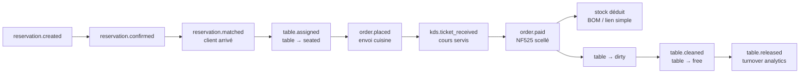

# LOGIQUE MÉTIER — VERTICALE RESTAURANT

> Plan de mise à niveau du **golden path restaurant**, de la réservation à la rotation de table.
> Rédigé le **2026-08-30**, session `plan-logique-metier-restaurant` (Claude Code), **lecture seule sur `src/`**.
>
> **Loi 7 (Zero-Claim)** : tout chiffre ci-dessous a été mesuré dans la session courante avec la commande
> indiquée. Aucun chiffre n'est recopié d'un audit antérieur.

---

## 0. Verdict

> **⏱️ MISE À JOUR 2026-08-30 après-midi** — session `plan-correctif-suite-cycles`.
> Sur les 9 lots (B, A, C, D, E, F, G, H, I), **6 sont livrés** : B (P0 split
> bill), A (P0 source vérité unique), F (P1 fail-closed tenant), E (P1 KDS
> projection unique), H (P2 blueprint), C (P1 chaîne événements). Reste **D**
> (cycle vie table), **G** (capacité réservations), **I** (test E2E + invariants).
> Vérité terrain : `npx tsc --noEmit` 0 erreur, `npx vitest run` 2474/2474.

## 0.a Verdict initial

La verticale restaurant n'a **pas** un déficit de fonctionnalités : le POS gère les cours, les remises,
l'offert, l'annulation, le pourboire, le split, le doggy bag, le mode de consommation et le paiement
NF525 ; le KDS gère les stations, le rush, le rappel et les allergènes ; les réservations gèrent le
pacing, le no-show, l'empreinte bancaire et les groupes ; le stock se déduit à la recette.

Le déficit est **un déficit de chaînage**. Trois symptômes structurels, tous vérifiés :

1. **Deux noms de collection pour le même objet métier.** Le POS écrit les commandes dans `ops_flows`
   et les tables dans `ops_nodes` (via `DomainRegistry`), tandis que **27 fichiers non-test** lisent ou
   écrivent `tenants/{tenantId}/orders` et que le transfert/handoff de table lit
   `tenants/{tenantId}/tables`. Tout ce qui est branché sur `orders`/`tables` travaille sur des
   collections que le service réel ne remplit jamais.
2. **Des événements qui ne se rencontrent pas.** Le POS émet `order.placed` / `order.paid` ; la verticale
   restaurant écoute `ops.order_notification` et `reservation.confirmed`, deux événements dont les seuls
   émetteurs sont soit un adaptateur sans appelant, soit la couche anti-corruption des canaux externes.
   `table.assigned` n'a **aucun** émetteur ; `table.released` n'est jamais émis à l'encaissement.
3. **Une rupture d'unité monétaire sur le split bill.** Le montant part en micro-unités et est traité en
   centimes sur trois points d'arrivée successifs : l'affichage, le terminal de paiement et la ligne de
   débit du journal comptable — soit un facteur **10 000** et une écriture NF525 déséquilibrée.

Ce plan traite ces trois causes racines, puis referme le golden path avec un test bout-en-bout et des
invariants qui empêchent la dérive de revenir.

---

## 1. Méthode & preuves

| Preuve | Commande exécutée en session | Résultat |
|---|---|---|
| Tests verticale restaurant + sagas ops | `rtk proxy npx vitest run src/__tests__/verticals/restaurantAdapters.test.ts src/__tests__/handlers/restaurant-vertical.test.ts src/__tests__/helpers/saga.ops.test.ts src/__tests__/helpers/saga.ops2.test.ts` | **4 fichiers, 63 tests passés, 0 échec** (11,64 s) |
| Consommateurs de `tenants/*/orders` | `grep -rn 'tenants/\${tenantId}/orders' src --include="*.ts*" \| grep -v '__tests__\|\.test\.\|/e2e/\|collections.ts\|DemoSeeder' \| sed 's/:.*//' \| sort -u \| wc -l` | **27 fichiers** |
| Chemin d'écriture réel des commandes | `grep -n "FLOWS" src/shared/nexus/engines/DomainRegistry.ts` | `ops_flows` |
| Appelants de `RestaurantOpsAdapter` | `grep -rn "RestaurantOpsAdapter" src --include="*.ts*"` | **0 hors tests et barrel** |
| Appelants de `AutomaticAssigner` | `grep -rn "AutomaticAssigner" src --include="*.ts*"` | **0 hors définition et barrel** |
| Émetteurs de `table.assigned` | `grep -rn "'table.assigned'" src --include="*.ts*"` | **0 émetteur** (1 écouteur) |

> ⚠️ **Rappel outillage** : `rtk` filtre et met en cache la sortie de `vitest`/`tsc`. Les chiffres ci-dessus
> ont été obtenus via `rtk proxy` (sortie brute). Ne jamais valider un lot sur un `exit 0` filtré.

---

## 2. Le golden path cible

Une seule chaîne métier, prouvée de bout en bout, sans branche parallèle :

**Règle d'acceptation du plan** : ce graphe doit être franchissable par un unique test d'intégration,
sur une seule collection de commandes et une seule collection de tables, sans qu'aucun maillon ne
repose sur un émetteur orphelin.

---

## 3. Constats vérifiés

Sévérité : **P0** = perte ou fausseté de donnée fiscale/financière · **P1** = maillon du golden path rompu ·
**P2** = dette de cohérence.

### P0-1 — Deux sources de vérité pour les ventes et les tables

| Écrit par | Chemin réel |
|---|---|
| POS (`useOrders.add` → `createSovereignHook`) | `tenants/{t}/ops_flows` — [opsCore.ts:95](src/modules/ops/providers/_internal/opsCore.ts:95), [DomainRegistry.ts:21](src/shared/nexus/engines/DomainRegistry.ts:21) |
| Plan de salle (`updateTable`) | `tenants/{t}/ops_nodes` — [floorHooks.tsx:36](src/modules/ops/providers/hooks/floorHooks.tsx:36) |
| KDS (lecture écran) | `tenants/{t}/ops_flows` — [KDSDashboard.tsx:93](src/modules/ops/production/kds/components/KDSDashboard.tsx:93) |

En face, **27 fichiers non-test** lisent `tenants/{t}/orders`, dont, au cœur du service restaurant :

- [MenuEngineeringService.ts:50](src/modules/commerce/catalog/menu-engineering/application/services/MenuEngineeringService.ts:50) — la route phare de la verticale (`/menu-engineering`) calcule sa matrice BCG sur une collection vide ;
- [TableTransferService.ts:27](src/modules/ops/service/pos/services/TableTransferService.ts:27) et `TableHandoffService` — le transfert de table cherche la commande dans `orders` et la table dans `tenants/{t}/tables` ;
- `OrderCancelRestockHandler`, `StockRestitutionHandler`, `KdsCoursePassedHandler` ;
- `GuestRecognition`, `CampaignAttributionService`, `CRMVipHandler`, `FranchiseService` ;
- `DailyDigestJob`, `DailyConsolidationService`, `weeklyReport`, `DailyFlashReport`, `FleetBenchmark` ;
- `RecallService` (rappel produit — enjeu sanitaire), `prepForecast`.

**Impact métier** : le CA analysé, l'historique client, l'attribution marketing, la prévision de mise en
place, le rappel produit et le transfert de table travaillent tous sur un jeu de données que le service
réel ne remplit pas. [collections.ts:16](src/shared/nexus/constants/collections.ts:16) déclare pourtant
`orders: 'orders'` comme nom canonique — la constante et le registre se contredisent.

### P0-2 — Split bill : facteur 10 000 sur trois sorties

Chaîne vérifiée ligne à ligne :

1. [pos-service.ts:14](src/modules/ops/service/pos/domain/pos-service.ts:14) — `calculateCartTotal` retourne des **`Microunits`**.
2. [pos/page.tsx:265](src/app/(client)/(ops)/pos/page.tsx:265) — ce total part dans `<SplitBillDialog total={cartTotal} />`.
3. [SplitBillDialog.tsx:86](src/modules/ops/service/pos/components/SplitBillDialog.tsx:86) — la valeur est renommée `amountInCents` sans conversion.
4. Trois points d'arrivée traitent alors des micro-unités comme des centimes :
   - **Affichage** : `formatCurrency` divise par 100 ([formatters.ts:46](src/lib/formatters.ts:46)) — le dialogue et le panier flottant affichent **10 000 ×** le montant réel. Le panier principal, lui, utilise correctement `formatMu` ([Cart.tsx:66](src/modules/ops/service/pos/components/Cart.tsx:66)).
   - **Terminal de paiement** : [useSplitPaymentExecution.ts:32](src/modules/ops/service/pos/components/split/useSplitPaymentExecution.ts:32) calcule `amountInMicrounits: amountInCents * 10000` — le TPE est débité **10 000 ×** trop.
   - **Journal comptable** : [FinancialJournalBuilder.ts:120](src/modules/finance/comptabilite/FinancialJournalBuilder.ts:120) pousse `p.amount` tel quel dans une ligne de **débit en centimes**, alors que les crédits sont convertis par `microToCents` ([FinancialJournalBuilder.ts:13](src/modules/finance/comptabilite/FinancialJournalBuilder.ts:13)).

**Impact métier** : dès qu'une addition est partagée, l'écriture scellée NF525 a un débit ≠ crédit d'un
facteur 10 000, et le client est potentiellement débité d'un montant aberrant. C'est le point le plus
grave du périmètre.

### P0-3 — Panier flottant mobile en unité erronée

[pos/page.tsx:215](src/app/(client)/(ops)/pos/page.tsx:215) — `formatCurrency(cartTotal)` sur un total en
micro-unités. Même cause que P0-2, chemin indépendant (visible hors split).

### P0-4 — Aucun contrôle d'équilibre du journal

[FinancialJournalBuilder.ts](src/modules/finance/comptabilite/FinancialJournalBuilder.ts) accumule
`totalCreditCents` mais ne compare jamais la somme des débits à ce total. Un split partiel, incomplet
ou en mauvaise unité produit une écriture déséquilibrée qui est ensuite **scellée** — donc immuable.

### P1-5 — Deux projections KDS concurrentes, aucune lue par l'écran

Les deux sont enregistrées ensemble ([ops-kds.ts:18,23](src/shared/eventBus/registerHandlers/ops-kds.ts:18)) :

| Handler | Écrit | Lu par |
|---|---|---|
| [KdsRoutingHandler.ts:25](src/shared/eventBus/handlers/KdsRoutingHandler.ts:25) | `kdsTickets` | `KdsPrepTimeAnalyzerHandler`, `KdsCourseManagerHandler` |
| [KDSOrderHandler.ts:20](src/shared/eventBus/handlers/KDSOrderHandler.ts:20) | `kdsOrders` | `KDSReadyHandler` (commentaire seulement) |
| **Écran KDS** | — | `ops_flows` |

**Impact métier** : chaque envoi en cuisine écrit deux documents dans deux modèles différents, et l'écran
cuisine n'en lit aucun. Les analyses de temps de préparation et la gestion de cours portent sur un
modèle fantôme, jamais celui que la brigade voit.

### P1-6 — La verticale restaurant n'entend pas le POS

[RestaurantVertical.ts:88](src/verticals/restaurant/RestaurantVertical.ts:88) écoute
`ops.order_notification` pour déclencher le sceau fiscal de la verticale et
`RestaurantIntelligenceAdapter.emitSalesDataReady`. Le seul émetteur est
[RestaurantOpsAdapter.ts:5](src/verticals/restaurant/adapters/RestaurantOpsAdapter.ts:5), qui n'a
**aucun appelant hors tests**. Le POS, lui, émet `order.placed` / `order.paid`.

### P1-7 — La rotation de table ne démarre ni ne s'arrête

- `table.assigned` : **0 émetteur**, 1 écouteur ([TableTurnoverAnalyzerHandler.ts:14](src/shared/eventBus/handlers/TableTurnoverAnalyzerHandler.ts:14)).
- `table.released` : émis uniquement par `TableTransferHandler`, `NoShowHandler`, `OrderCancelRestockHandler` — **jamais à l'encaissement**. [usePos.ts:188](src/modules/ops/service/pos/hooks/usePos.ts:188) se contente de `updateTable(..., { status: "dirty" })`.

**Impact métier** : le chronomètre de rotation ne se déclenche jamais en service normal ; l'analyse de
turnover et la notification hôtesse ne partent qu'en cas d'anomalie (no-show, annulation, transfert).

### P1-8 — Cycle de vie de la table incomplet

Le statut `dirty` n'a pas de sortie métier : la seule remise à `free` est manuelle depuis l'éditeur de
plan de salle ([useFloorPlanControls.ts:180](src/modules/facility/spaces/floor-plan/useFloorPlanControls.ts:180)).
Le statut `cleaning` existe dans le type ([spaces/types.ts:5](src/modules/facility/spaces/types.ts:5))
mais n'est écrit nulle part dans le flux restaurant.

### P1-9 — `reservation.confirmed` n'est jamais émis par le parcours interne

Le parcours interne émet `reservation.created`
([useReservationsPage.ts:131](src/modules/commerce/relation/reservations/hooks/useReservationsPage.ts:131)).
Les seuls émetteurs de `reservation.confirmed` sont `AntiCorruptionLayerHandler` (canaux externes type
TheFork) et `RestaurantCommerceAdapter` (sans appelant). La notification « Réservation confirmée » de la
verticale ne part donc que pour les réservations venues de l'extérieur.

### P1-10 — Arrivée client sans table réelle

[useReservationsPage.ts:204](src/modules/commerce/relation/reservations/hooks/useReservationsPage.ts:204)
émet `reservation.matched` avec `tableId: res?.tableId ?? 'table_default'` — un identifiant fantôme. Aucun
passage de la table en `seated`, aucun `table.assigned`. Le contrôle allergènes
(`ResaAllergenCheckHandler`) reçoit donc une table qui n'existe pas.

### P1-11 — Fallbacks tenant en écriture

[usePos.ts:161](src/modules/ops/service/pos/hooks/usePos.ts:161) et
[usePos.ts:221](src/modules/ops/service/pos/hooks/usePos.ts:221) : `activeTenantId ?? 'default'` ;
[usePos.ts:178](src/modules/ops/service/pos/hooks/usePos.ts:178) : `activeTenantId ?? "restaurant-os"`.
Un contexte tenant absent ne bloque pas : il écrit la commande et **scelle la vente** dans un tenant
fantôme. Huit autres fichiers pratiquent le même repli en lecture (`InventoryReceptionDashboard`,
`IngredientsTab`, `FECImportPanel`, `ReservationHistoryImportPanel`, `TableInsightPanel`,
`accounting-portal`, …) — moins graves, mais à traiter dans la même passe.

### P2-12 — Capacité et assignation de table simplifiées

[AvailabilityEngine.ts:149](src/modules/commerce/relation/reservations/domain/AvailabilityEngine.ts:149) :
`canAccommodate` retourne `true` après contrôle de la capacité globale et du pacing, avec le commentaire
« Check if there is AT LEAST one table that can take this group or a combo of tables » — non implémenté.
`AutomaticAssigner` existe et n'a **aucun appelant**. Conséquence : on accepte un groupe de 8 dans un
restaurant de 40 couverts n'ayant que des tables de 2.

### P2-13 — Blueprint restaurant partiellement fictif

[restaurant.blueprint.ts:54-56](src/verticals/restaurant/restaurant.blueprint.ts:54) déclare des routes
`./ops/POSPage`, `./ops/KDSPage`, `./facility/FloorPlanPage` qui n'existent pas — `src/verticals/restaurant/ops/index.ts`
est un simple ré-export de `@/modules/ops`. Ces `componentPath` ne sont consommés que par la forge
(`generateVertical.ts`, `stubRenderer.ts`) ; les vraies routes de la verticale sont
[RestaurantVertical.routes](src/verticals/restaurant/RestaurantVertical.ts:27) avec `componentLoader`.
Ce n'est pas un bug d'exécution, mais une métadonnée qui ment sur l'autonomie de la verticale et qui
induira en erreur toute génération future à partir de ce blueprint.

---

## 4. Lots d'exécution

Ordre imposé : **B → A → C → D → E → F → G → H → I**. B d'abord (argent faux, dommage irréversible car
scellé), A ensuite (tout le reste s'y adosse).

### LOT B — Assainir les unités monétaires du split et de l'affichage · **P0** · ~0,5 j

- [ ] `SplitBillDialog` : renommer `total` → `totalInMicrounits`, `getConviveTotal` → `getConviveTotalInMicrounits`, `amountInCents` → `amountInMicrounits` sur toute la chaîne (`split/types.ts`, `SplitEqualPanel`, `SplitByItemPanel`, `SplitCustomPanel`, `SplitPayingView`, `SplitConviveCard`, `SplitSummaryFooter`).
- [ ] Remplacer `formatCurrency` par `formatMu` dans `SplitBillDialog` et dans [pos/page.tsx:215](src/app/(client)/(ops)/pos/page.tsx:215).
- [ ] [useSplitPaymentExecution.ts:32](src/modules/ops/service/pos/components/split/useSplitPaymentExecution.ts:32) : supprimer le `* 10000`, passer la valeur telle quelle.
- [ ] `usePos.handlePaySplit` : stocker `amountInMicrounits` et corriger le toast (`formatMu`, plus `/100`).
- [ ] `FinancialNexusTypes.partialPayments` : renommer `amount` → `amountInMicrounits` (type branded `Microunits`).
- [ ] [FinancialJournalBuilder.ts:120](src/modules/finance/comptabilite/FinancialJournalBuilder.ts:120) : convertir par `microToCents` avant de construire la ligne de débit.
- [ ] **Ajouter le contrôle d'équilibre (P0-4)** : `Σ débits === totalCreditCents`, sinon `throw` **avant** appel à `FiscalSealer` — un déséquilibre ne doit jamais être scellé.
- [ ] Tolérance d'arrondi : utiliser `SovereignMath.splitRemainder` comme référence et documenter l'écart admis (0 centime).

**Critère d'acceptation** : un split 3 convives sur une addition de 47,80 € produit un `JournalEntry`
équilibré au centime, un débit TPE de 47,80 € au total, et un affichage à 47,80 €.

**Tests** : `src/__tests__/finance/split-bill-balance.test.ts` — (1) split égal, (2) split par article,
(3) split personnalisé, (4) split incomplet → l'écriture est refusée, pas scellée.

### LOT A — Une seule source de vérité pour ventes et tables · **P0** · ~2 j

- [ ] **Décider et acter le nom canonique.** Recommandation : garder `ops_flows`/`ops_nodes` (chemins réellement écrits par le service, protégés par `SovereignGuard`) et faire converger les 27 consommateurs, plutôt que l'inverse — migrer le POS casserait le KDS et les sagas déjà vertes (63 tests mesurés).
- [ ] Aligner [collections.ts](src/shared/nexus/constants/collections.ts) sur `DomainRegistry` : `orders → 'ops_flows'`, `tables → 'ops_nodes'`, ou mieux, faire de `COLLECTIONS` une projection de `DomainRegistry` pour rendre la divergence structurellement impossible.
- [ ] Remplacer chaque `tenants/${tenantId}/orders` par `DomainRegistry.resolve(OperationalIdentity.FLOWS)` dans les 27 fichiers, en priorisant le chemin service : `TableTransferService`, `TableHandoffService`, `OrderCancelRestockHandler`, `StockRestitutionHandler`, `KdsCoursePassedHandler`, `RecallService`, `MenuEngineeringService`.
- [ ] Idem pour `tenants/${tenantId}/tables` → `OperationalIdentity.NODES`.
- [ ] Vérifier la forme des documents : le POS écrit `{ id, tableId, tableNumber, serverName, items, status }` ([posOrderSubmit.ts:58](src/modules/ops/service/pos/hooks/posOrderSubmit.ts:58)) ; les consommateurs analytics attendent un total et un horodatage. Ajouter `totalInMicrounits` et `createdAt` à l'écriture POS **ou** adapter les lecteurs — ne pas laisser un `?? 0` masquer l'absence.
- [ ] Écrire une migration `oneshot-` si des tenants existants ont des documents dans `orders` (à vérifier avant : `Nexus.adapter.query('tenants/{t}/orders')` sur un tenant de démo).

**Critère d'acceptation** : `grep -rn 'tenants/\${tenantId}/orders' src --include="*.ts*" | grep -v __tests__` retourne
**0 résultat**, et le dashboard Menu Engineering affiche une matrice non vide après une vente POS.

**Tests** : `src/__tests__/restaurant/sales-single-source.test.ts` — une vente POS doit être visible par
`MenuEngineeringService.computeReport` et par `TableTransferService`.

### LOT C — Chaîne d'événements du golden path · **P1** · ~1,5 j

- [ ] **P1-6** : brancher la verticale sur les événements réels. Deux options — (a) `RestaurantVertical` écoute `order.paid` au lieu de `ops.order_notification` ; (b) `posOrderSubmit` appelle `RestaurantOpsAdapter.emitOrderPlaced`. **Retenir (a)** : moins de couplage POS → verticale, conforme ADR-015. Supprimer alors `ops.order_notification` et `RestaurantOpsAdapter.emitOrderPlaced` s'ils n'ont plus d'usage.
- [ ] **P1-9** : émettre `reservation.confirmed` depuis le parcours interne, au moment où la réservation passe réellement à `confirmed` (pas à la création). Si le métier ne distingue pas les deux états, supprimer `reservation.created` **ou** faire écouter les deux à la verticale — mais choisir, et le documenter.
- [ ] **P1-7** : émettre `table.assigned` à l'assignation (voir LOT D) et `table.released` à la libération réelle de la table (voir LOT D), pour que `TableTurnoverAnalyzerHandler` mesure une rotation complète.
- [ ] **P1-10** : `handleMarkArrived` doit refuser d'émettre `reservation.matched` sans `tableId` réel (fail-closed), passer la table en `seated` et émettre `table.assigned`.
- [ ] Passer en revue les autres écouteurs sans émetteur du domaine restaurant avant d'en ajouter (`npm run measure` expose déjà l'écart émis/écouté du bus).

**Critère d'acceptation** : aucun handler du périmètre restaurant n'écoute un événement à zéro émetteur.

### LOT D — Cycle de vie de la table · **P1** · ~1 j

- [ ] Formaliser la machine à états : `free → reserved → seated → ordered → eating → paying → dirty → cleaning → free`, dans un module de domaine unique (`src/modules/facility/spaces/domain/tableLifecycle.ts`), avec transitions autorisées explicites.
- [ ] Câbler le POS : `handleMarkArrived` → `seated` + `table.assigned` · `submitKitchenOrder` → `ordered` · `finalizePayment` → `dirty`.
- [ ] Créer l'action métier manquante « table nettoyée » (bouton plan de salle + KDS/frontdesk) : `dirty → cleaning → free`, avec émission de `table.released`.
- [ ] Interdire les transitions illégales au niveau du domaine, pas de l'UI.

**Critère d'acceptation** : un cycle complet en service normal produit exactement un `table.assigned` et
un `table.released`, et `TableTurnoverAnalyzerHandler` calcule une durée de rotation cohérente.

### LOT E — KDS : une seule projection · **P1** · ~0,5 j

- [ ] Choisir la projection canonique. Recommandation : **`kdsTickets`** — c'est le seul modèle réellement consommé par des handlers métier (`KdsPrepTimeAnalyzerHandler`, `KdsCourseManagerHandler`).
- [ ] Supprimer `KDSOrderHandler` + `kdsOrders`, ou le fusionner dans `KdsRoutingHandler`, et retirer l'enregistrement dans [ops-kds.ts:23](src/shared/eventBus/registerHandlers/ops-kds.ts:23).
- [ ] Décider ce que l'écran KDS lit : soit `ops_flows` (et alors `kdsTickets` n'est qu'une projection analytique, à documenter comme telle), soit `kdsTickets` (et alors `KDSDashboard` doit changer de source). Ne pas laisser les deux sans contrat écrit.
- [ ] Implémenter le routage par station réel dans `KdsRoutingHandler` — le commentaire admet une répartition fictive « chaud / froid ».

### LOT F — Fail-closed multi-tenant · **P1** · ~0,5 j

- [ ] Supprimer les trois fallbacks d'écriture de [usePos.ts](src/modules/ops/service/pos/hooks/usePos.ts) : sans `activeTenantId`, désactiver l'envoi cuisine et l'encaissement, avec un message explicite ; ne jamais écrire dans `'default'` ou `'restaurant-os'`.
- [ ] Traiter les 8 replis de lecture restants dans la même passe.
- [ ] Ajouter un invariant : aucun littéral `'default'` / `'restaurant-os'` en position de `tenantId` dans `src/modules/`.

### LOT G — Réservations : capacité réelle et assignation · **P2** · ~1 j

- [ ] Implémenter la vraie vérification dans `canAccommodate` : chercher une table ou une combinaison de tables libres sur le créneau, en réutilisant `AutomaticAssigner`.
- [ ] Brancher `AutomaticAssigner` dans le flux de création de réservation (proposition de table) et d'arrivée (assignation ferme).
- [ ] Gérer les combinaisons de tables (groupes) et le temps de rotation attendu par type de service.

### LOT H — Cohérence blueprint & documentation · **P2** · ~0,25 j

- [ ] Aligner [restaurant.blueprint.ts](src/verticals/restaurant/restaurant.blueprint.ts) sur la réalité : soit pointer vers les vraies pages, soit retirer les trois routes fictives et documenter que la verticale restaurant est écrite à la main (référence) et non générée.
- [ ] Vérifier que les 4 événements déclarés (`restaurant.order_sent_to_kitchen`, `restaurant.table_status_changed`, `restaurant.course_next_fired`, `restaurant.bill_split_requested`) sont émis ou les retirer.
- [ ] Mettre `ARCHITECTURE.md` à jour avec le golden path retenu.

### LOT I — Test bout-en-bout et invariants · **P1** · ~1 j

- [ ] `src/__tests__/restaurant/golden-path.test.ts` — un seul test qui parcourt le graphe du §2 : réservation → confirmation → arrivée → assignation → commande → KDS → paiement → sceau NF525 → déduction stock → table sale → nettoyage → libération → turnover. Chaque maillon assert l'événement **et** la donnée persistée.
- [ ] Invariant **INV-26** : zéro occurrence de `tenants/${tenantId}/orders` et `tenants/${tenantId}/tables` hors tests (cliquet à 0 dès que le LOT A est fini).
- [ ] Invariant **INV-27** : tout écouteur du périmètre restaurant a au moins un émetteur.
- [ ] Invariant **INV-28** : aucune ligne de journal ne peut être scellée si `Σ débits ≠ Σ crédits`.
- [ ] Invariant **INV-29** : aucun littéral de `tenantId` de repli dans `src/modules/`.
- [ ] Brancher ces invariants dans `invariants.test.ts` et les cliquets dans `preflight.sh`. **Ne jamais relever un cliquet** (Loi 2, `verify-gate-integrity.mjs` le refuse).

---

## 5. Effort et séquencement

| Lot | Sévérité | Effort | Dépend de |
|---|---|---|---|
| B — Unités monétaires | P0 | 0,5 j | — |
| A — Source de vérité unique | P0 | 2 j | — |
| C — Chaîne d'événements | P1 | 1,5 j | A |
| D — Cycle de vie table | P1 | 1 j | A, C |
| E — Projection KDS unique | P1 | 0,5 j | A |
| F — Fail-closed tenant | P1 | 0,5 j | — |
| G — Capacité réservations | P2 | 1 j | D |
| H — Blueprint & doc | P2 | 0,25 j | C |
| I — Test E2E & invariants | P1 | 1 j | tous |
| **Total** | | **~8,25 j** | |

---

## 6. Limites de cet audit

Ce qui **n'a pas** été vérifié et reste à instruire avant de considérer la verticale mûre :

- Le comportement **runtime** réel : tout ci-dessus est établi par lecture de code et par les 63 tests
  mesurés en session. Aucune sonde Playwright sur un jeu de démo reproductible (mesure M5, toujours
  absente d'après `CLAUDE.md`).
- La **chaîne de scellement NF525 elle-même** (hash chaîné, `chainHead`, audit de chaîne) — hors périmètre
  ici, traitée par les plans correctifs antérieurs.
- Les **impressions** (cuisine, ticket client, tiroir-caisse) et le comportement hors-ligne du split.
- Le **pourboire** et sa répartition (`TipDistributionService`), effleurés seulement.
- La **conformité HACCP** au-delà du branchement `sensor.temperature_anomaly → haccp.alert`.

---

## 7. Journal d'exécution

| Date | Lot | Agent | Preuve (commande + résultat) |
|---|---|---|---|
| 2026-08-30 | LOT B (P0) | Claude Code | split `total` → `totalInMicrounits`, `amountInCents` → `amountInMicrounits` + microToCents dans FinancialJournalBuilder + contrôle équilibre débits=crédits. `vitest run` 2477/2477. commit b65556d6b |
| 2026-08-30 | LOT F (P1) | Claude Code | `usePos` : refus fail-closed sur handleSendToKitchen/finalizePayment/handleSendCourse sans activeTenantId + 3 panels d'import guardés. `vitest run` 2477/2477. commit a6c432d7e |
| 2026-08-30 | LOT A (P0) | Claude Code | `COLLECTIONS.orders='ops_flows'`, `COLLECTIONS.tables='ops_nodes'`, migration 43 fichiers hardcodés, useSovereignOrders/Tables reroutés, SIGNED_WRITE_COLLECTIONS ajusté. `grep 'tenants/${tenantId}/orders'` = 0 hors tests. `vitest run` 2477/2477. commit b64ad7439 |
| 2026-08-30 | LOT E (P1) | Claude Code | KDSOrderHandler supprimé (kdsOrders projection fantôme), kdsTickets seule projection retenue. `vitest run` 2474/2474. commit 81e60c4ad |
| 2026-08-30 | LOT H (P2) | Claude Code | `restaurant.blueprint.ts` : routes/events fictifs retirés (les 3 componentPath n'existent pas, les 4 events restaurant.* jamais émis). `vitest run` 2474/2474. commit efcd02cb8 |
| 2026-08-30 | LOT C (P1) | Claude Code | RestaurantVertical écoute `order.paid` au lieu de `ops.order_notification`. `useReservationsPage` émet `reservation.confirmed` à la création interne + `table.assigned` à l'arrivée + fail-closed sans tableId réel. `vitest run` 2474/2474. commit c9ff9342d |
